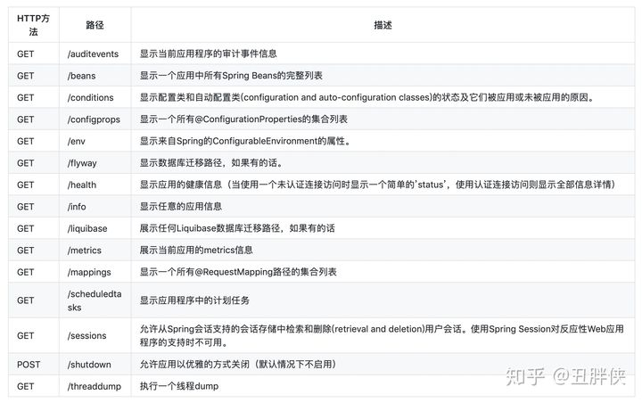
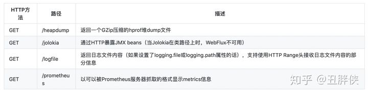
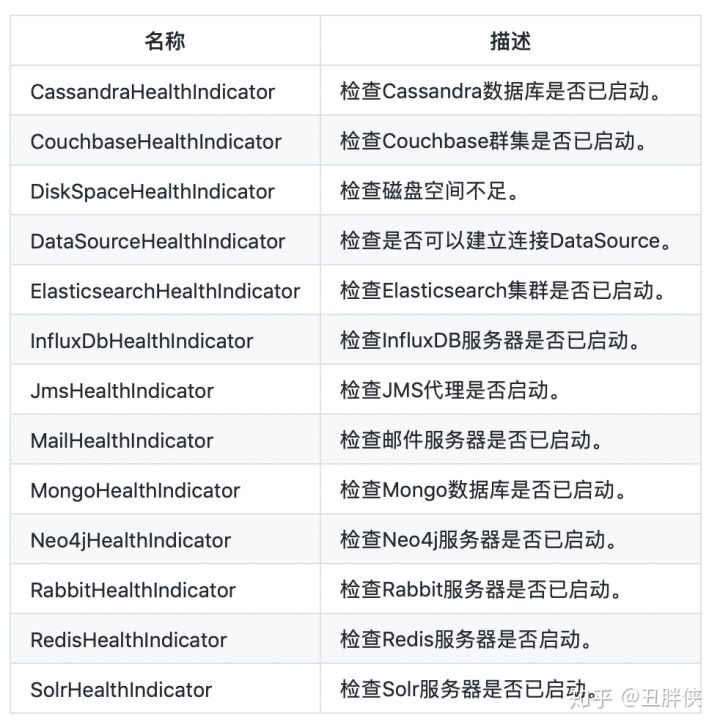

# springboot actuator

​		在企业级应用中，学习了如何进行SpringBoot应用的功能开发，以及如何写单元测试、集成测试等还是不够的。在实际的软件开发中还需要：应用程序的监控和管理。SpringBoot的Actuator模块实现了应用的监控与管理。


## Actuator简介

​	生产系统中，往往需要对系统实际运行的情况（例如cpu、io、disk、db、业务功能等指标）进行监控运维。在SpringBoot项目中Actuator模块提供了众多HTTP接口端点（Endpoint），来提供应用程序运行时的内部状态信息。

​	Actuator模块提供了一个监控和管理生产环境的模块，可以使用http、jmx、ssh、telnet等来管理和监控应用。包括应用的审计（Auditing）、健康（health）状态信息、数据采集（metrics gathering）统计等监控运维的功能。同时，提供了可以扩展 Actuator端点（Endpoint）自定义监控指标。这些指标都是以JSON接口数据的方式呈现。


## Actuator的使用

使用Spring Boot Actuator需要加入如下依赖：

```xml
<dependency>
    <groupId>org.springframework.boot</groupId>
    <artifactId>spring-boot-starter-actuator</artifactId>
</dependency>
```

actuator并没有默认集成在自动配置中，而在作为独立的项目来呈现的。当引入了上面的依赖，默认会引入actuator相关的两个项目：

```xml
<dependency>
  <groupId>org.springframework.boot</groupId>
  <artifactId>spring-boot-actuator</artifactId>
</dependency>
<dependency>
  <groupId>org.springframework.boot</groupId>
  <artifactId>spring-boot-actuator-autoconfigure</artifactId>
</dependency>
```

其中spring-boot-actuator为功能实现，spring-boot-actuator-autoconfigure为自动配置。

需要注意：因SpringBoot Actuator会暴露服务的详细信息，为了保障安全性，建议添加安全控制的相关依赖spring-boot-starter-security，这样在访问应用监控端点时，都需要输入验证信息。所需依赖如下：

```xml
<dependency>
    <groupId>org.springframework.boot</groupId>
    <artifactId>spring-boot-starter-security</artifactId>
</dependency>
```

关于security的使用我们在此不进行展开，可在application文件中配置相应的访问密码：

```yml
spring:
  security:
    user:
      name: admin
      password: admin
```


经过以上步骤的操作，启动SpringBoot项目，actuator便自动集成配置了，可通过：http://localhost:8080/actuator 访问，结果如下：

```json
{
    "_links": {
        "self": {
            "href": "http://localhost:8080/actuator",
            "templated": false
        },
        "health": {
            "href": "http://localhost:8080/actuator/health",
            "templated": false
        },
        "health-component": {
            "href": "http://localhost:8080/actuator/health/{component}",
            "templated": true
        },
        "health-component-instance": {
            "href": "http://localhost:8080/actuator/health/{component}/{instance}",
            "templated": true
        },
        "info": {
            "href": "http://localhost:8080/actuator/info",
            "templated": false
        }
    }
}
```

默认支持的链接有：

```
/actuator
/actuator/health
/health/{component}/{instance}
/health/{component}
/actuator/info
```

可以在application配置文件中配置开启更多的监控信息：

```yaml
management:
  endpoints:
    web:
      exposure:
        include: '*'
#      base-path: /monitor
  endpoint:
    health:
      show-details: always
    shutdown:
      enabled: true
```

- management.endpoints.web.exposure.include='*'，代表开启全部监控，也可仅配置需要开启的监控，如： management.endpoints.web.exposure.include=beans,trace。
- management.endpoint.health.show-details=always，health endpoint开启显示全部细节。默认情况下/actuator/health是公开的，但不显示细节。
- management.endpoints.web.base-path=/monitor，启用指定的url地址访问根路径，默认路径为/actuator/*，开启则访问路径变为/monitor/*。
- management.endpoint.shutdown.enabled=true，启用接口关闭SpringBoot。

监控信息如果需要跨越调用，可通过CORS配置来支持，默认处于禁用状态。设置management.endpoints.web.cors.allowed-origins属性后开启。

比如允许来自[https://www.choupangxia.com](https://link.zhihu.com/?target=https%3A//www.choupangxia.com) 域的GET和POST调用：

```yaml
management:
  endpoints:
    web:
      cors:
        allowed-origins: https://www.choupangxia.com
        allowed-methods: GET,POST
```


## REST接口

Spring Boot Actuator提供了非常丰富的监控接口，可以通过这些接口了解应用程序运行时的内部状况。Actuator也支持用户自定义添加端点，可以根据实际应用，定义一些比较关心的指标，在运行期进行监控。



如果使用web应用(Spring MVC, Spring WebFlux, 或者 Jersey)，还可以使用以下接口：




## 接口详解

health主要用来检查应用的运行状态，这是使用频次最高的监控点。通常使用此接口显示应用实例的运行状态，以及应用不“健康”的原因，比如数据库连接、磁盘空间不够等。

默认情况下health的状态是开放的，访问：http://localhost:8080/actuator/health 即可看到应用的状态。

```
{
    "status" : "UP"
}
```

设置状态码顺序：setStatusOrder(Status.DOWN,Status.OUT*OF*SERVICE, Status.UP, Status.UNKNOWN)。过滤掉不能识别的状态码。如果无任何状态码，整个SpringBoot应用的状态是UNKNOWN。将所有收集到的状态码排序。返回有序状态码序列中的第一个状态码，作为整个SpringBoot应用的状态。

Health通过合并几个健康指数检查应用的健康情况。SpringBoot Actuator会自动配置以下内容：



可以通过设置 management.health.defaults.enabled属性来全部禁用。


## 原生端点

原生端点分为三大类：

- 应用配置类：获取应用程序中加载的应用配置、环境变量、自动化配置报告等与Spring Boot应用密切相关的配置类信息。
- 度量指标类：获取应用程序运行过程中用于监控的度量指标，比如：内存信息、线程池信息、HTTP请求统计等。
- 操作控制类：提供了对应用的关闭等操作类功能。


## 应用配置类

/conditions：该端点用来获取应用的自动化配置报告，其中包括所有自动化配置的候选项。同时还列出了每个候选项自动化配置的各个先决条件是否满足。该端点可以帮助我们方便的找到一些自动化配置为什么没有生效的具体原因。

该报告内容将自动化配置内容分为两部分：positiveMatches中返回的是条件匹配成功的自动化配置和negativeMatches中返回的是条件匹配不成功的自动化配置。

部分代码如下：

```json
"contexts": {
        "application": {
            "positiveMatches": {
                "MsgAutoConfiguration": [
                    {
                        "condition": "OnClassCondition",
                        "message": "@ConditionalOnClass found required class 'com.secbro2.msg.MsgService'"
                    }
                ],
                "MsgAutoConfiguration#msgService": [
                    {
                        "condition": "OnPropertyCondition",
                        "message": "@ConditionalOnProperty (msg.enabled=true) matched"
                    },
                    {
                        "condition": "OnBeanCondition",
                        "message": "@ConditionalOnMissingBean (types: com.secbro2.msg.MsgService; SearchStrategy: all) did not find any beans"
                    }
                ],
```

/info：就是在配置文件中配置的以info开头的信息，如配置为：

```
info:
  app:
    name: spring-boot-actuator
    version: 1.0.0
```

返回结果：

```
{
  "app":{
    "name":"spring-boot-actuator",
    "version":"1.0.0"
  }
}
```

info中配置的参数也可以通过符号*@*包围的属性值来自pom.xml文件中的元素节点。如下：

```
info:
    build:
        artifact: @project.artifactId@
        name: @project.name@
        description: @project.description@
        ersion: @project.version@
```

返回结果：

```
{
    "build": {
        "artifact": "spring-learn",
        "name": "spring-learn",
        "description": "Demo project for Spring Boot",
        "ersion": "0.0.1-SNAPSHOT"
    }
}
```

/beans：该端点用来获取应用上下文中创建的所有Bean。

```json
{
    "contexts": {
        "application": {
            "beans": {
                "endpointCachingOperationInvokerAdvisor": {
                    "aliases": [],
                    "scope": "singleton",
                    "type": "org.springframework.boot.actuate.endpoint.invoker.cache.CachingOperationInvokerAdvisor",
                    "resource": "class path resource [org/springframework/boot/actuate/autoconfigure/endpoint/EndpointAutoConfiguration.class]",
                    "dependencies": ["environment"]
                },
                "defaultServletHandlerMapping": {
                    "aliases": [],
                    "scope": "singleton",
                    "type": "org.springframework.web.servlet.HandlerMapping",
                    "resource": "class path resource [org/springframework/boot/autoconfigure/web/servlet/WebMvcAutoConfiguration$EnableWebMvcConfiguration.class]",
                    "dependencies": []
                },
            },
            "parentId": null
        }
    }
}
```

接口展现了bean的别名、类型、是否单例、类的地址、依赖等信息。

/configprops：该端点用来获取应用中配置的属性信息报告。

```json
{
    "spring.transaction-org.springframework.boot.autoconfigure.transaction.TransactionProperties": {
        "prefix": "spring.transaction",
        "properties": {}
    }
}
```

上面展示了TransactionProperties属性的配置信息。

/mappings：该端点用来返回所有SpringMVC的控制器映射关系报告。

```
{
  "handler": "Actuator web endpoint 'beans'",
  "predicate": "{GET /actuator/beans, produces [application/vnd.spring-boot.actuator.v2+json || application/json]}",
  "details": {
    "handlerMethod": {
      "className": "org.springframework.boot.actuate.endpoint.web.servlet.AbstractWebMvcEndpointHandlerMapping.OperationHandler",
      "name": "handle",
      "descriptor": "(Ljavax/servlet/http/HttpServletRequest;Ljava/util/Map;)Ljava/lang/Object;"
    },
    "requestMappingConditions": {
      "consumes": [],
      "headers": [],
      "methods": ["GET"],
      "params": [],
      "patterns": ["/actuator/beans"],
      "produces": [{
        "mediaType": "application/vnd.spring-boot.actuator.v2+json",
        "negated": false
      }, {
        "mediaType": "application/json",
        "negated": false
      }]
    }
  }
}
```

/env：该端点与/configprops不同，它用来获取应用所有可用的环境属性报告。包括：环境变量、JVM属性、应用的配置配置、命令行中的参数。


## 度量指标类

应用配置类提供的指标为静态报告，而度量指标类端点提供的报告内容则是动态变化的，提供了应用程序在运行过程中的一些快照信息，比如：内存使用情况、HTTP请求统计、外部资源指标等。这些端点对于构建微服务架构中的监控系统非常有帮助。

/metrics：该端点用来返回当前应用的各类重要度量指标，比如：内存信息、线程信息、垃圾回收信息等。

```
{
    "names": [
        "jvm.memory.max",
        "jvm.threads.states",
        "http.server.requests",
        "process.files.max",
        "jvm.gc.memory.promoted",
        "system.load.average.1m",
        "jvm.memory.used",
        "jvm.gc.max.data.size",
        "jvm.gc.pause",
        "jvm.memory.committed",
        "system.cpu.count",
        "logback.events",
        "tomcat.global.sent",
        "jvm.buffer.memory.used",
        "tomcat.sessions.created",
        "jvm.threads.daemon",
        "system.cpu.usage",
        "jvm.gc.memory.allocated",
        "tomcat.global.request.max",
        "tomcat.global.request",
        "tomcat.sessions.expired",
        "jvm.threads.live",
        "jvm.threads.peak",
        "tomcat.global.received",
        "process.uptime",
        "tomcat.sessions.rejected",
        "process.cpu.usage",
        "tomcat.threads.config.max",
        "jvm.classes.loaded",
        "jvm.classes.unloaded",
        "tomcat.global.error",
        "tomcat.sessions.active.current",
        "tomcat.sessions.alive.max",
        "jvm.gc.live.data.size",
        "tomcat.threads.current",
        "process.files.open",
        "jvm.buffer.count",
        "jvm.buffer.total.capacity",
        "tomcat.sessions.active.max",
        "tomcat.threads.busy",
        "process.start.time"
    ]
}
```

从上面的示例中有这些重要的度量值：

- 系统信息：包括处理器数量processors、运行时间uptime和instance.uptime、系统平均负载systemload.average。
- mem.*：内存概要信息，包括分配给应用的总内存数量以及当前空闲的内存数量。这些信息来自java.lang.Runtime。
- heap.*：堆内存使用情况。这些信息来自java.lang.management.MemoryMXBean接口中getHeapMemoryUsage方法获取的java.lang.management.MemoryUsage。
- nonheap.*：非堆内存使用情况。这些信息来自java.lang.management.MemoryMXBean接口中getNonHeapMemoryUsage方法获取的java.lang.management.MemoryUsage。
- threads.*：线程使用情况，包括线程数、守护线程数（daemon）、线程峰值（peak）等，这些数据均来自java.lang.management.ThreadMXBean。
- classes.*：应用加载和卸载的类统计。这些数据均来自java.lang.management.ClassLoadingMXBean。
- gc.*：垃圾收集器的详细信息，包括垃圾回收次数gc.ps_scavenge.count、垃圾回收消耗时间gc.ps_scavenge.time、标记-清除算法的次数gc.ps_marksweep.count、标记-清除算法的消耗时间gc.ps_marksweep.time。这些数据均来自java.lang.management.GarbageCollectorMXBean。
- httpsessions.*：Tomcat容器的会话使用情况。包括最大会话数httpsessions.max和活跃会话数httpsessions.active。该度量指标信息仅在引入了嵌入式Tomcat作为应用容器的时候才会提供。
- gauge.*：HTTP请求的性能指标之一，它主要用来反映一个绝对数值。比如上面示例中的gauge.response.hello: 5，它表示上一次hello请求的延迟时间为5毫秒。
- counter.*：HTTP请求的性能指标之一，它主要作为计数器来使用，记录了增加量和减少量。如上示例中counter.status.200.hello: 11，它代表了hello请求返回200状态的次数为11。

/threaddump：会生成当前线程活动的快照。方便我们在日常定位问题的时候查看线程的情况。主要展示了线程名、线程ID、线程的状态、是否等待锁资源等信息。

```text
{
    "threads": [{
        "threadName": "Reference Handler",
        "threadId": 2,
        "blockedTime": -1,
        "blockedCount": 2,
        "waitedTime": -1,
        "waitedCount": 0,
        "lockName": null,
        "lockOwnerId": -1,
        "lockOwnerName": null,
        "daemon": true,
        "inNative": false,
        "suspended": false,
        "threadState": "RUNNABLE",
        "priority": 10,
        "stackTrace": [{
            "classLoaderName": null,
            "moduleName": "java.base",
            "moduleVersion": "11.0.4",
            "methodName": "waitForReferencePendingList",
            "fileName": "Reference.java",
            "lineNumber": -2,
            "className": "java.lang.ref.Reference",
            "nativeMethod": true
        }
  ...
  "lockedMonitors": [],
        "lockedSynchronizers": [{
            "className": "java.util.concurrent.locks.ReentrantLock$NonfairSync",
            "identityHashCode": 2060076420
        }],
        "lockInfo": null
  ...
  {
        "threadName": "DestroyJavaVM",
        "threadId": 42,
        "blockedTime": -1,
        "blockedCount": 0,
        "waitedTime": -1,
        "waitedCount": 0,
        "lockName": null,
        "lockOwnerId": -1,
        "lockOwnerName": null,
        "daemon": false,
        "inNative": false,
        "suspended": false,
        "threadState": "RUNNABLE",
        "priority": 5,
        "stackTrace": [],
        "lockedMonitors": [],
        "lockedSynchronizers": [],
        "lockInfo": null
    }]
}
```

/trace：该端点用来返回基本的HTTP跟踪信息。默认情况下，跟踪信息的存储采用。

## 操作控制类

/shutdown：配置文件中配置开启此功能：

```text
management.endpoint.shutdown.enabled=true
```

使用 curl 模拟 post 请求此接口：

```text
curl -X POST "http://localhost:8080/actuator/shutdown"
```

显示结果为：

```text
{
    "message": "Shutting down, bye..."
}
```