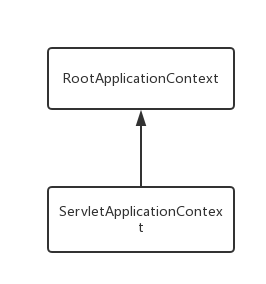

# springmvc源码--启动过程与组件初始化

**正文**

SpringMVC作为MVC框架近年来被广泛地使用，其与Mybatis和Spring的组合，也成为许多公司开发web的套装。SpringMVC继承了Spring的优点，对业务代码的非侵入性，配置的便捷和灵活，再加上注解方式的简便与流行，SpringMVC自然成为web开发中MVC框架的首选。

SpringMVC的设计理念，简单来说，就是将Spring的IOC容器与Servlet结合起来，从而在IOC容器中维护Servlet相关对象的生命周期，同时将Spring的上下文注入到Servlet的上下文中。依靠Servlet的事件和监听机制来操作和维护外部请求，以及组装和执行请求对应的响应。

## XML配置

SpringMVC想与Servlet相结合，首先得在Servlet容器中进行配置。以Tomcat为例，通常在web.xml文件中配置一个监听器和SpringMVC的核心Servlet。

### 监听器

```
<context-param>
    <param-name>contextConfigLocation</param-name>
    <param-value>classpath:spring.xml</param-value>
</context-param>

<listener>
    <listener-class>org.springframework.web.context.ContextLoaderListener</listener-class>
</listener>
```

### 核心Servlet

```
<servlet>
    <servlet-name>dispatcher</servlet-name>
    <servlet-class>org.springframework.web.servlet.DispatcherServlet</servlet-class>
    <init-param>
        <param-name>contextConfigLocation</param-name>
        <param-value>classpath:spring-mvc.xml</param-value>
    </init-param>
    <load-on-startup>1</load-on-startup>
</servlet>
<servlet-mapping>
    <servlet-name>dispatcher</servlet-name>
    <url-pattern>/</url-pattern>
</servlet-mapping>
```

当我准备研究SpringMVC源码时，我问出了一个早应该问的问题：为什么配置了DispatcherServlet，还需要一个监听器，而且都能加载配置文件？在context-param中的配置文件要不要在DispatcherServlet中的init-param再加上？相信很多刚用SpringMVC的人都闪现过这样的问题。翻阅过源码后，明白了SpringMVC通过这种方式实现了**父子上下文容器结构**。

Tomcat启动时，监听器ContextLoaderListener创建一个XMLWebApplicationContext上下文容器，并加载context-param中的配置文件，完成容器的刷新后将上下文设置到ServletContext。当DispatcherServlet创建时，先进行初始化操作，从ServletContext中查询出监听器中创建的上下文对象，作为父类上下文来创建servlet的上下文容器，并加载Servlet配置中的init-param的配置文件(默认加载/WEB-INF/servletName-servlet.xml,servletName为DispatcherServlet配置的servlet-name)，然后完成容器的刷新。**子上下文可以访问父上下文中的bean，反之则不行。**

父子上下文容器结构如下



通常是将业务操作及数据库相关的bean维护在Listener的父容器中，而在Servlet的子容器中只加载Controller相关的业务实现的bean。从而将业务实现和业务的具体操作分隔在两个上下文容器中，业务实现bean可以调用业务具体操作的bean。

## ServletContext启动监听

 ServletContextListener监听ServletContext的生命周期。每个web application对应一个ServletContext，用于servlet与servlet容器沟通的中介。它定义两个方法，context初始化和context销毁。

```
public interface ServletContextListener extends EventListener {

    public void contextInitialized(ServletContextEvent sce);

    
    public void contextDestroyed(ServletContextEvent sce);
}
```

SpringMVC的ContextLoaderListener实现了此接口，在web application启动时创建一个Spring的ROOT上下文。

### 根上下文的创建

 SpringMVC根上下文是通过ServletContext的监听器进行创建，默认的监听器为ContextLoaderListener。当web应用启动时，会调用监听器的contextInitialized方法。

