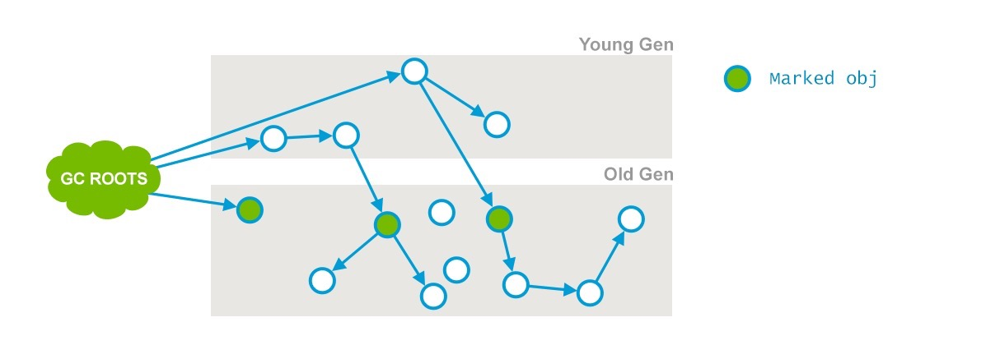
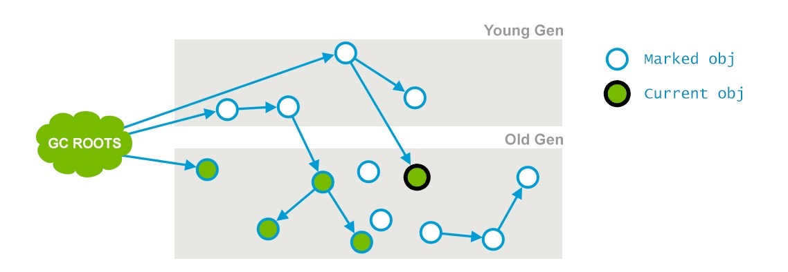
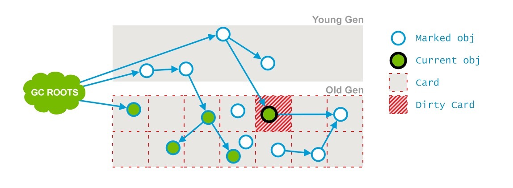
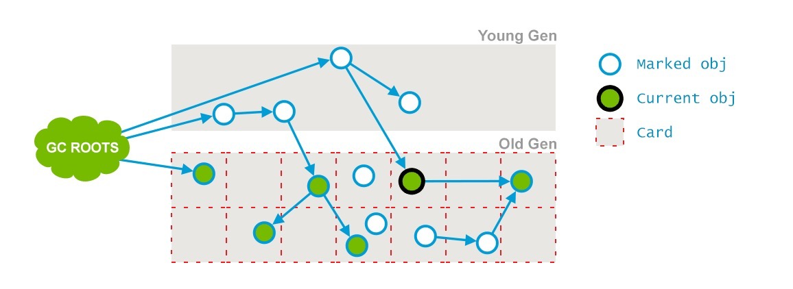
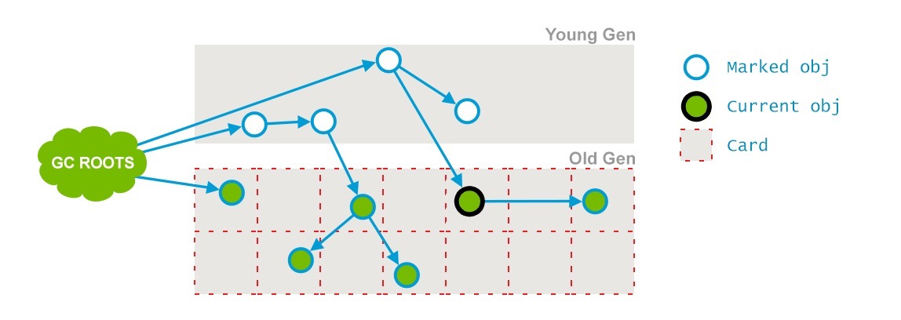

## CMS-老年代收集算法-JVM日志查看 

## 关键字

CMS回收算法、CMS7步回收

#### what is CMS

cms 是jvm中为老年代(tunured)实现垃圾收集的一种算法

CMS(concurrent mark and sweep) 并发标记清理

#### 常见搭配

##### ParNew+CMS

young : parNew (mark - copy) 

tenured : CMS (Concurrent makr-sweep)

###### 适用场景:保证响应、减少服务器停顿的场景（相应的缺点是付出更多的cpu消耗)

###### 原因：

1.没有花费时间压缩老年代，维持了free-lists的数据结构，用这个管理可回收空间

2.mark-sweep分为很多个阶段 只有两个阶段STW,其余阶段和Application Thread 是同时进行的

默认GC工作线程 是服务器物理CPU核数的1/4


#### CMS日志Example

```
Java HotSpot(TM) 64-Bit Server VM (25.251-b08) for windows-amd64 JRE (1.8.0_251-b08), built on Mar 12 2020 06:31:49 by "" with MS VC++ 10.0 (VS2010)
Memory: 4k page, physical 16102696k(5118632k free), swap 29209892k(2754224k free)
CommandLine flags: -XX:InitialHeapSize=20971520 -XX:MaxHeapSize=20971520 -XX:MaxNewSize=10485760 -XX:MaxTenuringThreshold=15 -XX:NewSize=10485760 -XX:OldPLABSize=16 -XX:PretenureSizeThreshold=3145728 -XX:+PrintGC -XX:+PrintGCDetails -XX:+PrintGCTimeStamps -XX:SurvivorRatio=8 -XX:+UseCompressedClassPointers -XX:+UseCompressedOops -XX:+UseConcMarkSweepGC -XX:-UseLargePagesIndividualAllocation -XX:+UseParNewGC
2020-09-02T13:59:22.710+0800: 0.281: [GC (Allocation Failure) 2020-09-02T13:59:22.710+0800: 0.281: [ParNew: 6663K->820K(9216K), 0.0026879 secs] 10759K->9014K(19456K), 0.0029187 secs] [Times: user=0.00 sys=0.00, real=0.00 secs]
2020-09-02T13:59:22.713+0800: 0.284: [GC (CMS Initial Mark) [1 CMS-initial-mark: 8194K(10240K)] 11062K(19456K), 0.0004216 secs] [Times: user=0.00 sys=0.00, real=0.00 secs]
2020-09-02T13:59:22.714+0800: 0.285: [CMS-concurrent-mark-start]
2020-09-02T13:59:22.714+0800: 0.285: [CMS-concurrent-mark: 0.000/0.000 secs] [Times: user=0.00 sys=0.00, real=0.00 secs]
2020-09-02T13:59:22.714+0800: 0.285: [CMS-concurrent-preclean-start]
2020-09-02T13:59:22.714+0800: 0.285: [CMS-concurrent-preclean: 0.000/0.000 secs] [Times: user=0.00 sys=0.00, real=0.00 secs]
2020-09-02T13:59:22.714+0800: 0.285: [CMS-concurrent-abortable-preclean-start]
2020-09-02T13:59:22.714+0800: 0.285: [CMS-concurrent-abortable-preclean: 0.000/0.000 secs] [Times: user=0.00 sys=0.00, real=0.00 secs]
2020-09-02T13:59:22.714+0800: 0.285: [GC (CMS Final Remark) [YG occupancy: 5372 K (9216 K)]2020-09-02T13:59:22.714+0800: 0.285: [Rescan (parallel) , 0.0003767 secs]2020-09-02T13:59:22.715+0800: 0.286: [weak refs processing, 0.0000570 secs]2020-09-02T13:59:22.715+0800: 0.286: [class unloading, 0.0003119 secs]2020-09-02T13:59:22.715+0800: 0.286: [scrub symbol table, 0.0006524 secs]2020-09-02T13:59:22.716+0800: 0.287: [scrub string table, 0.0001216 secs][1 CMS-remark: 8194K(10240K)] 13566K(19456K), 0.0016413 secs] [Times: user=0.00 sys=0.00, real=0.00 secs]
2020-09-02T13:59:22.716+0800: 0.287: [CMS-concurrent-sweep-start]
2020-09-02T13:59:22.716+0800: 0.287: [CMS-concurrent-sweep: 0.000/0.000 secs] [Times: user=0.00 sys=0.00, real=0.00 secs]
2020-09-02T13:59:22.716+0800: 0.287: [CMS-concurrent-reset-start]
2020-09-02T13:59:22.716+0800: 0.287: [CMS-concurrent-reset: 0.000/0.000 secs] [Times: user=0.00 sys=0.00, real=0.00 secs]
Heap
 par new generation   total 9216K, used 5454K [0x00000000fec00000, 0x00000000ff600000, 0x00000000ff600000)
  eden space 8192K,  56% used [0x00000000fec00000, 0x00000000ff086818, 0x00000000ff400000)
  from space 1024K,  80% used [0x00000000ff500000, 0x00000000ff5cd268, 0x00000000ff600000)
  to   space 1024K,   0% used [0x00000000ff400000, 0x00000000ff400000, 0x00000000ff500000)
 concurrent mark-sweep generation total 10240K, used 4098K [0x00000000ff600000, 0x0000000100000000, 0x0000000100000000)
 Metaspace       used 3073K, capacity 4556K, committed 4864K, reserved 1056768K
  class space    used 324K, capacity 392K, committed 512K, reserved 1048576K


```


#### Minor GC

[GC (Allocation Failure) 2020-09-02T13:59:22.710+0800<sup>0</sup>: 0.281<sup>1</sup>: [ParNew<sup>2</sup>: 6663K->820K<sup>3</sup>(9216K<sup>4</sup>), 0.0026879 secs<sup>5</sup>] 10759K->9014K<sup>7</sup>(19456K<sup>8</sup>), 0.0029187 secs<sup>9</sup>] [Times: user=0.00 sys=0.00, real=0.00 secs]<sup>10</sup>

##### 0.2020-09-02T13:59:22.710+0800   

GC发生时间 可以选择基准时间（-XX:+PrintGCTimeStamps）  

或者绝对时间（-XX:+PrintGCDateStamps）以日期的形式，如 2013-05-04T21:53:59.234+0800

##### 1.   0.281  

GC开始，相对JVM的启动时间

##### 2.   ParNew 

年轻代收集器名称

##### 3.   6663K->820K

Minor GC之后年轻代的变化情况 

##### 4.   9216K

整个年轻代的容量

##### 5.   0.0026879 secs

Duration for the collection w/o final cleanup.

##### 6.  10759K->9014K

整个堆的变化情况

##### 8.(19456K)

整个堆的容量

##### 9.0.0029187 secs

ParNew收集器标记和复制年轻代活着的对象所花费的时间（包括和老年代通信的开销、对象晋升到老年代时间、垃圾收集周期结束一些最后的清理对象等的花销）

##### 10.[Times: user=0.00 sys=0.00, real=0.00 secs]

[Times: user=0.78 sys=0.01, real=0.11 secs] – GC事件在不同维度的耗时，具体的用英文解释起来更加合理:

- user – Total CPU time that was consumed by Garbage Collector threads during this collection
- sys – Time spent in OS calls or waiting for system event
- real – Clock time for which your application was stopped. With Parallel GC this number should be close to (user time + system time) divided by the number of threads used by the Garbage Collector. In this particular case 8 threads were used. Note that due to some activities not being parallelizable, it always exceeds the ratio by a certain amount.


##### Minor GC  计算老年代大小

[GC (Allocation Failure) 2020-09-02T13:59:22.710+0800<sup>0</sup>: 0.281<sup>1</sup>: [ParNew<sup>2</sup>: 6663K->820K<sup>3</sup>(9216K<sup>4</sup>), 0.0026879 secs<sup>5</sup>] 10759K->9014K<sup>7</sup>(19456K<sup>8</sup>), 0.0029187 secs<sup>9</sup>] [Times: user=0.00 sys=0.00, real=0.00 secs]<sup>10</sup>

Minor GC前的老年代大小 = 10759K - 6663K = 4096K

Minor GC后的老年代大小 = 9014K - 820K = 8194K

老年代 增加了 8194K - 4096K = 4098 K


#### CMS回收的七个阶段

CMS Initial Mark  （STW）

concurrent-mark

concurrent-PreClean

concurrent-abortable-preclean

CMS Final Remark（STW)

sweep 

reset 

#### 1.CMS Initial Mark  （STW）

CMS两次STW的第一次

目标：

一是标记老年代中所有的GC Roots；二是标记被年轻代中活着的对象引用的对象。



2020-09-02T13:59:22.713+0800: 0.284<sup>1</sup>: [GC (CMS Initial Mark<sup>2</sup>) [1 CMS-initial-mark: 8194K<sup>3</sup>(10240K)<sup>4</sup>] 11062K<sup>5</sup>(19456K)<sup>6</sup>, 0.0004216 secs<sup>7</sup>] [Times: user=0.00 sys=0.00, real=0.00 secs]

##### 1.2020-09-02T13:59:22.713+0800: 0.284

GC开始时间 和 距离jvm启动的时间

##### 2. (CMS Initial Mark）

 收集阶段，开始收集所有的GC Roots和直接引用到的对象；

##### 3.  8194K

当前老年代（tunured) 的使用情况

##### 4. (10240K)

老年代容量

##### 5. 11062K

堆使用情况

##### 6. (19456K)

堆可用情况

##### 7.  0.0004216 secs

耗时

#### 2. concurrent-mark

这个阶段会遍历整个老年代并且标记所有存活的对象，从“初始化标记”阶段找到的GC Roots开始。并发标记的特点是和应用程序线程同时运行。并不是老年代的所有存活对象都会被标记，因为标记的同时应用程序会改变一些对象的引用等。



2020-09-02T13:59:22.714+0800: 0.285: [CMS-concurrent-mark-start]
2020-09-02T13:59:22.714+0800: 0.285: [CMS-concurrent-mark: 0.000/0.000 secs] [Times: user=0.00 sys=0.00, real=0.00 secs]

#### 3.concurrent-preclean

这个阶段又是一个并发阶段，和应用线程并行运行，不会中断他们。前一个阶段(concurrent-mark)在并行运行的时候，一些对象的引用已经发生了变化，当这些引用发生变化的时候，JVM会标记堆的这个区域为Dirty Card(包含被标记但是改变了的对象，被认为"dirty")，这就是 [Card Marking](http://psy-lob-saw.blogspot.com.ee/2014/10/the-jvm-write-barrier-card-marking.html)。




在pre-clean阶段，那些能够从dirty card对象到达的对象也会被标记，这个标记做完之后，dirty card标记就会被清除了，如下：



另外，一些必要的清扫工作也会做，还会做一些final remark阶段需要的准备工作；

2020-09-02T13:59:22.714+0800: 0.285: [CMS-concurrent-preclean-start]
2020-09-02T13:59:22.714+0800: 0.285: [CMS-concurrent-preclean: 0.000/0.000 secs] [Times: user=0.00 sys=0.00, real=0.00 secs]

#### 4.concurrent-adortable preclean  

( 可终止的并发预清理)又一个并发阶段不会停止应用程序线程。这个阶段尝试着去承担STW的Final Remark阶段足够多的工作。这个阶段持续的时间依赖好多的因素，由于这个阶段是重复的做相同的事情直到发生aboart的条件（比如：重复的次数、多少量的工作、持续的时间等等）之一才会停止。

2020-09-02T13:59:22.714+0800: 0.285: [CMS-concurrent-abortable-preclean-start]
2020-09-02T13:59:22.714+0800: 0.285: [CMS-concurrent-abortable-preclean: 0.000/0.000 secs] [Times: user=0.00 sys=0.00, real=0.00 secs]

#### 5.final-remark

这个阶段是CMS中第二个并且是最后一个STW的阶段。该阶段的任务是完成标记整个年老代的所有的存活对象。由于之前的预处理是并发的，它可能跟不上应用程序改变的速度，这个时候，STW是非常需要的来完成这个严酷考验的阶段。

通常CMS尽量运行Final Remark阶段在年轻代是足够干净的时候，目的是消除紧接着的连续的几个STW阶段。

2020-09-02T13:59:22.714+0800: 0.285: [GC (CMS Final Remark) [YG occupancy: 5372 K (9216 K) <sup>1</sup>]2020-09-02T13:59:22.714+0800: 0.285: [Rescan (parallel) , 0.0003767 secs <sup>2</sup>]2020-09-02T13:59:22.715+0800: 0.286: [weak refs processing, 0.0000570 secs <sup>3</sup>]2020-09-02T13:59:22.715+0800: 0.286: [class unloading , 0.0003119 secs<sup>4</sup>]2020-09-02T13:59:22.715+0800: 0.286: [scrub symbol table , 0.0006524 secs<sup>5</sup>]02T13:59:22.716+0800: 0.287: [scrub string table, 0.0001216 secs][1 CMS-remark: 8194K(10240K)] [1 CMS-remark: 8194K(10240K)<sup>6</sup>] 13566K(19456K)<sup>7</sup>, 0.0016413 secs<sup>8</sup>] [Times: user=0.00 sys=0.00, real=0.00 secs]


2020-09-02T13:59:22.714+0800: 0.285: [GC (CMS Final Remark) [YG occupancy: 5372 K (9216 K)]2020-09-02T13:59:22.714+0800: 0.285: [Rescan (parallel) , 0.0003767 secs]2020-09-02T13:59:22.715+0800: 0.286: [weak refs processing, 0.0000570 secs]2020-09-02T13:59:22.715+0800: 0.286: [class unloading, 0.0003119 secs]2020-09-02T13:59:22.715+0800: 0.286: [scrub symbol table, 0.0006524 secs]2020-09-02T13:59:22.716+0800: 0.287: [scrub string table, 0.0001216 secs][1 CMS-remark: 8194K(10240K)] 13566K(19456K), 0.0016413 secs] [Times: user=0.00 sys=0.00, real=0.00 secs]

##### 1.5372 K (9216 K) 

年轻代的占用和容量

##### 2.Rescan (parallel) , 0.0003767 secs 

是当应用暂停的情况下完成对所有存活对象的标记，这个阶段是并行处理的

##### 3.weak refs processing, 0.0000570 secs 

第一个子阶段，随着这个阶段的进行处理弱引用；

##### 4.class unloading 0.0003119 secs

第二个子阶段(that is unloading the unused classes, with the duration and timestamp of the phase);

##### 5.scrub symbol table , 0.0006524 secs

 最后一个子阶段（that is cleaning up symbol and string tables which hold class-level metadata and internalized string respectively）

##### 6.8194K(10240K)

老年代的占用和容量

##### 7.13566K(19456K)

堆的占用和容量

##### 8.0.0016413 secs

耗时

#### 6.concurrent-sweep

和应用线程同时进行，不需要STW。这个阶段的目的就是移除那些不用的对象，回收他们占用的空间并且为将来使用。




2020-09-02T13:59:22.716+0800: 0.287: [CMS-concurrent-sweep-start]
2020-09-02T13:59:22.716+0800: 0.287: [CMS-concurrent-sweep: 0.000/0.000 secs] [Times: user=0.00 sys=0.00, real=0.00 secs]


#### 7.concurrent-reset 

这个阶段并发执行，重新设置CMS算法内部的数据结构，准备下一个CMS生命周期的使用。

2020-09-02T13:59:22.716+0800: 0.287: [CMS-concurrent-reset-start]
2020-09-02T13:59:22.716+0800: 0.287: [CMS-concurrent-reset: 0.000/0.000 secs] [Times: user=0.00 sys=0.00, real=0.00 secs]

