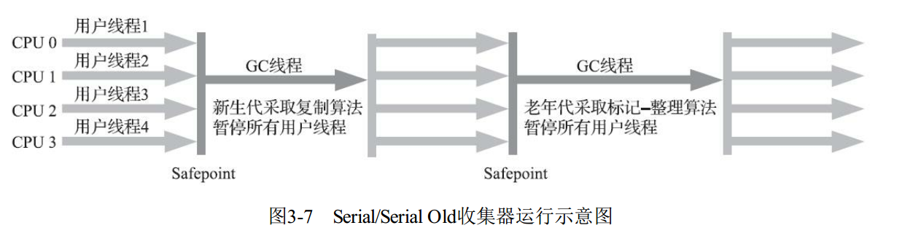
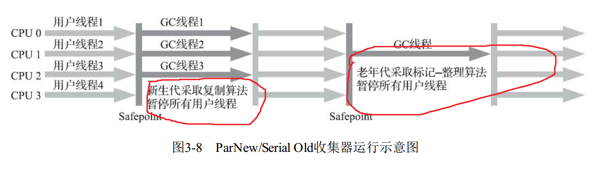
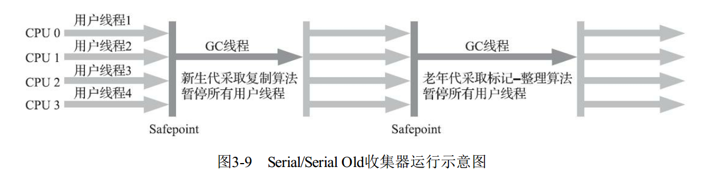
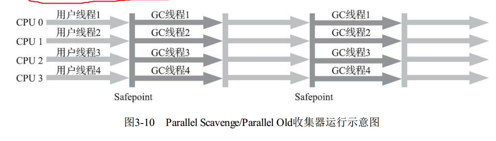
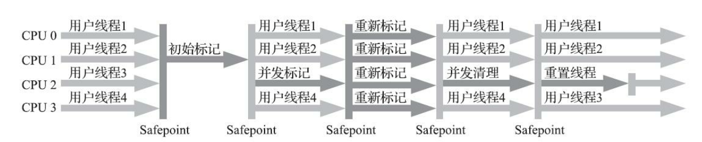
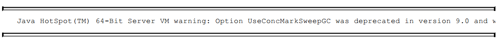
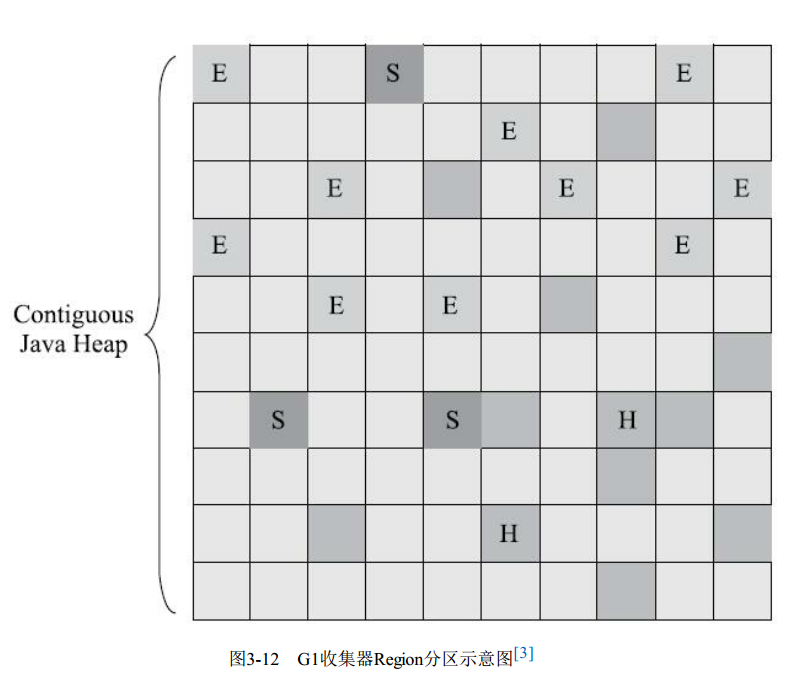
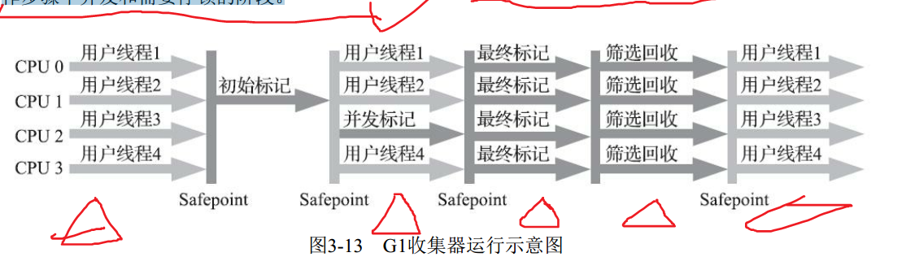

## 经典垃圾收集器

### Serial收集器

​		Serial收集器是最基础、 历史最悠久的收集器， 曾经（在JDK 1.3.1之前） 是HotSpot虚拟机新生代
收集器的唯一选择。 大家只看名字就能够猜到， 这个收集器是一个单线程工作的收集器， 但它的“单线
程”的意义并不仅仅是说明它只会使用一个处理器或一条收集线程去完成垃圾收集工作， **更重要的是强**
**调在它进行垃圾收集时， 必须暂停其他所有工作线程， 直到它收集结束。** “Stop The World”这个词语也
许听起来很酷， 但这项工作是由虚拟机在后台自动发起和自动完成的， 在用户不可知、 不可控的情况
下把用户的正常工作的线程全部停掉， 这对很多应用来说都是不能接受的。 读者不妨试想一下， 要是
你的电脑每运行一个小时就会暂停响应五分钟， 你会有什么样的心情？ 图3-7示意了Serial/Serial Old收
集器的运行过程。 

从JDK 1.3开始， 一直到现在最新的JDK 13， HotSpot虚拟机开发团队为消除或者降低用户线程因
垃圾收集而导致停顿的努力一直持续进行着， 从Serial收集器到Parallel收集器， 再到Concurrent Mark
Sweep（CMS） 和Garbage First（G1） 收集器， 最终至现在垃圾收集器的最前沿成果Shenandoah和ZGC
等， 我们看到了一个个越来越构思精巧， 越来越优秀， 也越来越复杂的垃圾收集器不断涌现， **用户线**
**程的停顿时间在持续缩短， 但是仍然没有办法彻底消除**（这里不去讨论RTSJ中的收集器）。

不过 迄今为止， 它依然是HotSpot虚拟机运行在客户端模式下的默认新生代收集器， 有着优于其他收集器的地方， 那就是简单而高效（与其他收集器的单线程相比） ， 对于内存资源受限的环境， 它是所有收集器里额外内存消耗（Memory Footprint） [1]最小的； 对于单核处理器或处理器核心数较少的环境来说， Serial收集器由于没有线程交互的开销， 专心做垃圾收集自然可以获得最高的单线程收集效率。 在用户桌面的应用场景以及近年来流行的部分微服务应用中， 分配给虚拟机管理的内存一般来说并不会特别大， 收集几十兆甚至一两百兆的新生代（仅仅是指新生代使用的内存， 桌面应用甚少超过这个容量） ， 垃圾收集的停顿时间完全可以控制在十几、 几十毫秒， 最多一百多毫秒以内， 只要不是频繁发生收集， 这点停顿时间对许多用户来说是完全可以接受的。 所以，Serial收集器对于运行在客户端模式下的虚拟机来说是一个很好的选择。 

### ParNew收集器

 	ParNew收集器实质上是Serial收集器的多线程并行版本， 除了同时使用多条线程进行垃圾收集之
外， 其余的行为包括Serial收集器可用的所有控制参数（例如： -XX： SurvivorRatio、 -XX：
PretenureSizeThreshold、 -XX： HandlePromotionFailure等） 、 收集算法、 Stop The World、 对象分配规
则、 回收策略等都与Serial收集器完全一致， 在实现上这两种收集器也共用了相当多的代码。 ParNew收
集器的工作过程如图3-8所示。 

ParNew收集器除了支持多线程并行收集之外， 其他与Serial收集器相比并没有太多创新之处， 但它
却是不少运行在服务端模式下的HotSpot虚拟机， 尤其是JDK 7之前的遗留系统中首选的新生代收集
器， 其中有一个与功能、 性能无关但其实很重要的原因是： 除了Serial收集器外， 目前只有它能与CMS
收集器配合工作。 

ParNew收集器在单核心处理器的环境中绝对不会有比Serial收集器更好的效果， 甚至由于存在线程
交互的开销， 该收集器在通过超线程（Hyper-Threading） 技术实现的伪双核处理器环境中都不能百分
之百保证超越Serial收集器。 当然， 随着可以被使用的处理器核心数量的增加， ParNew对于垃圾收集时
系统资源的高效利用还是很有好处的。 它默认开启的收集线程数与处理器核心数量相同， 在处理器核
心非常多（譬如32个， 现在CPU都是多核加超线程设计， 服务器达到或超过32个逻辑核心的情况非常
普遍） 的环境中， 可以使用-XX： ParallelGCThreads参数来限制垃圾收集的线程数。 

### Parallel Scavenge 收集器

​	Parallel Scavenge收集器也是一款新生代收集器， 它同样是基于标记-复制算法实现的收集器， 也是
能够并行收集的多线程收集器……Parallel Scavenge的诸多特性从表面上看和ParNew非常相似， 那它有
什么特别之处呢？
​	Parallel Scavenge收集器的特点是它的关注点与其他收集器不同， CMS等收集器的关注点**是尽可能**
**地缩短垃圾收集时用户线程的停顿时间， 而Parallel Scavenge收集器的目标则是达到一个可控制的吞吐**
**量（Throughput） 。** 所谓吞吐量就是处理器用于运行用户代码的时间与处理器总消耗时间的比值，
即 

​	如果虚拟机完成某个任务， 用户代码加上垃圾收集总共耗费了100分钟， 其中垃圾收集花掉1分
钟， 那吞吐量就是99%。 停顿时间越短就越适合需要与用户交互或需要保证服务响应质量的程序， 良
好的响应速度能提升用户体验； 而高吞吐量则可以最高效率地利用处理器资源， 尽快完成程序的运算
任务， 主要适合在后台运算而不需要太多交互的分析任务。 

​	Parallel Scavenge收集器提供了两个参数用于精确控制吞吐量， 分别是控制最大垃圾收集停顿时间
的-XX： MaxGCPauseMillis参数以及直接设置吞吐量大小的-XX： GCTimeRatio参数。
​	-XX： MaxGCPauseMillis参数允许的值是一个大于0的毫秒数， 收集器将尽力保证内存回收花费的
时间不超过用户设定值。 不过大家不要异想天开地认为如果把这个参数的值设置得更小一点就能使得
系统的垃圾收集速度变得更快， **垃圾收集停顿时间缩短是以牺牲吞吐量和新生代空间为代价换取的**：
系统把新生代调得小一些， 收集300MB新生代肯定比收集500MB快， 但这也直接导致垃圾收集发生得
更频繁， 原来10秒收集一次、 每次停顿100毫秒， 现在变成5秒收集一次、 每次停顿70毫秒。 停顿时间
的确在下降， 但吞吐量也降下来了。
​	-XX： GCTimeRatio参数的值则应当是一个大于0小于100的整数， 也就是垃圾收集时间占总时间的
比率， 相当于吞吐量的倒数。 譬如把此参数设置为19， 那允许的最大垃圾收集时间就占总时间的5%
（即1/(1+19)） ， 默认值为99， 即允许最大1%（即1/(1+99)） 的垃圾收集时间。 

​	由于与吞吐量关系密切， Parallel Scavenge收集器也经常被称作“吞吐量优先收集器”。 除上述两个
参数之外， Parallel Scavenge收集器还有一个参数-XX： +UseAdaptiveSizePolicy值得我们关注。 这是一
个开关参数， 当这个参数被激活之后， 就不需要人工指定新生代的大小（-Xmn） 、 Eden与Survivor区
的比例（-XX： SurvivorRatio） 、 晋升老年代对象大小（-XX： PretenureSizeThreshold） 等细节参数
了， 虚拟机会根据当前系统的运行情况收集性能监控信息， 动态调整这些参数以提供最合适的停顿时
间或者最大的吞吐量。 这种调节方式称为垃圾收集的自适应的调节策略（GC Ergonomics） [1]。 如果读
者对于收集器运作不太了解， 手工优化存在困难的话， 使用Parallel Scavenge收集器配合自适应调节策
略， 把内存管理的调优任务交给虚拟机去完成也许是一个很不错的选择。 只需要把基本的内存数据设
置好（如-Xmx设置最大堆） ， 然后使用-XX： MaxGCPauseMillis参数（更关注最大停顿时间） 或-
XX： GCTimeRatio（更关注吞吐量） 参数给虚拟机设立一个优化目标， 那具体细节参数的调节工作就
由虚拟机完成了。 自适应调节策略也是Parallel Scavenge收集器区别于ParNew收集器的一个重要特性。 

### Serial Old收集器

​	Serial Old是Serial收集器的老年代版本， 它同样是一个单线程收集器， 使用标记-整理算法。 这个收
集器的主要意义也是供客户端模式下的HotSpot虚拟机使用。 如果在服务端模式下， 它也可能有两种用
途： 一种是在JDK 5以及之前的版本中与Parallel Scavenge收集器搭配使用[1]， 另外一种就是作为CMS
收集器发生失败时的后备预案， 在并发收集发生Concurrent Mode Failure时使用。 这两点都将在后面的
内容中继续讲解。 Serial Old收集器的工作过程如图3-9所示。 

​	

### Parallel Old收集器

​	Parallel Old是Parallel Scavenge收集器的老年代版本， 支持多线程并发收集， 基于标记-整理算法实
现。 这个收集器是直到JDK 6时才开始提供的， 在此之前， 新生代的Parallel Scavenge收集器一直处于相
当尴尬的状态， 原因是如果新生代选择了Parallel Scavenge收集器， 老年代除了Serial Old（PS
MarkSweep） 收集器以外别无选择， 其他表现良好的老年代收集器， 如CMS无法与它配合工作。 由于
老年代Serial Old收集器在服务端应用性能上的“拖累”， 使用Parallel Scavenge收集器也未必能在整体上
获得吞吐量最大化的效果。 同样， 由于单线程的老年代收集中无法充分利用服务器多处理器的并行处
理能力， 在老年代内存空间很大而且硬件规格比较高级的运行环境中， 这种组合的总吞吐量甚至不一
定比ParNew加CMS的组合来得优秀。
​	直到Parallel Old收集器出现后， “吞吐量优先”收集器终于有了比较名副其实的搭配组合， 在注重
吞吐量或者处理器资源较为稀缺的场合， 都可以优先考虑Parallel Scavenge加Parallel Old收集器这个组
合。 Parallel Old收集器的工作过程如图3-10所示。 

### CMS收集器

​	CMS（Concurrent Mark Sweep） 收集器是一种以获取最短回收停顿时间为目标的收集器。 目前很
大一部分的Java应用集中在互联网网站或者基于浏览器的B/S系统的服务端上， 这类应用通常都会较为
关注服务的响应速度， 希望系统停顿时间尽可能短， 以给用户带来良好的交互体验。 CMS收集器就非
常符合这类应用的需求。 

​	从名字（包含“Mark Sweep”） 上就可以看出CMS收集器是基于标记-清除算法实现的， 它的运作
过程相对于前面几种收集器来说要更复杂一些， 整个过程分为四个步骤， 包括： 	

​	1） 初始标记（CMS initial mark）
​	2） 并发标记（CMS concurrent mark）
​	3） 重新标记（CMS remark）
​	4） 并发清除（CMS concurrent sweep )

​	其中初始标记、 重新标记这两个步骤仍然需要“Stop The World”。 初始标记仅仅只是标记一下GC
Roots能直接关联到的对象， 速度很快； 并发标记阶段就是从GC Roots的直接关联对象开始遍历整个对
象图的过程， 这个过程耗时较长但是不需要停顿用户线程， 可以与垃圾收集线程一起并发运行； 而重
新标记阶段则是为了修正并发标记期间， 因用户程序继续运作而导致标记产生变动的那一部分对象的
标记记录（详见3.4.6节中关于增量更新的讲解） ， 这个阶段的停顿时间通常会比初始标记阶段稍长一
些， 但也远比并发标记阶段的时间短； 最后是并发清除阶段， 清理删除掉标记阶段判断的已经死亡的
对象， 由于不需要移动存活对象， 所以这个阶段也是可以与用户线程同时并发的。 

​	由于在整个过程中耗时最长的并发标记和并发清除阶段中， 垃圾收集器线程都可以与用户线程一
起工作， 所以从总体上来说， CMS收集器的内存回收过程是与用户线程一起并发执行的。 通过图3-11
可以比较清楚地看到CMS收集器的运作步骤中并发和需要停顿的阶段。 

​	CMS是一款优秀的收集器， 它最主要的优点在名字上已经体现出来： 并发收集、 低停顿， 一些官
方公开文档里面也称之为“并发低停顿收集器”（Concurrent Low Pause Collector） 。 CMS收集器是
HotSpot虚拟机追求低停顿的第一次成功尝试， 但是它还远达不到完美的程度， 至少有以下三个明显的
缺点： 

​	首先， CMS收集器对处理器资源非常敏感。 事实上， 面向并发设计的程序都对处理器资源比较敏
感。 在并发阶段， 它虽然不会导致用户线程停顿， 但却会因为占用了一部分线程（或者说处理器的计
算能力） 而导致应用程序变慢， 降低总吞吐量。 CMS默认启动的回收线程数是（处理器核心数量
+3） /4， 也就是说， 如果处理器核心数在四个或以上， 并发回收时垃圾收集线程只占用不超过25%的
处理器运算资源， 并且会随着处理器核心数量的增加而下降。 但是当处理器核心数量不足四个时，
CMS对用户程序的影响就可能变得很大。 如果应用本来的处理器负载就很高， 还要分出一半的运算能
力去执行收集器线程， 就可能导致用户程序的执行速度忽然大幅降低。 为了缓解这种情况， 虚拟机提
供了一种称为“增量式并发收集器”（Incremental Concurrent Mark Sweep/i-CMS） 的CMS收集器变种，
所做的事情和以前单核处理器年代PC机操作系统靠抢占式多任务来模拟多核并行多任务的思想一样，
是在并发标记、 清理的时候让收集器线程、 用户线程交替运行， 尽量减少垃圾收集线程的独占资源的
时间， 这样整个垃圾收集的过程会更长， 但对用户程序的影响就会显得较少一些， 直观感受是速度变
慢的时间更多了， 但速度下降幅度就没有那么明显。 实践证明增量式的CMS收集器效果很一般， 从
JDK 7开始， i-CMS模式已经被声明为“deprecated”， 即已过时不再提倡用户使用， 到JDK 9发布后iCMS模式被完全废弃。 

​	然后， 由于CMS收集器无法处理“浮动垃圾”（Floating Garbage） ， 有可能出现“Con-current Mode
Failure”失败进而导致另一次完全“Stop The World”的Full GC的产生。 **在CMS的并发标记和并发清理阶**
**段， 用户线程是还在继续运行的， 程序在运行自然就还会伴随有新的垃圾对象不断产生， 但这一部分**
**垃圾对象是出现在标记过程结束以后， CMS无法在当次收集中处理掉它们， 只好留待下一次垃圾收集**
**时再清理掉。 这一部分垃圾就称为“浮动垃圾”。** 同样也是由于在垃圾收集阶段用户线程还需要持续运
行， 那就还需要预留足够内存空间提供给用户线程使用， 因此CMS收集器不能像其他收集器那样等待
到老年代几乎完全被填满了再进行收集， 必须预留一部分空间供并发收集时的程序运作使用。 在JDK
5的默认设置下， CMS收集器当老年代使用了68%的空间后就会被激活， 这是一个偏保守的设置， 如果
在实际应用中老年代增长并不是太快， 可以适当调高参数-XX： CMSInitiatingOccu-pancyFraction的值
来提高CMS的触发百分比， 降低内存回收频率， 获取更好的性能。 到了JDK 6时， CMS收集器的启动
阈值就已经默认提升至92%。 但这又会更容易面临另一种风险： 要是CMS运行期间预留的内存无法满
足程序分配新对象的需要， 就会出现一次“并发失败”（Concurrent Mode Failure） ， 这时候虚拟机将不
得不启动后备预案： 冻结用户线程的执行， 临时启用Serial Old收集器来重新进行老年代的垃圾收集，
但这样停顿时间就很长了。 所以参数-XX： CMSInitiatingOccupancyFraction设置得太高将会很容易导致
大量的并发失败产生， 性能反而降低， 用户应在生产环境中根据实际应用情况来权衡设置。 

​	还有最后一个缺点， 在本节的开头曾提到， CMS是一款基于“标记-清除”算法实现的收集器， 如果
读者对前面这部分介绍还有印象的话， 就可能想到这意味着收集结束时会有大量空间碎片产生。 空间
碎片过多时， 将会给大对象分配带来很大麻烦， 往往会出现老年代还有很多剩余空间， 但就是无法找
到足够大的连续空间来分配当前对象， 而不得不提前触发一次Full GC的情况。 为了解决这个问题，
CMS收集器提供了一个-XX： +UseCMS-CompactAtFullCollection开关参数（默认是开启的， 此参数从
JDK 9开始废弃） ， 用于在CMS收集器不得不进行Full GC时开启内存碎片的合并整理过程， 由于这个
内存整理必须移动存活对象， （在Shenandoah和ZGC出现前） 是无法并发的。 这样空间碎片问题是解
决了， 但停顿时间又会变长， 因此虚拟机设计者们还提供了另外一个参数-XX： CMSFullGCsBeforeCompaction（此参数从JDK 9开始废弃） ， 这个参数的作用是要求CMS收集器在执行过若干次（数量由参数值决定） 不整理空间的Full GC之后， 下一次进入Full GC前会先进行碎片整理（默认值为0， 表
示每次进入Full GC时都进行碎片整理） 。 

### Garbage First收集器（G1）

​	Garbage First（简称G1） 收集器是垃圾收集器技术发展历史上的里程碑式的成果， **它开创了收集**
**器面向局部收集的设计思路和基于Region的内存布局形式。** 早在JDK 7刚刚确立项目目标、 Oracle公司
制定的JDK 7 RoadMap里面， G1收集器就被视作JDK 7中HotSpot虚拟机的一项重要进化特征。 从JDK
6 Update 14开始就有Early Access版本的G1收集器供开发人员实验和试用， 但由此开始G1收集器的“实
验状态”（Experimental） 持续了数年时间， 直至JDK 7 Update 4， Oracle才认为它达到足够成熟的商用
程度， 移除了“Experimental”的标识； 到了JDK 8 Update 40的时候， G1提供并发的类卸载的支持， 补
全了其计划功能的最后一块拼图。 这个版本以后的G1收集器才被Oracle官方称为“全功能的垃圾收集
器”（Fully-Featured Garbage Collector） 

​	G1是一款主要面向服务端应用的垃圾收集器。 HotSpot开发团队最初赋予它的期望是（在比较长
期的） 未来可以替换掉JDK 5中发布的CMS收集器。 现在这个期望目标已经实现过半了， JDK 9发布之
日， G1宣告取代Parallel Scavenge加Parallel Old组合， 成为服务端模式下的默认垃圾收集器， 而CMS则
沦落至被声明为不推荐使用（Deprecate） 的收集器[1]。 如果对JDK 9及以上版本的HotSpot虚拟机使用
参数-XX： +UseConcMarkSweepGC来开启CMS收集器的话， 用户会收到一个警告信息， 提示CMS未
来将会被废弃： 

​	但作为一款曾被广泛运用过的收集器， 经过多个版本的开发迭代后， CMS（以及之前几款收集
器） 的代码与HotSpot的内存管理、 执行、 编译、 监控等子系统都有千丝万缕的联系， 这是历史原因导
致的， 并不符合职责分离的设计原则。 为此， 规划JDK 10功能目标时， HotSpot虚拟机提出了“统一垃
圾收集器接口”[2]， 将内存回收的“行为”与“实现”进行分离， CMS以及其他收集器都重构成基于这套
接口的一种实现。 以此为基础， 日后要移除或者加入某一款收集器， 都会变得容易许多， 风险也可以
控制， 这算是在为CMS退出历史舞台铺下最后的道路了。 

​	那具体要怎么做才能实现这个目标呢？ 首先要有一个思想上的改变， 在G1收集器出现之前的所有
其他收集器， 包括CMS在内， 垃圾收集的目标范围要么是整个新生代（Minor GC） ， 要么就是整个老
年代（Major GC） ， 再要么就是整个Java堆（Full GC） 。 而G1跳出了这个樊笼， 它可以面向堆内存任
何部分来组成回收集（Collection Set， 一般简称CSet） 进行回收， 衡量标准不再是它属于哪个分代， 而
是哪块内存中存放的垃圾数量最多， 回收收益最大， 这就是G1收集器的Mixed GC模式。 

	G1开创的基于Region的堆内存布局是它能够实现这个目标的关键。 虽然G1也仍是遵循分代收集理
论设计的， 但其堆内存的布局与其他收集器有非常明显的差异： G1不再坚持固定大小以及固定数量的
分代区域划分， 而是把连续的Java堆划分为多个大小相等的独立区域（Region） ， 每一个Region都可以
根据需要， 扮演新生代的Eden空间、 Survivor空间， 或者老年代空间。 收集器能够对扮演不同角色的
Region采用不同的策略去处理， 这样无论是新创建的对象还是已经存活了一段时间、 熬过多次收集的
旧对象都能获取很好的收集效果 。

​	Region中还有一类特殊的Humongous区域， 专门用来存储大对象。 G1认为只要大小超过了一个
Region容量一半的对象即可判定为大对象。 每个Region的大小可以通过参数-XX： G1HeapRegionSize设
定， 取值范围为1MB～32MB， 且应为2的N次幂。 而对于那些超过了整个Region容量的超级大对象，
将会被存放在N个连续的Humongous Region之中， G1的大多数行为都把Humongous Region作为老年代
的一部分来进行看待， 如图3-12所示 

​	虽然G1仍然保留新生代和老年代的概念， 但新生代和老年代不再是固定的了， 它们都是一系列区
域（不需要连续） 的动态集合。 G1收集器之所以能建立可预测的停顿时间模型， 是因为它将Region作
为单次回收的最小单元， 即每次收集到的内存空间都是Region大小的整数倍， 这样可以有计划地避免
在整个Java堆中进行全区域的垃圾收集。 更具体的处理思路是让G1收集器去跟踪各个Region里面的垃
圾堆积的“价值”大小， **价值即回收所获得的空间大小以及回收所需时间的经验值**， 然后在后台维护一
个优先级列表， 每次根据用户设定允许的收集停顿时间（使用参数-XX： MaxGCPauseMillis指定， 默
认值是200毫秒） ， 优先处理回收价值收益最大的那些Region， 这也就是“Garbage First”名字的由来。
这种使用Region划分内存空间， 以及具有优先级的区域回收方式， 保证了G1收集器在有限的时间内获
取尽可能高的收集效率。 

​	G1将堆内存“化整为零”的“解题思路”， 看起来似乎没有太多令人惊讶之处， 也完全不难理解， 但
其中的实现细节可是远远没有想象中那么简单， 否则就不会从2004年Sun实验室发表第一篇关于G1的
论文后一直拖到2012年4月JDK 7 Update 4发布， 用将近10年时间才倒腾出能够商用的G1收集器来。
G1收集器至少有（不限于） 以下这些关键的细节问题需要妥善解决： 

​	·譬如， 将Java堆分成多个独立Region后， Region里面存在的跨Region引用对象如何解决？ 解决的思
路我们已经知道（见3.3.1节和3.4.4节） ： 使用记忆集避免全堆作为GC Roots扫描， 但在G1收集器上记
忆集的应用其实要复杂很多， 它的每个Region都维护有自己的记忆集， 这些记忆集会记录下别的Region
指向自己的指针， 并标记这些指针分别在哪些卡页的范围之内。 G1的记忆集在存储结构的本质上是一
种哈希表， Key是别的Region的起始地址， Value是一个集合， 里面存储的元素是卡表的索引号。 这
种“双向”的卡表结构（卡表是“我指向谁”， 这种结构还记录了“谁指向我”） 比原来的卡表实现起来更
复杂， 同时由于Region数量比传统收集器的分代数量明显要多得多， 因此G1收集器要比其他的传统垃
圾收集器有着更高的内存占用负担。 根据经验， G1至少要耗费大约相当于Java堆容量10%至20%的额
外内存来维持收集器工作 

​	·譬如， 在并发标记阶段如何保证收集线程与用户线程互不干扰地运行？ 这里首先要解决的是用户

线程改变对象引用关系时， 必须保证其不能打破原本的对象图结构， 导致标记结果出现错误， 该问题
的解决办法笔者已经抽出独立小节来讲解过（见3.4.6节） ： CMS收集器采用增量更新算法实现， 而G1
收集器则是通过原始快照（SATB） 算法来实现的。 此外， 垃圾收集对用户线程的影响还体现在回收过
程中新创建对象的内存分配上， 程序要继续运行就肯定会持续有新对象被创建， G1为每一个Region设
计了两个名为TAMS（Top at Mark Start） 的指针， 把Region中的一部分空间划分出来用于并发回收过
程中的新对象分配， 并发回收时新分配的对象地址都必须要在这两个指针位置以上。 G1收集器默认在
这个地址以上的对象是被隐式标记过的， 即默认它们是存活的， 不纳入回收范围。 与CMS中
的“Concurrent Mode Failure”失败会导致Full GC类似， 如果内存回收的速度赶不上内存分配的速度，
G1收集器也要被迫冻结用户线程执行， 导致Full GC而产生长时间“Stop The World”。 

​	·譬如， 怎样建立起可靠的停顿预测模型？ 用户通过-XX： MaxGCPauseMillis参数指定的停顿时间
只意味着垃圾收集发生之前的期望值， 但G1收集器要怎么做才能满足用户的期望呢？ G1收集器的停顿
预测模型是以衰减均值（Decaying Average） 为理论基础来实现的， 在垃圾收集过程中， G1收集器会记
录每个Region的回收耗时、 每个Region记忆集里的脏卡数量等各个可测量的步骤花费的成本， 并分析得
出平均值、 标准偏差、 置信度等统计信息。 这里强调的“衰减平均值”是指它会比普通的平均值更容易
受到新数据的影响， 平均值代表整体平均状态， 但衰减平均值更准确地代表“最近的”平均状态。 换句
话说， Region的统计状态越新越能决定其回收的价值。 然后通过这些信息预测现在开始回收的话， 由
哪些Region组成回收集才可以在不超过期望停顿时间的约束下获得最高的收益。 

​	如果我们不去计算用户线程运行过程中的动作（如使用写屏障维护记忆集的操作） ， G1收集器的
运作过程大致可划分为以下四个步骤： 

​	·初始标记（Initial Marking） ： 仅仅只是标记一下GC Roots能直接关联到的对象， 并且修改TAMS
指针的值， 让下一阶段用户线程并发运行时， 能正确地在可用的Region中分配新对象。 这个阶段需要
停顿线程， 但耗时很短， 而且是借用进行Minor GC的时候同步完成的， 所以G1收集器在这个阶段实际
并没有额外的停顿。
​	·并发标记（Concurrent Marking） ： 从GC Root开始对堆中对象进行可达性分析， 递归扫描整个堆
里的对象图， 找出要回收的对象， 这阶段耗时较长， 但可与用户程序并发执行。 当对象图扫描完成以
后， 还要重新处理SATB记录下的在并发时有引用变动的对象。
​	·最终标记（Final Marking） ： 对用户线程做另一个短暂的暂停， 用于处理并发阶段结束后仍遗留
下来的最后那少量的SATB记录。
​	·筛选回收（Live Data Counting and Evacuation） ： 负责更新Region的统计数据， 对各个Region的回
收价值和成本进行排序， 根据用户所期望的停顿时间来制定回收计划， 可以自由选择任意多个Region
构成回收集， 然后把决定回收的那一部分Region的存活对象复制到空的Region中， 再清理掉整个旧
Region的全部空间。 这里的操作涉及存活对象的移动， 是必须暂停用户线程， 由多条收集器线程并行
完成的。
​	从上述阶段的描述可以看出， G1收集器除了并发标记外， 其余阶段也是要完全暂停用户线程的，
换言之， 它并非纯粹地追求低延迟， 官方给它设定的目标是在延迟可控的情况下获得尽可能高的吞吐
量， 所以才能担当起“全功能收集器”的重任与期望[4]。 

​	从Oracle官方透露出来的信息可获知， 回收阶段（Evacuation） 其实本也有想过设计成与用户程序
一起并发执行， 但这件事情做起来比较复杂， 考虑到G1只是回收一部分Region， 停顿时间是用户可控
制的， 所以并不迫切去实现， 而选择把这个特性放到了G1之后出现的低延迟垃圾收集器（即ZGC）
中。 另外， 还考虑到G1不是仅仅面向低延迟， 停顿用户线程能够最大幅度提高垃圾收集效率， 为了保
证吞吐量所以才选择了完全暂停用户线程的实现方案。 通过图3-13可以比较清楚地看到G1收集器的运
作步骤中并发和需要停顿的阶段。 

​	毫无疑问， 可以由用户指定期望的停顿时间是G1收集器很强大的一个功能， 设置不同的期望停顿
时间， 可使得G1在不同应用场景中取得关注吞吐量和关注延迟之间的最佳平衡。 不过， 这里设置
的“期望值”必须是符合实际的， 不能异想天开， 毕竟G1是要冻结用户线程来复制对象的， 这个停顿时
间再怎么低也得有个限度。 它默认的停顿目标为两百毫秒， 一般来说， 回收阶段占到几十到一百甚至
接近两百毫秒都很正常， 但如果我们把停顿时间调得非常低， 譬如设置为二十毫秒， 很可能出现的结
果就是由于停顿目标时间太短， 导致每次选出来的回收集只占堆内存很小的一部分， 收集器收集的速
度逐渐跟不上分配器分配的速度， 导致垃圾慢慢堆积。 很可能一开始收集器还能从空闲的堆内存中获
得一些喘息的时间， 但应用运行时间一长就不行了， 最终占满堆引发Full GC反而降低性能， 所以通常
把期望停顿时间设置为一两百毫秒或者两三百毫秒会是比较合理的。 

​	从G1开始， 最先进的垃圾收集器的设计导向都不约而同地变为追求能够应付应用的内存分配速率

（Allocation Rate） ， 而不追求一次把整个Java堆全部清理干净。 这样， 应用在分配， 同时收集器在收
集， 只要收集的速度能跟得上对象分配的速度， 那一切就能运作得很完美。 这种新的收集器设计思路
从工程实现上看是从G1开始兴起的， 所以说G1是收集器技术发展的一个里程碑。 

​	G1收集器常会被拿来与CMS收集器互相比较， 毕竟它们都非常关注停顿时间的控制， 官方资料
[5]中将它们两个并称为“The Mostly Concurrent Collectors”。 在未来， G1收集器最终还是要取代CMS
的， 而当下它们两者并存的时间里， 分个高低优劣就无可避免。

​	相比CMS， G1的优点有很多， 暂且不论可以指定最大停顿时间、 分Region的内存布局、 按收益动
态确定回收集这些创新性设计带来的红利， 单从最传统的算法理论上看， G1也更有发展潜力。 与CMS
的“标记-清除”算法不同， **G1从整体来看是基于“标记-整理”算法实现的收集器，** 但从局部（两个Region
之间） 上看又是基于“标记-复制”算法实现， 无论如何， 这两种算法都意味着G1运作期间不会产生内存
空间碎片， 垃圾收集完成之后能提供规整的可用内存。 这种特性有利于程序长时间运行， 在程序为大
对象分配内存时不容易因无法找到连续内存空间而提前触发下一次收集。

​	不过， G1相对于CMS仍然不是占全方位、 压倒性优势的， 从它出现几年仍不能在所有应用场景中
代替CMS就可以得知这个结论。 比起CMS， G1的弱项也可以列举出不少， 如在用户程序运行过程
中， G1无论是为了垃圾收集产生的内存占用（Footprint） 还是程序运行时的额外执行负载
（Overload） 都要比CMS要高。

​	就内存占用来说， 虽然G1和CMS都使用卡表来处理跨代指针， 但G1的卡表实现更为复杂， 而且
堆中每个Region， 无论扮演的是新生代还是老年代角色， 都必须有一份卡表， 这导致G1的记忆集（和
其他内存消耗） 可能会占整个堆容量的20%乃至更多的内存空间； 相比起来CMS的卡表就相当简单，
只有唯一一份， 而且只需要处理老年代到新生代的引用， 反过来则不需要， 由于新生代的对象具有朝
生夕灭的不稳定性， 引用变化频繁， 能省下这个区域的维护开销是很划算的[6]。

​	在执行负载的角度上， 同样由于两个收集器各自的细节实现特点导致了用户程序运行时的负载会
有不同， 譬如它们都使用到写屏障， CMS用写后屏障来更新维护卡表； 而G1除了使用写后屏障来进行
同样的（由于G1的卡表结构复杂， 其实是更烦琐的） 卡表维护操作外， 为了实现原始快照搜索
（SATB） 算法， 还需要使用写前屏障来跟踪并发时的指针变化情况。 相比起增量更新算法， 原始快照
搜索能够减少并发标记和重新标记阶段的消耗， 避免CMS那样在最终标记阶段停顿时间过长的缺点，
但是在用户程序运行过程中确实会产生由跟踪引用变化带来的额外负担。 由于G1对写屏障的复杂操作
要比CMS消耗更多的运算资源， 所以CMS的写屏障实现是直接的同步操作， 而G1就不得不将其实现
为类似于消息队列的结构， 把写前屏障和写后屏障中要做的事情都放到队列里， 然后再异步处理。

​	以上的优缺点对比仅仅是针对G1和CMS两款垃圾收集器单独某方面的实现细节的定性分析， 通常我们说哪款收集器要更好、 要好上多少， 往往是针对具体场景才能做的定量比较。 目前在小内存应用上CMS的表现大概率仍然要会优于G1， 而在大内存应用上G1则大多能发挥其优势， 这个优劣势的Java堆容量平衡点通常在6GB至8GB之间， 当然，  不同应用需要量体裁衣地实际测试才能得出最合适的结论， 随着HotSpot的开发者对G1的不断优化， 也会让对比结果继续向G1倾斜。 