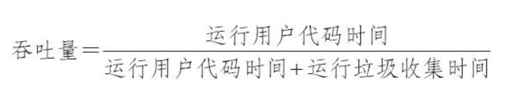

## 经典垃圾收集器

### Serial收集器

​		Serial收集器是最基础、 历史最悠久的收集器， 曾经（在JDK 1.3.1之前） 是HotSpot虚拟机新生代
收集器的唯一选择。 大家只看名字就能够猜到， 这个收集器是一个单线程工作的收集器， 但它的“单线
程”的意义并不仅仅是说明它只会使用一个处理器或一条收集线程去完成垃圾收集工作， **更重要的是强**
**调在它进行垃圾收集时， 必须暂停其他所有工作线程， 直到它收集结束。** “Stop The World”这个词语也
许听起来很酷， 但这项工作是由虚拟机在后台自动发起和自动完成的， 在用户不可知、 不可控的情况
下把用户的正常工作的线程全部停掉， 这对很多应用来说都是不能接受的。 读者不妨试想一下， 要是
你的电脑每运行一个小时就会暂停响应五分钟， 你会有什么样的心情？ 图3-7示意了Serial/Serial Old收
集器的运行过程。 

从JDK 1.3开始， 一直到现在最新的JDK 13， HotSpot虚拟机开发团队为消除或者降低用户线程因
垃圾收集而导致停顿的努力一直持续进行着， 从Serial收集器到Parallel收集器， 再到Concurrent Mark
Sweep（CMS） 和Garbage First（G1） 收集器， 最终至现在垃圾收集器的最前沿成果Shenandoah和ZGC
等， 我们看到了一个个越来越构思精巧， 越来越优秀， 也越来越复杂的垃圾收集器不断涌现， **用户线**
**程的停顿时间在持续缩短， 但是仍然没有办法彻底消除**（这里不去讨论RTSJ中的收集器）。

不过 迄今为止， 它依然是HotSpot虚拟机运行在客户端模式下的默认新生代收集器， 有着优于其他收集器的地方， 那就是简单而高效（与其他收集器的单线程相比） ， 对于内存资源受限的环境， 它是所有收集器里额外内存消耗（Memory Footprint） [1]最小的； 对于单核处理器或处理器核心数较少的环境来说， Serial收集器由于没有线程交互的开销， 专心做垃圾收集自然可以获得最高的单线程收集效率。 在用户桌面的应用场景以及近年来流行的部分微服务应用中， 分配给虚拟机管理的内存一般来说并不会特别大， 收集几十兆甚至一两百兆的新生代（仅仅是指新生代使用的内存， 桌面应用甚少超过这个容量） ， 垃圾收集的停顿时间完全可以控制在十几、 几十毫秒， 最多一百多毫秒以内， 只要不是频繁发生收集， 这点停顿时间对许多用户来说是完全可以接受的。 所以，Serial收集器对于运行在客户端模式下的虚拟机来说是一个很好的选择。 

### ParNew收集器

 	ParNew收集器实质上是Serial收集器的多线程并行版本， 除了同时使用多条线程进行垃圾收集之
外， 其余的行为包括Serial收集器可用的所有控制参数（例如： -XX： SurvivorRatio、 -XX：
PretenureSizeThreshold、 -XX： HandlePromotionFailure等） 、 收集算法、 Stop The World、 对象分配规
则、 回收策略等都与Serial收集器完全一致， 在实现上这两种收集器也共用了相当多的代码。 ParNew收
集器的工作过程如图3-8所示。 

ParNew收集器除了支持多线程并行收集之外， 其他与Serial收集器相比并没有太多创新之处， 但它
却是不少运行在服务端模式下的HotSpot虚拟机， 尤其是JDK 7之前的遗留系统中首选的新生代收集
器， 其中有一个与功能、 性能无关但其实很重要的原因是： 除了Serial收集器外， 目前只有它能与CMS
收集器配合工作。 

ParNew收集器在单核心处理器的环境中绝对不会有比Serial收集器更好的效果， 甚至由于存在线程
交互的开销， 该收集器在通过超线程（Hyper-Threading） 技术实现的伪双核处理器环境中都不能百分
之百保证超越Serial收集器。 当然， 随着可以被使用的处理器核心数量的增加， ParNew对于垃圾收集时
系统资源的高效利用还是很有好处的。 它默认开启的收集线程数与处理器核心数量相同， 在处理器核
心非常多（譬如32个， 现在CPU都是多核加超线程设计， 服务器达到或超过32个逻辑核心的情况非常
普遍） 的环境中， 可以使用-XX： ParallelGCThreads参数来限制垃圾收集的线程数。 

### Parallel Scavenge 收集器

​	Parallel Scavenge收集器也是一款新生代收集器， 它同样是基于标记-复制算法实现的收集器， 也是
能够并行收集的多线程收集器……Parallel Scavenge的诸多特性从表面上看和ParNew非常相似， 那它有
什么特别之处呢？
​	Parallel Scavenge收集器的特点是它的关注点与其他收集器不同， CMS等收集器的关注点**是尽可能**
**地缩短垃圾收集时用户线程的停顿时间， 而Parallel Scavenge收集器的目标则是达到一个可控制的吞吐**
**量（Throughput） 。** 所谓吞吐量就是处理器用于运行用户代码的时间与处理器总消耗时间的比值，
即 

​	如果虚拟机完成某个任务， 用户代码加上垃圾收集总共耗费了100分钟， 其中垃圾收集花掉1分
钟， 那吞吐量就是99%。 停顿时间越短就越适合需要与用户交互或需要保证服务响应质量的程序， 良
好的响应速度能提升用户体验； 而高吞吐量则可以最高效率地利用处理器资源， 尽快完成程序的运算
任务， 主要适合在后台运算而不需要太多交互的分析任务。 

​	Parallel Scavenge收集器提供了两个参数用于精确控制吞吐量， 分别是控制最大垃圾收集停顿时间
的-XX： MaxGCPauseMillis参数以及直接设置吞吐量大小的-XX： GCTimeRatio参数。
​	-XX： MaxGCPauseMillis参数允许的值是一个大于0的毫秒数， 收集器将尽力保证内存回收花费的
时间不超过用户设定值。 不过大家不要异想天开地认为如果把这个参数的值设置得更小一点就能使得
系统的垃圾收集速度变得更快， **垃圾收集停顿时间缩短是以牺牲吞吐量和新生代空间为代价换取的**：
系统把新生代调得小一些， 收集300MB新生代肯定比收集500MB快， 但这也直接导致垃圾收集发生得
更频繁， 原来10秒收集一次、 每次停顿100毫秒， 现在变成5秒收集一次、 每次停顿70毫秒。 停顿时间
的确在下降， 但吞吐量也降下来了。
​	-XX： GCTimeRatio参数的值则应当是一个大于0小于100的整数， 也就是垃圾收集时间占总时间的
比率， 相当于吞吐量的倒数。 譬如把此参数设置为19， 那允许的最大垃圾收集时间就占总时间的5%
（即1/(1+19)） ， 默认值为99， 即允许最大1%（即1/(1+99)） 的垃圾收集时间。 

​	由于与吞吐量关系密切， Parallel Scavenge收集器也经常被称作“吞吐量优先收集器”。 除上述两个
参数之外， Parallel Scavenge收集器还有一个参数-XX： +UseAdaptiveSizePolicy值得我们关注。 这是一
个开关参数， 当这个参数被激活之后， 就不需要人工指定新生代的大小（-Xmn） 、 Eden与Survivor区
的比例（-XX： SurvivorRatio） 、 晋升老年代对象大小（-XX： PretenureSizeThreshold） 等细节参数
了， 虚拟机会根据当前系统的运行情况收集性能监控信息， 动态调整这些参数以提供最合适的停顿时
间或者最大的吞吐量。 这种调节方式称为垃圾收集的自适应的调节策略（GC Ergonomics） [1]。 如果读
者对于收集器运作不太了解， 手工优化存在困难的话， 使用Parallel Scavenge收集器配合自适应调节策
略， 把内存管理的调优任务交给虚拟机去完成也许是一个很不错的选择。 只需要把基本的内存数据设
置好（如-Xmx设置最大堆） ， 然后使用-XX： MaxGCPauseMillis参数（更关注最大停顿时间） 或-
XX： GCTimeRatio（更关注吞吐量） 参数给虚拟机设立一个优化目标， 那具体细节参数的调节工作就
由虚拟机完成了。 自适应调节策略也是Parallel Scavenge收集器区别于ParNew收集器的一个重要特性。 

### Serial Old收集器

​	Serial Old是Serial收集器的老年代版本， 它同样是一个单线程收集器， 使用标记-整理算法。 这个收
集器的主要意义也是供客户端模式下的HotSpot虚拟机使用。 如果在服务端模式下， 它也可能有两种用
途： 一种是在JDK 5以及之前的版本中与Parallel Scavenge收集器搭配使用[1]， 另外一种就是作为CMS
收集器发生失败时的后备预案， 在并发收集发生Concurrent Mode Failure时使用。 这两点都将在后面的
内容中继续讲解。 Serial Old收集器的工作过程如图3-9所示。 

​	

### Parallel Old收集器

​	Parallel Old是Parallel Scavenge收集器的老年代版本， 支持多线程并发收集， 基于标记-整理算法实
现。 这个收集器是直到JDK 6时才开始提供的， 在此之前， 新生代的Parallel Scavenge收集器一直处于相
当尴尬的状态， 原因是如果新生代选择了Parallel Scavenge收集器， 老年代除了Serial Old（PS
MarkSweep） 收集器以外别无选择， 其他表现良好的老年代收集器， 如CMS无法与它配合工作。 由于
老年代Serial Old收集器在服务端应用性能上的“拖累”， 使用Parallel Scavenge收集器也未必能在整体上
获得吞吐量最大化的效果。 同样， 由于单线程的老年代收集中无法充分利用服务器多处理器的并行处
理能力， 在老年代内存空间很大而且硬件规格比较高级的运行环境中， 这种组合的总吞吐量甚至不一
定比ParNew加CMS的组合来得优秀。
​	直到Parallel Old收集器出现后， “吞吐量优先”收集器终于有了比较名副其实的搭配组合， 在注重
吞吐量或者处理器资源较为稀缺的场合， 都可以优先考虑Parallel Scavenge加Parallel Old收集器这个组
合。 Parallel Old收集器的工作过程如图3-10所示。 

