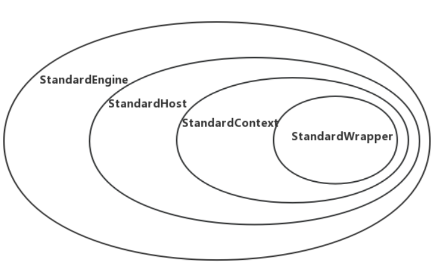

## tomcat的启动过程（二）

**正文**

在上一篇文章中，我们分析了tomcat的初始化过程，是由Bootstrap反射调用Catalina的load方法完成tomcat的初始化，包括server.xml的解析、实例化各大组件、初始化组件等逻辑。那么tomcat又是如何启动webapp应用，又是如何加载应用程序的ServletContextListener，以及Servlet呢？我们将在这篇文章进行分析

我们先来看下整体的启动逻辑，tomcat由上往下，挨个启动各个组件： 


我们接着上一篇文章来分析，上一篇文章我们分析完了Catalina.load(),这篇文章来看看daemon.start();

## Bootstrap

### daemon.start()

启动过程和初始化一样，由Bootstrap反射调用Catalina的start方法

```java
public void start()
    throws Exception {
    if( catalinaDaemon == null ) init();

    Method method = catalinaDaemon.getClass().getMethod("start", (Class [] )null);
    method.invoke(catalinaDaemon, (Object [])null);
}
```

## Catalina

```java
public void start() {

    if (getServer() == null) {
        load();
    }

    if (getServer() == null) {
        log.fatal("Cannot start server. Server instance is not configured.");
        return;
    }

    long t1 = System.nanoTime();

    // Start the new server
    try {
        //调用Server的start方法，启动Server组件 
        getServer().start();
    } catch (LifecycleException e) {
        log.fatal(sm.getString("catalina.serverStartFail"), e);
        try {
            getServer().destroy();
        } catch (LifecycleException e1) {
            log.debug("destroy() failed for failed Server ", e1);
        }
        return;
    }

    long t2 = System.nanoTime();
    if(log.isInfoEnabled()) {
        log.info("Server startup in " + ((t2 - t1) / 1000000) + " ms");
    }

    // Register shutdown hook
    // 注册勾子，用于安全关闭tomcat
    if (useShutdownHook) {
        if (shutdownHook == null) {
            shutdownHook = new CatalinaShutdownHook();
        }
        Runtime.getRuntime().addShutdownHook(shutdownHook);

        // If JULI is being used, disable JULI's shutdown hook since
        // shutdown hooks run in parallel and log messages may be lost
        // if JULI's hook completes before the CatalinaShutdownHook()
        LogManager logManager = LogManager.getLogManager();
        if (logManager instanceof ClassLoaderLogManager) {
            ((ClassLoaderLogManager) logManager).setUseShutdownHook(
                    false);
        }
    }

    // Bootstrap中会设置await为true，其目的在于让tomcat在shutdown端口阻塞监听关闭命令
    if (await) {
        await();
        stop();
    }
}
```

## Server

在前面的Lifecycle文章中，我们介绍了StandardServer重写了startInternal方法，完成自己的逻辑

### StandardServer.startInternal

```java
protected void startInternal() throws LifecycleException {

    fireLifecycleEvent(CONFIGURE_START_EVENT, null);
    setState(LifecycleState.STARTING);

    globalNamingResources.start();

    // Start our defined Services
    synchronized (servicesLock) {
        for (int i = 0; i < services.length; i++) {
            services[i].start();
        }
    }
}
```

先是由LifecycleBase统一发出STARTING_PREP事件，StandardServer额外还会发出CONFIGURE_START_EVENT、STARTING事件，用于通知LifecycleListener在启动前做一些准备工作，比如NamingContextListener会处理CONFIGURE_START_EVENT事件，实例化tomcat相关的上下文，以及ContextResource资源

接着，启动Service组件，这一块的逻辑将在下面进行详细分析，最后由LifecycleBase发出STARTED事件，完成start

## Service

StandardService的start代码如下所示： 
1. 启动Engine，Engine的child容器都会被启动，webapp的部署会在这个步骤完成； 
2. 启动Executor，这是tomcat用Lifecycle封装的线程池，继承至java.util.concurrent.Executor以及tomcat的Lifecycle接口 
3. 启动Connector组件，由Connector完成Endpoint的启动，这个时候意味着tomcat可以对外提供请求服务了

### StandardService.startInternal

```java
protected void startInternal() throws LifecycleException {

    setState(LifecycleState.STARTING);

    // 启动Engine
    if (engine != null) {
        synchronized (engine) {
            engine.start();
        }
    }

    // 启动Executor线程池
    synchronized (executors) {
        for (Executor executor: executors) {
            executor.start();
        }
    }

    // 启动MapperListener
    mapperListener.start();
    
    // 启动Connector
    synchronized (connectorsLock) {
        for (Connector connector: connectors) {
            try {
                // If it has already failed, don't try and start it
                if (connector.getState() != LifecycleState.FAILED) {
                    connector.start();
                }
            } catch (Exception e) {
                // logger......
            }
        }
    }
}
```

## Engine

Engine的标准实现为`org.apache.catalina.core.StandardEngine`。我们先来看看构造函数。其主要职责为：使用默认的基础阀门创建标准Engine组件。

```java
/**
 * Create a new StandardEngine component with the default basic Valve.
 */
public StandardEngine() {
    super();
    pipeline.setBasic(new StandardEngineValve());
    /* Set the jmvRoute using the system property jvmRoute */
    try {
        setJvmRoute(System.getProperty("jvmRoute"));
    } catch(Exception ex) {
        log.warn(sm.getString("standardEngine.jvmRouteFail"));
    }
    // By default, the engine will hold the reloading thread
    backgroundProcessorDelay = 10;
}
```

**StandardEngine.startInternal**

```java
@Override
protected synchronized void startInternal() throws LifecycleException {

    // Log our server identification information
    if(log.isInfoEnabled())
        log.info( "Starting Servlet Engine: " + ServerInfo.getServerInfo());

    // Standard container startup
    super.startInternal();
}
```

StandardEngine、StandardHost、StandardContext、StandardWrapper各个容器存在父子关系，一个父容器包含多个子容器，并且一个子容器对应一个父容器。Engine是顶层父容器，它不存在父容器。各个组件的包含关系如下图所示，默认情况下，StandardEngine只有一个子容器StandardHost，一个StandardContext对应一个webapp应用，而一个StandardWrapper对应一个webapp里面的一个 Servlet


StandardEngine、StandardHost、StandardContext、StandardWrapper都是继承至ContainerBase，各个容器的启动，都是由父容器调用子容器的start方法，也就是说由StandardEngine启动StandardHost，再StandardHost启动StandardContext，以此类推。

由于它们都是继续至ContainerBase，当调用 start 启动Container容器时，首先会执行 ContainerBase 的 start 方法，它会寻找子容器，并且在线程池中启动子容器，StandardEngine也不例外。

### ContainerBase

ContainerBase的startInternal方法如下所示，主要分为以下3个步骤： 
1. 启动子容器 

2. 启动Pipeline，并且发出STARTING事件 

3. 如果backgroundProcessorDelay参数 >= 0，则开启ContainerBackgroundProcessor线程，用于调用子容器的backgroundProcess

   ```java
   protected synchronized void startInternal() throws LifecycleException {
       // 省略若干代码......
   
       // 把子容器的启动步骤放在线程中处理，默认情况下线程池只有一个线程处理任务队列
       Container children[] = findChildren();
       List<Future<Void>> results = new ArrayList<>();
       for (int i = 0; i < children.length; i++) {
           results.add(startStopExecutor.submit(new StartChild(children[i])));
       }
   
       // 阻塞当前线程，直到子容器start完成
       boolean fail = false;
       for (Future<Void> result : results) {
           try {
               result.get();
           } catch (Exception e) {
               log.error(sm.getString("containerBase.threadedStartFailed"), e);
               fail = true;
           }
       }
   
       // 启用Pipeline
       if (pipeline instanceof Lifecycle)
           ((Lifecycle) pipeline).start();
       setState(LifecycleState.STARTING);
   
       // 开启ContainerBackgroundProcessor线程用于调用子容器的backgroundProcess方法，默认情况下backgroundProcessorDelay=-1，不会启用该线程
       threadStart();
   }
   ```

   ContainerBase会把StartChild任务丢给线程池处理，得到Future，并且会遍历所有的Future进行阻塞result.get()，这个操作是将异步启动转同步，子容器启动完成才会继续运行。我们再来看看submit到线程池的StartChild任务，它实现了java.util.concurrent.Callable接口，在call里面完成子容器的start动作。

   ```java
   private static class StartChild implements Callable<Void> {
   
       private Container child;
   
       public StartChild(Container child) {
           this.child = child;
       }
   
       @Override
       public Void call() throws LifecycleException {
           child.start();
           return null;
       }
   }
   ```

   ### 启动Pipeline

   默认使用 StandardPipeline 实现类，它也是一个Lifecycle。在容器启动的时候，StandardPipeline 会遍历 Valve 链表，如果 Valve 是 Lifecycle 的子类，则会调用其 start 方法启动 Valve 组件，代码如下

   ```java
   public class StandardPipeline extends LifecycleBase
           implements Pipeline, Contained {
   
       // 省略若干代码......
   
       protected synchronized void startInternal() throws LifecycleException {
   
           Valve current = first;
           if (current == null) {
               current = basic;
           }
           while (current != null) {
               if (current instanceof Lifecycle)
                   ((Lifecycle) current).start();
               current = current.getNext();
           }
   
           setState(LifecycleState.STARTING);
       }
   
   }
   ```

   ## Host

   分析Host的时候，我们从Host的构造函数入手，该方法主要是设置基础阀门。

   ```java
   public StandardHost() {
       super();
       pipeline.setBasic(new StandardHostValve());
   }
   ```

   **StandardEngine.startInternal** 

   ```java
   protected synchronized void startInternal() throws LifecycleException {
   
       // errorValve默认使用org.apache.catalina.valves.ErrorReportValve
       String errorValve = getErrorReportValveClass();
       if ((errorValve != null) && (!errorValve.equals(""))) {
           try {
               boolean found = false;
   
               // 如果所有的阀门中已经存在这个实例，则不进行处理，否则添加到  Pipeline 中
               Valve[] valves = getPipeline().getValves();
               for (Valve valve : valves) {
                   if (errorValve.equals(valve.getClass().getName())) {
                       found = true;
                       break;
                   }
               }
   
               // 如果未找到则添加到 Pipeline 中，注意是添加到 basic valve 的前面
               // 默认情况下，first valve 是 AccessLogValve，basic 是 StandardHostValve
               if(!found) {
                   Valve valve =
                       (Valve) Class.forName(errorValve).getConstructor().newInstance();
                   getPipeline().addValve(valve);
               }
           } catch (Throwable t) {
               // 处理异常，省略......
           }
       }
   
       // 调用父类 ContainerBase，完成统一的启动动作
       super.startInternal();
   }
   ```

   StandardHost Pipeline 包含的 Valve 组件： 
   \1. basic：org.apache.catalina.core.StandardHostValve 
   \2. first：org.apache.catalina.valves.AccessLogValve

   需要注意的是，在往 Pipeline 中添加 Valve 阀门时，是添加到 first 后面，basic 前面

   ## Context

   接下来我们分析一下Context的实现`org.apache.catalina.core.StandardContext`。

   先来看看构造方法，该方法用于设置`Context.pipeline`的基础阀门。

   ```java
   public StandardContext() {
       super();
       pipeline.setBasic(new StandardContextValve());
       broadcaster = new NotificationBroadcasterSupport();
       // Set defaults
       if (!Globals.STRICT_SERVLET_COMPLIANCE) {
           // Strict servlet compliance requires all extension mapped servlets
           // to be checked against welcome files
           resourceOnlyServlets.add("jsp");
       }
   }
   ```

   启动方法和上面的容器启动方法类似，我们就不再赘述了

   ## Wrapper

   Wrapper是一个Servlet的包装，我们先来看看构造方法。主要作用就是设置基础阀门`StandardWrapperValve`。

   ```java
   public StandardWrapper() {
       super();
       swValve=new StandardWrapperValve();
       pipeline.setBasic(swValve);
       broadcaster = new NotificationBroadcasterSupport();
   }
   ```

   这里每个容器中的pipeline设置的StandardEngineValve、StandardHostValve、StandardContextValve、StandardWrapperValve是有大用处的，后面我们会在Http请求过程中详细讲解。

