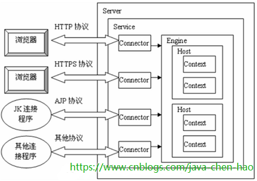
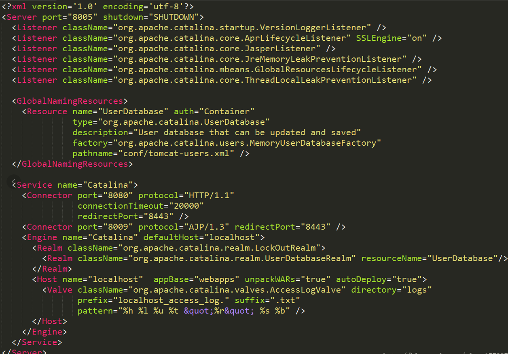
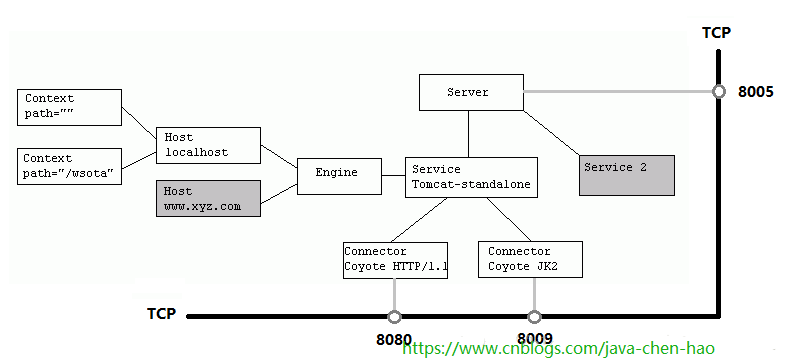
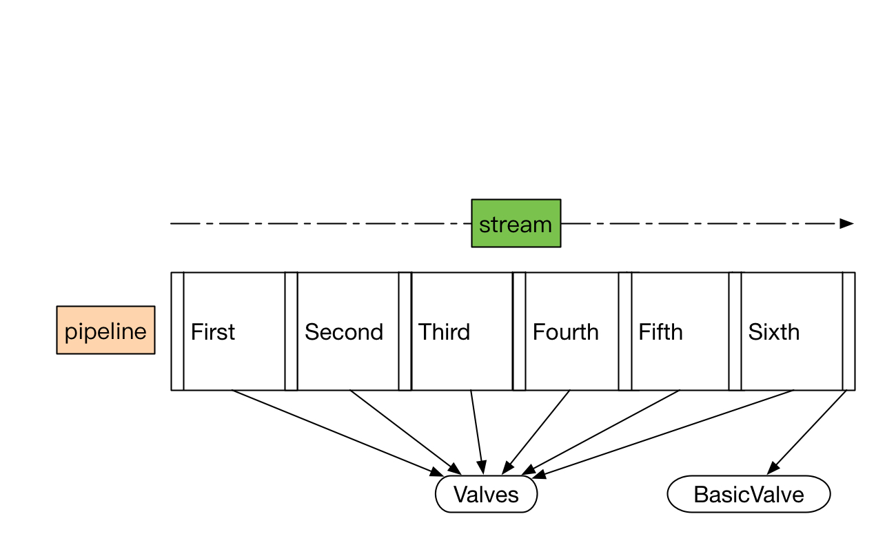
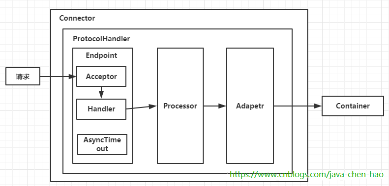
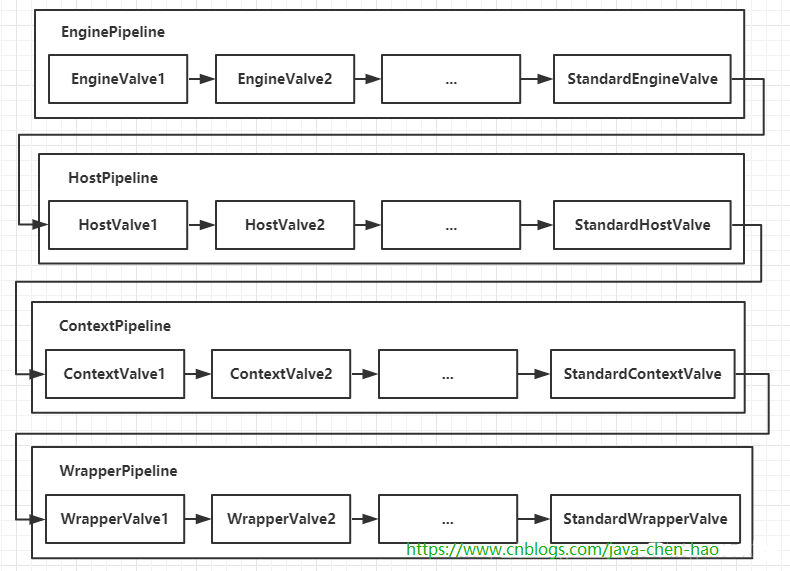

# tomcat整体组件与架构

## 前言

Tomcat的前身为Catalina，而Catalina又是一个轻量级的Servlet容器。在美国，catalina是一个很美的小岛。所以Tomcat作者的寓意可能是想把Tomcat设计成一个优雅美丽且轻量级的web服务器。Tomcat从4.x版本开始除了作为支持Servlet的容器外，额外加入了很多的功能，比如：jsp、el、naming等等，所以说Tomcat不仅仅是Catalina。

既然Tomcat首先是一个Servlet容器，我们应该更多的关心Servlet。

那么，什么是Servlet呢？

在互联网兴起之初，当时的Sun公司（后面被Oracle收购）已然看到了这次机遇，于是设计出了Applet来对Web应用的支持。不过事实却并不是预期那么得好，Sun悲催地发现Applet并没有给业界带来多大的影响。经过反思，Sun就想既然机遇出现了，市场前景也非常不错，总不能白白放弃了呀，怎么办呢？于是又投入精力去搞一套规范出来，这时Servlet诞生了！

**所谓Servlet，其实就是Sun为了让Java能实现动态可交互的网页，从而进入Web编程领域而制定的一套标准！**

一个Servlet主要做下面三件事情：

1. 创建并填充Request对象，包括：URI、参数、method、请求头信息、请求体信息等
2. 创建Response对象
3. 执行业务逻辑，将结果通过Response的输出流输出到客户端

Servlet没有main方法，所以，如果要执行，则需要在一个`容器`里面才能执行，这个容器就是为了支持Servlet的功能而存在，Tomcat其实就是一个Servlet容器的实现。

## 整体架构图


从上图我们看出，最核心的两个组件--连接器（Connector）和容器（Container）起到`心脏`的作用，他们至关重要！他们的作用如下：

> 1、Connector用于处理连接相关的事情，并提供Socket与Request和Response相关的转化;
> 2、Container用于封装和管理Servlet，以及具体处理Request请求；

一个Tomcat中只有一个Server，一个Server可以包含多个Service，一个Service只有一个Container，但是可以有多个Connectors，这是因为一个服务可以有多个连接，如同时提供Http和Https链接，也可以提供向相同协议不同端口的连接,示意图如下（Engine、Host、Context下边会说到）：



多个 Connector 和一个 Container 就形成了一个 Service，有了 Service 就可以对外提供服务了，但是 Service 还要一个生存的环境，必须要有人能够给她生命、掌握其生死大权，那就非 Server 莫属了！所以整个 Tomcat 的生命周期由 Server 控制。

 另外，上述的包含关系或者说是父子关系，都可以在tomcat的conf目录下的`server.xml`配置文件中看出



上边的配置文件，还可以通过下边的一张结构图更清楚的理解：



下面我们逐一来分析各个组件的功能：

1. `Server`表示服务器，提供了一种优雅的方式来启动和停止整个系统，不必单独启停连接器和容器

2. `Service`表示服务，`Server`可以运行多个服务。比如一个Tomcat里面可运行订单服务、支付服务、用户服务等等

3. 每个`Service`可包含`多个Connector`和`一个Container`。因为每个服务允许同时支持多种协议，但是每种协议最终执行的Servlet却是相同的

4. `Connector`表示连接器，比如一个服务可以同时支持AJP协议、Http协议和Https协议，每种协议可使用一种连接器来支持

5. ```
   Container
   ```

   表示容器，可以看做Servlet容器

   - `Engine` -- 引擎
   - `Host` -- 主机
   - `Context` -- 上下文
   - `Wrapper` -- 包装器

6. Service服务之下还有各种

   ```
   支撑组件
   ```

   ，下面简单罗列一下这些组件

   - `Manager` -- 管理器，用于管理会话Session
   - `Logger` -- 日志器，用于管理日志
   - `Loader` -- 加载器，和类加载有关，只会开放给Context所使用
   - `Pipeline` -- 管道组件，配合Valve实现过滤器功能
   - `Valve` -- 阀门组件，配合Pipeline实现过滤器功能
   - `Realm` -- 认证授权组件

除了连接器和容器，管道组件和阀门组件也很关键，我们通过一张图来看看这两个组件



## Connector和Container的微妙关系

由上述内容我们大致可以知道一个请求发送到Tomcat之后，首先经过Service然后会交给我们的Connector，Connector用于接收请求并将接收的请求封装为Request和Response来具体处理，Request和Response封装完之后再交由Container进行处理，Container处理完请求之后再返回给Connector，最后在由Connector通过Socket将处理的结果返回给客户端，这样整个请求的就处理完了！

Connector最底层使用的是Socket来进行连接的，Request和Response是按照HTTP协议来封装的，所以Connector同时需要实现TCP/IP协议和HTTP协议！

## Connector架构分析

Connector用于接受请求并将请求封装成Request和Response，然后交给Container进行处理，Container处理完之后在交给Connector返回给客户端。

因此，我们可以把Connector分为四个方面进行理解：

（1）Connector如何接受请求的？
（2）如何将请求封装成Request和Response的？
（3）封装完之后的Request和Response如何交给Container进行处理的？

首先看一下Connector的结构图，如下所示：



Connector就是使用ProtocolHandler来处理请求的，不同的ProtocolHandler代表不同的连接类型，比如：Http11Protocol使用的是普通Socket来连接的，Http11NioProtocol使用的是NioSocket来连接的。

其中ProtocolHandler由包含了三个部件：Endpoint、Processor、Adapter。

（1）Endpoint用来处理底层Socket的网络连接，Processor用于将Endpoint接收到的Socket封装成Request，Adapter用于将Request交给Container进行具体的处理。

（2）Endpoint由于是处理底层的Socket网络连接，因此Endpoint是用来实现TCP/IP协议的，而Processor用来实现HTTP协议的，Adapter将请求适配到Servlet容器进行具体的处理。

（3）Endpoint的抽象实现AbstractEndpoint里面定义的Acceptor和AsyncTimeout两个内部类和一个Handler接口。Acceptor用于监听请求，AsyncTimeout用于检查异步Request的超时，Handler用于处理接收到的Socket，在内部调用Processor进行处理。

## Container如何处理请求的

Container处理请求是使用Pipeline-Valve管道来处理的！（Valve是阀门之意）

Pipeline-Valve是责任链模式，责任链模式是指在一个请求处理的过程中有很多处理者依次对请求进行处理，每个处理者负责做自己相应的处理，处理完之后将处理后的请求返回，再让下一个处理着继续处理。

但是！Pipeline-Valve使用的责任链模式和普通的责任链模式有些不同！区别主要有以下两点：

（1）每个Pipeline都有特定的Valve，而且是在管道的最后一个执行，这个Valve叫做BaseValve，BaseValve是不可删除的；

（2）在上层容器的管道的BaseValve中会调用下层容器的管道。

我们知道Container包含四个子容器，而这四个子容器对应的BaseValve分别在：StandardEngineValve、StandardHostValve、StandardContextValve、StandardWrapperValve。

Pipeline的处理流程图如下：



（1）Connector在接收到请求后会首先调用最顶层容器的Pipeline来处理，这里的最顶层容器的Pipeline就是EnginePipeline（Engine的管道）；

（2）在Engine的管道中依次会执行EngineValve1、EngineValve2等等，最后会执行StandardEngineValve，在StandardEngineValve中会调用Host管道，然后再依次执行Host的HostValve1、HostValve2等，最后在执行StandardHostValve，然后再依次调用Context的管道和Wrapper的管道，最后执行到StandardWrapperValve。

（3）当执行到StandardWrapperValve的时候，会在StandardWrapperValve中创建FilterChain，并调用其doFilter方法来处理请求，这个FilterChain包含着我们配置的与请求相匹配的Filter和Servlet，其doFilter方法会依次调用所有的Filter的doFilter方法和Servlet的service方法，这样请求就得到了处理！

（4）当所有的Pipeline-Valve都执行完之后，并且处理完了具体的请求，这个时候就可以将返回的结果交给Connector了，Connector在通过Socket的方式将结果返回给客户端。

## 总结

好了，我们已经从整体上看到了Tomcat的结构，但是对于每个组件我们并没有详细分析。后续章节我们会从几个方面来学习Tomcat：

1. 逐一分析各个组件
2. 通过断点的方式来跟踪Tomcat代码中的一次完整请求

