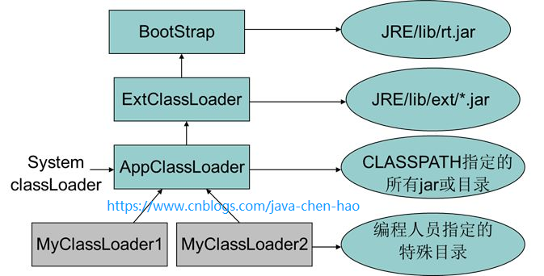
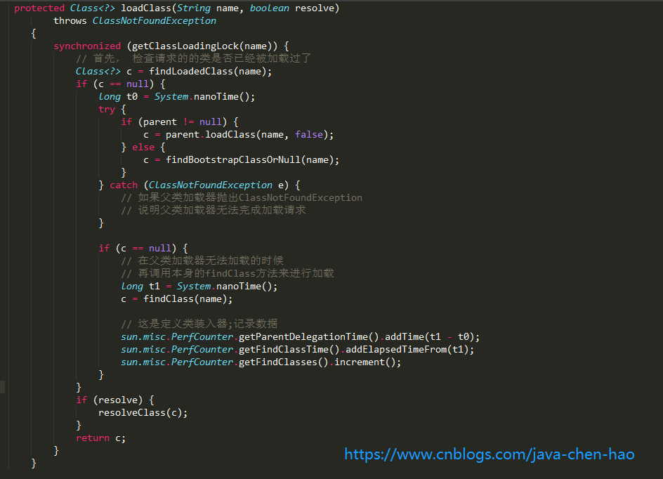

## tomcat类加载器

## 什么是类加载机制？

> Java虚拟机把描述类的数据从Class文件加载进内存，并对数据进行校验，转换解析和初始化，最终形成可以被虚拟机直接使用的Java类型，这就是虚拟机的类加载机制。

> 虚拟机设计团队把类加载阶段中的“通过一个类的全限定名来获取描述此类的二进制字节流”这个动作放到Java虚拟机外部去实现，以便让应用程序自己决定如何去获取所需要的类。实现这动作的代码模块成为“类加载器”。


### 类与类加载器的关系

> 类加载器虽然只用于实现类的加载动作，但它在Java程序中起到的作用却远远不限于类加载阶段。对于任意一个类，都需要由**加载他的类加载器和这个类本身一同确立其在Java虚拟机中的唯一性**，每一个类加载器，都拥有一个独立的类命名空间。这句话可以表达的更通俗一些：比较两个类是否“相等”，`只有在这两个类是由同一个类加载器加载的前提下才有意义`，否则，即使这两个类来自同一个Class文件，被同一个虚拟机加载，只要加载他们的类加载器不同，那这个两个类就必定不相等。

## 什么是双亲委任模型？

1. 从Java虚拟机的角度来说，只存在两种不同类加载器：一种是**启动类加载器(Bootstrap ClassLoader)**，这个类加载器使用C++语言实现（只限HotSpot），是虚拟机自身的一部分；另一种就是所有其他的类加载器，这些类加载器都由Java语言实现，独立于虚拟机外部，并且全都继承自抽象类`java.lang.ClassLoader`.
2. 从Java开发人员的角度来看，类加载还可以划分的更细致一些，绝大部分Java程序员都会使用以下3种系统提供的类加载器：
   - 启动类加载器（Bootstrap ClassLoader）：这个类加载器复杂将存放在 JAVA_HOME/lib 目录中的，或者被-Xbootclasspath 参数所指定的路径种的，并且是虚拟机识别的（仅按照文件名识别，如rt.jar，名字不符合的类库即使放在lib目录下也不会重载）。
   - 扩展类加载器（Extension ClassLoader）：这个类加载器由sun.misc.Launcher$ExtClassLoader实现，它负责夹杂JAVA_HOME/lib/ext 目录下的，或者被java.ext.dirs 系统变量所指定的路径种的所有类库。开发者可以直接使用扩展类加载器。
   - 应用程序类加载器（Application ClassLoader）：这个类加载器由sun.misc.Launcher$AppClassLoader 实现。由于这个类加载器是ClassLoader 种的getSystemClassLoader方法的返回值，所以也成为系统类加载器。它负责加载用户类路径（ClassPath）上所指定的类库。开发者可以直接使用这个类加载器，如果应用中没有定义过自己的类加载器，一般情况下这个就是程序中默认的类加载器。

这些类加载器之间的关系一般如下图所示：



图中各个类加载器之间的关系成为 **类加载器的双亲委派模型（Parents Dlegation Mode）**。双亲委派模型要求除了顶层的启动类加载器之外，**其余的类加载器都应当由自己的父类加载器加载**，这里类加载器之间的父子关系一般不会以继承的关系来实现，而是都使用组合关系来复用父加载器的代码。

类加载器的双亲委派模型在JDK1.2 期间被引入并被广泛应用于之后的所有Java程序中，但他并不是个强制性的约束模型，而是Java设计者推荐给开发者的一种类加载器实现方式。

双亲委派模型的工作过程是：如果一个类加载器收到了类加载的请求，他首先不会自己去尝试加载这个类，而是把这个请求委派父类加载器去完成。每一个层次的类加载器都是如此，因此所有的加载请求最终都应该传送到顶层的启动类加载器中，只有当父加载器反馈自己无法完成这个请求（他的搜索范围中没有找到所需的类）时，子加载器才会尝试自己去加载。

### 为什么要这么做呢？

 如果没有使用双亲委派模型，由各个类加载器自行加载的话，如果用户自己编写了一个称为java.lang.Object的类，并放在程序的ClassPath中，那系统将会出现多个不同的Object类， Java类型体系中最基础的行为就无法保证。应用程序也将会变得一片混乱。

### 双亲委任模型时如何实现的？

非常简单：所有的代码都在java.lang.ClassLoader中的loadClass方法之中，代码如下：



先检查是否已经被加载过，若没有加载则调用父加载器的loadClass方法， 如父加载器为空则默认使用启动类加载器作为父加载器。如果父类加载失败，抛出ClassNotFoundException 异常后，再调用自己的findClass方法进行加载。

## 如何破坏双亲委任模型？

双亲委任模型不是一个强制性的约束模型，而是一个建议型的类加载器实现方式。在Java的世界中大部分的类加载器都遵循者模型，但也有例外，到目前为止，双亲委派模型有过3次大规模的“被破坏”的情况。
**第一次**：在双亲委派模型出现之前-----即JDK1.2发布之前。
**第二次**：是这个模型自身的缺陷导致的。我们说，双亲委派模型很好的解决了各个类加载器的基础类的统一问题（越基础的类由越上层的加载器进行加载），基础类之所以称为“基础”，是因为它们总是作为被用户代码调用的API， 但没有绝对，**如果基础类调用会用户的代码**怎么办呢？

这不是没有可能的。一个典型的例子就是JNDI服务，JNDI现在已经是Java的标准服务，它的代码由启动类加载器去加载（在JDK1.3时就放进去的rt.jar）,但它需要调用由独立厂商实现并部署在应用程序的ClassPath下的JNDI接口提供者（SPI， Service Provider Interface）的代码，但启动类加载器不可能“认识“这些代码啊。因为这些类不在rt.jar中，但是启动类加载器又需要加载。怎么办呢？

为了解决这个问题，Java设计团队只好引入了一个不太优雅的设计：**线程上下文类加载器（Thread Context ClassLoader）**。这个类加载器可以通过java.lang.Thread类的setContextClassLoader方法进行设置。如果创建线程时还未设置，它将会从父线程中继承一个，如果在应用程序的全局范围内都没有设置过多的话，那这个类加载器默认即使应用程序类加载器。

嘿嘿，有了线程上下文加载器，JNDI服务使用这个线程上下文加载器去加载所需要的SPI代码，也就是父类加载器请求子类加载器去完成类加载的动作，这种行为实际上就是打通了双亲委派模型的层次结构来逆向使用类加载器，实际上已经违背了双亲委派模型的一般性原则。但这无可奈何，Java中所有涉及SPI的加载动作基本胜都采用这种方式。例如JNDI，**JDBC**，JCE，JAXB，JBI等。

**第三次**：为了实现热插拔，热部署，模块化，意思是添加一个功能或减去一个功能不用重启，只需要把这模块连同类加载器一起换掉就实现了代码的热替换。

## Tomcat 的类加载器是怎么设计的？

### Tomcat 如果使用默认的类加载机制行不行？

我们思考一下：Tomcat是个web容器， 那么它要解决什么问题：

1. 一个web容器可能需要部署两个应用程序，不同的应用程序可能会依赖**同一个第三方类库的不同版本**，不能要求同一个类库在同一个服务器只有一份，因此要保证每个应用程序的类库都是独立的，保证相互隔离。
2. 部署在同一个web容器中相同的类库**相同的版本可以共享**。否则，如果服务器有10个应用程序，那么要有10份相同的类库加载进虚拟机，这是扯淡的。
3. **web容器也有自己依赖的类库**，不能于应用程序的类库混淆。基于安全考虑，应该让容器的类库和程序的类库隔离开来。
4. web容器要支持jsp的修改，我们知道，jsp 文件最终也是要编译成class文件才能在虚拟机中运行，但程序运行后修改jsp已经是司空见惯的事情，否则要你何用？ 所以，web容器需要支持 jsp 修改后不用重启。

 

再看看我们的问题：Tomcat 如果使用默认的类加载机制行不行？
答案是不行的。为什么？我们看，第一个问题，如果使用默认的类加载器机制，那么是无法加载两个相同类库的不同版本的，默认的类加器是不管你是什么版本的，只在乎你的全限定类名，并且只有一份。第二个问题，默认的类加载器是能够实现的，因为他的职责就是保证唯一性。第三个问题和第一个问题一样。我们再看第四个问题，我们想我们要怎么实现jsp文件的热修改（楼主起的名字），jsp 文件其实也就是class文件，那么如果修改了，但类名还是一样，类加载器会直接取方法区中已经存在的，修改后的jsp是不会重新加载的。那么怎么办呢？我们可以直接卸载掉这jsp文件的类加载器，所以你应该想到了，每个jsp文件对应一个唯一的类加载器，当一个jsp文件修改了，就直接卸载这个jsp类加载器。重新创建类加载器，重新加载jsp文件。

### Tomcat 如何实现自己独特的类加载机制？

我们看看他们的设计图：


我们在这张图中看到很多类加载器，除了Jdk自带的类加载器，我们尤其关心Tomcat自身持有的类加载器。仔细一点我们很容易发现：Catalina类加载器和Shared类加载器，他们并不是父子关系，而是兄弟关系。为啥这样设计，我们得分析一下每个类加载器的用途，才能知晓。

1. Common类加载器，负责加载Tomcat和Web应用都复用的类
2. Catalina类加载器，负责加载Tomcat专用的类，而这些被加载的类在Web应用中将不可见
3. Shared类加载器，负责加载Tomcat下所有的Web应用程序都复用的类，而这些被加载的类在Tomcat中将不可见
4. WebApp类加载器，负责加载具体的某个Web应用程序所使用到的类，而这些被加载的类在Tomcat和其他的Web应用程序都将不可见
5. Jsp类加载器，每个jsp页面一个类加载器，不同的jsp页面有不同的类加载器，方便实现jsp页面的热插拔

## 源码阅读

Tomcat启动的入口在`Bootstrap的main()方法`。`main()`方法执行前，必然先执行其`static{}`块。所以我们首先分析`static{}`块，然后分析`main()`方法

### Bootstrap.static{}

```
static {
    // 获取用户目录
    // Will always be non-null
    String userDir = System.getProperty("user.dir");

    // 第一步，从环境变量中获取catalina.home，在没有获取到的时候将执行后面的获取操作
    // Home first
    String home = System.getProperty(Globals.CATALINA_HOME_PROP);
    File homeFile = null;

    if (home != null) {
        File f = new File(home);
        try {
            homeFile = f.getCanonicalFile();
        } catch (IOException ioe) {
            homeFile = f.getAbsoluteFile();
        }
    }

    // 第二步，在第一步没获取的时候，从bootstrap.jar所在目录的上一级目录获取
    if (homeFile == null) {
        // First fall-back. See if current directory is a bin directory
        // in a normal Tomcat install
        File bootstrapJar = new File(userDir, "bootstrap.jar");

        if (bootstrapJar.exists()) {
            File f = new File(userDir, "..");
            try {
                homeFile = f.getCanonicalFile();
            } catch (IOException ioe) {
                homeFile = f.getAbsoluteFile();
            }
        }
    }

    // 第三步，第二步中的bootstrap.jar可能不存在，这时我们直接把user.dir作为我们的home目录
    if (homeFile == null) {
        // Second fall-back. Use current directory
        File f = new File(userDir);
        try {
            homeFile = f.getCanonicalFile();
        } catch (IOException ioe) {
            homeFile = f.getAbsoluteFile();
        }
    }

    // 重新设置catalinaHome属性
    catalinaHomeFile = homeFile;
    System.setProperty(
            Globals.CATALINA_HOME_PROP, catalinaHomeFile.getPath());

    // 接下来获取CATALINA_BASE（从系统变量中获取），若不存在，则将CATALINA_BASE保持和CATALINA_HOME相同
    // Then base
    String base = System.getProperty(Globals.CATALINA_BASE_PROP);
    if (base == null) {
        catalinaBaseFile = catalinaHomeFile;
    } else {
        File baseFile = new File(base);
        try {
            baseFile = baseFile.getCanonicalFile();
        } catch (IOException ioe) {
            baseFile = baseFile.getAbsoluteFile();
        }
        catalinaBaseFile = baseFile;
    }
   // 重新设置catalinaBase属性
    System.setProperty(
            Globals.CATALINA_BASE_PROP, catalinaBaseFile.getPath());
}
```

我们把代码中的注释搬下来总结一下：

1. 获取用户目录
2. 第一步，从环境变量中获取catalina.home，在没有获取到的时候将执行后面的获取操作
3. 第二步，在第一步没获取的时候，从bootstrap.jar所在目录的上一级目录获取
4. 第三步，第二步中的bootstrap.jar可能不存在，这时我们直接把user.dir作为我们的home目录
5. 重新设置catalinaHome属性
6. 接下来获取CATALINA_BASE（从系统变量中获取），若不存在，则将CATALINA_BASE保持和CATALINA_HOME相同
7. 重新设置catalinaBase属性

简单总结一下，就是加载并设置catalinaHome和catalinaBase相关的信息，以备后续使用。

### main()

main方法大体分成两块，一块为**init**，另一块为**load+start**。

```
public static void main(String args[]) {
    // 第一块，main方法第一次执行的时候，daemon肯定为null，所以直接new了一个Bootstrap对象，然后执行其init()方法
    if (daemon == null) {
        // Don't set daemon until init() has completed
        Bootstrap bootstrap = new Bootstrap();
        try {
            bootstrap.init();
        } catch (Throwable t) {
            handleThrowable(t);
            t.printStackTrace();
            return;
        }
        // daemon守护对象设置为bootstrap
        daemon = bootstrap;
    } else {
        // When running as a service the call to stop will be on a new
        // thread so make sure the correct class loader is used to prevent
        // a range of class not found exceptions.
        Thread.currentThread().setContextClassLoader(daemon.catalinaLoader);
    }

    // 第二块，执行守护对象的load方法和start方法
    try {
        String command = "start";
        if (args.length > 0) {
            command = args[args.length - 1];
        }

        if (command.equals("startd")) {
            args[args.length - 1] = "start";
            daemon.load(args);
            daemon.start();
        } else if (command.equals("stopd")) {
            args[args.length - 1] = "stop";
            daemon.stop();
        } else if (command.equals("start")) {
            daemon.setAwait(true);
            daemon.load(args);
            daemon.start();
            if (null == daemon.getServer()) {
                System.exit(1);
            }
        } else if (command.equals("stop")) {
            daemon.stopServer(args);
        } else if (command.equals("configtest")) {
            daemon.load(args);
            if (null == daemon.getServer()) {
                System.exit(1);
            }
            System.exit(0);
        } else {
            log.warn("Bootstrap: command \"" + command + "\" does not exist.");
        }
    } catch (Throwable t) {
        // Unwrap the Exception for clearer error reporting
        if (t instanceof InvocationTargetException &&
                t.getCause() != null) {
            t = t.getCause();
        }
        handleThrowable(t);
        t.printStackTrace();
        System.exit(1);
    }
}
```

```
public void init() throws Exception {
    // 非常关键的地方，初始化类加载器s，后面我们会详细具体地分析这个方法
    initClassLoaders();

    // 设置上下文类加载器为catalinaLoader，这个类加载器负责加载Tomcat专用的类
    Thread.currentThread().setContextClassLoader(catalinaLoader);
    // 暂时略过，后面会讲
    SecurityClassLoad.securityClassLoad(catalinaLoader);

    // 使用catalinaLoader加载我们的Catalina类
    // Load our startup class and call its process() method
    if (log.isDebugEnabled())
        log.debug("Loading startup class");
    Class<?> startupClass = catalinaLoader.loadClass("org.apache.catalina.startup.Catalina");
    Object startupInstance = startupClass.getConstructor().newInstance();

    // 设置Catalina类的parentClassLoader属性为sharedLoader
    // Set the shared extensions class loader
    if (log.isDebugEnabled())
        log.debug("Setting startup class properties");
    String methodName = "setParentClassLoader";
    Class<?> paramTypes[] = new Class[1];
    paramTypes[0] = Class.forName("java.lang.ClassLoader");
    Object paramValues[] = new Object[1];
    paramValues[0] = sharedLoader;
    Method method =
        startupInstance.getClass().getMethod(methodName, paramTypes);
    method.invoke(startupInstance, paramValues);

    // catalina守护对象为刚才使用catalinaLoader加载类、并初始化出来的Catalina对象
    catalinaDaemon = startupInstance;
}
```

```
private void initClassLoaders() {
    try {
        // 创建commonLoader，如果未创建成果的话，则使用应用程序类加载器作为commonLoader
        commonLoader = createClassLoader("common", null);
        if( commonLoader == null ) {
            // no config file, default to this loader - we might be in a 'single' env.
            commonLoader=this.getClass().getClassLoader();
        }
        // 创建catalinaLoader，父类加载器为commonLoader
        catalinaLoader = createClassLoader("server", commonLoader);
        // 创建sharedLoader，父类加载器为commonLoader
        sharedLoader = createClassLoader("shared", commonLoader);
    } catch (Throwable t) {
        // 如果创建的过程中出现异常了，日志记录完成之后直接系统退出
        handleThrowable(t);
        log.error("Class loader creation threw exception", t);
        System.exit(1);
    }
}
```

所有的类加载器的创建都使用到了方法`createClassLoader`，所以，我们进一步分析一下这个方法。`createClassLoader`用到了CatalinaProperties.getProperty("xxx")方法，这个方法用于从`conf/catalina.properties`文件获取属性值。

```
private ClassLoader createClassLoader(String name, ClassLoader parent)
    throws Exception {
    // 获取类加载器待加载的位置，如果为空，则不需要加载特定的位置，使用父类加载返回回去。
    String value = CatalinaProperties.getProperty(name + ".loader");
    if ((value == null) || (value.equals("")))
        return parent;
    // 替换属性变量，比如：${catalina.base}、${catalina.home}
    value = replace(value);

    List<Repository> repositories = new ArrayList<>();

   // 解析属性路径变量为仓库路径数组
    String[] repositoryPaths = getPaths(value);

    // 对每个仓库路径进行repositories设置。我们可以把repositories看成一个个待加载的位置对象，可以是一个classes目录，一个jar文件目录等等
    for (String repository : repositoryPaths) {
        // Check for a JAR URL repository
        try {
            @SuppressWarnings("unused")
            URL url = new URL(repository);
            repositories.add(
                    new Repository(repository, RepositoryType.URL));
            continue;
        } catch (MalformedURLException e) {
            // Ignore
        }

        // Local repository
        if (repository.endsWith("*.jar")) {
            repository = repository.substring
                (0, repository.length() - "*.jar".length());
            repositories.add(
                    new Repository(repository, RepositoryType.GLOB));
        } else if (repository.endsWith(".jar")) {
            repositories.add(
                    new Repository(repository, RepositoryType.JAR));
        } else {
            repositories.add(
                    new Repository(repository, RepositoryType.DIR));
        }
    }
    // 使用类加载器工厂创建一个类加载器
    return ClassLoaderFactory.createClassLoader(repositories, parent);
}
```

```
public static ClassLoader createClassLoader(List<Repository> repositories,
                                            final ClassLoader parent)
    throws Exception {

    if (log.isDebugEnabled())
        log.debug("Creating new class loader");

    // Construct the "class path" for this class loader
    Set<URL> set = new LinkedHashSet<>();
    // 遍历repositories，对每个repository进行类型判断，并生成URL，每个URL我们都要校验其有效性，有效的URL我们会放到URL集合中
    if (repositories != null) {
        for (Repository repository : repositories)  {
            if (repository.getType() == RepositoryType.URL) {
                URL url = buildClassLoaderUrl(repository.getLocation());
                if (log.isDebugEnabled())
                    log.debug("  Including URL " + url);
                set.add(url);
            } else if (repository.getType() == RepositoryType.DIR) {
                File directory = new File(repository.getLocation());
                directory = directory.getCanonicalFile();
                if (!validateFile(directory, RepositoryType.DIR)) {
                    continue;
                }
                URL url = buildClassLoaderUrl(directory);
                if (log.isDebugEnabled())
                    log.debug("  Including directory " + url);
                set.add(url);
            } else if (repository.getType() == RepositoryType.JAR) {
                File file=new File(repository.getLocation());
                file = file.getCanonicalFile();
                if (!validateFile(file, RepositoryType.JAR)) {
                    continue;
                }
                URL url = buildClassLoaderUrl(file);
                if (log.isDebugEnabled())
                    log.debug("  Including jar file " + url);
                set.add(url);
            } else if (repository.getType() == RepositoryType.GLOB) {
                File directory=new File(repository.getLocation());
                directory = directory.getCanonicalFile();
                if (!validateFile(directory, RepositoryType.GLOB)) {
                    continue;
                }
                if (log.isDebugEnabled())
                    log.debug("  Including directory glob "
                        + directory.getAbsolutePath());
                String filenames[] = directory.list();
                if (filenames == null) {
                    continue;
                }
                for (int j = 0; j < filenames.length; j++) {
                    String filename = filenames[j].toLowerCase(Locale.ENGLISH);
                    if (!filename.endsWith(".jar"))
                        continue;
                    File file = new File(directory, filenames[j]);
                    file = file.getCanonicalFile();
                    if (!validateFile(file, RepositoryType.JAR)) {
                        continue;
                    }
                    if (log.isDebugEnabled())
                        log.debug("    Including glob jar file "
                            + file.getAbsolutePath());
                    URL url = buildClassLoaderUrl(file);
                    set.add(url);
                }
            }
        }
    }

    // Construct the class loader itself
    final URL[] array = set.toArray(new URL[set.size()]);
    if (log.isDebugEnabled())
        for (int i = 0; i < array.length; i++) {
            log.debug("  location " + i + " is " + array[i]);
        }

    // 从这儿看，最终所有的类加载器都是URLClassLoader的对象~~
    return AccessController.doPrivileged(
            new PrivilegedAction<URLClassLoader>() {
                @Override
                public URLClassLoader run() {
                    if (parent == null)
                        return new URLClassLoader(array);
                    else
                        return new URLClassLoader(array, parent);
                }
            });
}
```

```
public static void securityClassLoad(ClassLoader loader) throws Exception {
    securityClassLoad(loader, true);
}

static void securityClassLoad(ClassLoader loader, boolean requireSecurityManager) throws Exception {

    if (requireSecurityManager && System.getSecurityManager() == null) {
        return;
    }

    loadCorePackage(loader);
    loadCoyotePackage(loader);
    loadLoaderPackage(loader);
    loadRealmPackage(loader);
    loadServletsPackage(loader);
    loadSessionPackage(loader);
    loadUtilPackage(loader);
    loadValvesPackage(loader);
    loadJavaxPackage(loader);
    loadConnectorPackage(loader);
    loadTomcatPackage(loader);
}

 private static final void loadCorePackage(ClassLoader loader) throws Exception {
    final String basePackage = "org.apache.catalina.core.";
    loader.loadClass(basePackage + "AccessLogAdapter");
    loader.loadClass(basePackage + "ApplicationContextFacade$PrivilegedExecuteMethod");
    loader.loadClass(basePackage + "ApplicationDispatcher$PrivilegedForward");
    loader.loadClass(basePackage + "ApplicationDispatcher$PrivilegedInclude");
    loader.loadClass(basePackage + "ApplicationPushBuilder");
    loader.loadClass(basePackage + "AsyncContextImpl");
    loader.loadClass(basePackage + "AsyncContextImpl$AsyncRunnable");
    loader.loadClass(basePackage + "AsyncContextImpl$DebugException");
    loader.loadClass(basePackage + "AsyncListenerWrapper");
    loader.loadClass(basePackage + "ContainerBase$PrivilegedAddChild");
    loadAnonymousInnerClasses(loader, basePackage + "DefaultInstanceManager");
    loader.loadClass(basePackage + "DefaultInstanceManager$AnnotationCacheEntry");
    loader.loadClass(basePackage + "DefaultInstanceManager$AnnotationCacheEntryType");
    loader.loadClass(basePackage + "ApplicationHttpRequest$AttributeNamesEnumerator");
}
```

这儿其实就是使用catalinaLoader加载tomcat源代码里面的各个专用类。我们大致罗列一下待加载的类所在的package：

1. org.apache.catalina.core.*
2. org.apache.coyote.*
3. org.apache.catalina.loader.*
4. org.apache.catalina.realm.*
5. org.apache.catalina.servlets.*
6. org.apache.catalina.session.*
7. org.apache.catalina.util.*
8. org.apache.catalina.valves.*
9. javax.servlet.http.Cookie
10. org.apache.catalina.connector.*
11. org.apache.tomcat.*

好了，至此我们已经分析完了init里面涉及到的几个关键方法

### WebApp类加载器

到这儿，我们隐隐感觉到少分析了点什么！没错，就是WebApp类加载器。整个启动过程分析下来，我们仍然没有看到这个类加载器。它又是在哪儿出现的呢？

我们知道WebApp类加载器是Web应用私有的，而每个Web应用其实算是一个Context，那么我们通过Context的实现类应该可以发现。在Tomcat中，Context的默认实现为`StandardContext`，我们看看这个类的`startInternal()方法`，在这儿我们发现了我们感兴趣的WebApp类加载器。

```
protected synchronized void startInternal() throws LifecycleException {
    if (getLoader() == null) {
        WebappLoader webappLoader = new WebappLoader(getParentClassLoader());
        webappLoader.setDelegate(getDelegate());
        setLoader(webappLoader);
    }
}
```

入口代码非常简单，就是webappLoader不存在的时候创建一个，并调用`setLoader`方法。

## 总结

我们终于完整地分析完了Tomcat的整个启动过程+类加载过程。也了解并学习了Tomcat不同的类加载机制是为什么要这样设计，带来的附加作用又是怎样的。