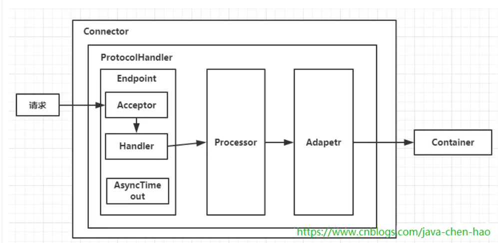
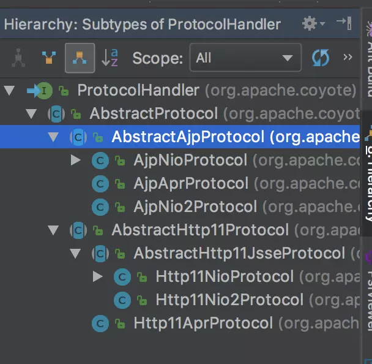

## HTTP请求处理过程

**正文**

终于进行到`Connector`的分析阶段了，这也是Tomcat里面最复杂的一块功能了。`Connector`中文名为`连接器`，既然是连接器，它肯定会连接某些东西，连接些什么呢？

> `Connector`用于接受请求并将请求封装成Request和Response，然后交给`Container`进行处理，`Container`处理完之后再交给`Connector`返回给客户端。

要理解`Connector`，我们需要问自己4个问题。

- （1）`Connector`如何接受请求的？
- （2）如何将请求封装成Request和Response的？
- （3）封装完之后的Request和Response如何交给`Container`进行处理的？
- （4）`Container`处理完之后如何交给`Connector`并返回给客户端的？

先来一张`Connector`的整体结构图



【注意】：不同的协议、不同的通信方式，`ProtocolHandler`会有不同的实现。在Tomcat8.5中，`ProtocolHandler`的类继承层级如下图所示。



针对上述的类继承层级图，我们做如下说明：

1. ajp和http11是两种不同的协议
2. nio、nio2和apr是不同的通信方式
3. 协议和通信方式可以相互组合。

`ProtocolHandler`包含三个部件：`Endpoint`、`Processor`、`Adapter`。

1. `Endpoint`用来处理底层Socket的网络连接，`Processor`用于将`Endpoint`接收到的Socket封装成Request，`Adapter`用于将Request交给Container进行具体的处理。
2. `Endpoint`由于是处理底层的Socket网络连接，因此`Endpoint`是用来实现`TCP/IP协议`的，而`Processor`用来实现`HTTP协议`的，`Adapter`将请求适配到Servlet容器进行具体的处理。
3. `Endpoint`的抽象实现类AbstractEndpoint里面定义了`Acceptor`和`AsyncTimeout`两个内部类和一个`Handler接口`。`Acceptor`用于监听请求，`AsyncTimeout`用于检查异步Request的超时，`Handler`用于处理接收到的Socket，在内部调用`Processor`进行处理。

至此，我们已经明白了问题（1）、（2）和（3）。至于（4），当我们了解了Container自然就明白了，前面章节内容已经详细分析过了。

## Connector源码分析入口

我们在`Service`标准实现`StandardService`的源码中发现，其`init()`、`start()`、`stop()`和`destroy()`方法分别会对Connectors的同名方法进行调用。而一个`Service`对应着多个`Connector`。

### Service.init()

```java
@Override
protected void initInternal() throws LifecycleException {
    super.initInternal();

    if (engine != null) {
        engine.init();
    }

    // Initialize any Executors
    for (Executor executor : findExecutors()) {
        if (executor instanceof JmxEnabled) {
            ((JmxEnabled) executor).setDomain(getDomain());
        }
        executor.init();
    }

    // Initialize mapper listener
    mapperListener.init();

    // Initialize our defined Connectors
    synchronized (connectorsLock) {
        for (Connector connector : connectors) {
            try {
                connector.init();
            } catch (Exception e) {
                String message = sm.getString(
                        "standardService.connector.initFailed", connector);
                log.error(message, e);

                if (Boolean.getBoolean("org.apache.catalina.startup.EXIT_ON_INIT_FAILURE"))
                    throw new LifecycleException(message);
            }
        }
    }
}
```

### Service.start()

```java
@Override
protected void startInternal() throws LifecycleException {
    if(log.isInfoEnabled())
        log.info(sm.getString("standardService.start.name", this.name));
    setState(LifecycleState.STARTING);

    // Start our defined Container first
    if (engine != null) {
        synchronized (engine) {
            engine.start();
        }
    }

    synchronized (executors) {
        for (Executor executor: executors) {
            executor.start();
        }
    }

    mapperListener.start();

    // Start our defined Connectors second
    synchronized (connectorsLock) {
        for (Connector connector: connectors) {
            try {
                // If it has already failed, don't try and start it
                if (connector.getState() != LifecycleState.FAILED) {
                    connector.start();
                }
            } catch (Exception e) {
                log.error(sm.getString(
                        "standardService.connector.startFailed",
                        connector), e);
            }
        }
    }
}
```

我们知道`Connector`实现了`Lifecycle`接口，所以它是一个`生命周期组件`。所以`Connector`的启动逻辑入口在于`init()`和`start()`

### Connector构造方法

在分析之前，我们看看`server.xml`，该文件已经体现出了tomcat中各个组件的大体结构。

```xml
<?xml version='1.0' encoding='utf-8'?>
<Server port="8005" shutdown="SHUTDOWN">
  <Listener className="org.apache.catalina.startup.VersionLoggerListener" />
  <Listener className="org.apache.catalina.core.AprLifecycleListener" SSLEngine="on" />
  <Listener className="org.apache.catalina.core.JreMemoryLeakPreventionListener" />
  <Listener className="org.apache.catalina.mbeans.GlobalResourcesLifecycleListener" />
  <Listener className="org.apache.catalina.core.ThreadLocalLeakPreventionListener" />

  <GlobalNamingResources>
    <Resource name="UserDatabase" auth="Container"
              type="org.apache.catalina.UserDatabase"
              description="User database that can be updated and saved"
              factory="org.apache.catalina.users.MemoryUserDatabaseFactory"
              pathname="conf/tomcat-users.xml" />
  </GlobalNamingResources>

  <Service name="Catalina">
    <Connector port="8080" protocol="HTTP/1.1" connectionTimeout="20000" redirectPort="8443" />
    <Connector port="8009" protocol="AJP/1.3" redirectPort="8443" />

    <Engine name="Catalina" defaultHost="localhost">
      <Realm className="org.apache.catalina.realm.LockOutRealm">
        <Realm className="org.apache.catalina.realm.UserDatabaseRealm"
               resourceName="UserDatabase"/>
      </Realm>

      <Host name="localhost"  appBase="webapps"
            unpackWARs="true" autoDeploy="true">
        <Valve className="org.apache.catalina.valves.AccessLogValve" directory="logs"
               prefix="localhost_access_log" suffix=".txt"
               pattern="%h %l %u %t "%r" %s %b" />
      </Host>
    </Engine>
  </Service>
</Server>
```

在这个文件中，我们看到一个`Connector`有几个关键属性，`port`和`protocol`是其中的两个。`server.xml`默认支持两种协议：`HTTP/1.1`和`AJP/1.3`。其中`HTTP/1.1`用于支持http1.1协议，而`AJP/1.3`用于支持对apache服务器的通信。

接下来我们看看构造方法。

```java
public Connector() {
    this(null); // 1. 无参构造方法，传入参数为空协议，会默认使用`HTTP/1.1`
}

public Connector(String protocol) {
    setProtocol(protocol);
    // Instantiate protocol handler
    // 5. 使用protocolHandler的类名构造ProtocolHandler的实例
    ProtocolHandler p = null;
    try {
        Class<?> clazz = Class.forName(protocolHandlerClassName);
        p = (ProtocolHandler) clazz.getConstructor().newInstance();
    } catch (Exception e) {
        log.error(sm.getString(
                "coyoteConnector.protocolHandlerInstantiationFailed"), e);
    } finally {
        this.protocolHandler = p;
    }

    if (Globals.STRICT_SERVLET_COMPLIANCE) {
        uriCharset = StandardCharsets.ISO_8859_1;
    } else {
        uriCharset = StandardCharsets.UTF_8;
    }
}

@Deprecated
public void setProtocol(String protocol) {
    boolean aprConnector = AprLifecycleListener.isAprAvailable() &&
            AprLifecycleListener.getUseAprConnector();

    // 2. `HTTP/1.1`或`null`，protocolHandler使用`org.apache.coyote.http11.Http11NioProtocol`，不考虑apr
    if ("HTTP/1.1".equals(protocol) || protocol == null) {
        if (aprConnector) {
            setProtocolHandlerClassName("org.apache.coyote.http11.Http11AprProtocol");
        } else {
            setProtocolHandlerClassName("org.apache.coyote.http11.Http11NioProtocol");
        }
    }
    // 3. `AJP/1.3`，protocolHandler使用`org.apache.coyote.ajp.AjpNioProtocol`，不考虑apr
    else if ("AJP/1.3".equals(protocol)) {
        if (aprConnector) {
            setProtocolHandlerClassName("org.apache.coyote.ajp.AjpAprProtocol");
        } else {
            setProtocolHandlerClassName("org.apache.coyote.ajp.AjpNioProtocol");
        }
    }
    // 4. 其他情况，使用传入的protocol作为protocolHandler的类名
    else {
        setProtocolHandlerClassName(protocol);
    }
}
```

从上面的代码我们看到构造方法主要做了下面几件事情：

1. 无参构造方法，传入参数为空协议，会默认使用`HTTP/1.1`
2. `HTTP/1.1`或`null`，protocolHandler使用`org.apache.coyote.http11.Http11NioProtocol`，不考虑apr
3. `AJP/1.3`，protocolHandler使用`org.apache.coyote.ajp.AjpNioProtocol`，不考虑apr
4. 其他情况，使用传入的protocol作为protocolHandler的类名
5. 使用protocolHandler的类名构造ProtocolHandler的实例

### Connector.init()

```java
@Override
protected void initInternal() throws LifecycleException {
    super.initInternal();

    // Initialize adapter
    // 1. 初始化adapter
    adapter = new CoyoteAdapter(this);
    protocolHandler.setAdapter(adapter);

    // Make sure parseBodyMethodsSet has a default
    // 2. 设置接受body的method列表，默认为POST
    if (null == parseBodyMethodsSet) {
        setParseBodyMethods(getParseBodyMethods());
    }

    if (protocolHandler.isAprRequired() && !AprLifecycleListener.isAprAvailable()) {
        throw new LifecycleException(sm.getString("coyoteConnector.protocolHandlerNoApr",
                getProtocolHandlerClassName()));
    }
    if (AprLifecycleListener.isAprAvailable() && AprLifecycleListener.getUseOpenSSL() &&
            protocolHandler instanceof AbstractHttp11JsseProtocol) {
        AbstractHttp11JsseProtocol<?> jsseProtocolHandler =
                (AbstractHttp11JsseProtocol<?>) protocolHandler;
        if (jsseProtocolHandler.isSSLEnabled() &&
                jsseProtocolHandler.getSslImplementationName() == null) {
            // OpenSSL is compatible with the JSSE configuration, so use it if APR is available
            jsseProtocolHandler.setSslImplementationName(OpenSSLImplementation.class.getName());
        }
    }

    // 3. 初始化protocolHandler
    try {
        protocolHandler.init();
    } catch (Exception e) {
        throw new LifecycleException(
                sm.getString("coyoteConnector.protocolHandlerInitializationFailed"), e);
    }
}
```

`init()`方法做了3件事情

1. 初始化adapter
2. 设置接受body的method列表，默认为POST
3. 初始化protocolHandler

从`ProtocolHandler类继承层级`我们知道`ProtocolHandler`的子类都必须实现`AbstractProtocol`抽象类，而`protocolHandler.init();`的逻辑代码正是在这个抽象类里面。我们来分析一下。

```java
@Override
public void init() throws Exception {
    if (getLog().isInfoEnabled()) {
        getLog().info(sm.getString("abstractProtocolHandler.init", getName()));
    }

    if (oname == null) {
        // Component not pre-registered so register it
        oname = createObjectName();
        if (oname != null) {
            Registry.getRegistry(null, null).registerComponent(this, oname, null);
        }
    }

    if (this.domain != null) {
        rgOname = new ObjectName(domain + ":type=GlobalRequestProcessor,name=" + getName());
        Registry.getRegistry(null, null).registerComponent(
                getHandler().getGlobal(), rgOname, null);
    }

    // 1. 设置endpoint的名字，默认为：http-nio-{port}
    String endpointName = getName();
    endpoint.setName(endpointName.substring(1, endpointName.length()-1));
    endpoint.setDomain(domain);
    
    // 2. 初始化endpoint
    endpoint.init();
}
```

我们接着分析一下`Endpoint.init()`里面又做了什么。该方法位于`AbstactEndpoint`抽象类，该类是基于模板方法模式实现的，主要调用了子类的`bind()`方法。

```java
public abstract void bind() throws Exception;
public abstract void unbind() throws Exception;
public abstract void startInternal() throws Exception;
public abstract void stopInternal() throws Exception;

public void init() throws Exception {
    // 执行bind()方法
    if (bindOnInit) {
        bind();
        bindState = BindState.BOUND_ON_INIT;
    }
    if (this.domain != null) {
        // Register endpoint (as ThreadPool - historical name)
        oname = new ObjectName(domain + ":type=ThreadPool,name=\"" + getName() + "\"");
        Registry.getRegistry(null, null).registerComponent(this, oname, null);

        ObjectName socketPropertiesOname = new ObjectName(domain +
                ":type=ThreadPool,name=\"" + getName() + "\",subType=SocketProperties");
        socketProperties.setObjectName(socketPropertiesOname);
        Registry.getRegistry(null, null).registerComponent(socketProperties, socketPropertiesOname, null);

        for (SSLHostConfig sslHostConfig : findSslHostConfigs()) {
            registerJmx(sslHostConfig);
        }
    }
}
```

继续分析`bind()`方法，我们终于看到了我们想要看的东西了。关键的代码在于`serverSock.socket().bind(addr,getAcceptCount());`，用于绑定`ServerSocket`到指定的IP和端口。

```java
@Override
public void bind() throws Exception {

    if (!getUseInheritedChannel()) {
        serverSock = ServerSocketChannel.open();
        socketProperties.setProperties(serverSock.socket());
        InetSocketAddress addr = (getAddress()!=null?new InetSocketAddress(getAddress(),getPort()):new InetSocketAddress(getPort()));
        //绑定ServerSocket到指定的IP和端口
        serverSock.socket().bind(addr,getAcceptCount());
    } else {
        // Retrieve the channel provided by the OS
        Channel ic = System.inheritedChannel();
        if (ic instanceof ServerSocketChannel) {
            serverSock = (ServerSocketChannel) ic;
        }
        if (serverSock == null) {
            throw new IllegalArgumentException(sm.getString("endpoint.init.bind.inherited"));
        }
    }

    serverSock.configureBlocking(true); //mimic APR behavior

    // Initialize thread count defaults for acceptor, poller
    if (acceptorThreadCount == 0) {
        // FIXME: Doesn't seem to work that well with multiple accept threads
        acceptorThreadCount = 1;
    }
    if (pollerThreadCount <= 0) {
        //minimum one poller thread
        pollerThreadCount = 1;
    }
    setStopLatch(new CountDownLatch(pollerThreadCount));

    // Initialize SSL if needed
    initialiseSsl();

    selectorPool.open();
}
```

好了，我们已经分析完了`init()`方法，接下来我们分析`start()`方法。关键代码就一行，调用`ProtocolHandler.start()`方法。

### Connector.start()

```java
@Override
protected void startInternal() throws LifecycleException {

    // Validate settings before starting
    if (getPort() < 0) {
        throw new LifecycleException(sm.getString(
                "coyoteConnector.invalidPort", Integer.valueOf(getPort())));
    }

    setState(LifecycleState.STARTING);

    try {
        protocolHandler.start();
    } catch (Exception e) {
        throw new LifecycleException(
                sm.getString("coyoteConnector.protocolHandlerStartFailed"), e);
    }
}
```

我们深入`ProtocolHandler.start()`方法。

1. 调用`Endpoint.start()`方法

2. 开启异步超时线程，线程执行单元为`Asynctimeout`

   

   

```java
@Override
public void start() throws Exception {
    if (getLog().isInfoEnabled()) {
        getLog().info(sm.getString("abstractProtocolHandler.start", getName()));
    }

    // 1. 调用`Endpoint.start()`方法
    endpoint.start();

    // Start async timeout thread
    // 2. 开启异步超时线程，线程执行单元为`Asynctimeout`
    asyncTimeout = new AsyncTimeout();
    Thread timeoutThread = new Thread(asyncTimeout, getNameInternal() + "-AsyncTimeout");
    int priority = endpoint.getThreadPriority();
    if (priority < Thread.MIN_PRIORITY || priority > Thread.MAX_PRIORITY) {
        priority = Thread.NORM_PRIORITY;
    }
    timeoutThread.setPriority(priority);
    timeoutThread.setDaemon(true);
    timeoutThread.start();
}
```

这儿我们重点关注`Endpoint.start()`方法

```java
public final void start() throws Exception {
    // 1. `bind()`已经在`init()`中分析过了
    if (bindState == BindState.UNBOUND) {
        bind();
        bindState = BindState.BOUND_ON_START;
    }
    startInternal();
}

@Override
public void startInternal() throws Exception {
    if (!running) {
        running = true;
        paused = false;

        processorCache = new SynchronizedStack<>(SynchronizedStack.DEFAULT_SIZE,
                socketProperties.getProcessorCache());
        eventCache = new SynchronizedStack<>(SynchronizedStack.DEFAULT_SIZE,
                        socketProperties.getEventCache());
        nioChannels = new SynchronizedStack<>(SynchronizedStack.DEFAULT_SIZE,
                socketProperties.getBufferPool());

        // Create worker collection
        // 2. 创建工作者线程池
        if ( getExecutor() == null ) {
            createExecutor();
        }
        
        // 3. 初始化连接latch，用于限制请求的并发量
        initializeConnectionLatch();

        // Start poller threads
        // 4. 开启poller线程。poller用于对接受者线程生产的消息（或事件）进行处理，poller最终调用的是Handler的代码
        pollers = new Poller[getPollerThreadCount()];
        for (int i=0; i<pollers.length; i++) {
            pollers[i] = new Poller();
            Thread pollerThread = new Thread(pollers[i], getName() + "-ClientPoller-"+i);
            pollerThread.setPriority(threadPriority);
            pollerThread.setDaemon(true);
            pollerThread.start();
        }
        // 5. 开启acceptor线程
        startAcceptorThreads();
    }
}

protected final void startAcceptorThreads() {
    int count = getAcceptorThreadCount();
    acceptors = new Acceptor[count];

    for (int i = 0; i < count; i++) {
        acceptors[i] = createAcceptor();
        String threadName = getName() + "-Acceptor-" + i;
        acceptors[i].setThreadName(threadName);
        Thread t = new Thread(acceptors[i], threadName);
        t.setPriority(getAcceptorThreadPriority());
        t.setDaemon(getDaemon());
        t.start();
    }
}
```

1. `bind()`已经在`init()`中分析过了
2. 创建工作者线程池
3. 初始化连接latch，用于限制请求的并发量
4. 创建轮询Poller线程。poller用于对接受者线程生产的消息（或事件）进行处理，poller最终调用的是Handler的代码
5. 创建Acceptor线程

## Connector请求逻辑

分析完了`Connector`的启动逻辑之后，我们就需要进一步分析一下http的请求逻辑，当请求从客户端发起之后，需要经过哪些操作才能真正地得到执行？


### Acceptor

Acceptor线程主要用于监听套接字，将已连接套接字转给Poller线程。Acceptor线程数由AbstracEndPoint的acceptorThreadCount成员变量控制，默认值为1

AbstractEndpoint.Acceptor是AbstractEndpoint类的静态抽象类，实现了Runnable接口，部分代码如下：

```java
public abstract static class Acceptor implements Runnable {
    public enum AcceptorState {
        NEW, RUNNING, PAUSED, ENDED
    }

    protected volatile AcceptorState state = AcceptorState.NEW;
    public final AcceptorState getState() {
        return state;
    }

    private String threadName;
    protected final void setThreadName(final String threadName) {
        this.threadName = threadName;
    }
    protected final String getThreadName() {
        return threadName;
    }
}
```

NioEndpoint的Acceptor成员内部类继承了AbstractEndpoint.Acceptor：

```java
protected class Acceptor extends AbstractEndpoint.Acceptor {
    @Override
    public void run() {
        int errorDelay = 0;

        // Loop until we receive a shutdown command
        while (running) {

            // Loop if endpoint is paused
            // 1. 运行过程中，如果`Endpoint`暂停了，则`Acceptor`进行自旋（间隔50毫秒） `       
            while (paused && running) {
                state = AcceptorState.PAUSED;
                try {
                    Thread.sleep(50);
                } catch (InterruptedException e) {
                    // Ignore
                }
            }
            // 2. 如果`Endpoint`终止运行了，则`Acceptor`也会终止
            if (!running) {
                break;
            }
            state = AcceptorState.RUNNING;

            try {
                //if we have reached max connections, wait
                // 3. 如果请求达到了最大连接数，则wait直到连接数降下来
                countUpOrAwaitConnection();

                SocketChannel socket = null;
                try {
                    // Accept the next incoming connection from the server
                    // socket
                    // 4. 接受下一次连接的socket
                    socket = serverSock.accept();
                } catch (IOException ioe) {
                    // We didn't get a socket
                    countDownConnection();
                    if (running) {
                        // Introduce delay if necessary
                        errorDelay = handleExceptionWithDelay(errorDelay);
                        // re-throw
                        throw ioe;
                    } else {
                        break;
                    }
                }
                // Successful accept, reset the error delay
                errorDelay = 0;

                // Configure the socket
                if (running && !paused) {
                    // setSocketOptions() will hand the socket off to
                    // an appropriate processor if successful
                    // 5. `setSocketOptions()`这儿是关键，会将socket以事件的方式传递给poller
                    if (!setSocketOptions(socket)) {
                        closeSocket(socket);
                    }
                } else {
                    closeSocket(socket);
                }
            } catch (Throwable t) {
                ExceptionUtils.handleThrowable(t);
                log.error(sm.getString("endpoint.accept.fail"), t);
            }
        }
        state = AcceptorState.ENDED;
    }
}
```

从以上代码可以看到：

- countUpOrAwaitConnection函数检查当前最大连接数，若未达到maxConnections则加一，否则等待；
- socket = serverSock.accept()这一行中的serverSock正是NioEndpoint的bind函数中打开的ServerSocketChannel。为了引用这个变量，NioEndpoint的Acceptor类是成员而不再是静态类；
- setSocketOptions函数调用上的注释表明该函数将已连接套接字交给Poller线程处理。

setSocketOptions方法接着处理已连接套接字：

```java
protected boolean setSocketOptions(SocketChannel socket) {
    // Process the connection
    try {
        //disable blocking, APR style, we are gonna be polling it
        socket.configureBlocking(false);
        Socket sock = socket.socket();
        socketProperties.setProperties(sock);

        NioChannel channel = nioChannels.pop();
        if (channel == null) {
            SocketBufferHandler bufhandler = new SocketBufferHandler(
                    socketProperties.getAppReadBufSize(),
                    socketProperties.getAppWriteBufSize(),
                    socketProperties.getDirectBuffer());
            if (isSSLEnabled()) {
                channel = new SecureNioChannel(socket, bufhandler, selectorPool, this);
            } else {
                channel = new NioChannel(socket, bufhandler);
            }
        } else {
            channel.setIOChannel(socket);
            channel.reset();
        }
        // 将channel注册到poller，注意关键的两个方法，`getPoller0()`和`Poller.register()`
        getPoller0().register(channel);
    } catch (Throwable t) {
        ExceptionUtils.handleThrowable(t);
        try {
            log.error("",t);
        } catch (Throwable tt) {
            ExceptionUtils.handleThrowable(tt);
        }
        // Tell to close the socket
        return false;
    }
    return true;
}
```

- 从NioChannel栈中出栈一个，若能重用（即不为null）则重用对象，否则新建一个NioChannel对象；
- getPoller0方法利用轮转法选择一个Poller线程，利用Poller类的register方法将上述NioChannel对象注册到该Poller线程上；
- 若成功转给Poller线程该函数返回true，否则返回false。返回false后，Acceptor类的closeSocket函数会关闭通道和底层Socket连接并将当前最大连接数减一。

### Poller

Poller线程主要用于以较少的资源轮询已连接套接字以保持连接，当数据可用时转给工作线程。

Poller线程数由NioEndPoint的pollerThreadCount成员变量控制，默认值为2与可用处理器数二者之间的较小值。
Poller实现了Runnable接口，可以看到构造函数为每个Poller打开了一个新的Selector。

```java
public class Poller implements Runnable {
    private Selector selector;
    private final SynchronizedQueue<PollerEvent> events =
            new SynchronizedQueue<>();
    // 省略一些代码
    public Poller() throws IOException {
        this.selector = Selector.open();
    }

    public Selector getSelector() { return selector;}
    // 省略一些代码
}
```

将channel注册到poller，注意关键的两个方法，`getPoller0()`和`Poller.register()`。先来分析一下`getPoller0()`，该方法比较关键的一个地方就是`以取模的方式`对poller数量进行轮询获取。

```java
/**
 * The socket poller.
 */
private Poller[] pollers = null;
private AtomicInteger pollerRotater = new AtomicInteger(0);
/**
 * Return an available poller in true round robin fashion.
 *
 * @return The next poller in sequence
 */
public Poller getPoller0() {
    int idx = Math.abs(pollerRotater.incrementAndGet()) % pollers.length;
    return pollers[idx];
}
```

接下来我们分析一下`Poller.register()`方法。因为`Poller`维持了一个`events同步队列`，所以`Acceptor`接受到的channel会放在这个队列里面，放置的代码为`events.offer(event);`

```java
public class Poller implements Runnable {

    private final SynchronizedQueue<PollerEvent> events = new SynchronizedQueue<>();

    /**
     * Registers a newly created socket with the poller.
     *
     * @param socket    The newly created socket
     */
    public void register(final NioChannel socket) {
        socket.setPoller(this);
        NioSocketWrapper ka = new NioSocketWrapper(socket, NioEndpoint.this);
        socket.setSocketWrapper(ka);
        ka.setPoller(this);
        ka.setReadTimeout(getSocketProperties().getSoTimeout());
        ka.setWriteTimeout(getSocketProperties().getSoTimeout());
        ka.setKeepAliveLeft(NioEndpoint.this.getMaxKeepAliveRequests());
        ka.setSecure(isSSLEnabled());
        ka.setReadTimeout(getConnectionTimeout());
        ka.setWriteTimeout(getConnectionTimeout());
        PollerEvent r = eventCache.pop();
        ka.interestOps(SelectionKey.OP_READ);//this is what OP_REGISTER turns into.
        if ( r==null) r = new PollerEvent(socket,ka,OP_REGISTER);
        else r.reset(socket,ka,OP_REGISTER);
        addEvent(r);
    }

    private void addEvent(PollerEvent event) {
        events.offer(event);
        if ( wakeupCounter.incrementAndGet() == 0 ) selector.wakeup();
    }
}
```

