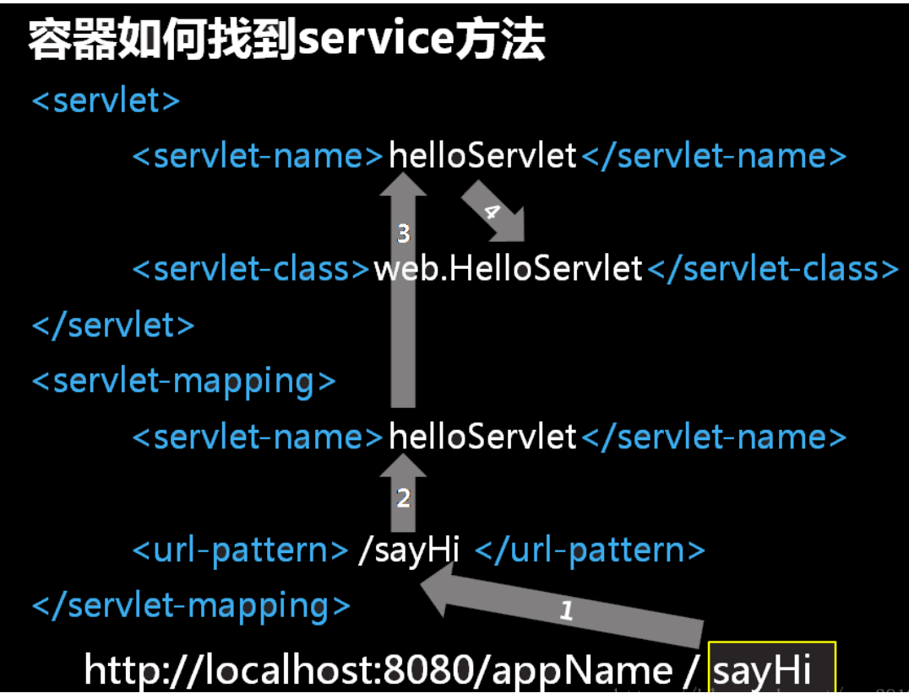
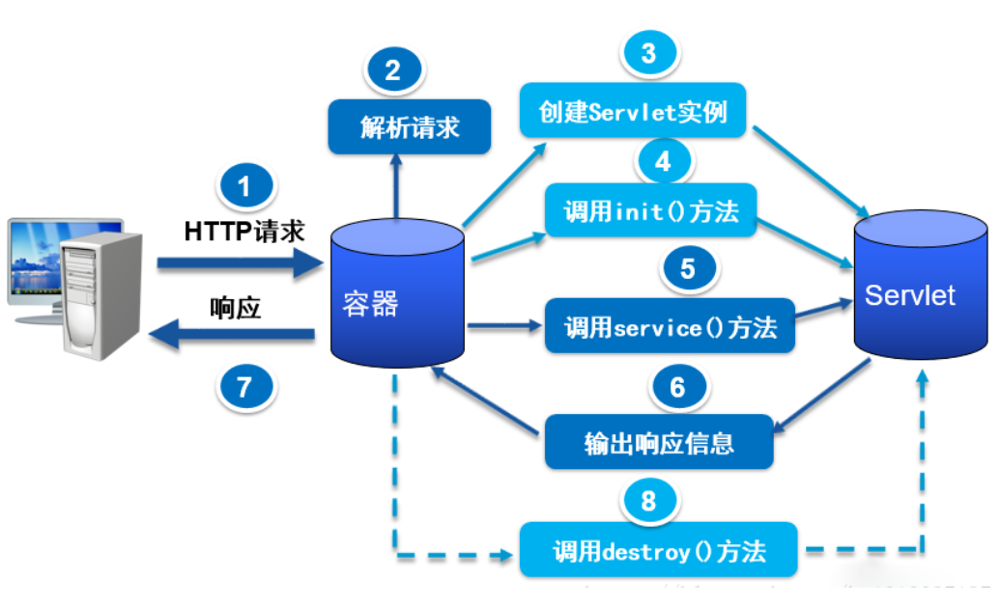

# servlet底层原理、servlet实现方式、serlvet生命周期

## Servlet简介


### Servlet定义

Servlet是一个Java应用程序，运行在服务器端，用来处理客户端请求并作出响应的程序。


### Servlet的特点

（1）Servlet对像，由Servlet容器（Tomcat）创建。

（2）Servlet是一个接口：位于javax.servlet包中。

（3）service方法用于接收用户的请求并返回响应。

（4）用户访问时多次被执行（可以统计网站的访问量）。

## Servlet底层原理

### Servlet

```java
package javax.servlet;

import java.io.IOException;

public interface Servlet {
    void init(ServletConfig var1) throws ServletException;

    ServletConfig getServletConfig();

    void service(ServletRequest var1, ServletResponse var2) throws ServletException, IOException;

    String getServletInfo();

    void destroy();
}
```

#### 实现Servlet接口

```
import java.io.IOException;

import javax.servlet.Servlet;
import javax.servlet.ServletConfig;
import javax.servlet.ServletException;
import javax.servlet.ServletRequest;
import javax.servlet.ServletResponse;

public class FirstServlet implements Servlet {
    /**init方法*/
    @Override
    public void init(ServletConfig paramServletConfig) throws ServletException {
    }

​    /**getServletConfig方法*/
​    @Override
​    public ServletConfig getServletConfig() {
​        return null;
​    }

​    /**service方法*/
​    @Override
​    public void service(ServletRequest paramServletRequest,
​            ServletResponse paramServletResponse) throws ServletException,
​            IOException {
​    }

​    /**getServletInfo方法*/
​    @Override
​    public String getServletInfo() {
​        return null;
​    }

​    /**destroy方法*/
​    @Override
​    public void destroy() {
​    }
}
```

我们需要实现servlet接口里面所有的方法，这对于我们开发来说是很繁琐的。

Servlet 生命周期的方法: 以下方法都是由 Serlvet 容器负责调用. 
1). 构造器: 只被调用一次. 只有第一次请求 Servlet 时, 创建 Servlet 的实例. 调用构造器. 这说明 Serlvet 是单实例的!
2). init 方法: 只被调用一次. 在创建好实例后立即被调用. 用于初始化当前 Servlet. 
3). service: 被多次调用. 每次请求都会调用 service 方法. 实际用于响应请求的. 
4). destroy: 只被调用一次. 在当前 Servlet 所在的 WEB 应用被卸载前调用. 用于释放当前 Servlet 所占用的资源.

下面两个方法是开发者调用
1). getServletConfig: 返回一个ServletConfig对象，其中包含这个servlet初始化和启动参数. 
2). getServletinfo: 返回有关servlet的信息，如作者、版本和版权;

#### **在 web.xml 文件中配置和映射这个 Servlet**

```
<!-- 配置和映射 Servlet -->
<servlet>
    <!-- Servlet 注册的名字 -->
    <servlet-name>helloServlet</servlet-name>
    <!-- Servlet 的全类名 -->
    <servlet-class>com.atguigu.javaweb.HelloServlet</servlet-class>
</servlet>

<servlet-mapping>
    <!-- 需要和某一个 servlet 节点的 serlvet-name 子节点的文本节点一致 -->
    <servlet-name>helloServlet</servlet-name>
    <!-- 映射具体的访问路径: / 代表当前 WEB 应用的根目录. -->
    <url-pattern>/hello</url-pattern>
</servlet-mapping>
```




#### load-on-startup 参数

1). 配置在 servlet 节点中:

```
<servlet>
    <!-- Servlet 注册的名字 -->
    <servlet-name>secondServlet</servlet-name>
    <!-- Servlet 的全类名 -->
    <servlet-class>com.atguigu.javaweb.SecondServlet</servlet-class>
    <!-- 可以指定 Servlet 被创建的时机 -->
    <load-on-startup>2</load-on-startup>
</servlet>
```

2). load-on-startup: 可以指定 Serlvet 被创建的时机. 若为负数, 则在第一次请求时被创建.若为 0 或正数, 则在当前 WEB 应用被Serlvet 容器加载时创建实例, 且数组越小越早被创建.


#### 关于 serlvet-mapping

1). 同一个Servlet可以被映射到多个URL上，即多个 <servlet-mapping> 元素的<servlet-name>子元素的设置值可以是同一个
Servlet的注册名。

2). 在Servlet映射到的URL中也可以使用 * 通配符，但是只能有两种固定的格式：
一种格式是“*.扩展名”，另一种格式是以正斜杠（/）开头并以“/*”结尾。

```
<servlet-mapping>
    <servlet-name>secondServlet</servlet-name>
    <url-pattern>/*</url-pattern>
</servlet-mapping>

OR

<servlet-mapping>
    <servlet-name>secondServlet</servlet-name>
    <url-pattern>*.do</url-pattern>
</servlet-mapping>
```

注意: 以下的既带 / 又带扩展名的不合法. 


#### Servlet生命周期

实例化：在第一次访问或启动tomcat时，tomcat会调用此无参构造方法实例化servlet。

初始化：tomcat在实例化此servlet后，会立即调用init方法初始化servlet。

就绪：容器收到请求后调用servlet的service方法来处理请求。

销毁：容器依据自身算法删除servlet对象，删除前会调用destory方法

其中实例化，初始化，销毁只会执行一次，service方法执行多次，默认情况下servlet是在第一次接受到用户请求的情况下才会实例化，可以在web.xml中的<servlet><servlet>标签内添加一个<load-on-startup>1<load-on-startup>配置，此时在启动tomcat时会创建servlet实例。

#### ServletConfig

封装了 Serlvet 的配置信息, 并且可以获取 ServletContext 对象

1). 配置 Serlvet 的初始化参数

```XML
<servlet>
    <servlet-name>helloServlet</servlet-name>
    <servlet-class>com.atguigu.javaweb.HelloServlet</servlet-class>
    
    <!-- 配置 Serlvet 的初始化参数。 且节点必须在 load-on-startup 节点的前面 -->
    <init-param>
        <!-- 参数名 -->
        <param-name>user</param-name>
        <!-- 参数值 -->
        <param-value>root</param-value>
    </init-param>
    
    <init-param>
        <param-name>password</param-name>
        <param-value>1230</param-value>
    </init-param>
    
    <load-on-startup>-1</load-on-startup>
    
</servlet>
```

2). 获取初始化参数: 

```java
getInitParameter(String name): 获取指定参数名的初始化参数
getInitParameterNames(): 获取参数名组成的 Enumeration 对象. 

String user = servletConfig.getInitParameter("user");
System.out.println("user： " + user);

Enumeration<String> names = servletConfig.getInitParameterNames();
while(names.hasMoreElements()){
    String name = names.nextElement();
    String value = servletConfig.getInitParameter(name);
    System.out.println("^^" + name + ": " + value);
}
```


#### ServletContext

1). 可以由 SerlvetConfig 获取:

```
ServletContext servletContext = servletConfig.getServletContext();
```

2). 该对象代表当前 WEB 应用: 可以认为 SerlvetContext 是当前 WEB 应用的一个大管家. 可以从中获取到当前 WEB 应用的各个方面的信息.

①. 获取当前 WEB 应用的初始化参数

设置初始化参数: 可以为所有的 Servlet 所获取, 而 Servlet 的初始化参数只用那个 Serlvet 可以获取.

```
<!-- 配置当前 WEB 应用的初始化参数 -->
<context-param>
　　<param-name>driver</param-name>
　　<param-value>com.mysql.jdbc.Driver</param-value>
</context-param>
```

代码:

```
ServletContext servletContext = servletConfig.getServletContext();
String driver = servletContext.getInitParameter("driver");
System.out.println("driver:" + driver);

Enumeration<String> names2 = servletContext.getInitParameterNames();
while(names2.hasMoreElements()){
　　String name = names2.nextElement();
　　System.out.println("-->" + name); 
}
```

②. 获取当前 WEB 应用的某一个文件在服务器上的绝对路径, 而不是部署前的路径

```
String realPath = servletContext.getRealPath("/note.txt");
```

③. 获取当前 WEB 应用的名称: 

```
String contextPath = servletContext.getContextPath();
```

④. 获取当前 WEB 应用的某一个文件对应的输入流. 

InputStream is2 = servletContext.getResourceAsStream("/WEB-INF/classes/jdbc.properties");


#### 如何在 Serlvet 中获取请求信息

**1). Servlet 的 service() 方法用于应答请求: 因为每次请求都会调用 service() 方法**

```
public void service(ServletRequest request, ServletResponse response)throws ServletException, IOException
```

ServletRequest: 封装了请求信息. 可以从中获取到任何的请求信息.
ServletResponse: 封装了响应信息, 如果想给用户什么响应, 具体可以使用该接口的方法实现.

这两个接口的实现类都是服务器给予实现的, 并在服务器调用 service 方法时传入。


**2). ServletRequest: 封装了请求信息. 可以从中获取到任何的请求信息.**

①. 获取请求参数:


```
> String getParameter(String name): 根据请求参数的名字, 返回参数值. 

若请求参数有多个值(例如 checkbox), 该方法只能获取到第一个提交的值.

> String[] getParameterValues(String name): 根据请求参数的名字, 返回请求参数对应的字符串数组.

> Enumeration getParameterNames(): 返回参数名对应的 Enumeration 对象, 
类似于 ServletConfig(或 ServletContext) 的 getInitParameterNames() 方法.

> Map getParameterMap(): 返回请求参数的键值对: key: 参数名, value: 参数值, String 数组类型.
```


②. 获取请求的 URI:

```
HttpServletRequest httpServletRequest = (HttpServletRequest) request;
    
String requestURI = httpServletRequest.getRequestURI();
System.out.println(requestURI); //  /day_29/loginServlet
```

③. 获取请求方式: 

```
String method = httpServletRequest.getMethod();
System.out.println(method); //GET
```

④. 若是一个 GET 请求, 获取请求参数对应的那个字符串, 即 ? 后的那个字符串. 

```
String queryString = httpServletRequest.getQueryString();
System.out.println(queryString); //user=atguigu&password=123456&interesting=game&interesting=party&interesting=shopping
```

⑤. 获取请求的 Serlvet 的映射路径 

```
String servletPath = httpServletRequest.getServletPath();
System.out.println(servletPath);  //  /loginServlet
```

 

**3). HttpServletRequest: 是 SerlvetRequest 的子接口. 针对于 HTTP 请求所定义. 里边包含了大量获取 HTTP 请求相关的方法.** 

**4). ServletResponse: 封装了响应信息, 如果想给用户什么响应, 具体可以使用该接口的方法实现.** 

　　①. *getWriter(): 返回 PrintWriter 对象. 调用该对象的 print() 方法, 将把 print() 中的参数直接打印到客户的浏览器上. 

　　②. 设置响应的内容类型: response.setContentType("application/msword");

　　③. void sendRedirect(String location): 请求的重定向. (此方法为 HttpServletResponse 中定义.)

### GenericServlet

1). 是一个 Serlvet. 是 Servlet 接口和 ServletConfig 接口的实现类. 但是一个抽象类. 其中的 service 方法为抽象方法

2). 如果新建的 Servlet 程序直接继承 GenericSerlvet 会使开发更简洁.

3). 具体实现:

　　①. 在 GenericServlet 中声明了一个 SerlvetConfig 类型的成员变量, 在 init(ServletConfig) 方法中对其进行了初始化 
　　②. 利用 servletConfig 成员变量的方法实现了 ServletConfig 接口的方法
　　③. 还定义了一个 init() 方法, 在 init(SerlvetConfig) 方法中对其进行调用, 子类可以直接覆盖 init() 在其中实现对 Servlet 的初始化. 
　　④. 不建议直接覆盖 init(ServletConfig), 因为如果忘记编写 super.init(config); 而还是用了 SerlvetConfig 接口的方法,则会出现空指针异常.
　　⑤. 新建的 init(){} 并非 Serlvet 的生命周期方法. 而 init(ServletConfig) 是生命周期相关的方法.


```
public abstract class GenericServlet implements Servlet, ServletConfig {

​    /** 以下方法为 Servlet 接口的方法 **/
​    @Override
​    public void destroy() {}

​    @Override
​    public ServletConfig getServletConfig() {
​        return servletConfig;
​    }

​    @Override
​    public String getServletInfo() {
​        return null;
​    }

​    private ServletConfig servletConfig;
​    
​    @Override
​    public void init(ServletConfig arg0) throws ServletException {
​        this.servletConfig = arg0;
​        init();
​    }

​    public void init() throws ServletException{}

​     /**【注意】唯独service方法没有被实现，还是一个抽象方法，这个service方法必须我们自己去重写*/
​    @Override
​    public abstract void service(ServletRequest arg0, ServletResponse arg1)
​            throws ServletException, IOException;

​    /** 以下方法为 ServletConfig 接口的方法 **/
​    @Override
​    public String getInitParameter(String arg0) {
​        return servletConfig.getInitParameter(arg0);
​    }

​    @Override
​    public Enumeration getInitParameterNames() {
​        return servletConfig.getInitParameterNames();
​    }

​    @Override
​    public ServletContext getServletContext() {
​        return servletConfig.getServletContext();
​    }

​    @Override
​    public String getServletName() {
​        return servletConfig.getServletName();
​    }
}
```


【注意】唯独service方法没有被实现，还是一个抽象方法，这个service方法必须我们自己去重写。


### HttpServlet

　　1). 是一个 Servlet, 继承自 GenericServlet. 针对于 HTTP 协议所定制.

　　2). 在 service() 方法中直接把 ServletReuqest 和 ServletResponse 转为 HttpServletRequest 和 HttpServletResponse.并调用了重载的 service(HttpServletRequest, HttpServletResponse)

　　    在 service(HttpServletRequest, HttpServletResponse) 获取了请求方式: request.getMethod(). 根据请求方式有创建了doXxx() 方法(xxx 为具体的请求方式, 比如 doGet, doPost)

```java
@Override
 public void service(ServletRequest req, ServletResponse res)
    throws ServletException, IOException {

    HttpServletRequest  request;
    HttpServletResponse response;
    
    try {
        request = (HttpServletRequest) req;
        response = (HttpServletResponse) res;
    } catch (ClassCastException e) {
        throw new ServletException("non-HTTP request or response");
    }
    service(request, response);
}

public void service(HttpServletRequest request, HttpServletResponse response)
        throws ServletException, IOException {
    //1. 获取请求方式.
    String method = request.getMethod();
    
    //2. 根据请求方式再调用对应的处理方法
    if("GET".equalsIgnoreCase(method)){
        doGet(request, response);
    }else if("POST".equalsIgnoreCase(method)){
        doPost(request, response);
    }
}

public void doPost(HttpServletRequest request, HttpServletResponse response) 
        throws ServletException, IOException{
    // TODO Auto-generated method stub
    
}

public void doGet(HttpServletRequest request, HttpServletResponse response) 
        throws ServletException, IOException {
    // TODO Auto-generated method stub
    
}
```

3). 实际开发中, 直接继承 HttpServlet, 并根据请求方式复写 doXxx() 方法即可.

4). 好处: 直接由针对性的覆盖 doXxx() 方法; 直接使用 HttpServletRequest 和 HttpServletResponse, 不再需要强转.

## Servlet的生命周期


### Servlet生命周期图




### Servlet生命周期简述

（1）加载和实例化

　　当Servlet容器启动或客户端发送一个请求时，Servlet容器会查找内存中是否存在该Servlet实例，若存在，则直接读取该实例响应请求；如果不存在，就创建一个Servlet实例。

（2） 初始化

　　实例化后，Servlet容器将调用Servlet的init()方法进行初始化（一些准备工作或资源预加载工作）。

（3）服务

　　初始化后，Servlet处于能响应请求的就绪状态。当接收到客户端请求时，调用service()的方法处理客户端请求，HttpServlet的service()方法会根据不同的请求 转调不同的doXxx()方法,比如 doGet, doPost。

（4）销毁

　　当Servlet容器关闭时，Servlet实例也随时销毁。其间，Servlet容器会调用Servlet 的destroy()方法去判断该Servlet是否应当被释放（或回收资源）。

 

其中实例化，初始化，销毁只会执行一次，service方法执行多次，默认情况下servlet是在第一次接受到用户请求的情况下才会实例化，可以在web.xml中的<servlet><servlet>标签内添加一个<load-on-startup>1<load-on-startup>配置，此时在启动tomcat时会创建servlet实例。

