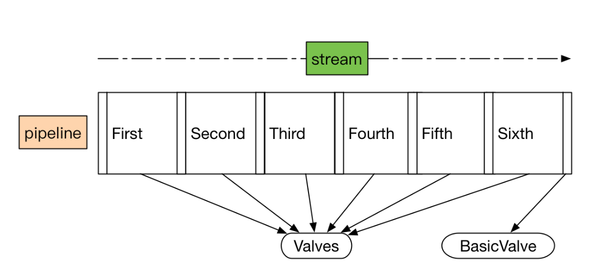
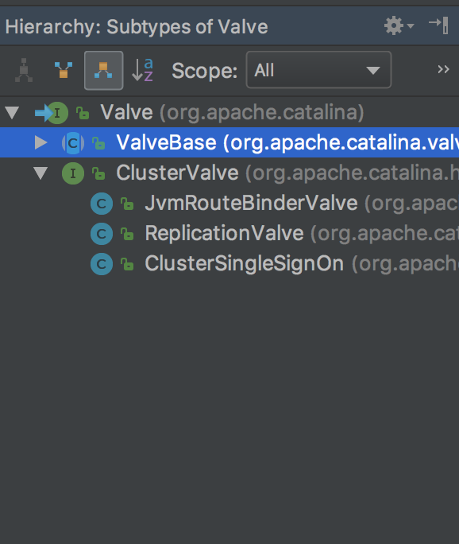

## Valve

`Valve`作为一个个基础的阀门，扮演着业务实际执行者的角色。我们看看`Valve`这个接口有哪些方法。

```java
public interface Valve {
    // 获取下一个阀门
    public Valve getNext();
    // 设置下一个阀门
    public void setNext(Valve valve);
    // 后台执行逻辑，主要在类加载上下文中使用到
    public void backgroundProcess();
    // 执行业务逻辑
    public void invoke(Request request, Response response)
        throws IOException, ServletException;
    // 是否异步执行
    public boolean isAsyncSupported();
}
```

### Contained

`ValveBase`、`Pipeline`及其他相关组件都实现了`Contained`接口，我们看看这个接口有哪些方法。很简单，就是get/set容器操作。

```java
public interface Contained {

    /**
     * Get the {@link Container} with which this instance is associated.
     *
     * @return The Container with which this instance is associated or
     *         <code>null</code> if not associated with a Containerjava
     */
    Container getContainer();


    /**
     * Set the <code>Container</code> with which this instance is associated.
     *
     * @param container The Container instance with which this instance is to
     *  be associated, or <code>null</code> to disassociate this instance
     *  from any Container
     */
    void setContainer(Container container);
}
```

### ValveBase

从Valve的类层次结构，我们发现几乎所有Valve都继承了`ValveBase`这个抽象类，所以这儿我们需要分析一下它。



```java
public abstract class ValveBase extends LifecycleMBeanBase implements Contained, Valve {
    // 国际化管理器，可以支持多国语言
    protected static final StringManager sm = StringManager.getManager(ValveBase.class);

    //------------------------------------------------------ Instance Variables

    // 无参构造方法，默认不支持异步
    public ValveBase() {
        this(false);
    }
    // 有参构造方法，可传入异步支持标记
    public ValveBase(boolean asyncSupported) {
        this.asyncSupported = asyncSupported;
    }


    //------------------------------------------------------ Instance Variables

    // 异步标记
    protected boolean asyncSupported;
    // 所属容器
    protected Container container = null;
    // 容器日志组件对象
    protected Log containerLog = null;
    // 下一个阀门
    protected Valve next = null;


    //-------------------------------------------------------------- Properties

    // 获取所属容器
    @Override
    public Container getContainer() {
        return container;
    }
    // 设置所属容器
    @Override
    public void setContainer(Container container) {
        this.container = container;
    }
    // 是否异步执行
    @Override
    public boolean isAsyncSupported() {
        return asyncSupported;
    }
    // 设置是否异步执行
    public void setAsyncSupported(boolean asyncSupported) {
        this.asyncSupported = asyncSupported;
    }
    // 获取下一个待执行的阀门
    @Override
    public Valve getNext() {
        return next;
    }
    // 设置下一个待执行的阀门
    @Override
    public void setNext(Valve valve) {
        this.next = valve;
    }


    //---------------------------------------------------------- Public Methods

    // 后台执行，子类实现
    @Override
    public void backgroundProcess() {
        // NOOP by default
    }
    // 初始化逻辑
    @Override
    protected void initInternal() throws LifecycleException {
        super.initInternal();
        // 设置容器日志组件对象到当前阀门的containerLog属性
        containerLog = getContainer().getLogger();
    }
    // 启动逻辑
    @Override
    protected synchronized void startInternal() throws LifecycleException {
        setState(LifecycleState.STARTING);
    }
    // 停止逻辑
    @Override
    protected synchronized void stopInternal() throws LifecycleException {
        setState(LifecycleState.STOPPING);
    }
    // 重写toString，格式为[${containerName}]
    @Override
    public String toString() {
        StringBuilder sb = new StringBuilder(this.getClass().getName());
        sb.append('[');
        if (container == null) {
            sb.append("Container is null");
        } else {
            sb.append(container.getName());
        }
        sb.append(']');
        return sb.toString();
    }


    // -------------------- JMX and Registration  --------------------

    // 设置获取MBean对象的keyProperties，格式如：a=b,c=d,e=f...
    @Override
    public String getObjectNameKeyProperties() {
        StringBuilder name = new StringBuilder("type=Valve");

        Container container = getContainer();

        name.append(container.getMBeanKeyProperties());

        int seq = 0;

        // Pipeline may not be present in unit testing
        Pipeline p = container.getPipeline();
        if (p != null) {
            for (Valve valve : p.getValves()) {
                // Skip null valves
                if (valve == null) {
                    continue;
                }
                // Only compare valves in pipeline until we find this valve
                if (valve == this) {
                    break;
                }
                if (valve.getClass() == this.getClass()) {
                    // Duplicate valve earlier in pipeline
                    // increment sequence number
                    seq ++;
                }
            }
        }

        if (seq > 0) {
            name.append(",seq=");
            name.append(seq);
        }

        String className = this.getClass().getName();
        int period = className.lastIndexOf('.');
        if (period >= 0) {
            className = className.substring(period + 1);
        }
        name.append(",name=");
        name.append(className);

        return name.toString();
    }
    // 获取所属域，从container获取
    @Override
    public String getDomainInternal() {
        Container c = getContainer();
        if (c == null) {
            return null;
        } else {
            return c.getDomain();
        }
    }
}
```

## Pipeline

`Pipeline`作为一个管道，我们可以简单认为是一个Valve的集合，内部会对这个集合进行遍历，调用每个元素的业务逻辑方法`invoke()`。

是不是这样呢？我们还是分析一下源码，先看看接口定义。

```java
public interface Pipeline {
    // ------------------------------------------------------------- Properties

    // 获取基本阀门
    public Valve getBasic();
    // 设置基本阀门
    public void setBasic(Valve valve);

    // --------------------------------------------------------- Public Methods

    // 添加阀门
    public void addValve(Valve valve);
    // 获取阀门数组
    public Valve[] getValves();
    // 删除阀门
    public void removeValve(Valve valve);
    // 获取首个阀门
    public Valve getFirst();
    // 管道内所有阀门是否异步执行
    public boolean isAsyncSupported();
    // 获取管道所属的容器
    public Container getContainer();
    // 设置管道所属的容器
    public void setContainer(Container container);
    // 查找非异步执行的所有阀门，并放置到result参数中，所以result不允许为null
    public void findNonAsyncValves(Set<String> result);
}
```

### StandardPipeline

接着我们分析一下`Pipeline`唯一的实现`StandardPipeline`。

```java
public class StandardPipeline extends LifecycleBase
        implements Pipeline, Contained {

    private static final Log log = LogFactory.getLog(StandardPipeline.class);

    // ----------------------------------------------------------- Constructors

    // 构造一个没有所属容器的管道
    public StandardPipeline() {
        this(null);
    }

    // 构造一个有所属容器的管道
    public StandardPipeline(Container container) {
        super();
        setContainer(container);
    }

    // ----------------------------------------------------- Instance Variables

    /**
     * 基本阀门，最后执行的阀门
     */
    protected Valve basic = null;

    /**
     * 管道所属的容器
     */
    protected Container container = null;

    /**
     * 管道里面的首个执行的阀门
     */
    protected Valve first = null;

    // --------------------------------------------------------- Public Methods

    // 是否异步执行，如果一个阀门都没有，或者所有阀门都是异步执行的，才返回true
    @Override
    public boolean isAsyncSupported() {
        Valve valve = (first!=null)?first:basic;
        boolean supported = true;
        while (supported && valve!=null) {
            supported = supported & valve.isAsyncSupported();
            valve = valve.getNext();
        }
        return supported;
    }

    // 查找所有未异步执行的阀门
    @Override
    public void findNonAsyncValves(Set<String> result) {
        Valve valve = (first!=null) ? first : basic;
        while (valve != null) {
            if (!valve.isAsyncSupported()) {
                result.add(valve.getClass().getName());
            }
            valve = valve.getNext();
        }
    }

    // ------------------------------------------------------ Contained Methods

    // 获取所属容器
    @Override
    public Container getContainer() {
        return (this.container);
    }

    // 设置所属容器
    @Override
    public void setContainer(Container container) {
        this.container = container;
    }

    // 初始化逻辑，默认没有任何逻辑
    @Override
    protected void initInternal() {
        // NOOP
    }

    // 开始逻辑，调用所有阀门的start方法
    @Override
    protected synchronized void startInternal() throws LifecycleException {
        // Start the Valves in our pipeline (including the basic), if any
        Valve current = first;
        if (current == null) {
            current = basic;
        }
        while (current != null) {
            if (current instanceof Lifecycle)
                ((Lifecycle) current).start();
            current = current.getNext();
        }

        setState(LifecycleState.STARTING);
    }

    // 停止逻辑，调用所有阀门的stop方法
    @Override
    protected synchronized void stopInternal() throws LifecycleException {
        setState(LifecycleState.STOPPING);

        // Stop the Valves in our pipeline (including the basic), if any
        Valve current = first;
        if (current == null) {
            current = basic;
        }
        while (current != null) {
            if (current instanceof Lifecycle)
                ((Lifecycle) current).stop();
            current = current.getNext();
        }
    }

    // 销毁逻辑，移掉所有阀门，调用removeValve方法
    @Override
    protected void destroyInternal() {
        Valve[] valves = getValves();
        for (Valve valve : valves) {
            removeValve(valve);
        }
    }

    /**
     * 重新toString方法
     */
    @Override
    public String toString() {
        StringBuilder sb = new StringBuilder("Pipeline[");
        sb.append(container);
        sb.append(']');
        return sb.toString();
    }

    // ------------------------------------------------------- Pipeline Methods

    // 获取基础阀门
    @Override
    public Valve getBasic() {
        return (this.basic);
    }

    // 设置基础阀门
    @Override
    public void setBasic(Valve valve) {
        // Change components if necessary
        Valve oldBasic = this.basic;
        if (oldBasic == valve)
            return;

        // Stop the old component if necessary
        // 老的基础阀门会被调用stop方法且所属容器置为null
        if (oldBasic != null) {
            if (getState().isAvailable() && (oldBasic instanceof Lifecycle)) {
                try {
                    ((Lifecycle) oldBasic).stop();
                } catch (LifecycleException e) {
                    log.error("StandardPipeline.setBasic: stop", e);
                }
            }
            if (oldBasic instanceof Contained) {
                try {
                    ((Contained) oldBasic).setContainer(null);
                } catch (Throwable t) {
                    ExceptionUtils.handleThrowable(t);
                }
            }
        }

        // Start the new component if necessary
        // 新的阀门会设置所属容器，并调用start方法
        if (valve == null)
            return;
        if (valve instanceof Contained) {
            ((Contained) valve).setContainer(this.container);
        }
        if (getState().isAvailable() && valve instanceof Lifecycle) {
            try {
                ((Lifecycle) valve).start();
            } catch (LifecycleException e) {
                log.error("StandardPipeline.setBasic: start", e);
                return;
            }
        }

        // Update the pipeline
        // 替换pipeline中的基础阀门，就是讲基础阀门的前一个阀门的next指向当前阀门
        Valve current = first;
        while (current != null) {
            if (current.getNext() == oldBasic) {
                current.setNext(valve);
                break;
            }
            current = current.getNext();
        }

        this.basic = valve;
    }

    // 添加阀门
    @Override
    public void addValve(Valve valve) {
        // Validate that we can add this Valve
        // 设置所属容器
        if (valve instanceof Contained)
            ((Contained) valve).setContainer(this.container);

        // Start the new component if necessary
        // 调用阀门的start方法
        if (getState().isAvailable()) {
            if (valve instanceof Lifecycle) {
                try {
                    ((Lifecycle) valve).start();
                } catch (LifecycleException e) {
                    log.error("StandardPipeline.addValve: start: ", e);
                }
            }
        }

        // Add this Valve to the set associated with this Pipeline
        // 设置阀门，将阀门添加到基础阀门的前一个
        if (first == null) {
            first = valve;
            valve.setNext(basic);
        } else {
            Valve current = first;
            while (current != null) {
                if (current.getNext() == basic) {
                    current.setNext(valve);
                    valve.setNext(basic);
                    break;
                }
                current = current.getNext();
            }
        }

        container.fireContainerEvent(Container.ADD_VALVE_EVENT, valve);
    }

    // 获取阀门数组
    @Override
    public Valve[] getValves() {
        ArrayList<Valve> valveList = new ArrayList<>();
        Valve current = first;
        if (current == null) {
            current = basic;
        }
        while (current != null) {
            valveList.add(current);
            current = current.getNext();
        }

        return valveList.toArray(new Valve[0]);
    }

    // JMX方法，在此忽略
    public ObjectName[] getValveObjectNames() {
        ArrayList<ObjectName> valveList = new ArrayList<>();
        Valve current = first;
        if (current == null) {
            current = basic;
        }
        while (current != null) {
            if (current instanceof JmxEnabled) {
                valveList.add(((JmxEnabled) current).getObjectName());
            }
            current = current.getNext();
        }

        return valveList.toArray(new ObjectName[0]);
    }

    // 移除阀门
    @Override
    public void removeValve(Valve valve) {
        Valve current;
        if(first == valve) {
            // 如果待移出的阀门是首个阀门，则首个阀门的下一个阀门变成首个阀门
            first = first.getNext();
            current = null;
        } else {
            current = first;
        }
        // 遍历阀门集合，并进行移除
        while (current != null) {
            if (current.getNext() == valve) {
                current.setNext(valve.getNext());
                break;
            }
            current = current.getNext();
        }

        if (first == basic) first = null;

        // 设置阀门所属容器为null
        if (valve instanceof Contained)
            ((Contained) valve).setContainer(null);

        // 调用待移除阀门的stop方法和destroy方法，并触发移除阀门事件
        if (valve instanceof Lifecycle) {
            // Stop this valve if necessary
            if (getState().isAvailable()) {
                try {
                    ((Lifecycle) valve).stop();
                } catch (LifecycleException e) {
                    log.error("StandardPipeline.removeValve: stop: ", e);
                }
            }
            try {
                ((Lifecycle) valve).destroy();
            } catch (LifecycleException e) {
                log.error("StandardPipeline.removeValve: destroy: ", e);
            }
        }

        container.fireContainerEvent(Container.REMOVE_VALVE_EVENT, valve);
    }

    // 获取首个阀门，如果阀门列表为null，返回基础阀门
    @Override
    public Valve getFirst() {
        if (first != null) {
            return first;
        }
        return basic;
    }
}
```

## 总结

通过上面的代码分析，我们发现了几个关键的设计模式：

1. 模板方法模式，父类定义框架，子类实现
2. 责任链模式，就是这儿的管道/阀门的实现方式，每个阀门维护一个next属性指向下一个阀门