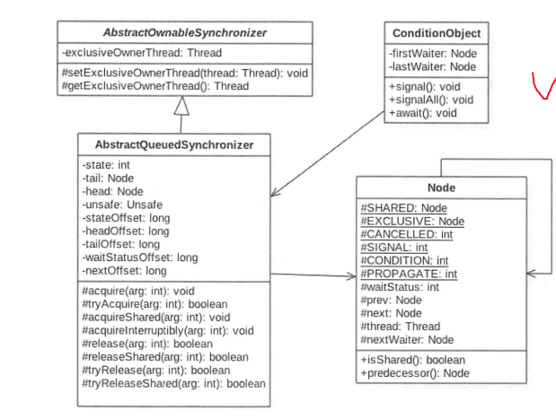

# 抽象同步队列AQS

### AQS-------锁底层支持

AbstractQueuedSynchronizer抽象同步队列简称AQS，它是实现同步器的基础组件，并发包中锁的底层就是使用AQS实现的。

​		由图可以看出AQS是是一个FIFO的双向队列，内部通过节点head和tail记录队列首尾元素，队列元素的类型为Node，其中Node中的thread变量用来存放进入AQS队列里面的线程；Node节点内部的SHARED用来标记该线程是获取共享资源时被阻塞挂起后放入AQS队列的，**EXCLUSIVE**用来标记线程是获取独占资源是被挂起后放入AQS队列的；**waitStatus**记录当前线程等待状态，可以为**CANCELLED**（线程被取消了）、**SIGNAL**（线程需要被唤醒）、**CONDITION**（线程在条件队列里面等待）、**PROPAGETE**（释放共享资源时需要通知其他节点）；**prev**记录当前节点的前驱节点，**next**记录当前节点的后继节点。

​		在AQS中维持了一个单一的状态信息state，可以通过getState、setState、compareAndSetState函数修改其值。对于ReentreantLock的实现来说，state可以用来表示当前线程获取锁的可重入次数；对于读写锁ReentrantReadWriteLock来说，state的高16位表示读状态，也就是获取该锁的次数，低16位表示获取写锁的线程可重入次数；对于semaphore来说，state用来表示当前信号的个数；对于CountDownlatch来说，state用来表示计数器当前的值。

​		AQS有个内部类ConditionObject，用来结合锁实现线同步。ConditionObject可以直接访问AQS对象内部的变量，比如state状态值和AQS队列。ConditionObject是条件变量，每个条件变量对应一个条件队列（单向链表队列），其用来存放调用条件变量的await方法后被阻塞的线程。

​		对于AQS来说，线程同步的关键是对状态值state进行操作。根据state是否属于一个线程，操作state 的方式分为独占方式和共享方式。在独占方式下获取和释放资源的使用的方法是：void acquire（int args) void acquireInterruptibly(it arg) boolean release(int arg)。

​		在共享方式侠获取和释放资源的方法为：void acquireShared(int arg) void acquireSharedInterruptibly(int arg) boolean relwaseShared(int arg);

​	