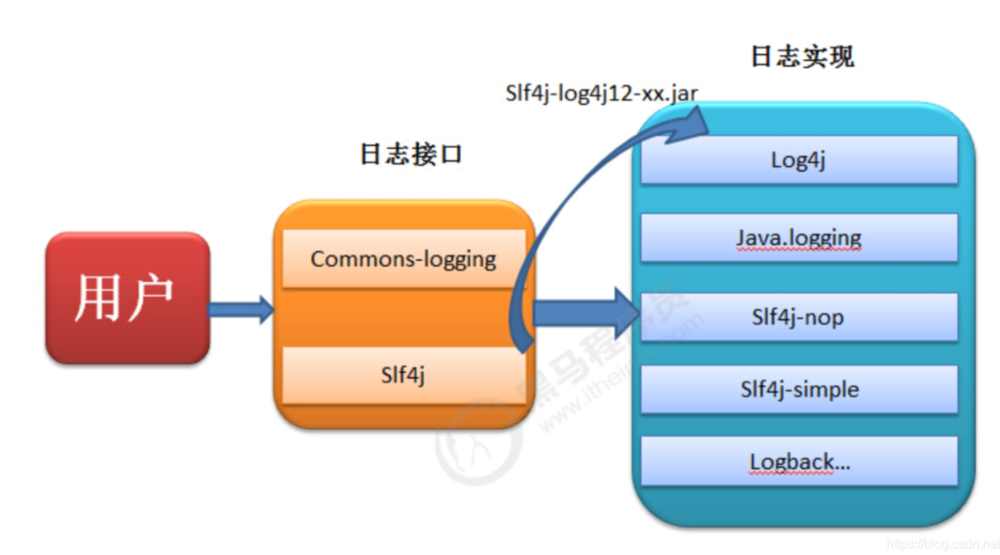
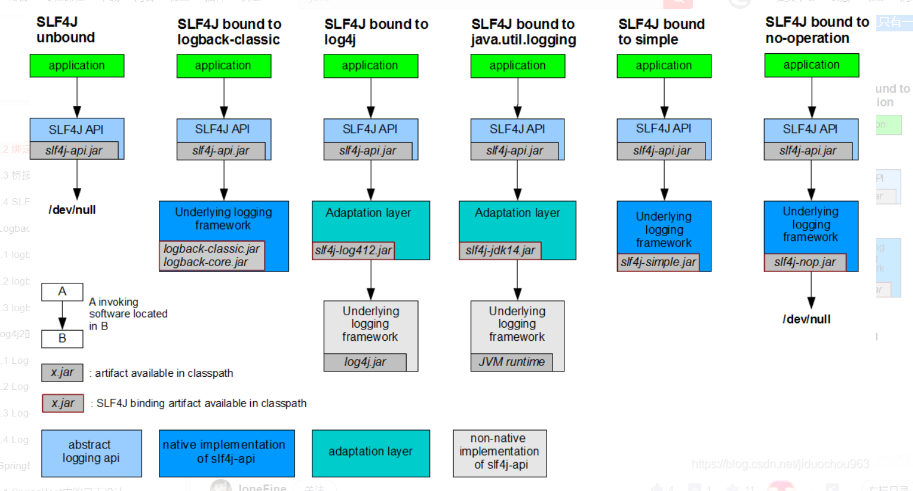
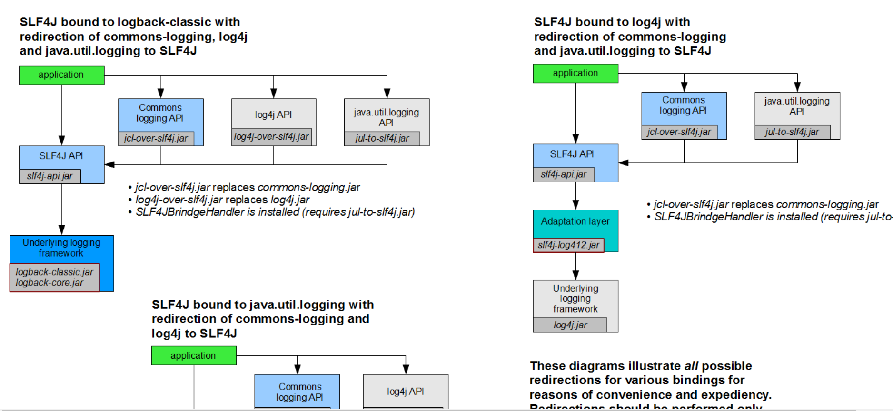
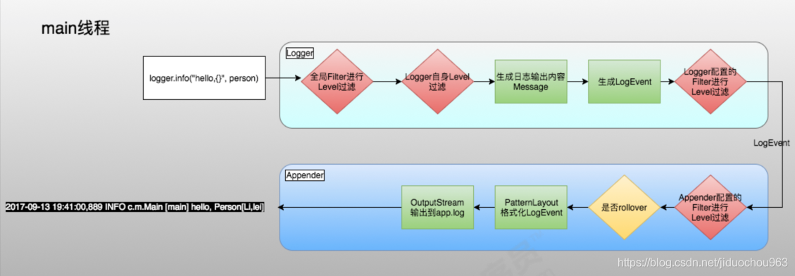
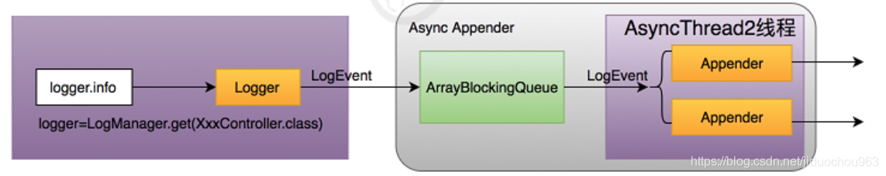
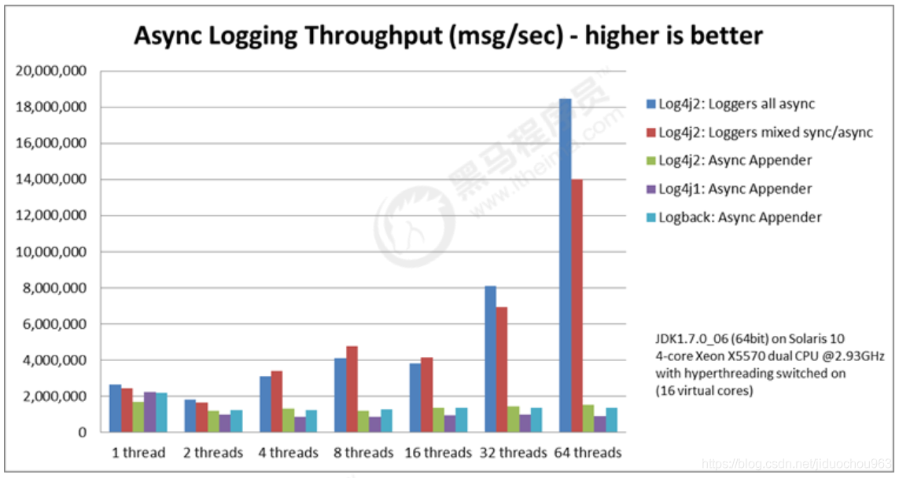
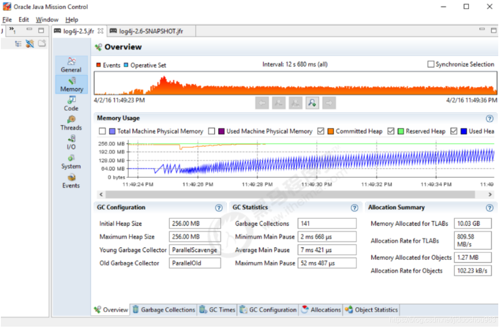
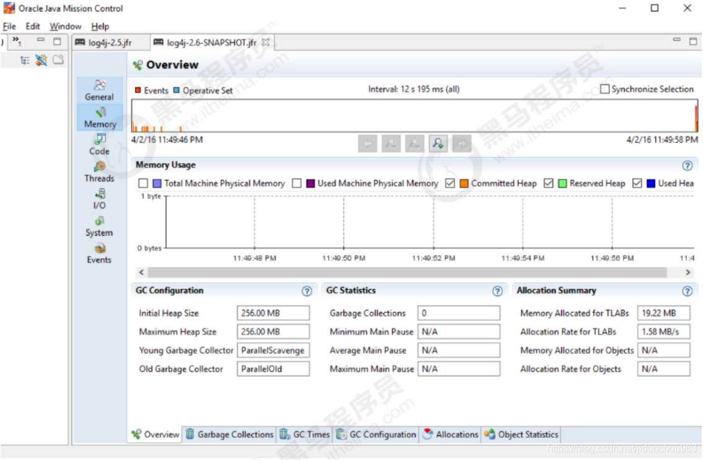
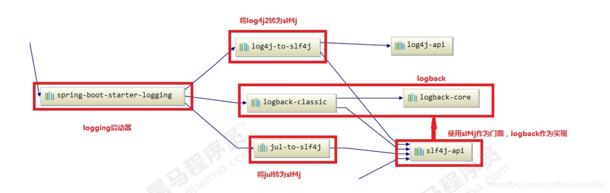
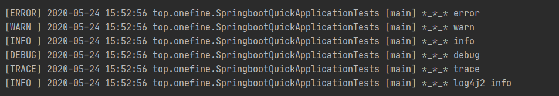

# Java - 日志

# 一、日志门面

当我们的系统变的更加复杂的时候，我们的日志就容易发生混乱。随着系统开发的进行，可能会更新不同的日志框架，造成当前系统中存在不同的日志依赖，让我们难以统一的管理和控制。就算我们强制要求所有的模块使用相同的日志框架，系统中也难以避免使用其他类似spring,mybatis等其他的第三方框架，它们依赖于我们规定不同的日志框架，而且他们自身的日志系统就有着不一致性，依然会出来日志体系的混乱。

所以我们需要借鉴JDBC的思想，为日志系统也提供一套门面，那么我们就可以面向这些接口规范来开发，避免了直接依赖具体的日志框架。这样我们的系统在日志中，就存在了日志的门面和日志的实现。

**常见的日志门面 ：**
JCL、`slf4j`

**常见的日志实现：**
JUL、log4j、`logback`、`log4j2`

日志门面和日志实现的关系：



**日志框架出现的历史顺序：**
log4j -->JUL–>JCL–> slf4j --> logback --> log4j2


# 二、 SLF4J的使用

简单日志门面(Simple Logging Facade For Java) SLF4J主要是为了给Java日志访问提供一套标准、规范的API框架，其主要意义在于提供接口，具体的实现可以交由其他日志框架，例如log4j和logback等。

当然slf4j自己也提供了功能较为简单的实现，但是一般很少用到。对于一般的Java项目而言，日志框架会选择slf4j-api作为门面，配上具体的实现框架（log4j、logback等），中间使用桥接器完成桥接。

官方网站： https://www.slf4j.org/

SLF4J是目前市面上最流行的日志门面。现在的项目中，基本上都是使用SLF4J作为我们的日志系统。

SLF4J日志门面主要提供两大功能：

日志框架的绑定
日志框架的桥接


## 2.1 SLF4J入门

1. 添加依赖

   ```
   dependencies {
       // slf4j日志门面
       // https://mvnrepository.com/artifact/org.slf4j/slf4j-api
       compile group: 'org.slf4j', name: 'slf4j-api', version: '1.7.30'
   
       // slf4j内置的简单日志实现
       // https://mvnrepository.com/artifact/org.slf4j/slf4j-simple
       testCompile group: 'org.slf4j', name: 'slf4j-simple', version: '1.7.30'
   
       // https://mvnrepository.com/artifact/junit/junit
       testCompile group: 'junit', name: 'junit', version: '4.13'
   }
   ```

2. 编写代码

   ```java
   package top.onefine;
   
   import org.junit.Test;
   import org.slf4j.Logger;
   import org.slf4j.LoggerFactory;
   
   public class Slf4jTest {
   
       // 声明日志对象
       public static final Logger LOGGER = LoggerFactory.getLogger(Slf4jTest.class);
   
       @Test
       public void testQuick() {
           // 打印日志信息
           LOGGER.error("error");
           LOGGER.warn("warn");
           LOGGER.info("info");  // 默认级别
           LOGGER.debug("debug");
           LOGGER.trace("trace");
   
           // 使用占位符输出日志信息
           String name = "one fine";
           Integer age = 18;
           LOGGER.info("用户：{}， 年龄：{}", name, age);
   
           // 将系统的日常信息输出
           try {
               int i = 1 / 0;
           } catch (Exception e) {
   //            e.printStackTrace();
               LOGGER.error("出现异常", e);
           }
       }
   }
   
   ```

   

输出

```
[Test worker] ERROR top.onefine.Slf4jTest - error
[Test worker] WARN top.onefine.Slf4jTest - warn
[Test worker] INFO top.onefine.Slf4jTest - info
[Test worker] INFO top.onefine.Slf4jTest - 用户：one fine， 年龄：18
[Test worker] ERROR top.onefine.Slf4jTest - 出现异常
java.lang.ArithmeticException: / by zero
	at top.onefine.Slf4jTest.testQuick(Slf4jTest.java:28)
	at sun.reflect.NativeMethodAccessorImpl.invoke0(Native Method)
	at sun.reflect.NativeMethodAccessorImpl.invoke(NativeMethodAccessorImpl.java:62)
	at sun.reflect.DelegatingMethodAccessorImpl.invoke(DelegatingMethodAccessorImpl.java:43)
	at java.lang.reflect.Method.invoke(Method.java:498)
	at org.junit.runners.model.FrameworkMethod$1.runReflectiveCall(FrameworkMethod.java:59)
	at org.junit.internal.runners.model.ReflectiveCallable.run(ReflectiveCallable.java:12)
	at org.junit.runners.model.FrameworkMethod.invokeExplosively(FrameworkMethod.java:56)
	at org.junit.internal.runners.statements.InvokeMethod.evaluate(InvokeMethod.java:17)
	at org.junit.runners.ParentRunner$3.evaluate(ParentRunner.java:306)
	at org.junit.runners.BlockJUnit4ClassRunner$1.evaluate(BlockJUnit4ClassRunner.java:100)
	at org.junit.runners.ParentRunner.runLeaf(ParentRunner.java:366)
	at org.junit.runners.BlockJUnit4ClassRunner.runChild(BlockJUnit4ClassRunner.java:103)
	at org.junit.runners.BlockJUnit4ClassRunner.runChild(BlockJUnit4ClassRunner.java:63)
	at org.junit.runners.ParentRunner$4.run(ParentRunner.java:331)
	at org.junit.runners.ParentRunner$1.schedule(ParentRunner.java:79)
	at org.junit.runners.ParentRunner.runChildren(ParentRunner.java:329)
	at org.junit.runners.ParentRunner.access$100(ParentRunner.java:66)
	at org.junit.runners.ParentRunner$2.evaluate(ParentRunner.java:293)
	at org.junit.runners.ParentRunner$3.evaluate(ParentRunner.java:306)
	at org.junit.runners.ParentRunner.run(ParentRunner.java:413)
	at org.gradle.api.internal.tasks.testing.junit.JUnitTestClassExecutor.runTestClass(JUnitTestClassExecutor.java:110)
	at org.gradle.api.internal.tasks.testing.junit.JUnitTestClassExecutor.execute(JUnitTestClassExecutor.java:58)
	at org.gradle.api.internal.tasks.testing.junit.JUnitTestClassExecutor.execute(JUnitTestClassExecutor.java:38)
	at org.gradle.api.internal.tasks.testing.junit.AbstractJUnitTestClassProcessor.processTestClass(AbstractJUnitTestClassProcessor.java:62)
	at org.gradle.api.internal.tasks.testing.SuiteTestClassProcessor.processTestClass(SuiteTestClassProcessor.java:51)
	at sun.reflect.NativeMethodAccessorImpl.invoke0(Native Method)
	at sun.reflect.NativeMethodAccessorImpl.invoke(NativeMethodAccessorImpl.java:62)
	at sun.reflect.DelegatingMethodAccessorImpl.invoke(DelegatingMethodAccessorImpl.java:43)
	at java.lang.reflect.Method.invoke(Method.java:498)
	at org.gradle.internal.dispatch.ReflectionDispatch.dispatch(ReflectionDispatch.java:36)
	at org.gradle.internal.dispatch.ReflectionDispatch.dispatch(ReflectionDispatch.java:24)
	at org.gradle.internal.dispatch.ContextClassLoaderDispatch.dispatch(ContextClassLoaderDispatch.java:33)
	at org.gradle.internal.dispatch.ProxyDispatchAdapter$DispatchingInvocationHandler.invoke(ProxyDispatchAdapter.java:94)
	at com.sun.proxy.$Proxy2.processTestClass(Unknown Source)
	at org.gradle.api.internal.tasks.testing.worker.TestWorker.processTestClass(TestWorker.java:118)
	at sun.reflect.NativeMethodAccessorImpl.invoke0(Native Method)
	at sun.reflect.NativeMethodAccessorImpl.invoke(NativeMethodAccessorImpl.java:62)
	at sun.reflect.DelegatingMethodAccessorImpl.invoke(DelegatingMethodAccessorImpl.java:43)
	at java.lang.reflect.Method.invoke(Method.java:498)
	at org.gradle.internal.dispatch.ReflectionDispatch.dispatch(ReflectionDispatch.java:36)
	at org.gradle.internal.dispatch.ReflectionDispatch.dispatch(ReflectionDispatch.java:24)
	at org.gradle.internal.remote.internal.hub.MessageHubBackedObjectConnection$DispatchWrapper.dispatch(MessageHubBackedObjectConnection.java:182)
	at org.gradle.internal.remote.internal.hub.MessageHubBackedObjectConnection$DispatchWrapper.dispatch(MessageHubBackedObjectConnection.java:164)
	at org.gradle.internal.remote.internal.hub.MessageHub$Handler.run(MessageHub.java:413)
	at org.gradle.internal.concurrent.ExecutorPolicy$CatchAndRecordFailures.onExecute(ExecutorPolicy.java:64)
	at org.gradle.internal.concurrent.ManagedExecutorImpl$1.run(ManagedExecutorImpl.java:48)
	at java.util.concurrent.ThreadPoolExecutor.runWorker(ThreadPoolExecutor.java:1149)
	at java.util.concurrent.ThreadPoolExecutor$Worker.run(ThreadPoolExecutor.java:624)
	at org.gradle.internal.concurrent.ThreadFactoryImpl$ManagedThreadRunnable.run(ThreadFactoryImpl.java:56)
	at java.lang.Thread.run(Thread.java:748)

```

**为什么要使用SLF4J作为日志门面？**

```
* 1. 使用SLF4J框架，可以在部署时迁移到所需的日志记录框架。

* 2. SLF4J提供了对所有流行的日志框架的绑定，例如log4j，JUL，Simple logging和NOP。因此可以在部署时切换到任何这些流行的框架。

* 3. 无论使用哪种绑定，SLF4J都支持参数化日志记录消息。由于SLF4J将应用程序和日志记录框架分离，因此可以轻松编写独立于日志记录框架的应用程序。而无需担心用于编写应用程序的日志记录框架。

* 4. SLF4J提供了一个简单的Java工具，称为迁移器。使用此工具，可以迁移现有项目，这些项目使用日志框架(如Jakarta Commons Logging(JCL)或log4j或Java.util.logging(JUL))到SLF4J。

```


## 2.2 绑定日志的实现（Binding）

如前所述，SLF4J支持各种日志框架。SLF4J发行版附带了几个称为“SLF4J绑定”的jar文件，每个绑定对应一个受支持的框架。

### 使用slf4j的日志绑定流程:

1.添加slf4j-api的依赖
2.使用slf4j的API在项目中进行统一的日志记录
3.绑定具体的日志实现框架
	-绑定已经实现了slf4j的日志框架,直接添加对应依赖
	-绑定没有实现slf4j的日志框架,先添加日志的适配器,再添加实现类的依赖
4.slf4j有且仅有一个日志实现框架的绑定（如果出现多个默认使用第一个依赖日志实现）

**通过maven引入常见的日志实现框架：**

```
dependencies {
    // slf4j日志门面
    // https://mvnrepository.com/artifact/org.slf4j/slf4j-api
    compile group: 'org.slf4j', name: 'slf4j-api', version: '1.7.30'

//    // slf4j内置的简单日志实现
//    // https://mvnrepository.com/artifact/org.slf4j/slf4j-simple
//    testCompile group: 'org.slf4j', name: 'slf4j-simple', version: '1.7.30'

//    // logback 日志实现
//    // https://mvnrepository.com/artifact/ch.qos.logback/logback-classic
//    testCompile group: 'ch.qos.logback', name: 'logback-classic', version: '1.2.3'

//    // nop 日志开关
//    // https://mvnrepository.com/artifact/org.slf4j/slf4j-nop
//    testCompile group: 'org.slf4j', name: 'slf4j-nop', version: '1.7.30'

//    // 绑定log4j日志实现需要的适配器
//    // https://mvnrepository.com/artifact/org.slf4j/slf4j-log4j12
//    testCompile group: 'org.slf4j', name: 'slf4j-log4j12', version: '1.7.30'
//    // https://mvnrepository.com/artifact/log4j/log4j
//    compile group: 'log4j', name: 'log4j', version: '1.2.17'

//    // 绑定jul的日志实现框架
//    // https://mvnrepository.com/artifact/org.slf4j/slf4j-jdk14
//    testCompile group: 'org.slf4j', name: 'slf4j-jdk14', version: '1.7.30'

    // jcl
    // https://mvnrepository.com/artifact/org.slf4j/slf4j-jcl
    testCompile group: 'org.slf4j', name: 'slf4j-jcl', version: '1.7.30'

    // https://mvnrepository.com/artifact/junit/junit
    testCompile group: 'junit', name: 'junit', version: '4.13'
}

```


要切换日志框架，只需替换类路径上的slf4j绑定。例如，要从java.util.logging切换到log4j，只需将slf4j-jdk14-1.7.27.jar替换为slf4j-log4j12-1.7.27.jar即可。

SLF4J不依赖于任何特殊的类装载。实际上，每个SLF4J绑定在编译时都是硬连线的， 以使用一个且只有一个特定的日志记录框架。例如，slf4j-log4j12-1.7.27.jar绑定在编译时绑定以使用log4j。在您的代码中，除了slf4j-api-1.7.27.jar之外，您只需将您选择的一个且只有一个绑定放到相应的类路径位置。不要在类路径上放置多个绑定。以下是一般概念的图解说明。





## 2.3 桥接旧的日志框架（Bridging）

通常，您依赖的某些组件依赖于SLF4J以外的日志记录API。您也可以假设这些组件在不久的将来不会切换到SLF4J。为了解决这种情况，SLF4J附带了几个桥接模块，这些模块将对log4j，JCL和java.util.logging API的调用重定向，就好像它们是对SLF4J API一样。

桥接解决的是项目中日志的遗留问题，当系统中存在之前的日志API，可以通过桥接转换到slf4j的实现

1.先去除之前老的日志框架的依赖
2.添加SLF4J提供的桥接组件
3.为项目添加SLF4J的具体实现



**迁移的方式：**
如果我们要使用SLF4J的桥接器，替换原有的日志框架，那么我们需要做的第一件事情，就是删除掉原有项目中的日志框架的依赖。然后替换成SLF4J提供的桥接器。

引入

```
dependencies {
//    // slf4j日志门面
//    // https://mvnrepository.com/artifact/org.slf4j/slf4j-api
//    compile group: 'org.slf4j', name: 'slf4j-api', version: '1.7.30'

    // https://mvnrepository.com/artifact/log4j/log4j
    compile group: 'log4j', name: 'log4j', version: '1.2.17'

    // https://mvnrepository.com/artifact/junit/junit
    testCompile group: 'junit', name: 'junit', version: '4.13'
}

```

```
package top.onefine.test;

import org.apache.log4j.Logger;
import org.junit.Test;

public class Log4jTest {

    // 定义log4j日志记录器
    public static final Logger LOGGER = Logger.getLogger(Log4jTest.class);

    // 测试桥接器
    @Test
    public void test() {
        LOGGER.info("hello log4j");
    }
}

```

输出：【注`log4j.appender.console.layout.conversionPattern = %d [%t] %-5p [%c] - %m%n`】

```

dependencies {
    // slf4j日志门面
    // https://mvnrepository.com/artifact/org.slf4j/slf4j-api
    compile group: 'org.slf4j', name: 'slf4j-api', version: '1.7.30'

    // logback 日志实现
    // https://mvnrepository.com/artifact/ch.qos.logback/logback-classic
    testCompile group: 'ch.qos.logback', name: 'logback-classic', version: '1.2.3'

//    // https://mvnrepository.com/artifact/log4j/log4j
//    compile group: 'log4j', name: 'log4j', version: '1.2.17'
    // log4j的桥接器
    // https://mvnrepository.com/artifact/org.slf4j/log4j-over-slf4j
    compile group: 'org.slf4j', name: 'log4j-over-slf4j', version: '1.7.30'

    // https://mvnrepository.com/artifact/junit/junit
    testCompile group: 'junit', name: 'junit', version: '4.13'
}

```


## 2.4 SLF4J原理解析

1.SLF4J通过LoggerFactory加载日志具体的实现对象。
2.LoggerFactory在初始化的过程中，会通过performInitialization()方法绑定具体的日志实现。
3.在绑定具体实现的时候，通过类加载器，加载org/slf4j/impl/StaticLoggerBinder.class
4.所以，只要是一个日志实现框架，在org.slf4j.impl包中提供一个自己的StaticLoggerBinder类，在其中提供具体日志实现的LoggerFactory就可以被SLF4J所加载

# 三、Logback的使用 

Logback是由log4j创始人设计的另一个开源日志组件，性能比log4j要好。

官方网站：https://logback.qos.ch/index.html

Logback主要分为三个模块：

logback-core：其它两个模块的基础模块
logback-classic：它是log4j的一个改良版本，同时它完整实现了slf4j API
logback-access：访问模块与Servlet容器集成提供通过Http来访问日志的功能
后续的日志代码都是通过SLF4J日志门面搭建日志系统，所以在代码是没有区别，主要是通过修改配置文件和pom.xml依赖

## 3.1 logback入门

1. 添加依赖

```
dependencies {
    // slf4j日志门面
    // https://mvnrepository.com/artifact/org.slf4j/slf4j-api
    compile group: 'org.slf4j', name: 'slf4j-api', version: '1.7.30'

    // logback 日志实现
    // https://mvnrepository.com/artifact/ch.qos.logback/logback-classic
    testCompile group: 'ch.qos.logback', name: 'logback-classic', version: '1.2.3'

    // https://mvnrepository.com/artifact/junit/junit
    testCompile group: 'junit', name: 'junit', version: '4.13'
}

```


2.java代码

```
package top.onefine.test;

import org.junit.Test;
import org.slf4j.Logger;
import org.slf4j.LoggerFactory;

public class LogbackTest {

    public static final Logger LOGGER = LoggerFactory.getLogger(LogbackTest.class);

    @Test
    public void test() {
        //打印日志信息
        LOGGER.error("error");
        LOGGER.warn("warn");
        LOGGER.info("info");
        LOGGER.debug("debug");  // 默认
        LOGGER.trace("trace");
    }
}

```


## 3.2 logback配置
logback会依次读取以下类型配置文件：

logback.groovy
logback-test.xml
logback.xml
如果均不存在会采用默认配置
logback组件之间的关系
-Logger:日志的记录器，把它关联到应用的对应的context上后，主要用于存放日志对象，也可以定义日志类型、级别。
-Appender:用于指定日志输出的目的地，目的地可以是控制台、文件、数据库等等。
-Layout:负责把事件转换成字符串，格式化的日志信息的输出。在logback中Layout对象被封装在encoder中。

基本配置信息

```xml
<?xml version="1.0" encoding="UTF-8"?>
<configuration>

    <!--
        配置集中管理属性
        可用直接改属性的value值，然后使用${属性name}对value值进行引用
     -->
    <!--
    日志输出格式：
        %-5level
        %d{yyyy-MM-dd HH:mm:ss.SSS}日期
        %c类的完整名称
        %M为method
        %L为行号
        %thread线程名称
        %m或者%msg为信息
        %n换行
    -->
    <!--格式化输出：%d表示日期，%thread表示线程名，%-5level：级别从左显示5个字符宽度
    %msg：日志消息，%n是换行符-->
    <property name="pattern" value="%d{yyyy-MM-dd HH:mm:ss.SSS} %c [%thread] %-5level %msg%n"/>

    <!--
    Appender: 设置日志信息的去向,常用的有以下几个
    ch.qos.logback.core.ConsoleAppender (控制台)3. FileAppender配置
    ch.qos.logback.core.rolling.RollingFileAppender (文件大小到达指定尺寸的时候产生一个新文件)
    ch.qos.logback.core.FileAppender (文件)
    -->
    <appender name="console" class="ch.qos.logback.core.ConsoleAppender">
        <!--输出流对象 默认 System.out 改为 System.err-->
        <!-- System.out 输出的字体黑色；System.err输出的字体是红色-->
        <target>System.err</target>
        <!--日志消息格式配置-->
        <encoder class="ch.qos.logback.classic.encoder.PatternLayoutEncoder">
            <pattern>${pattern}</pattern>
        </encoder>
    </appender>
    <!--
        用来设置某一个包或者具体的某一个类的日志打印级别、以及指定<appender>。
        <loger>仅有一个name属性，一个可选的level和一个可选的addtivity属性
        name:
            用来指定受此logger约束的某一个包或者具体的某一个类。
        level:
            用来设置打印级别，大小写无关：TRACE, DEBUG, INFO, WARN, ERROR, ALL 和 OFF，
            如果未设置此属性，那么当前logger将会继承上级的级别。
        additivity:
            是否向上级loger传递打印信息。默认是true。
        <logger>可以包含零个或多个<appender-ref>元素，标识这个appender将会添加到这个logger
    -->
    <!--
        也是<logger>元素，但是它是根logger。默认debug
        level:用来设置打印级别，大小写无关：TRACE, DEBUG, INFO, WARN, ERROR, ALL 和 OFF，
        <root>可以包含零个或多个<appender-ref>元素，标识这个appender将会添加到这个logger。
    -->
    <root level="ALL">
        <appender-ref ref="console" />
    </root>
</configuration>

```

1. FileAppender配置

   ```xml
   <?xml version="1.0" encoding="UTF-8"?>
   <configuration>
   
       <!--  日志输出格式 -->
       <property name="pattern" value="%d{yyyy-MM-dd HH:mm:ss.SSS} %c [%thread] %-5level %msg%n"/>
       <!-- 定义保存日志文件的路径 -->
       <property name="log_dir" value="d:/projects_temp/logs" />
   
       <!--控制台日志输出的appender-->
       <appender name="console" class="ch.qos.logback.core.ConsoleAppender">
           <!--输出流对象 默认 System.out 改为 System.err-->
           <!-- System.out 输出的字体黑色；System.err输出的字体是红色-->
           <target>System.err</target>
           <!--日志消息格式配置-->
           <encoder class="ch.qos.logback.classic.encoder.PatternLayoutEncoder">
               <pattern>${pattern}</pattern>
           </encoder>
       </appender>
   
       <!--日志文件输出的appender-->
       <appender name="file" class="ch.qos.logback.core.FileAppender">
           <!-- 日志文件保存路径 -->
           <file>${log_dir}/logback.log</file>
           <!--日志消息格式配置-->
           <encoder class="ch.qos.logback.classic.encoder.PatternLayoutEncoder">
               <pattern>${pattern}</pattern>
           </encoder>
       </appender>
   
       <!-- html 格式 日志输出的appender-->
       <appender name="file_html" class="ch.qos.logback.core.FileAppender">
           <!-- 日志文件保存路径 -->
           <file>${log_dir}/logback.html</file>
           <!-- html的日志消息格式配置-->
           <encoder class="ch.qos.logback.core.encoder.LayoutWrappingEncoder">
               <layout class="ch.qos.logback.classic.html.HTMLLayout">
   <!--                <pattern>${pattern}</pattern>-->
                   <pattern>%d{yyyy-MM-dd HH:mm:ss.SSS}%c%thread%-5level%msg</pattern>
               </layout>
           </encoder>
       </appender>
   
       <root level="ALL">
           <appender-ref ref="console" />
           <appender-ref ref="file" />
           <appender-ref ref="file_html" />
       </root>
   </configuration>
   
   ```

   1. RollingFileAppender配置

      ```xml
      <?xml version="1.0" encoding="UTF-8"?>
      <configuration>
      
          <!--  日志输出格式 -->
          <property name="pattern" value="%d{yyyy-MM-dd HH:mm:ss.SSS} %c [%thread] %-5level %msg%n"/>
          <!-- 定义保存日志文件的路径 -->
          <property name="log_dir" value="d:/projects_temp/logs" />
      
          <!-- 日志拆分和归档压缩的appender对象 -->
          <appender name="rollFile" class="ch.qos.logback.core.rolling.RollingFileAppender">
              <!-- 日志文件保存路径 -->
              <file>${log_dir}/roll_logback.log</file>
              <!--日志消息格式配置-->
              <encoder class="ch.qos.logback.classic.encoder.PatternLayoutEncoder">
                  <pattern>${pattern}</pattern>
              </encoder>
              <!-- 指定拆分规则 -->
              <rollingPolicy class="ch.qos.logback.core.rolling.SizeAndTimeBasedRollingPolicy">
                  <!-- 按照时间和压缩格式声明拆分的文件名 -->
                  <fileNamePattern>${log_dir}/rolling.%d{yyyy-MM-dd-mm-ss}_%i.log.gz</fileNamePattern>
                  <!-- 按照文件大小拆分 -->
                  <maxFileSize>1MB</maxFileSize>
              </rollingPolicy>
          </appender>
      
          <root level="ALL">
              <appender-ref ref="rollFile" />
          </root>
      </configuration>
      
      ```

      1. Filter和异步日志配置、自定义logger

         ```xml
         <?xml version="1.0" encoding="UTF-8"?>
         <configuration>
         
             <!--  日志输出格式 -->
             <property name="pattern" value="%d{yyyy-MM-dd HH:mm:ss.SSS} %c [%thread] %-5level %msg%n"/>
             <!-- 定义保存日志文件的路径 -->
             <property name="log_dir" value="d:/projects_temp/logs" />
         
             <!-- 日志拆分和归档压缩的appender对象 -->
             <appender name="rollFile" class="ch.qos.logback.core.rolling.RollingFileAppender">
                 <!-- 日志文件保存路径 -->
                 <file>${log_dir}/roll_logback.log</file>
                 <!--日志消息格式配置-->
                 <encoder class="ch.qos.logback.classic.encoder.PatternLayoutEncoder">
                     <pattern>${pattern}</pattern>
                 </encoder>
                 <!-- 指定拆分规则 -->
                 <rollingPolicy class="ch.qos.logback.core.rolling.SizeAndTimeBasedRollingPolicy">
                     <!-- 按照时间和压缩格式声明拆分的文件名 -->
                     <fileNamePattern>${log_dir}/rolling.%d{yyyy-MM-dd-mm-ss}_%i.log.gz</fileNamePattern>
                     <!-- 按照文件大小拆分 -->
                     <maxFileSize>1MB</maxFileSize>
                 </rollingPolicy>
         
                 <!-- 日志级别过滤器 -->
                 <filter class="ch.qos.logback.classic.filter.LevelFilter" >
                     <!-- 日志过滤的规则 -->
                     <level>ERROR</level>
                     <onMatch>ACCEPT</onMatch>
                     <onMismatch>DENY</onMismatch>
                 </filter>
             </appender>
         
             <!-- 异步日志 -->
             <appender name="async" class="ch.qos.logback.classic.AsyncAppender">
                 <!-- 指定某个具体的appender -->
                 <appender-ref ref="rollFile" />
             </appender>
         
         
             <root level="ALL">
         <!--        <appender-ref ref="console" />-->
         <!--        <appender-ref ref="file" />-->
         <!--        <appender-ref ref="file_html" />-->
                 <appender-ref ref="rollFile" />
             </root>
         
             <!-- 自定义logger对象 -->
             <!--
                 additivity  自定义logger对象是否继承rootLogger
             -->
             <logger name="top.onefine" level="info" additivity="false">
                 <appender-ref ref="console" />
             </logger>
         </configuration>
         
         ```

         1. 官方提供的log4j.properties转换成logback.xml
            https://logback.qos.ch/translator/

##  3.3 logback-access的使用
logback-access模块与Servlet容器（如Tomcat和Jetty）集成，以提供HTTP访问日志功能。我们可以使用logback-access模块来替换tomcat的访问日志。

将logback-access.jar与logback-core.jar复制到$TOMCAT_HOME/lib/目录下
修改$TOMCAT_HOME/conf/server.xml中的Host元素中添加：

```
<Valve className="ch.qos.logback.access.tomcat.LogbackValve" />
```


logback默认会在$TOMCAT_HOME/conf下查找文件 logback-access.xml：
在$TOMCAT_HOME/conf下新建文件logback-access.xml，内容如下。

```
<?xml version="1.0" encoding="UTF-8"?>
<configuration>
	<!-- always a good activate OnConsoleStatusListener -->
	<statusListener class="ch.qos.logback.core.status.OnConsoleStatusListener"/>
	<property name="LOG_DIR" value="${catalina.base}/logs"/>
	<appender name="FILE" class="ch.qos.logback.core.rolling.RollingFileAppender">
		<file>${LOG_DIR}/access.log</file>
		<rollingPolicy class="ch.qos.logback.core.rolling.TimeBasedRollingPolicy">
			<fileNamePattern>access.%d{yyyy-MM-dd}.log.zip</fileNamePattern>
		</rollingPolicy>
		<encoder>
			<!-- 访问日志的格式 -->
			<pattern>combined</pattern>
		</encoder>
	</appender>
	<appender-ref ref="FILE"/>
</configuration>

```


# 四、log4j2的使用

Apache Log4j 2是对Log4j的升级版，参考了logback的一些优秀的设计，并且修复了一些问题，因此带来了一些重大的提升，主要有：

**异常处理**，在logback中，Appender中的异常不会被应用感知到，但是在log4j2中，提供了一些异常处理机制。
**性能提升**， log4j2相较于log4j 和logback都具有很明显的性能提升，后面会有官方测试的数据。
**自动重载配置**，参考了logback的设计，当然会提供自动刷新参数配置，最实用的就是我们在生产上可以动态的修改日志的级别而不需要重启应用。
**无垃圾机制**，log4j2在大部分情况下，都可以使用其设计的一套无垃圾机制，避免频繁的日志收集导致的jvm gc。
官网： https://logging.apache.org/log4j/2.x/

## 4.1 Log4j2入门
目前市面上最主流的日志门面就是SLF4J，虽然Log4j2也是日志门面，因为它的日志实现功能非常强大，性能优越。所以大家一般还是将Log4j2看作是日志的实现，Slf4j + Log4j2应该是未来的大势所趋。

添加依赖

```
dependencies {
    // Log4j2 门面API
    // https://mvnrepository.com/artifact/org.apache.logging.log4j/log4j-api
    compile group: 'org.apache.logging.log4j', name: 'log4j-api', version: '2.13.3'

    // Log4j2 日志实现
    // https://mvnrepository.com/artifact/org.apache.logging.log4j/log4j-core
    compile group: 'org.apache.logging.log4j', name: 'log4j-core', version: '2.13.3'

    // https://mvnrepository.com/artifact/junit/junit
    testCompile group: 'junit', name: 'junit', version: '4.13'
}

```

java代码

```java
package top.onefine.test;

import org.apache.logging.log4j.LogManager;
import org.apache.logging.log4j.Logger;
import org.junit.Test;

public class Log4j2Test {

    public static final Logger LOGGER = LogManager.getLogger(Log4j2Test.class);

    @Test
    public void test() {
        //打印日志信息
        LOGGER.fatal("fatal");
        LOGGER.error("error");  // 默认
        LOGGER.warn("warn");
        LOGGER.info("info");
        LOGGER.debug("debug");
        LOGGER.trace("trace");
    }
}

```


使用slf4j作为日志的门面,使用log4j2作为日志的实现

```
dependencies {
    // 使用slf4j作为日志的门面,使用log4j2来记录日志
    // https://mvnrepository.com/artifact/org.slf4j/slf4j-api
    compile group: 'org.slf4j', name: 'slf4j-api', version: '1.7.30'

    // 为slf4j绑定日志实现 log4j2的适配器
    // https://mvnrepository.com/artifact/org.apache.logging.log4j/log4j-slf4j-impl
    testCompile group: 'org.apache.logging.log4j', name: 'log4j-slf4j-impl', version: '2.13.3'

    // Log4j2 门面API
    // https://mvnrepository.com/artifact/org.apache.logging.log4j/log4j-api
    compile group: 'org.apache.logging.log4j', name: 'log4j-api', version: '2.13.3'

    // Log4j2 日志实现
    // https://mvnrepository.com/artifact/org.apache.logging.log4j/log4j-core
    compile group: 'org.apache.logging.log4j', name: 'log4j-core', version: '2.13.3'

    // https://mvnrepository.com/artifact/junit/junit
    testCompile group: 'junit', name: 'junit', version: '4.13'
}

```


```java
package top.onefine.test;

import org.junit.Test;
import org.slf4j.Logger;
import org.slf4j.LoggerFactory;

public class Slf4jTest {

    // 声明日志对象
    public static final Logger LOGGER = LoggerFactory.getLogger(Slf4jTest.class);

    @Test
    public void testQuick() {
        // 打印日志信息
        LOGGER.error("error");
        LOGGER.warn("warn");
        LOGGER.info("info");  // 默认级别
        LOGGER.debug("debug");
        LOGGER.trace("trace");
    }
}

```


## 4.2 Log4j2配置

log4j2默认加载classpath下的 `log4j2.xml` 文件中的配置。

```xml
<?xml version="1.0" encoding="UTF-8"?>
<!--
    status="warn" 表示'日志框架本身'的输出日志级别
    monitorInterval="5" 表示自动加载配置文件的间隔时间不低于5s
-->
<Configuration status="warn" monitorInterval="5">
    <!-- 集中配置属性来对配置进行管理，使用${name}来引用值 -->
    <properties>
        <property name="LOG_HOME">D:/projects_temp/logs</property>
    </properties>

    <!-- 定义日志处理器 -->
    <Appenders>
        <!-- 控制台输出的appender
            target="SYSTEM_OUT" 表示输出黑色字体
            SYSTEM_ERR 输出红色
         -->
        <Console name="Console" target="SYSTEM_OUT">
            <!-- 输出的表达式 -->
            <PatternLayout pattern="%d{HH:mm:ss.SSS} [%t] [%-5level] %c{36}:%L --- %m%n"/>
        </Console>

        <!-- 日志文件输出的appender -->
        <File name="file" fileName="${LOG_HOME}/myfile.log">
            <PatternLayout pattern="[%d{yyyy-MM-dd HH:mm:ss.SSS}] [%-5level] %l%c{36} - %m%n"/>
        </File>

        <!--
             使用随机读写流的日志文件输出appender（提高了性能）
         -->
        <RandomAccessFile name="accessFile" fileName="${LOG_HOME}/myAcclog.log">
            <PatternLayout pattern="[%d{yyyy-MM-dd HH:mm:ss.SSS}] [%-5level] %l%c{36} - %m%n"/>
        </RandomAccessFile>

        <!-- 按照一定规则拆分日志文件的appender -->
        <RollingFile name="rollingFile" fileName="${LOG_HOME}/myrollog.log"
                     filePattern="${LOG_HOME}/$${date:yyyy-MM-dd}/myrollog-%d{yyyyMM-dd-HH-mm}-%i.log">
            <!-- 日志级别的过滤器 -->
            <ThresholdFilter level="debug" onMatch="ACCEPT" onMismatch="DENY"/>
            <!-- 日志消息的格式 -->
            <PatternLayout pattern="[%d{yyyy-MM-dd HH:mm:ss.SSS}] [%-5level] %l%c{36} - %msg%n"/>
            <!-- 日志拆分的规则 -->
            <Policies>
                <!-- 在系统启动是，触发拆分规则，产生一个新的日志文件 -->
                <OnStartupTriggeringPolicy/>
                <!-- 按照文件大小进行拆分 -->
                <SizeBasedTriggeringPolicy size="10 MB"/>
                <!-- 按照时间节点拆分，规则是上面的filePattern定义的 -->
                <TimeBasedTriggeringPolicy/>
            </Policies>
            <!-- 在同一个目录下，文件的个数限定为30个，超过则按照时间进行覆盖 -->
            <DefaultRolloverStrategy max="30"/>
        </RollingFile>
    </Appenders>

    <!-- logger定义 -->
    <Loggers>
        <!-- 使用 root logger配置日志级别 -->
        <Root level="trace">
            <!-- 指定日志使用的处理器 -->
            <AppenderRef ref="Console"/>
        </Root>
    </Loggers>
</Configuration>

```


## 4.3 Log4j2异步日志

**异步日志**
log4j2最大的特点就是异步日志，其性能的提升主要也是从异步日志中受益，我们来看看如何使用log4j2的异步日志。

- 同步日志

  

- 异步日志

  

Log4j2提供了两种实现日志的方式，一个是通过AsyncAppender，一个是通过AsyncLogger，分别对应前面我们说的Appender组件和Logger组件。

```
注意：配置异步日志需要添加依赖
```

```
// https://mvnrepository.com/artifact/com.lmax/disruptor
compile group: 'com.lmax', name: 'disruptor', version: '3.4.2'

```

1. AsyncAppender方式

```xml
<?xml version="1.0" encoding="UTF-8"?>
<Configuration status="warn">
	<properties>
		<property name="LOG_HOME">D:/logs</property>
	</properties>
	<Appenders>
		<File name="file" fileName="${LOG_HOME}/myfile.log">
			<PatternLayout>
				<Pattern>%d %p %c{1.} [%t] %m%n</Pattern>
			</PatternLayout>
		</File>
		<!-- 修改 -->
		<Async name="Async">
			<AppenderRef ref="file"/>
		</Async>
	</Appenders>
	<Loggers>
		<Root level="error">
			<!-- 修改 -->
			<AppenderRef ref="Async"/>
		</Root>
	</Loggers>
</Configuration>

```

AsyncLogger方式
AsyncLogger才是log4j2 的重头戏，也是官方推荐的异步方式。它可以使得调用Logger.log返回的更快。你可以有两种选择：全局异步和混合异步。
全局异步就是，所有的日志都异步的记录，在配置文件上不用做任何改动，只需要添加一个log4j2.component.properties 配置；

```
Log4jContextSelector=org.apache.logging.log4j.core.async.AsyncLoggerContextSelector

```

- 混合异步就是，你可以在应用中同时使用同步日志和异步日志，这使得日志的配置方式更加灵活。

  

```xml
<?xml version="1.0" encoding="UTF-8"?>
<Configuration status="WARN">
	<properties>
		<property name="LOG_HOME">D:/logs</property>
	</properties>
	<Appenders>
		<File name="file" fileName="${LOG_HOME}/myfile.log">
			<PatternLayout>
				<Pattern>%d %p %c{1.} [%t] %m%n</Pattern>
			</PatternLayout>
		</File>
		<Async name="Async">
			<AppenderRef ref="file"/>
		</Async>
	</Appenders>
	<Loggers>
		<!-- 自定义异步logger对象 
			includeLocation="false"  关闭日志记录的行号信息
			additivity="false" 不再继承root logger对象
		-->
		<AsyncLogger name="com.itheima" level="trace" includeLocation="false" additivity="false">
			<AppenderRef ref="file"/>
		</AsyncLogger>
		<Root level="info" includeLocation="true">
			<AppenderRef ref="file"/>
		</Root>
	</Loggers>
</Configuration>

```

如上配置： com.itheima 日志是异步的，root日志是同步的。

使用异步日志需要注意的问题：

如果使用异步日志，AsyncAppender、AsyncLogger和全局日志，不要同时出现。性能会和AsyncAppender一致，降至最低。
设置includeLocation=false ，打印位置信息会急剧降低异步日志的性能，比同步日志还要慢。

## 4.4 Log4j2的性能
Log4j2最牛的地方在于异步输出日志时的性能表现，Log4j2在多线程的环境下吞吐量与Log4j和Logback的比较如下图。下图比较中Log4j2有三种模式：1）全局使用异步模式；2）部分Logger采用异步模式；3）异步Appender。可以看出在前两种模式下，Log4j2的性能较之Log4j和Logback有很大的优势。



无垃圾记录
垃圾收集暂停是延迟峰值的常见原因，并且对于许多系统而言，花费大量精力来控制这些暂停。

许多日志库（包括以前版本的Log4j）在稳态日志记录期间分配临时对象，如日志事件对象，字符串，字符数组，字节数组等。这会对垃圾收集器造成压力并增加GC暂停发生的频率。

从版本2.6开始，默认情况下Log4j以“无垃圾”模式运行，其中重用对象和缓冲区，并且尽可能不分配临时对象。还有一个“低垃圾”模式，它不是完全无垃圾，但不使用ThreadLocal字段。

Log4j 2.6中的无垃圾日志记录部分通过重用ThreadLocal字段中的对象来实现，部分通过在将文本转换为字节时重用缓冲区来实现。

使用Log4j 2.5：内存分配速率809 MB /秒，141个无效集合。


**Log4j 2.6没有分配临时对象：0（零）垃圾回收。**



有两个单独的系统属性可用于手动控制Log4j用于避免创建临时对象的机制：

log4j2.enableThreadlocals - 如果“true”（非Web应用程序的默认值）对象存储在ThreadLocal字段中并重新使用，否则将为每个日志事件创建新对象。
log4j2.enableDirectEncoders - 如果将“true”（默认）日志事件转换为文本，则将此文本转换为字节而不创建临时对象。注意： 由于共享缓冲区上的同步，在此模式下多线程应用程序的同步日志记录性能可能更差。如果您的应用程序是多线程的并且日志记录性能很重要，请考虑使用异步记录器。

# 五、SpringBoot中的日志使用

springboot框架在企业中的使用越来越普遍，springboot日志也是开发中常用的日志系统。springboot默认就是使用`SLF4J`作为日志门面，`logback`作为日志实现来记录日志。

## 5.1 SpringBoot中的日志设计

springboot中的日志

```
<dependency>
	<artifactId>spring-boot-starter-logging</artifactId>
	<groupId>org.springframework.boot</groupId>
</dependency>

```



**总结：**

1. springboot 底层默认使用logback作为日志实现。
2. 使用了SLF4J作为日志门面
3. 将JUL也转换成slf4j
4. 也可以使用log4j2作为日志门面，但是最终也是通过slf4j调用logback


## 5.2 SpringBoot日志使用

1. 在springboot中测试打印日志

```java
package top.onefine;

import org.apache.logging.log4j.LogManager;
import org.junit.jupiter.api.Test;
import org.slf4j.Logger;
import org.slf4j.LoggerFactory;
import org.springframework.beans.factory.annotation.Autowired;
import org.springframework.boot.test.context.SpringBootTest;

/**
 * springboot单元测试
 *
 */
@SpringBootTest
class SpringbootQuickApplicationTests {

    // 声明日志记录器对象
    public static final Logger LOGGER = LoggerFactory.getLogger(SpringbootQuickApplicationTests.class);

    @Test
    void contextLoads() {
        // 打印日志信息
        LOGGER.error("error");
        LOGGER.warn("warn");
        LOGGER.info("info"); // 默认日志级别
        LOGGER.debug("debug");
        LOGGER.trace("trace");


        // 若使用log4j2，则会使用桥接器切换为slf4j门面和logback日志实现
        org.apache.logging.log4j.Logger logger = LogManager.getLogger(SpringbootQuickApplicationTests.class);
        logger.info("log4j2 info");
    }

}

```


2.修改默认日志配置

src\main\resources\application.properties：

```xml
# 指定自定义logger对象日志级别
logging.level.top.onefine=trace

# 指定控制台输出日志消息的格式
logging.pattern.console=[%-5level] %d{yyyy-MM-dd HH:mm:ss} %c [%thread] *_*_* %msg %n

## 指定存放日志文件的具体路径
#logging.file.name=d:/projects_temp/logs/springboot.log
# 指定日志文件存放的目录，默认的问卷名为spring.log
logging.file.path=d:/projects_temp/logs/

# 指定日志文件消息格式
logging.pattern.file=[%5level] %d{yyyy-MM-dd HH:mm:ss} %c [%thread] *_*_* %msg %n

```

控制台输出结果：




3.指定配置

给类路径下放上每个日志框架自己的配置文件；SpringBoot就不使用默认配置的了

| 日志框架 | 配置文件                         |
| -------- | -------------------------------- |
| Logback  | logback-spring.xml , logback.xml |
| Log4j2   | log4j2-spring.xml ， log4j2.xml  |
| JUL      | logging.properties               |


栗子src\main\resources\logback.xml：

```xml
<?xml version="1.0" encoding="UTF-8"?>
<configuration>

    <property name="pattern" value="[%-5level] %d{yyyy-MM-dd HH:mm:ss.SSS} %c %M %L [%thread] -------- %m %n" />

    <!--控制台日志输出的 appender-->
    <appender name="console" class="ch.qos.logback.core.ConsoleAppender">
        <!--控制输出流对象 默认 System.out 改为 System.err-->
        <target>System.err</target>
        <!--日志消息格式配置-->
        <encoder class="ch.qos.logback.classic.encoder.PatternLayoutEncoder">
        	<pattern>${pattern}</pattern>
        </encoder>
    </appender>


    <!--自定义 looger 对象
        additivity="false" 自定义 logger 对象是否继承 rootLogger
     -->
    <logger name="top.onefine" level="info" additivity="false">
        <appender-ref ref="console"/>
    </logger>
</configuration>

```

```
细节：
logback.xml：直接就被日志框架识别了
logback-spring.xml：能被springboot解析，所以能够自定义消息的格式，如下
```


4.使用SpringBoot解析日志配置

logback-spring.xml：由SpringBoot解析日志配置

栗子src\main\resources\logback-spring.xml：

```xml
<?xml version="1.0" encoding="UTF-8"?>
<configuration>

    <property name="pattern" value="[%-5level] %d{yyyy-MM-dd HH:mm:ss.SSS} %c %M %L [%thread] -------- %m %n" />

    <!--控制台日志输出的 appender-->
    <appender name="console" class="ch.qos.logback.core.ConsoleAppender">
        <!--控制输出流对象 默认 System.out 改为 System.err-->
        <target>System.err</target>
        <!--日志消息格式配置-->
        <encoder class="ch.qos.logback.classic.encoder.PatternLayoutEncoder">
            <!-- 开发环境 -->
            <springProfile name="dev">
                <pattern>${pattern}</pattern>
            </springProfile>

            <!-- 生产环境 -->
            <springProfile name="prod">
                <pattern>[%-5level] %d{yyyy-MM-dd HH:mm:ss.SSS} %c %M %L [%thread] xxxxxxxx %m %n</pattern>
            </springProfile>
        </encoder>
    </appender>


    <!--自定义 looger 对象
        additivity="false" 自定义 logger 对象是否继承 rootLogger
     -->
    <logger name="top.onefine" level="info" additivity="false">
        <appender-ref ref="console"/>
    </logger>
</configuration>

```

src\main\resources\application.yml

```yaml
# 文档块1
server:
  port: 8081
  servlet:
    context-path: /boot


## 激活开发环境
#spring:
#  profiles:
#    active: dev

## 激活生产环境
spring:
  profiles:
    active: prod

# 开启springboot的debug模式
#debug: true

---

# 文档块2
server:
  port: 8082

## 指定环境：开发环境
spring:
  profiles: dev
---

# 文档块3
server:
  port: 8083

## 指定环境：生产环境
spring:
  profiles: prod

```

