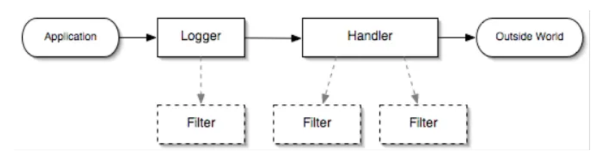
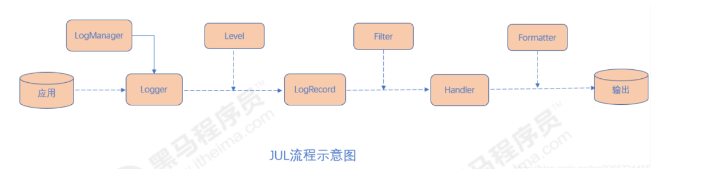
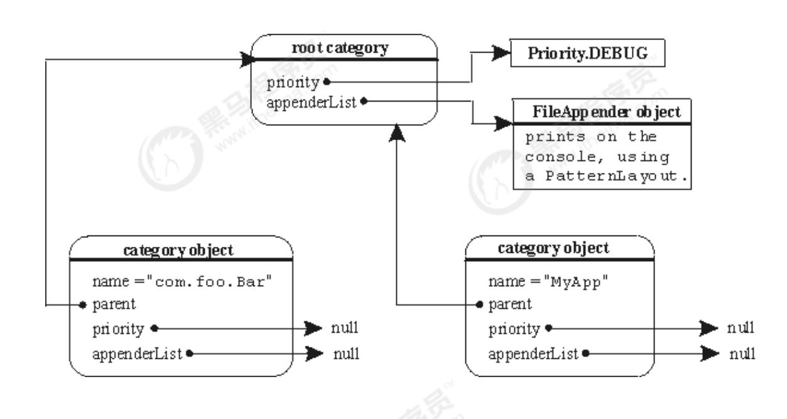
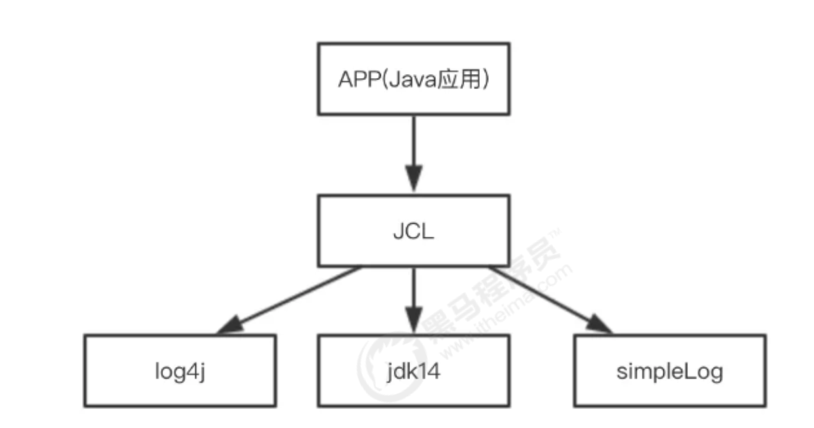
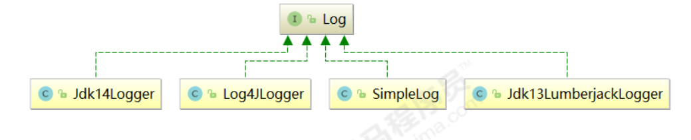
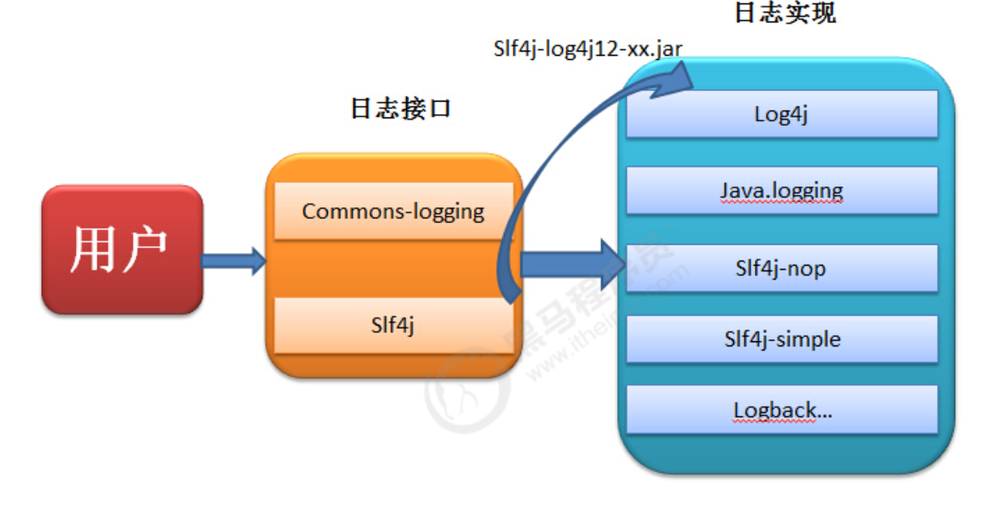
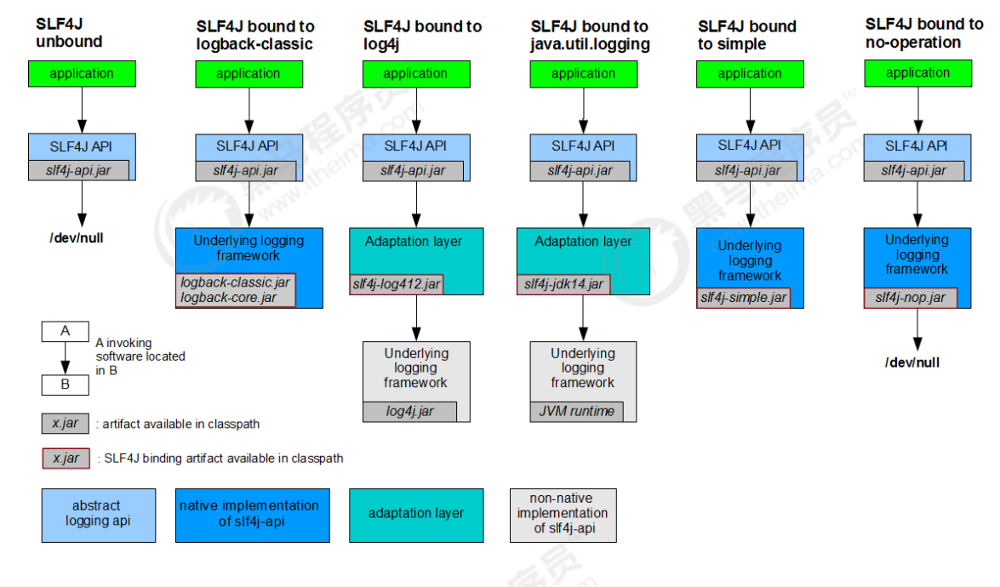
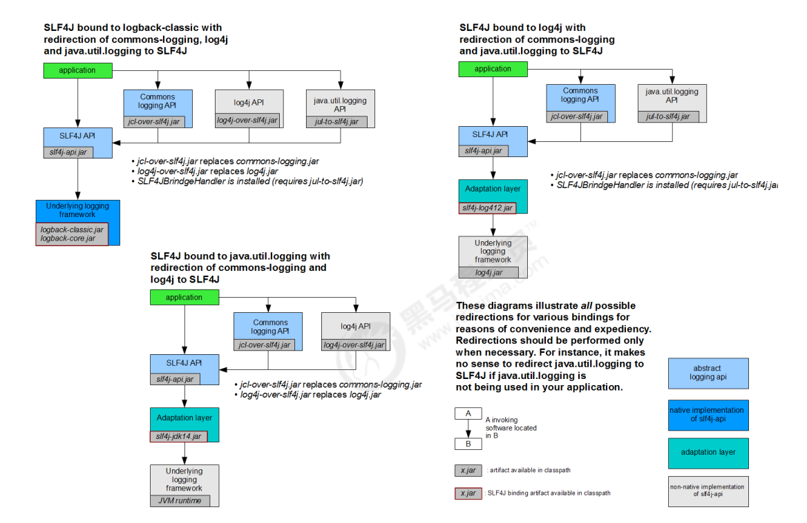
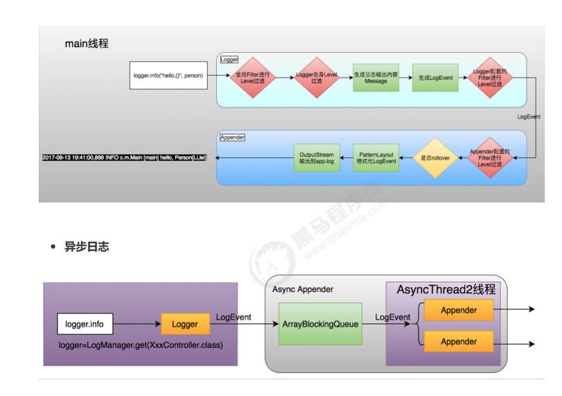
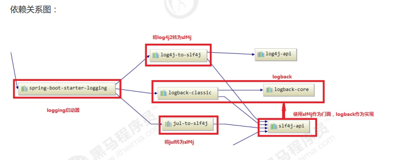

# 1.日志的概念

## 1.1 日志文件

**日志文件是用于记录系统操作事件的文件集合，**可分为事件日志和消息日志。具有处理历史数据、诊断问题的追踪以及理解系统的活动等重要作用。

在计算机中，日志文件是记录在操作系统或其它软件运行中发生的事件火灾通信软件的不同用户之间的消息的文件。记录是保持日志的行为。在最简单的情况下，消息被写入单个日志文件。

许多操作系统，日志框架和程序包括日志系统。广泛使用的日志记录标准是在英特网工程任务组RFC5424中定义的syslog。syslog标准是专用的标准化子系统能够生成，过滤，记录和分析日志消息。

### 1.1.1 调试日志

  软件开发中，我们经常需要去调试程序，做一些信息，状态的输出便于我们查询程序的运行状况。为了让我们能够更加灵活和方便的控制这些调试的信息，所以我们需要专业的日志技术。java中寻找bug会需要重现。调试也就是debug可以在程序运行中暂停程序运行，可以查看程序在运行中的情况。日志主要是为了更方便的去重现问题。

### 1.1.2 系统日志

系统日志是记录系统中硬件、软件和系统问题的信息，同时还可以监视系统中发生的事件。用户可以通过它赖检查错误发生的原因，或者寻找受到攻击时攻击者留下的痕迹。系统日志包括系统日志、应用程序日志和安全日志。

#### 系统日志的价值

系统日志策略可以在故障刚刚发生时就向你发送警告信息，系统日志帮助你在最短的时间内发现问题。
系统日志是一种非常关键的组件，因为系统日志可以让你充分了解自己的环境。这种系统日志信息对于
决定故障的根本原因或者缩小系统攻击范围来说是非常关键的，因为系统日志可以让你了解故障或者袭
击发生之前的所有事件。为虚拟化环境制定一套良好的系统日志策略也是至关重要的，因为系统日志需
要和许多不同的外部组件进行关联。良好的系统日志可以防止你从错误的角度分析问题，避免浪费宝贵
的排错时间。另外一种原因是借助于系统日志，管理员很有可能会发现一些之前从未意识到的问题，在
几乎所有刚刚部署系统日志的环境当中。  


# 2.java日志框架

## 2.1 为什么要用日志框架

因为软件系统发展到今天已经很复杂了，特别是服务器端软件，涉及到的知识，内容，问题太多。在某
些方面使用别人成熟的框架，就相当于让别人帮你完成一些基础工作，你只需要集中精力完成系统的业
务逻辑设计。而且框架一般是成熟，稳健的，他可以处理系统很多细节问题，比如，事务处理，安全
性，数据流控制等问题。还有框架一般都经过很多人使用，所以结构很好，所以扩展性也很好，而且它
是不断升级的，你可以直接享受别人升级代码带来的好处。  


## 2.2 现有的日志框架

JUL(java util logging)、logback、log4j、log4j2

jCL(jakarta Commons Logging)、slf4j（simple Logging facade for java）

日志门面
JCL、slf4j

日志实现
JUL、logback、log4j、log4j2  


# 3.JUL学习

JUL全称Java util Logging是java原生的日志框架，使用时不需要另外引用第三方类库，相对其他日志框
架使用方便，学习简单，能够在小型应用中灵活使用。  


## 3.1 JUL入门

### 3.1.1 架构介绍



- Loggers：被称为记录器，应用程序通过获取Logger对象，调用其API来来发布日志信息。Logger
  通常是应用程序访问日志系统的入口程序。
- Appenders：也被称为Handlers，每个Logger都会关联一组Handlers，Logger会将日志交给关联
  Handlers处理，由Handlers负责将日志做记录。Handlers在此是一个抽象，其具体的实现决定了
  日志记录的位置可以是控制台、文件、网络上的其他日志服务或操作系统日志等。
- Layouts：也被称为Formatters，它负责对日志事件中的数据进行转换和格式化。Layouts决定了
  数据在一条日志记录中的最终形式。
- Level：每条日志消息都有一个关联的日志级别。该级别粗略指导了日志消息的重要性和紧迫，我
  可以将Level和Loggers，Appenders做关联以便于我们过滤消息。
- Filters：过滤器，根据需要定制哪些信息会被记录，哪些信息会被放过。

总结一下就是：

用户使用Logger来进行日志记录，Logger持有若干个Handler，日志的输出操作是由Handler完成的。
在Handler在输出日志前，会经过Filter的过滤，判断哪些日志级别过滤放行哪些拦截，Handler会将日
志内容输出到指定位置（日志文件、控制台等）。Handler在输出日志时会使用Layout，将输出内容进
行排版。  


### 3.1.2 入门案例

```java
public class JULTest {
@Test
public void testQuick() throws Exception {
// 1.创建日志记录器对象
Logger logger = Logger.getLogger("com.itheima.log.JULTest");
// 2.日志记录输出
logger.info("hello jul");
logger.log(Level.INFO, "info msg");
String name = "jack";
Integer age = 18;
logger.log(Level.INFO, "用户信息：{0},{1}", new Object[]{name, age});
}
}
```


## 3.2 日志的级别

jul中定义的日志级别，默认是info以上的级别

```
* java.util.logging.Level中定义了日志的级别：
    SEVERE（最高值）
    WARNING
    INFO （默认级别）
    CONFIG
    FINE
    FINER
    FINEST（最低值）
* 还有两个特殊的级别：
    OFF，可用来关闭日志记录。
    ALL，启用所有消息的日志记录。
```

```java
@Test
public void testLogLevel() throws Exception {
    // 1.获取日志对象
    Logger logger = Logger.getLogger("com.itheima.log.QuickTest");
    // 2.日志记录输出
    logger.severe("severe");
    logger.warning("warning");
    logger.info("info");
    logger.config("cofnig");
    logger.fine("fine");
    logger.finer("finer");
    logger.finest("finest");
}
```


自定义日志级别的配置

```java
 @Test
    public void testLogConfig() throws IOException {
        //1.创建日志记录器对象
        Logger logger = Logger.getLogger("JULTest");

        //一、自定义日志级别
        // a.关闭系统默认配置
        logger.setUseParentHandlers(false);

        //b.创建handler对象
        ConsoleHandler consoleHandler = new ConsoleHandler();
        //c.创建formatter对象
        SimpleFormatter simpleFormatter = new SimpleFormatter();
        //d.进行关联
        consoleHandler.setFormatter(simpleFormatter);
        logger.addHandler(consoleHandler);

        //e.设置日志级别
        logger.setLevel(Level.ALL);
        consoleHandler.setLevel(Level.ALL);

        FileHandler fileHandler = new FileHandler("D:/1.log");
        fileHandler.setFormatter(simpleFormatter);
        logger.addHandler(fileHandler);

        logger.severe("severe");
        logger.warning("warning");
        logger.info("info");
        logger.config("config");
        logger.fine("fine");
        logger.finer("finer");
        logger.finest("finest");
    }
```


## 3.3 Logger之间的父子关系

JUL中logger之间存在父子关系，这种父子关系通过树状结构存储，JUL在初始化时会创建一个顶层RootLogger作为所有Logger父Logger，存储上作为树状结构的根节点。并父子关系通过路径来关联。

```java
  @Test
    public void testLogParent(){
        Logger logger1 = Logger.getLogger("com.itheima.log");
        Logger logger2 = Logger.getLogger("com.itheima");

        System.out.println(logger1.getParent() == logger2);
        System.out.println("logger2 parent:" + logger2.getParent() + ".name" + logger2.getParent().getName());

        logger2.setUseParentHandlers(false);
        ConsoleHandler consoleHandler = new ConsoleHandler();
        SimpleFormatter simpleFormatter = new SimpleFormatter();

        consoleHandler.setFormatter(simpleFormatter);
        logger2.addHandler(consoleHandler);

        logger2.setLevel(Level.ALL);
        consoleHandler.setLevel(Level.ALL);

        logger1.severe("severe");
        logger1.warning("warning");
        logger1.info("info");
        logger1.config("config");
        logger1.fine("fine");
        logger1.finer("finer");
        logger1.finest("finest");
    }
```


## 3.4 日志的配置文件

默认的配置文件路径$JAVAHOME\jre\lib\logging.properties

```java
@Test
public void testProperties() throws Exception {
    // 读取自定义配置文件
    InputStream in =
    JULTest.class.getClassLoader().getResourceAsStream("logging.properties");
    // 获取日志管理器对象
    LogManager logManager = LogManager.getLogManager();
    // 通过日志管理器加载配置文件
    logManager.readConfiguration(in);
    Logger logger = Logger.getLogger("com.itheima.log.JULTest");
    logger.severe("severe");
    logger.warning("warning");
    logger.info("info");
    logger.config("config");
    logger.fine("fine");
    logger.finer("finer");
    logger.finest("finest");
}
```

配置文件

```
#
# RootLogger使用的处理器（获取时设置）
handlers= java.util.logging.ConsoleHandler
# RootLogger日志等级
.level= INFO


## 自定义Logger
com.itheima.handlers= java.util.logging.FileHandler
# 自定义Logger日志等级
com.itheima.level= INFO
# 忽略父日志设置
com.itheima.useParentHandlers=false


## 控制台处理器
# 输出日志级别
java.util.logging.ConsoleHandler.level = INFO
# 输出日志格式
java.util.logging.ConsoleHandler.formatter = java.util.logging.SimpleFormatter


## 文件处理器
# 输出日志级别
java.util.logging.FileHandler.level=INFO
# 输出日志格式
java.util.logging.FileHandler.formatter = java.util.logging.SimpleFormatter
# 输出日志文件路径
java.util.logging.FileHandler.pattern = /java%u.log
# 输出日志文件限制大小（50000字节）
java.util.logging.FileHandler.limit = 50000
# 输出日志文件限制个数
java.util.logging.FileHandler.count = 10
# 输出日志文件 是否是追加
java.util.logging.FileHandler.append=true
```


## 3.5 日志原理的解析


1.初始化LogManager

 	1. LogManager加载logging.properties配置
 	2. 添加Logger到LogManager

2.从单例LogManager获取logger

3.设置级别Level，并指定日志记录LogRecord

4.filter提供了日志级别之外更细粒度的控制

5.handler是用来处理日志输出位置

6.Formatter是用来格式化LogRecord的




# 4.LOG4j的学习

Log4j是Apache下的一款开源的日志框架，通过在项目中使用 Log4J，我们可以控制日志信息输出到控
制台、文件、甚至是数据库中。我们可以控制每一条日志的输出格式，通过定义日志的输出级别，可以
更灵活的控制日志的输出过程。方便项目的调试。
官方网站： http://logging.apache.org/log4j/1.2/  

## 4.1 log4j入门

1. 建立maven工程
2. 添加依赖  

```xml
<dependencies>
<dependency>
<groupId>log4j</groupId>
<artifactId>log4j</artifactId>
<version>1.2.17</version>
</dependency>
<dependency>
<groupId>junit</groupId>
<artifactId>junit</artifactId>
<version>4.12</version>
</dependency>
</dependencies>
```

3.代码

```java
public class Log4jTest {
@Test
public void testQuick() throws Exception {
// 初始化系统配置，不需要配置文件
BasicConfigurator.configure();
// 创建日志记录器对象
Logger logger = Logger.getLogger(Log4jTest.class);
// 日志记录输出
logger.info("hello log4j");
// 日志级别
logger.fatal("fatal"); // 严重错误，一般会造成系统崩溃和终止运行
logger.error("error"); // 错误信息，但不会影响系统运行
logger.warn("warn"); // 警告信息，可能会发生问题
logger.info("info"); // 程序运行信息，数据库的连接、网络、IO操作等
logger.debug("debug"); // 调试信息，一般在开发阶段使用，记录程序的变量、参
数等
logger.trace("trace"); // 追踪信息，记录程序的所有流程信息
}
}
```

4.日志级别

```
*
每个Logger都被了一个日志级别（log level），用来控制日志信息的输出。日志级别从高到低分
为：
fatal 指出每个严重的错误事件将会导致应用程序的退出。
error 指出虽然发生错误事件，但仍然不影响系统的继续运行。
warn 表明会出现潜在的错误情形。
info 一般和在粗粒度级别上，强调应用程序的运行全程。
debug 一般用于细粒度级别上，对调试应用程序非常有帮助。
trace 是程序追踪，可以用于输出程序运行中的变量，显示执行的流程。
* 还有两个特殊的级别：
OFF，可用来关闭日志记录。
ALL，启用所有消息的日志记录
```

注：一般只使用4个级别，优先级从高到低为 ERROR > WARN > INFO > DEBUG  

## 4.2 log4j组件

Log4J 主要由 Loggers (日志记录器)、Appenders（输出端）和 Layout（日志格式化器）组成。其中
Loggers 控制日志的输出级别与日志是否输出；Appenders 指定日志的输出方式（输出到控制台、文件
等）；Layout 控制日志信息的输出格式。  

### 4.2.1 Loggers

日志记录器，负责收集处理日志记录，实例的命名就是类“XX”的full quailied name（类的全限定名），
Logger的名字大小写敏感，其命名有继承机制：例如：name为org.apache.commons的logger会继承
name为org.apache的logger。

Log4J中有一个特殊的logger叫做“root”，他是所有logger的根，也就意味着其他所有的logger都会直接
或者间接地继承自root。root logger可以用Logger.getRootLogger()方法获取。

但是，自log4j 1.2版以来， Logger 类已经取代了 Category 类。对于熟悉早期版本的log4j的人来说，
Logger 类可以被视为 Category 类的别名。  



### 4.2.2 Appenders  

Appender 用来指定日志输出到哪个地方，可以同时指定日志的输出目的地。Log4j 常用的输出目的地
有以下几种  

| 输出端类型               | 作用                                                         |
| ------------------------ | ------------------------------------------------------------ |
| ConsoleAppender          | 将日志输出到控制台                                           |
| FileAppender             | 将日志输出到文件中                                           |
| DailyRollingFileAppender | 将日志输出到一个日志文件，并且每天输出到一个新的文件         |
| RollingFileAppender      | 将日志信息输出到一个日志文件，并且指定文件的尺寸，当文件大 小达到指定尺寸时，会自动把文件改名，同时产生一个新的文件 |
| JDBCAppender             | 把日志信息保存到数据库中                                     |

### 4.2.3 Layouts

布局器 Layouts用于控制日志输出内容的格式，让我们可以使用各种需要的格式输出日志。Log4j常用
的Layouts:  

| 格式化器类型  | 作用                                                         |
| ------------- | ------------------------------------------------------------ |
| HTMLLayout    | 格式化日志输出为HTML表格形式                                 |
| SimpleLayout  | 简单的日志输出格式化，打印的日志格式为（info - message）     |
| PatternLayout | 最强大的格式化期，可以根据自定义格式输出日志，如果没有指定转换格式， 就是用默认的转换格式 |


## 4.3 Layout的格式

在 log4j.properties 配置文件中，我们定义了日志输出级别与输出端，在输出端中分别配置日志的输出
格式  

```
* log4j 采用类似 C 语言的 printf 函数的打印格式格式化日志信息，具体的占位符及其含义如下：
%m 输出代码中指定的日志信息
%p 输出优先级，及 DEBUG、INFO 等
%n 换行符（Windows平台的换行符为 "\n"，Unix 平台为 "\n"）
%r 输出自应用启动到输出该 log 信息耗费的毫秒数
%c 输出打印语句所属的类的全名
%t 输出产生该日志的线程全名
%d 输出服务器当前时间，默认为 ISO8601，也可以指定格式，如：%d{yyyy年MM月dd日
HH:mm:ss}
%l 输出日志时间发生的位置，包括类名、线程、及在代码中的行数。如：
Test.main(Test.java:10)
%F 输出日志消息产生时所在的文件名称
%L 输出代码中的行号
%% 输出一个 "%" 字符
* 可以在 % 与字符之间加上修饰符来控制最小宽度、最大宽度和文本的对其方式。如：
%5c 输出category名称，最小宽度是5，category<5，默认的情况下右对齐
%-5c 输出category名称，最小宽度是5，category<5，"-"号指定左对齐,会有空格
%.5c 输出category名称，最大宽度是5，category>5，就会将左边多出的字符截掉，<5不
会有空格
%20.30c category名称<20补空格，并且右对齐，>30字符，就从左边交远销出的字符截掉
```

## 4.4 Appender的输出

控制台，文件，数据库  

```properties
#指定日志的输出级别与输出端
log4j.rootLogger=INFO,Console
# 控制台输出配置
log4j.appender.Console=org.apache.log4j.ConsoleAppender
log4j.appender.Console.layout=org.apache.log4j.PatternLayout
log4j.appender.Console.layout.ConversionPattern=%d [%t] %-5p [%c] - %m%n
# 文件输出配置
log4j.appender.A = org.apache.log4j.DailyRollingFileAppender
#指定日志的输出路径
log4j.appender.A.File = D:/log.txt
log4j.appender.A.Append = true
#使用自定义日志格式化器
log4j.appender.A.layout = org.apache.log4j.PatternLayout
#指定日志的输出格式
log4j.appender.A.layout.ConversionPattern = %-d{yyyy-MM-dd HH:mm:ss} [%t:%r] -
[%p] %m%n
#指定日志的文件编码
log4j.appender.A.encoding=UTF-8
#mysql
log4j.appender.logDB=org.apache.log4j.jdbc.JDBCAppender
log4j.appender.logDB.layout=org.apache.log4j.PatternLayout
log4j.appender.logDB.Driver=com.mysql.jdbc.Driver
log4j.appender.logDB.URL=jdbc:mysql://localhost:3306/test
log4j.appender.logDB.User=root
log4j.appender.logDB.Password=root
log4j.appender.logDB.Sql=INSERT INTO
log(project_name,create_date,level,category,file_name,thread_name,line,all_categ
ory,message) values('itcast','%d{yyyy-MM-dd
HH:mm:ss}','%p','%c','%F','%t','%L','%l','%m')
```

```sql
CREATE TABLE `log` (
`log_id` int(11) NOT NULL AUTO_INCREMENT,
`project_name` varchar(255) DEFAULT NULL COMMENT '目项名',
`create_date` varchar(255) DEFAULT NULL COMMENT '创建时间',
`level` varchar(255) DEFAULT NULL COMMENT '优先级',
`category` varchar(255) DEFAULT NULL COMMENT '所在类的全名',
`file_name` varchar(255) DEFAULT NULL COMMENT '输出日志消息产生时所在的文件名称 ',
`thread_name` varchar(255) DEFAULT NULL COMMENT '日志事件的线程名',
`line` varchar(255) DEFAULT NULL COMMENT '号行',
`all_category` varchar(255) DEFAULT NULL COMMENT '日志事件的发生位置',
`message` varchar(4000) DEFAULT NULL COMMENT '输出代码中指定的消息',
PRIMARY KEY (`log_id`)
);
```

## 4.5 自定义Logger  

```properties
# RootLogger配置
log4j.rootLogger = trace,console
# 自定义Logger
log4j.logger.com.itheima = info,file
log4j.logger.org.apache = error
```

```java
@Test
public void testCustomLogger() throws Exception {
// 自定义 com.itheima
Logger logger1 = Logger.getLogger(Log4jTest.class);
logger1.fatal("fatal"); // 严重错误，一般会造成系统崩溃和终止运行
logger1.error("error"); // 错误信息，但不会影响系统运行
logger1.warn("warn"); // 警告信息，可能会发生问题
logger1.info("info"); // 程序运行信息，数据库的连接、网络、IO操作等
logger1.debug("debug"); // 调试信息，一般在开发阶段使用，记录程序的变量、参数等
logger1.trace("trace"); // 追踪信息，记录程序的所有流程信息
// 自定义 org.apache
Logger logger2 = Logger.getLogger(Logger.class);
logger2.fatal("fatal logger2"); // 严重错误，一般会造成系统崩溃和终止运行
logger2.error("error logger2"); // 错误信息，但不会影响系统运行
logger2.warn("warn logger2"); // 警告信息，可能会发生问题
logger2.info("info logger2"); // 程序运行信息，数据库的连接、网络、IO操作等
logger2.debug("debug logger2"); // 调试信息，一般在开发阶段使用，记录程序的变量、参
数等
logger2.trace("trace logger2"); // 追踪信息，记录程序的所有流程信息
}
```


# 5.JCL学习

全称为Jakarta Commons Logging，是Apache提供的一个通用日志API。
它是为 "所有的Java日志实现"提供一个统一的接口，它自身也提供一个日志的实现，但是功能非常常弱
（SimpleLog）。所以一般不会单独使用它。他允许开发人员使用不同的具体日志实现工具: Log4j, Jdk
自带的日志（JUL)
JCL 有两个基本的抽象类：Log(基本记录器)和LogFactory(负责创建Log实例)。  



## 5.1 JCL入门

1. 建立maven工程

2. 添加依赖

   ```
   <dependency>
   <groupId>commons-logging</groupId>
   <artifactId>commons-logging</artifactId>
   <version>1.2</version>
   </dependency> 
   ```

   

   3.入门代码

```java
public class JULTest {
@Test
public void testQuick() throws Exception {
// 创建日志对象
Log log = LogFactory.getLog(JULTest.class);
// 日志记录输出
log.fatal("fatal");
log.error("error");
log.warn("warn");
log.info("info");
log.debug("debug");
}
}
```

我们为什么要使用日志门面：

1. 面向接口开发，不再依赖具体的实现类。减少代码的耦合
2. 项目通过导入不同的日志实现类，可以灵活的切换日志框架
3. 统一API，方便开发者学习和使用  
4. 统一配置便于项目日志的管理

## 5.2 JCL配置

1.通过LogFactory动态加载Log实现类

2.日志门面支持的日志实现数组

```
private static final String[] classesToDiscover =
new String[]{"org.apache.commons.logging.impl.Log4JLogger",
"org.apache.commons.logging.impl.Jdk14Logger",
"org.apache.commons.logging.impl.Jdk13LumberjackLogger",
"org.apache.commons.logging.impl.SimpleLog"};
```


3.获取具体的日志的实现

```java
for(int i = 0; i < classesToDiscover.length && result == null; ++i) {
result = this.createLogFromClass(classesToDiscover[i], logCategory,
true);
}
```


# 6.门面日志

当我们的系统变的更加复杂的时候，我们的日志就容易发生混乱。随着系统开发的进行，可能会更新不
同的日志框架，造成当前系统中存在不同的日志依赖，让我们难以统一的管理和控制。就算我们强制要
求所有的模块使用相同的日志框架，系统中也难以避免使用其他类似spring,mybatis等其他的第三方框
架，它们依赖于我们规定不同的日志框架，而且他们自身的日志系统就有着不一致性，依然会出来日志
体系的混乱。

所以我们需要借鉴JDBC的思想，为日志系统也提供一套门面，那么我们就可以面向这些接口规范来开
发，避免了直接依赖具体的日志框架。这样我们的系统在日志中，就存在了日志的门面和日志的实现。  


常见的日志门面 ：
JCL、slf4j

常见的日志实现：
JUL、log4j、logback、log4j2  


日志门面和日志实现的关系：  



日志框架出现的历史顺序：
log4j -->JUL-->JCL--> slf4j --> logback --> log4j2  


# 7.SLF4J的使用

简单日志门面(Simple Logging Facade For Java) SLF4J主要是为了给Java日志访问提供一套标准、规范
的API框架，其主要意义在于提供接口，具体的实现可以交由其他日志框架，例如log4j和logback等。
当然slf4j自己也提供了功能较为简单的实现，但是一般很少用到。对于一般的Java项目而言，日志框架
会选择slf4j-api作为门面，配上具体的实现框架（log4j、logback等），中间使用桥接器完成桥接。  

官方网站： https://www.slf4j.org/

SLF4J是目前市面上最流行的日志门面。现在的项目中，基本上都是使用SLF4J作为我们的日志系统。
SLF4J日志门面主要提供两大功能：  

```
1.日志框架的绑定
2.日志框架的桥接
```


## 7.1 SLF4J入门

1.添加依赖

```xml
<!--slf4j core 使用slf4j必須添加-->
<dependency>
    <groupId>org.slf4j</groupId>
    <artifactId>slf4j-api</artifactId>
    <version>1.7.27</version>
</dependency>
<!--slf4j 自带的简单日志实现 -->
<dependency>
    <groupId>org.slf4j</groupId>
    <artifactId>slf4j-simple</artifactId>
    <version>1.7.27</version>
</dependency>
```

2.编写代码

```java
public class Slf4jTest {
// 声明日志对象
public final static Logger LOGGER = LoggerFactory.getLogger(Slf4jTest.class);
    @Test
    public void testQuick() throws Exception {
        //打印日志信息
        LOGGER.error("error");
        LOGGER.warn("warn");
        LOGGER.info("info");
        LOGGER.debug("debug");
        LOGGER.trace("trace");
        // 使用占位符输出日志信息
        String name = "jack";
        Integer age = 18;
        LOGGER.info("用户：{},{}", name, age);
    // 将系统异常信息写入日志
        try {
            int i = 1 / 0;
        } catch (Exception e) {
            // e.printStackTrace();
            LOGGER.info("出现异常：", e);
        }
    }
}
```


为什么要使用SLF4J作为日志门面？  

```
* 1. 使用SLF4J框架，可以在部署时迁移到所需的日志记录框架。

* 2. SLF4J提供了对所有流行的日志框架的绑定，例如log4j，JUL，Simple logging和NOP。因此可以
在部署时切换到任何这些流行的框架。

* 3. 无论使用哪种绑定，SLF4J都支持参数化日志记录消息。由于SLF4J将应用程序和日志记录框架分离，
因此可以轻松编写独立于日志记录框架的应用程序。而无需担心用于编写应用程序的日志记录框架。

* 4. SLF4J提供了一个简单的Java工具，称为迁移器。使用此工具，可以迁移现有项目，这些项目使用日志
框架(如Jakarta Commons Logging(JCL)或log4j或Java.util.logging(JUL))到SLF4J。
```


## 7.2 绑定日志的实现（Binding）

1. 如前所述，SLF4J支持各种日志框架。SLF4J发行版附带了几个称为“SLF4J绑定”的jar文件，每个绑定对应
   一个受支持的框架。
   **使用slf4j的日志绑定流程:**

   1. 添加slf4j-api的依赖;

   2. 使用slf4j的api在项目中进行统一的日志记录

   3. 绑定具体的日志实现框架
      1. 绑定已经实现了slf4j的日志框架，直接添加对应依赖；
      2. 绑定没有实现sfl4j的日志框架，先添加日志的适配器，再添加实现类的依赖；

   4. slf4j有且只有一个日志实现框架的绑定（如果出现多个默认使用第一个依赖日志实现）


**通过maven引入常见的日志实现框架：**

```xml
<!--slf4j core 使用slf4j必須添加-->
<dependency>
    <groupId>org.slf4j</groupId>
    <artifactId>slf4j-api</artifactId>
    <version>1.7.27</version>
</dependency>
<!-- log4j-->
<dependency>
    <groupId>org.slf4j</groupId>
    <artifactId>slf4j-log4j12</artifactId>
    <version>1.7.27</version>
</dependency>
<dependency>
    <groupId>log4j</groupId>
    <artifactId>log4j</artifactId>
    <version>1.2.17</version>
</dependency>
<!-- jul -->
<dependency>
    <groupId>org.slf4j</groupId>
    <artifactId>slf4j-jdk14</artifactId>
    <version>1.7.27</version>
</dependency>
<!--jcl -->
<dependency>
    <groupId>org.slf4j</groupId>
    <artifactId>slf4j-jcl</artifactId>
    <version>1.7.27</version>
</dependency>
<!-- nop -->
<dependency>
    <groupId>org.slf4j</groupId>
    <artifactId>slf4j-nop</artifactId>
    <version>1.7.27</version>
</dependency>
```


要切换日志框架，只需替换类路径上的slf4j绑定。例如，要从java.util.logging切换到log4j，只需将
slf4j-jdk14-1.7.27.jar替换为slf4j-log4j12-1.7.27.jar即可。

SLF4J不依赖于任何特殊的类装载。实际上，每个SLF4J绑定在编译时都是硬连线的， 以使用一个且只有
一个特定的日志记录框架。例如，slf4j-log4j12-1.7.27.jar绑定在编译时绑定以使用log4j。在您的代码
中，除了*slf4j-api-1.7.27.jar*之外，您只需将您选择的**一个且只有一个**绑定放到相应的类路径位置。不要
在类路径上放置多个绑定。以下是一般概念的图解说明。  



## 7.3 桥接旧的日志框架

通常，您依赖的某些组件依赖于SLF4J以外的日志记录API。您也可以假设这些组件在不久的将来不会切
换到SLF4J。为了解决这种情况，SLF4J附带了几个桥接模块，这些模块将对log4j，JCL和
java.util.logging API的调用重定向，就好像它们是对SLF4J API一样。  

桥接解决的是项目中日志的遗留问题，当系统中存在之前的日志API，可以通过桥接转换到slf4j的实现

1. 先去除之前老的日志框架的依赖
2. 添加SLF4J提供的桥接组件

3. 为项目添加SLF4J的具体实现  



迁移的方式：

如果我们要使用SLF4J的桥接器，替换原有的日志框架，那么我们需  

```xml
<!-- log4j-->
<dependency>
    <groupId>org.slf4j</groupId>
    <artifactId>log4j-over-slf4j</artifactId>
    <version>1.7.27</version>
</dependency>
<!-- jul -->
<dependency>
    <groupId>org.slf4j</groupId>
    <artifactId>jul-to-slf4j</artifactId>
    <version>1.7.27</version>
</dependency>
<!--jcl -->
<dependency>
    <groupId>org.slf4j</groupId>
    <artifactId>jcl-over-slf4j</artifactId>
    <version>1.7.27</version>
</dependency>
```

**注意问题：**

1. jcl-over-slf4j.jar和 *slf4j-jcl.jar*不能同时部署。前一个jar文件将导致JCL将日志系统的选择委托给
   SLF4J，后一个jar文件将导致SLF4J将日志系统的选择委托给JCL，从而导致无限循环。
2. log4j-over-slf4j.jar和slf4j-log4j12.jar不能同时出现  

4. 所有的桥接都只对Logger日志记录器对象有效，如果程序中调用了内部的配置类或者是
   Appender,Filter等对象，将无法产生效果。  


## 7.4 SLF4J原理解析

1. SLF4J通过LoggerFactory加载日志具体的实现对象。
2. LoggerFactory在初始化的过程中，会通过performInitialization()方法绑定具体的日志实现。
3. 在绑定具体实现的时候，通过类加载器，加载org/slf4j/impl/StaticLoggerBinder.class
4. 所以，只要是一个日志实现框架，在org.slf4j.impl包中提供一个自己的StaticLoggerBinder类，在
   其中提供具体日志实现的LoggerFactory就可以被SLF4J所加载  


# 8.Logback的使用

Logback是由log4j创始人设计的另一个开源日志组件，性能比log4j要好。
官方网站：https://logback.qos.ch/index.html

Logback主要分为三个模块：

​    logback-core：其它两个模块的基础模块
​	logback-classic：它是log4j的一个改良版本，同时它完整实现了slf4j API
​	logback-access：访问模块与Servlet容器集成提供通过Http来访问日志的功能

后续的日志代码都是通过SLF4J日志门面搭建日志系统，所以在代码是没有区别，主要是通过修改配置
文件和pom.xml依赖  


## 8.1 logback入门

1.添加依赖

```xml
<dependency>
    <groupId>org.slf4j</groupId>
    <artifactId>slf4j-api</artifactId>
    <version>1.7.25</version>
</dependency>
<dependency>
    <groupId>ch.qos.logback</groupId>
    <artifactId>logback-classic</artifactId>
    <version>1.2.3</version>
</dependency>
```


2.java代码

```java
//定义日志对象
public final static Logger LOGGER = LoggerFactory.getLogger(LogBackTest.class);
    @Test
    public void testSlf4j(){
        //打印日志信息
        LOGGER.error("error");
        LOGGER.warn("warn");
        LOGGER.info("info");
        LOGGER.debug("debug");
        LOGGER.trace("trace");
    }
```


## 8.2 logback配置

logback会依次读取以下类型配置文件：

​	logback.groovy
​	logback-test.xml
​	logback.xml 如果均不存在会采用默认配置

1. logback组件之间的关系
	1. Logger:日志的记录器，把它关联到应用的对应的context上后，主要用于存放日志对象，也
可以定义日志类型、级别。
	2. Appender:用于指定日志输出的目的地，目的地可以是控制台、文件、数据库等等。
	3.  Layout:负责把事件转换成字符串，格式化的日志信息的输出。在logback中Layout对象被封
	   装在encoder中。基本配置信息  

​    2.基本配置信息

```xml
<?xml version="1.0" encoding="UTF-8"?>
<configuration>
    <!--
    日志输出格式：
        %-5level
        %d{yyyy-MM-dd HH:mm:ss.SSS}日期
        %c类的完整名称
        %M为method
        %L为行号
        %thread线程名称
        %m或者%msg为信息
        %n换行
    -->
	<!--格式化输出：%d表示日期，%thread表示线程名，%-5level：级别从左显示5个字符宽度
%msg：日志消息，%n是换行符-->
	<property name="pattern" value="%d{yyyy-MM-dd HH:mm:ss.SSS} %c [%thread]
%-5level %msg%n"/>
    <!--
        Appender: 设置日志信息的去向,常用的有以下几个
            ch.qos.logback.core.ConsoleAppender (控制台)
            ch.qos.logback.core.rolling.RollingFileAppender (文件大小到达指定尺
            寸的时候产生一个新文件)
            ch.qos.logback.core.FileAppender (文件)
    -->
    <appender name="console" class="ch.qos.logback.core.ConsoleAppender">
        <!--输出流对象 默认 System.out 改为 System.err-->
        <target>System.err</target>
        <!--日志格式配置-->
        <encoder class="ch.qos.logback.classic.encoder.PatternLayoutEncoder">
        	<pattern>${pattern}</pattern>
        </encoder>
    </appender>
    <!--
        用来设置某一个包或者具体的某一个类的日志打印级别、以及指定<appender>。
        <loger>仅有一个name属性，一个可选的level和一个可选的addtivity属性
        name:
        	用来指定受此logger约束的某一个包或者具体的某一个类。
        level:
        	用来设置打印级别，大小写无关：TRACE, DEBUG, INFO, WARN, ERROR, ALL 和
        OFF，
        	如果未设置此属性，那么当前logger将会继承上级的级别。
        additivity:
        	是否向上级loger传递打印信息。默认是true。
        <logger>可以包含零个或多个<appender-ref>元素，标识这个appender将会添加到这个
        logger
        -->
        <!--
        也是<logger>元素，但是它是根logger。默认debug
        level:用来设置打印级别，大小写无关：TRACE, DEBUG, INFO, WARN, ERROR, ALL
        和 OFF，
        <root>可以包含零个或多个<appender-ref>元素，标识这个appender将会添加到这个
        logger。
    -->
    <root level="ALL">
    	<appender-ref ref="console"/>
    </root>
</configuration>
```


3.fileAppender配置

```xml
<?xml version="1.0" encoding="UTF-8"?>
<configuration>
    <!-- 自定义属性 可以通过${name}进行引用-->
    <property name="pattern" value="[%-5level] %d{yyyy-MM-dd HH:mm:ss} %c %M
    %L [%thread] %m %n"/>
    <!--
        日志输出格式：
        %d{pattern}日期
        %m或者%msg为信息
        %M为method
        %L为行号
        %c类的完整名称
        %thread线程名称
        %n换行
        %-5level
     -->
    <!-- 日志文件存放目录 -->
	<property name="log_dir" value="d:/logs"></property>
	
    <!--控制台输出appender对象-->
	<appender name="console" class="ch.qos.logback.core.ConsoleAppender">
        <!--输出流对象 默认 System.out 改为 System.err-->
        <target>System.err</target>
        <!--日志格式配置-->
        <encoder class="ch.qos.logback.classic.encoder.PatternLayoutEncoder">
        	<pattern>${pattern}</pattern>
		</encoder>
	</appender>
    
	<!--日志文件输出appender对象-->
    <appender name="file" class="ch.qos.logback.core.FileAppender">
        <!--日志格式配置-->
        <encoder class="ch.qos.logback.classic.encoder.PatternLayoutEncoder">
        	<pattern>${pattern}</pattern>
        </encoder>
        <!--日志输出路径-->
        <file>${log_dir}/logback.log</file>
    </appender>

    <!-- 生成html格式appender对象 -->
	<appender name="htmlFile" class="ch.qos.logback.core.FileAppender">
        <!--日志格式配置-->
        <encoder class="ch.qos.logback.core.encoder.LayoutWrappingEncoder">
            <layout class="ch.qos.logback.classic.html.HTMLLayout">
            	<pattern>%level%d{yyyy-MM-dd HH:mm:ss}%c%M%L%thread%m</pattern>
            </layout>
        </encoder>
        <!--日志输出路径-->
        <file>${log_dir}/logback.html</file>
	</appender>
    
    <!--RootLogger对象-->
    <root level="all">
        <appender-ref ref="console"/>
        <appender-ref ref="file"/>
        <appender-ref ref="htmlFile"/>
    </root>
</configuration>
```


4.RollingFileAppender配置

```xml
<?xml version="1.0" encoding="UTF-8"?>
<configuration>
    <!-- 自定义属性 可以通过${name}进行引用-->
    <property name="pattern" value="[%-5level] %d{yyyy-MM-dd HH:mm:ss} %c %M
%L [%thread] %m %n"/>
    <!--
    日志输出格式：
    %d{pattern}日期
    %m或者%msg为信息
    %M为method
    %L为行号
    %c类的完整名称
    %thread线程名称
    %n换行
    %-5level
    -->
    <!-- 日志文件存放目录 -->
    <property name="log_dir" value="d:/logs"></property>
    <!--控制台输出appender对象-->
    <appender name="console" class="ch.qos.logback.core.ConsoleAppender">
        <!--输出流对象 默认 System.out 改为 System.err-->
        <target>System.err</target>
        <!--日志格式配置-->
        <encoder
                class="ch.qos.logback.classic.encoder.PatternLayoutEncoder">
            <pattern>${pattern}</pattern>
        </encoder>
    </appender>
    <!-- 日志文件拆分和归档的appender对象-->
    <appender name="rollFile"
              class="ch.qos.logback.core.rolling.RollingFileAppender">
        <!--日志格式配置-->
        <encoder
                class="ch.qos.logback.classic.encoder.PatternLayoutEncoder">
            <pattern>${pattern}</pattern>
        </encoder>
        <!--日志输出路径-->
        <file>${log_dir}/roll_logback.log</file>
        <!--指定日志文件拆分和压缩规则-->
        <rollingPolicy
                class="ch.qos.logback.core.rolling.SizeAndTimeBasedRollingPolicy">
            <!--通过指定压缩文件名称，来确定分割文件方式-->
            <fileNamePattern>${log_dir}/rolling.%d{yyyy-MMdd}.log%i.gz</fileNamePattern>
            <!--文件拆分大小-->
            <maxFileSize>1MB</maxFileSize>
        </rollingPolicy>
    </appender>
    <!--RootLogger对象-->
    <root level="all">
        <appender-ref ref="console"/>
        <appender-ref ref="rollFile"/>
    </root>
</configuration>
```


5.Filter和异步日志配置

```xml
<?xml version="1.0" encoding="UTF-8"?>
<configuration>
    <!-- 自定义属性 可以通过${name}进行引用-->
    <property name="pattern" value="[%-5level] %d{yyyy-MM-dd HH:mm:ss} %c %M
%L [%thread] %m %n"/>
    <!--
    日志输出格式：
    %d{pattern}日期
    %m或者%msg为信息
    %M为method
    %L为行号
    %c类的完整名称
    %thread线程名称
    %n换行
    %-5level
    -->
    <!-- 日志文件存放目录 -->
    <property name="log_dir" value="d:/logs/"></property>
    <!--控制台输出appender对象-->
    <appender name="console" class="ch.qos.logback.core.ConsoleAppender">
        <!--输出流对象 默认 System.out 改为 System.err-->
        <target>System.err</target>
        <!--日志格式配置-->
        <encoder
                class="ch.qos.logback.classic.encoder.PatternLayoutEncoder">
            <pattern>${pattern}</pattern>
        </encoder>
    </appender>
    <!-- 日志文件拆分和归档的appender对象-->
    <appender name="rollFile"
              class="ch.qos.logback.core.rolling.RollingFileAppender">
        <!--日志格式配置-->
        <encoder
                class="ch.qos.logback.classic.encoder.PatternLayoutEncoder">
            <pattern>${pattern}</pattern>
        </encoder>
        <!--日志输出路径-->
        <file>${log_dir}roll_logback.log</file>
        <!--指定日志文件拆分和压缩规则-->
        <rollingPolicy
                class="ch.qos.logback.core.rolling.SizeAndTimeBasedRollingPolicy">
            <!--通过指定压缩文件名称，来确定分割文件方式-->
            <fileNamePattern>${log_dir}rolling.%d{yyyy-MMdd}.log%i.gz</fileNamePattern>
            <!--文件拆分大小-->
            <maxFileSize>1MB</maxFileSize>
        </rollingPolicy>
        <!--filter配置-->
        <filter class="ch.qos.logback.classic.filter.LevelFilter">
            <!--设置拦截日志级别-->
            <level>error</level>
            <onMatch>ACCEPT</onMatch>
            <onMismatch>DENY</onMismatch>
        </filter>
    </appender>
    <!--异步日志-->
    <appender name="async" class="ch.qos.logback.classic.AsyncAppender">
        <appender-ref ref="rollFile"/>
    </appender>
    <!--RootLogger对象-->
    <root level="all">
        <appender-ref ref="console"/>
        <appender-ref ref="async"/>
    </root>
    <!--自定义logger additivity表示是否从 rootLogger继承配置-->
    <logger name="com.itheima" level="debug" additivity="false">
        <appender-ref ref="console"/>
    </logger>
</configuration>
```


官方提供的log4j.properties转换成logback.xml
https://logback.qos.ch/translator/  


## 8.3 logback-access的使用

logback-access模块与Servlet容器（如Tomcat和Jetty）集成，以提供HTTP访问日志功能。我们可以使
用logback-access模块来替换tomcat的访问日志。  


1.将logback-access.jar 与logback-core.jar复制到$TOMCAT_HOME/lib/目录下

2.修改$TOMCAT_HOME/conf/server.xml中的Host元素中添加：

```
<Valve className="ch.qos.logback.access.tomcat.LogbackValve" />
```

3.logback默认会在$TOMCAT_HOME/conf 下查找文件logback-access.xml

```xml
<?xml version="1.0" encoding="UTF-8"?>
<configuration>
    <!-- always a good activate OnConsoleStatusListener -->
    <statusListener
            class="ch.qos.logback.core.status.OnConsoleStatusListener"/>
    <property name="LOG_DIR" value="${catalina.base}/logs"/>
    <appender name="FILE"
              class="ch.qos.logback.core.rolling.RollingFileAppender">
        <file>${LOG_DIR}/access.log</file>
        <rollingPolicy
                class="ch.qos.logback.core.rolling.TimeBasedRollingPolicy">
            <fileNamePattern>access.%d{yyyy-MM-dd}.log.zip</fileNamePattern>
        </rollingPolicy>
        <encoder>
            <!-- 访问日志的格式 -->
            <pattern>combined</pattern>
        </encoder>
    </appender>
    <appender-ref ref="FILE"/>
</configuration>
```

# 9.log4j2的使用

Apache Log4j 2是对Log4j的升级版，参考了logback的一些优秀的设计，并且修复了一些问题，因此带
来了一些重大的提升，主要有：

异常处理，在logback中，Appender中的异常不会被应用感知到，但是在log4j2中，提供了一些异
常处理机制。

性能提升， log4j2相较于log4j 和logback都具有很明显的性能提升，后面会有官方测试的数据。

自动重载配置，参考了logback的设计，当然会提供自动刷新参数配置，最实用的就是我们在生产
上可以动态的修改日志的级别而不需要重启应用。

无垃圾机制，log4j2在大部分情况下，都可以使用其设计的一套无垃圾机制，避免频繁的日志收集
导致的jvm gc。 

## 9.1 Log4j2入门

目前市面上最主流的日志门面就是SLF4J，虽然Log4j2也是日志门面，因为它的日志实现功能非常强
大，性能优越。所以大家一般还是将Log4j2看作是日志的实现，Slf4j + Log4j2应该是未来的大势所趋。  

添加依赖

```xml
<!-- Log4j2 门面API-->
<dependency>
    <groupId>org.apache.logging.log4j</groupId>
    <artifactId>log4j-api</artifactId>
    <version>2.11.1</version>
</dependency>
<!-- Log4j2 日志实现 -->
<dependency>
    <groupId>org.apache.logging.log4j</groupId>
    <artifactId>log4j-core</artifactId>
    <version>2.11.1</version>
</dependency>
```

2.java代码

```
public class Log4j2Test{
    // 定义日志记录器对象
    public static final Logger LOGGER = LogManager.getLogger(Log4j2Test.class);
    @Test
    public void testQuick() throws Exception {
        LOGGER.fatal("fatal");
        LOGGER.error("error");
        LOGGER.warn("warn");
        LOGGER.info("info");
        LOGGER.debug("debug");
        LOGGER.trace("trace");
    }
}
```

3.使用slf4j作为日志的门面，使用log4j2作为日志的实现

```xml
<
!-- Log4j2 门面API-->
<dependency>
    <groupId>org.apache.logging.log4j</groupId>
    <artifactId>log4j-api</artifactId>
    <version>2.11.1</version>
</dependency>
<!-- Log4j2 日志实现 -->
<dependency>	
    <groupId>org.apache.logging.log4j</groupId>
    <artifactId>log4j-core</artifactId>
    <version>2.11.1</version>
</dependency>
<!--使用slf4j作为日志的门面,使用log4j2来记录日志 -->
<dependency>
    <groupId>org.slf4j</groupId>
    <artifactId>slf4j-api</artifactId>
    <version>1.7.25</version>
</dependency>
<!--为slf4j绑定日志实现 log4j2的适配器 -->
<dependency>
    <groupId>org.apache.logging.log4j</groupId>
    <artifactId>log4j-slf4j-impl</artifactId>
    <version>2.10.0</version>
</dependency>
```


## 9.2 log4j2配置

log4j2默认加载classpath下的 log4j2.xml 文件中的配置  

```xml
<?xml version="1.0" encoding="UTF-8"?>
<Configuration status="warn" monitorInterval="5">
    <properties>
        <property name="LOG_HOME">D:/logs</property>
    </properties>
    <Appenders>
        <Console name="Console" target="SYSTEM_OUT">
            <PatternLayout pattern="%d{HH:mm:ss.SSS} [%t] [%-5level] %c{36}:%L -
        -- %m%n" />
        </Console>
        <File name="file" fileName="${LOG_HOME}/myfile.log">
            <PatternLayout pattern="[%d{yyyy-MM-dd HH:mm:ss.SSS}] [%-5level] %l
        %c{36} - %m%n" />
        </File>
        <RandomAccessFile name="accessFile" fileName="${LOG_HOME}/myAcclog.log">
            <PatternLayout pattern="[%d{yyyy-MM-dd HH:mm:ss.SSS}] [%-5level] %l
        %c{36} - %m%n" />
        </RandomAccessFile>
        <RollingFile name="rollingFile" fileName="${LOG_HOME}/myrollog.log"
                     filePattern="D:/logs/$${date:yyyy-MM-dd}/myrollog-%d{yyyyMM-dd-HH-mm}-%i.log">
            <ThresholdFilter level="debug" onMatch="ACCEPT" onMismatch="DENY" />
            <PatternLayout pattern="[%d{yyyy-MM-dd HH:mm:ss.SSS}] [%-5level] %l
        %c{36} - %msg%n" />
            <Policies>
                <OnStartupTriggeringPolicy />
                <SizeBasedTriggeringPolicy size="10 MB" />
                <TimeBasedTriggeringPolicy />
            </Policies>
            <DefaultRolloverStrategy max="30" />
        </RollingFile>
    </Appenders>
    <Loggers>
        <Root level="trace">
            <AppenderRef ref="Console" />
        </Root>
    </Loggers>
</Configuration>
```


## 9.3 Log4j2异步日志

异步日志

log4j2最大的特点就是异步日志，其性能的提升主要也是从异步日志中受益，我们来看看如何使用
log4j2的异步日志。  

同步日志



Log4j2提供了两种实现日志的方式，一个是通过AsyncAppender，一个是通过AsyncLogger，分别对应
前面我们说的Appender组件和Logger组件。

注意：配置异步日志需要添加依赖  

```
<!--异步日志依赖-->
<dependency>
    <groupId>com.lmax</groupId>
    <artifactId>disruptor</artifactId>
    <version>3.3.4</version>
</dependency>
```

AsyncAppender方式  

```xml
<?xml version="1.0" encoding="UTF-8"?>
<Configuration status="warn">
    <properties>
        <property name="LOG_HOME">D:/logs</property>
    </properties>
    <Appenders>
        <File name="file" fileName="${LOG_HOME}/myfile.log">
            <PatternLayout>
                <Pattern>%d %p %c{1.} [%t] %m%n</Pattern>
            </PatternLayout>
        </File>
        <Async name="Async">
            <AppenderRef ref="file"/>
        </Async>
    </Appenders>
    <Loggers>
        <Root level="error">
            <AppenderRef ref="Async"/>
        </Root>
    </Loggers>
</Configuration>
```

AsyncLogger方式
AsyncLogger才是log4j2 的重头戏，也是官方推荐的异步方式。它可以使得调用Logger.log返回的
更快。你可以有两种选择：全局异步和混合异步。  

全局异步就是，所有的日志都异步的记录，在配置文件上不用做任何改动，只需要添加一个
log4j2.component.properties 配置；  

```
Log4jContextSelector=org.apache.logging.log4j.core.async.AsyncLoggerCon
textSelector
```


混合异步就是，你可以在应用中同时使用同步日志和异步日志，这使得日志的配置方式更加
灵活  

```xml
<?xml version="1.0" encoding="UTF-8"?>
<Configuration status="WARN">
    <properties>
        <property name="LOG_HOME">D:/logs</property>
    </properties>
    <Appenders>
        <File name="file" fileName="${LOG_HOME}/myfile.log">
            <PatternLayout>
                <Pattern>%d %p %c{1.} [%t] %m%n</Pattern>
            </PatternLayout>
        </File>
        <Async name="Async">
            <AppenderRef ref="file"/>
        </Async>
    </Appenders>
    <Loggers>
        <AsyncLogger name="com.itheima" level="trace"
                     includeLocation="false" additivity="false">
            <AppenderRef ref="file"/>
        </AsyncLogger>
        <Root level="info" includeLocation="true">
            <AppenderRef ref="file"/>
        </Root>
    </Loggers>
</Configuration>
```

使用异步日志需要**注意的问题**：

1. 如果使用异步日志，AsyncAppender、AsyncLogger和全局日志，不要同时出现。性能会和
   AsyncAppender一致，降至最低。
2. 设置includeLocation=false ，打印位置信息会急剧降低异步日志的性能，比同步日志还要
   慢。  

# 10.springboot中的日志使用

springboot框架在企业中的使用越来越普遍，springboot日志也是开发中常用的日志系统。springboot
默认就是使用SLF4J作为日志门面，logback作为日志实现来记录日志。  


## 10.1 springboot中的日志设计

springboot中的日志

```xml
<dependency>
    <artifactId>spring-boot-starter-logging</artifactId>
    <groupId>org.springframework.boot</groupId>
</dependency>
```



总结：

1. springboot 底层默认使用logback作为日志实现。
2. 使用了SLF4J作为日志门面
3. 将JUL也转换成slf4j
4. 也可以使用log4j2作为日志门面，但是最终也是通过slf4j调用logback  


## 10.2 springboot日志使用

```java

@SpringBootTest
class SpringbootLogApplicationTests {
    //记录器
    public static final Logger LOGGER = 	LoggerFactory.getLogger(SpringbootLogApplicationTests.class);
    @Test
    public void contextLoads() {
        // 打印日志信息
        LOGGER.error("error");
        LOGGER.warn("warn");
        LOGGER.info("info"); // 默认日志级别
        LOGGER.debug("debug");
        LOGGER.trace("trace");
    }
}
```


修改默认的日志配置

```
logging.level.com.itheima=trace
# 在控制台输出的日志的格式 同logback
logging.pattern.console=%d{yyyy-MM-dd} [%thread] [%-5level] %logger{50} -
%msg%n
# 指定文件中日志输出的格式
logging.file=D:/logs/springboot.log
logging.pattern.file=%d{yyyy-MM-dd} [%thread] %-5level %logger{50} - %msg%n
```

指定配置
给类路径下放上每个日志框架自己的配置文件；SpringBoot就不使用默认配置的了  

| 日志框架 | 配置文件                         |
| -------- | -------------------------------- |
| Logback  | logback-spring.xml , logback.xml |
| Log4j2   | log4j2-spring.xml ， log4j2.xml  |
| JUL      | logging.properties               |