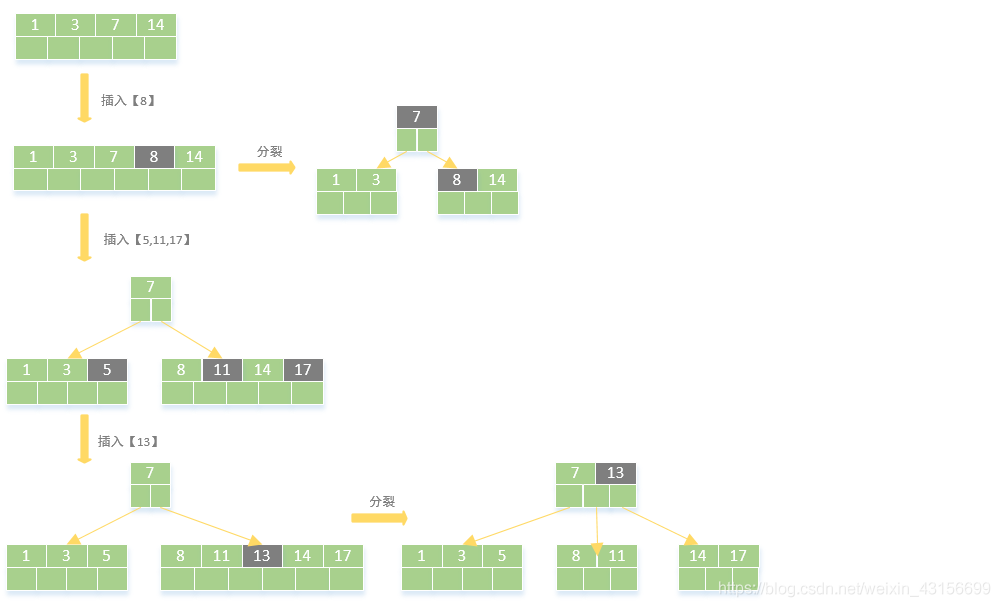
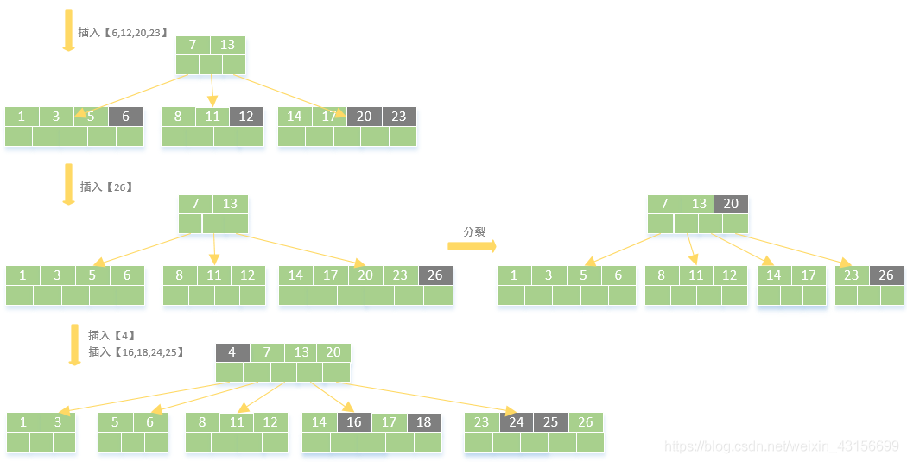
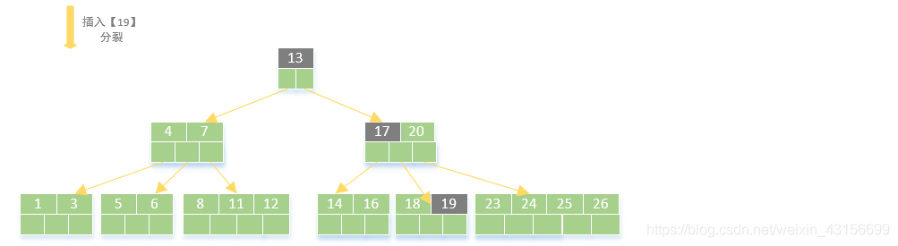
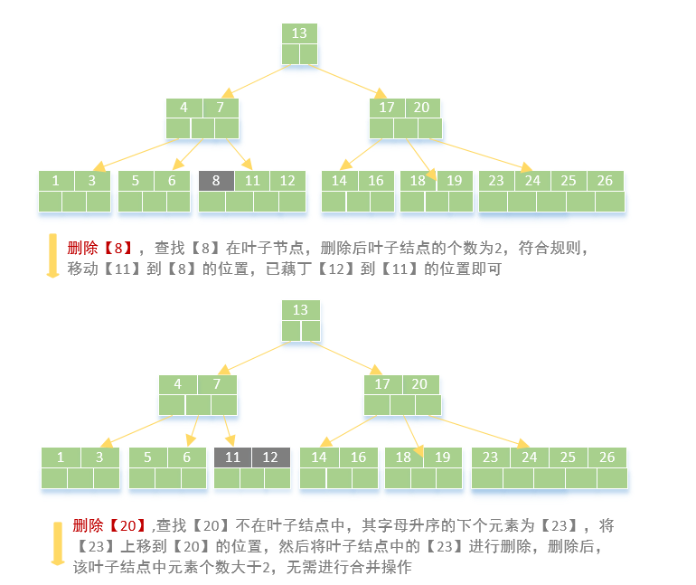
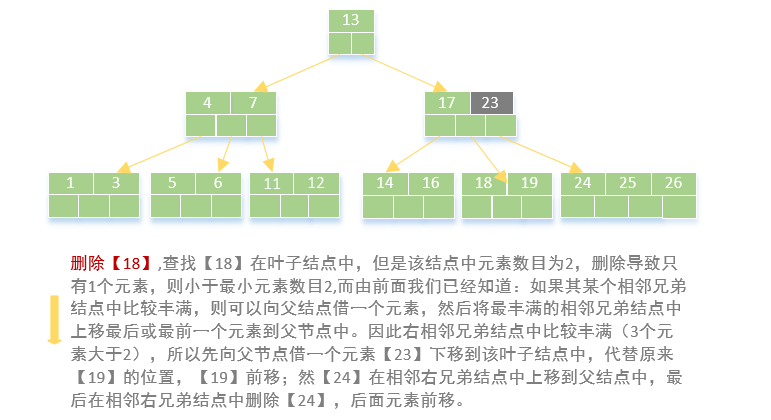
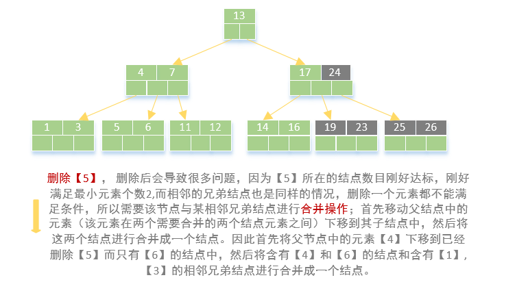
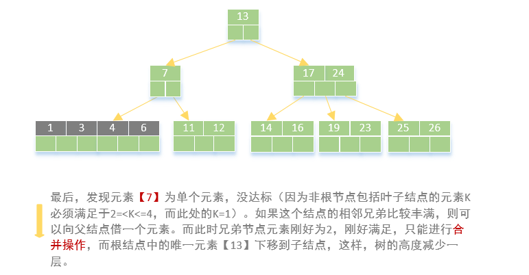
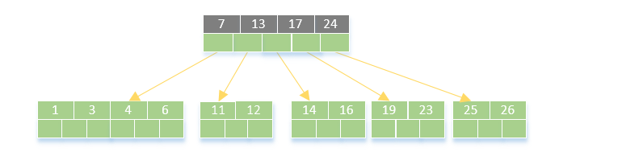
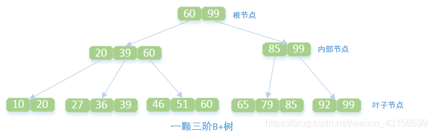

# B树和B+树详解

## 1 B树

​		二叉树是二分树，多分树是二叉树的推广。多分树主要适用于静态的索引数据文件，在插入和删除的时候需要把插入位置之后的每个记录都要向后移动，从而导致增加新的索引项和索引页块，需要对外存上的页块进行大量的调整。因此对于经常需要插入和删除的动态索引顺序文件，使用多分树并不合适，需要采用动态索引结构，即B树和B+树。
​		B树是一种自平衡树，是AVL树的一般化，它维护有序数据并允许以对数时间进行搜索，顺序访问，插入和删除。与AVL树不同的是，B树非常适合读取和写入相对较大的数据块（如光盘）的存储系统。它通常用于数据库和文件系统。

### 1.1 B树的定义

一颗m阶的B树满足如下条件：

- 每个节点最多只有m个子节点。

- 除根节点外，每个非叶子节点具有至少有 m/2（向下取整）个子节点。

- 非叶子节点的根节点至少有两个子节点。

- 有k颗子树的非叶节点有k-1个键，键按照递增顺序排列。

- 叶节点都在同一层中。

  

> （1）什么是B树的阶 ？
> B树中一个节点的子节点数目的最大值，用m表示，假如最大值为4，则为4阶，如图，所有节点中，节点[13,16,19]拥有的子节点数目最多，四个子节点（灰色节点），所以可以定义上面的图片为4阶B树。
>
> （2）什么是根节点 ？
> 节点【10】即为根节点，特征：根节点拥有的子节点数量的上限和内部节点相同，如果根节点不是树中唯一节点的话，至少有俩个子节点（不然就变成单支了）。在m阶B树中（根节点非树中唯一节点），那么有关系式2<= M <=m，M为子节点数量；包含的元素数量 1<= K <=m-1,K为元素数量。
>
> （3）什么是内部节点 ？
> 节点【13,16,19】、节点【3,6】都为内部节点，特征：内部节点是除叶子节点和根节点之外的所有节点，拥有父节点和子节点。假定m阶B树的内部节点的子节点数量为M，则一定要符合（m/2）<= M <=m关系式，包含元素数量M-1；包含的元素数量 （m/2）-1<= K <=m-1,K为元素数量。m/2向上取整。
>
> （4）什么是叶子节点？
> 节点【1,2】、节点【11,12】等最后一层都为叶子节点，叶子节点对元素的数量有相同的限制，但是没有子节点，也没有指向子节点的指针。特征：在m阶B树中叶子节点的元素符合（m/2）-1<= K <=m-1。

### 1.2 B树出现的目的

​		B树的出现是为了弥补不同的存储级别之间的访问速度上的巨大差异，实现高效的 I/O。平衡二叉树的查找效率是非常高的，并可以通过降低树的深度来提高查找的效率。但是当数据量非常大，树的存储的元素数量是有限的，这样会导致二叉查找树结构由于树的深度过大而造成磁盘I/O读写过于频繁，进而导致查询效率低下。另外数据量过大会导致内存空间不够容纳平衡二叉树所有结点的情况。B树是解决这个问题的很好的结构。

### 1.3 B树的检索、插入和删除

#### 1.3.1 检索

根据要查找的关键码key，在根节点的关键码集合中进行顺序或二分法检索，若key = ki，则检索成功；
否则，key一定在某 ki 和 ki+1 之间，用一个指针在所指节点继续查找，重复上述检索过程，直到检索成功；或指针为空，则检索失败。
整个检索过程中访外次数与B树的高度成正比。

#### 1.3.2 插入

针对m阶高度h的B树，插入一个元素时，首先在B树中是否存在，如果不存在，即在叶子结点处结束，然后在叶子结点中插入该新的元素。

若该节点元素个数小于m-1，直接插入；
若该节点元素个数等于m-1，引起节点分裂；以该节点中间元素为分界，取中间元素（偶数个数，中间两个随机选取）插入到父节点中；
重复上面动作，直到所有节点符合B树的规则；最坏的情况一直分裂到根节点，生成新的根节点，高度增加1。
上面三点为插入动作的核心，接下来以5阶B树为例，详细讲解插入的动作。

> **5阶B树关键点**:
> 2<=根节点子节点个数<=5
> 3<=内节点子节点个数<=5
> 1<=根节点元素个数<=4
> 2<=非根节点元素个数<=4
>
> 

#### 1.3.3 删除

首先查找B树中需删除的元素,如果该元素在B树中存在，则将该元素在其结点中进行删除；删除该元素后，首先判断该元素是否有左右孩子结点，如果有，则上移孩子结点中的某相近元素(“左孩子最右边的节点”或“右孩子最左边的节点”)到父节点中，然后是移动之后的情况；如果没有，直接删除。

某结点中元素数目小于（m/2）-1,(m/2)向上取整，则需要看其某相邻兄弟结点是否丰满；
如果丰满（结点中元素个数大于(m/2)-1），则向父节点借一个元素来满足条件；
如果其相邻兄弟都不丰满，即其结点数目等于(m/2)-1，则该结点与其相邻的某一兄弟结点进行“合并”成一个结点；
接下来还以5阶B树为例，详细讲解删除的动作：
关键要领，元素个数小于2(m/2 -1)就合并，大于4(m-1)就分裂
如图依次删除依次删除【8】,【20】,【18】,【5】

## 2 B+树

B+树是应文件系统所需而产生的B树的变形树，那么可能一定会想到，既然有了B树，又出一个B+树，那B+树必然是有很多优点的。

### 2.1 B+树的定义

一颗m阶的B+树满足如下条件：

- 每个节点最多只有m个子节点。
- 除根节点外，每个非叶子节点具有至少有 m/2（向下取整）个子节点。
- 非叶子节点的根节点至少有两个子节点。
- 有k个子节点的非叶节点有k个键，键按照递增顺序排列。
- 叶节点都在同一层中。

**说明**：
每个叶节点中至少包含 m/2（向下取整）个关键码，所有主文件记录的索引项都存放在B+树的叶节点中。所有内部节点都看成是索引的索引。节点中仅包含它的各个子节点中最大（或最小）关键码的分界值以及指向子节点的指针。

### 2.2 B+树与B树的差异

| B+树                                                         | B树                                                          |
| ------------------------------------------------------------ | ------------------------------------------------------------ |
| 有m颗子树的节点中含有 m 个关键码                             | 有m颗子树的节点中含有 m-1 个关键码                           |
| 所有的叶子结点中包含了完整的索引信息，包括指向含有这些关键字记录的指针，中间节点每个元素不保存数据，只用来索引 | B树中非叶子节点的关键码与叶子结点的关键码均不重复，它们共同构成全部的索引信息 |
| 所有的非叶子节点可以看成是高层索引， 结点中仅含有其子树根结点中最大（或最小）关键字 | B 树的非叶子节点包含需要查找的有效信息                       |

### 2.3 B+树的检索、插入和删除

检索
在B+树中检索关键码key的方法与B树的检索方式相似，但若在内部节点中找到检索的关键码时，检索并不会结束，要继续找到B+树的叶子结点为止。
插入
与B树的插入操作相似，总是插到叶子结点上。当叶节点中原关键码的个数等于m时，该节点分裂成两个节点，分别使关键码的个数为 (m+1)/2 （向上取整）和 (m+1)/2 （向下取整）。
删除
仅在叶节点删除关键码。若因为删除操作使得节点中关键码数少于 m/2（向下取整）时，则需要调整或者和兄弟节点合并。合并的过程和B树类似，区别是父节点中作为分界的关键码不放入合并后的节点中。
