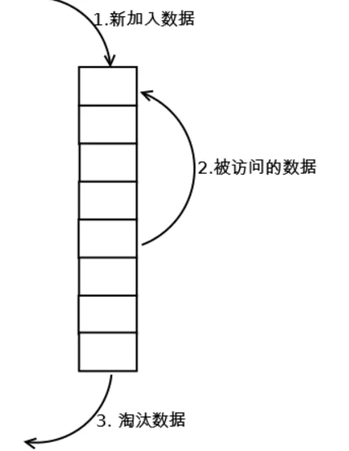

## LRU原理

LRU（Least recently used，最近最少使用）算法根据数据的历史访问记录来进行淘汰数据，其核心思想是“如果数据最近被访问过，那么将来被访问的几率也更高”。

- 最常见的实现是使用一个链表保存缓存数据，详细算法实现如下

  

新数据插入到链表头部；

每当缓存命中（即缓存数据被访问），则将数据移到链表头部；

当链表满的时候，将链表尾部的数据丢弃。
 【命中率】
 当存在热点数据时，LRU的效率很好，但偶发性的、周期性的批量操作会导致LRU命中率急剧下降，缓存污染情况比较严重。
 【复杂度】
 实现简单。
 【代价】
 命中时需要遍历链表，找到命中的数据块索引，然后需要将数据移到头部。

## LRU-K原理

LRU-K中的K代表最近使用的次数，因此LRU可以认为是LRU-1。LRU-K的主要目的是为了解决LRU算法“缓存污染”的问题，其核心思想是将“最近使用过1次”的判断标准扩展为“最近使用过K次”。

相比LRU，LRU-K需要多维护一个队列，用于记录所有缓存数据被访问的历史。只有当数据的访问次数达到K次的时候，才将数据放入缓存。当需要淘汰数据时，LRU-K会淘汰第K次访问时间距当前时间最大的数据。详细实现如下：

数据第一次被访问，加入到访问历史列表；

如果数据在访问历史列表里后没有达到K次访问，则按照一定规则（FIFO，LRU）淘汰；

当访问历史队列中的数据访问次数达到K次后，将数据索引从历史队列删除，将数据移到缓存队列中，并缓存此数据，缓存队列重新按照时间排序；

缓存数据队列中被再次访问后，重新排序；

需要淘汰数据时，淘汰缓存队列中排在末尾的数据，即：淘汰“倒数第K次访问离现在最久”的数据。
 LRU-K具有LRU的优点，同时能够避免LRU的缺点，实际应用中LRU-2是综合各种因素后最优的选择，LRU-3或者更大的K值命中率会高，但适应性差，需要大量的数据访问才能将历史访问记录清除掉。
 【命中率】
 LRU-K降低了“缓存污染”带来的问题，命中率比LRU要高。
 【复杂度】
 LRU-K队列是一个优先级队列，算法复杂度和代价比较高。
 【代价】
 由于LRU-K还需要记录那些被访问过、但还没有放入缓存的对象，因此内存消耗会比LRU要多；当数据量很大的时候，内存消耗会比较可观。
 LRU-K需要基于时间进行排序（可以需要淘汰时再排序，也可以即时排序），CPU消耗比LRU要高。

## URL-Two queues原理

Two queues（以下使用2Q代替）算法类似于LRU-2，不同点在于2Q将LRU-2算法中的访问历史队列（注意这不是缓存数据的）改为一个FIFO缓存队列，即：2Q算法有两个缓存队列，一个是FIFO队列，一个是LRU队列。
 当数据第一次访问时，2Q算法将数据缓存在FIFO队列里面，当数据第二次被访问时，则将数据从FIFO队列移到LRU队列里面，两个队列各自按照自己的方法淘汰数据。详细实现如下：

新访问的数据插入到FIFO队列；

如果数据在FIFO队列中一直没有被再次访问，则最终按照FIFO规则淘汰；

如果数据在FIFO队列中被再次访问，则将数据移到LRU队列头部；

如果数据在LRU队列再次被访问，则将数据移到LRU队列头部；

LRU队列淘汰末尾的数据。

## Multi Queue原理

MQ算法根据访问频率将数据划分为多个队列，不同的队列具有不同的访问优先级，其核心思想是：优先缓存访问次数多的数据。
 MQ算法将缓存划分为多个LRU队列，每个队列对应不同的访问优先级。访问优先级是根据访问次数计算出来的，例如
 详细的算法结构图如下，Q0，Q1....Qk代表不同的优先级队列，Q-history代表从缓存中淘汰数据，但记录了数据的索引和引用次数的队列：

如上图，算法详细描述如下：

1. 新插入的数据放入Q0；
2. 每个队列按照LRU管理数据；
3. 当数据的访问次数达到一定次数，需要提升优先级时，将数据从当前队列删除，加入到高一级队列的头部；
4. 为了防止高优先级数据永远不被淘汰，当数据在指定的时间里访问没有被访问时，需要降低优先级，将数据从当前队列删除，加入到低一级的队列头部；
5. 需要淘汰数据时，从最低一级队列开始按照LRU淘汰；每个队列淘汰数据时，将数据从缓存中删除，将数据索引加入Q-history头部；
6. 如果数据在Q-history中被重新访问，则重新计算其优先级，移到目标队列的头部；
7. Q-history按照LRU淘汰数据的索引。

【命中率】
 MQ降低了“缓存污染”带来的问题，命中率比LRU要高。
 【复杂度】
 MQ需要维护多个队列，且需要维护每个数据的访问时间，复杂度比LRU高。
 【代价】
 MQ需要记录每个数据的访问时间，需要定时扫描所有队列，代价比LRU要高。
 注：虽然MQ的队列看起来数量比较多，但由于所有队列之和受限于缓存容量的大小，因此这里多个队列长度之和和一个LRU队列是一样的，因此队列扫描性能也相近。

**4.Redis LRU算法实现**

分析Redis LRU实现之前，我们先了解一下Redis缓存淘汰策略。

当Redis内存超出物理内存限制时，内存会频繁的磁盘swap区交换数据，而交换会导致redis对外服务性能的急剧下降，这在生产环境是不允许的。说得更明白些，在生产环境是不允许交换行为的，通过设置maxmemory可限制内存超过期望大小。

当实际需要的内存大于**maxmemory**时，Redis提供了6种可选策略：

1. **noeviction**：不继续提供写服务，读请求可以继续。
2. **volatile-lru**：尝试淘汰设置了过期时间的key，最少使用的key优先淘汰。也就是说没有设置过期时间的key不会被淘汰。
3. **volatile-ttl**：也是淘汰设置了过期时间的key，只不过策略不是lru，而是根据剩余寿命的ttl值，ttl越小越优先被淘汰。
4. **volatile-random**：同理，也是淘汰设置了过期时间的key，只不过策略是随机。
5. **allkeys-lru：**类比volatile-lru，只不过未设置过期时间的key也在淘汰范围。
6. **allkeys-random：**类比volatile-random，只不过未设置过期时间的key也在淘汰范围。

采用HashMap + 双向循环链表具有较好的读写性能，但是有没有发现什么问题呢？对，HashMap和链表都存在空间浪费的情况，HashMap本来就很耗内存，双向链表由于需要空间存储指针，两种数据结构空间使用率都不高，这显然很不划算。

针对这个问题，Redis采用了近似的做法，我们来分析分析。

首先，针对问题本身，我们需要淘汰的是最近未使用的相对比较旧的数据淘汰掉，那么，我们是否一定得非常精确地淘汰掉最旧的数据还是只需要淘汰掉比较旧的数据？

咱们来看下Redis是如何实现的。Redis做法很简单：随机取若干个key，然后按照访问时间排序，淘汰掉最不经常使用的数据。为此，Redis给每个key额外增加了一个24bit长度的字段，用于保存最后一次被访问的时钟（Redis维护了一个全局LRU时钟lruclock:REDIS_LUR_BITS，时钟分辨率默认1秒）。

redis会基于server.maxmemory_samples配置选取固定数目的key，然后比较它们的lru访问时间，然后淘汰最近最久没有访问的key，maxmemory_samples的值越大，Redis的近似LRU算法就越接近于严格LRU算法，但是相应消耗也变高，对性能有一定影响，样本值默认为5。

LRU是缓存系统中常见的淘汰策略，当内存不足时，我们需要淘汰掉最近最少使用的数据，LRU就是实现这种策略的统称。LRU算法实现可以基于HashMap + 双向链表的数据结构实现高效数据读写，于此同时，高效查询却带来了高内存消耗的的问题，为此Redis选择了近似LRU算法，随机采用一组key，选择最老的数据进行删除，能够达到类似的效果。