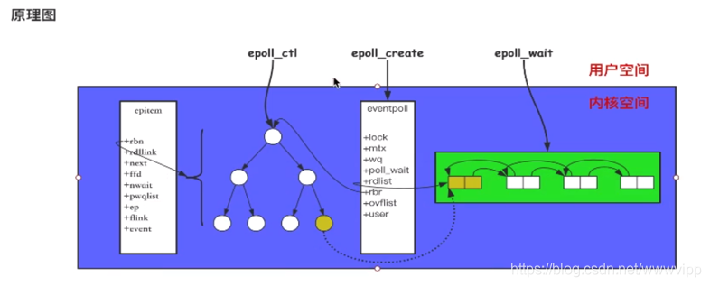

# epoll、poll、select的原理和区别

## **一、什么是epoll？**

epoll是一种I/O事件通知机制，是linux 内核实现IO多路复用的一个实现。IO多路复用是指，在一个操作里同时监听多个输入输出源，在其中一个或多个输入输出源可用的时候返回，然后对其的进行读写操作。
epoll有两种工作方式， LT-水平触发 和ET-边缘触发(默认工作方式),主要区别是：
LT，内核通知你fd是否就绪，如果没有处理，则会持续通知。而ET，内核只通知一次。

**什么是I/O？**
输入输出(input/output)的对象可以是文件(file)， 网络(socket)，进程之间的管道(pipe)。在linux系统中，都用文件描述符(fd)来表示。

**什么是事件？**
IO中涉及到的行为，建立连接、读操作、写操作等抽象出一个概念，就是事件，在jdk中用类SelectionKey.java来表示，例如：可读事件，当文件描述符关联的内核读缓冲区可读，则触发可读事件（可读：内核缓冲区非空，有数据可以读取）；可写事件，当文件描述符关联的内核写缓冲区可写，则触发可写事件（可写：内核缓冲区不满，有空闲空间可以写入）。

**什么是通知机制？**

通知机制，就是当事件发生的时候，则主动通知。通知机制的反面，就是轮询机制。


### 二、epoll的三个函数

```c
 int epoll_create(int size)
```

size参数告诉内核这个epoll对象处理的事件大致数量，而不是能够处理的最大数量。
在现在的linux版本中，这个size函数已经被废弃（但是size不要传0，会报invalid argument错误）。
内核会产生一个epoll 实例数据结构并返回一个文件描述符，这个特殊的描述符就是epoll实例的句柄，之后针对该epoll的操作需要通过该句柄来标识该epoll对象。

```c
int epoll_ctl(int epfd， int op， int fd， struct epoll_event *event)
```


将被监听的描述符添加到红黑树或从红黑树中删除或者对监听事件进行修改
返回：0表示成功，-1表示错误，根据errno错误码判断错误类型

**op参数说明操作类型：**
EPOLL_CTL_ADD：向interest list添加一个需要监视的描述符
EPOLL_CTL_DEL：从interest list中删除一个描述符
EPOLL_CTL_MOD：修改interest list中一个描述符

**epoll_event取值：**
EPOLLIN：描述符处于可读状态
EPOLLOUT：描述符处于可写状态
EPOLLET：将epoll event通知模式设置成edge triggered
EPOLLONESHOT：第一次进行通知，之后不再监测
EPOLLHUP：本端描述符产生一个挂断事件，默认监测事件
EPOLLRDHUP：对端描述符产生一个挂断事件
EPOLLPRI：由带外数据触发
EPOLLERR：描述符产生错误时触发，默认检测事件

```c
int epoll_wait(int epfd， struct epoll_event *events， int maxevents， int timeout);
```

阻塞等待注册的事件发生，返回事件的数目，并将触发的事件写入events数组中
events: 用来记录被触发的events，其大小应该和maxevents一致
maxevents: 返回的events的最大个数
参数timeout描述在函数调用中阻塞时间上限，单位是ms：
        timeout = -1表示调用将一直阻塞，直到有文件描述符进入ready状态或者捕获到信号才返回；
        timeout = 0用于非阻塞检测是否有描述符处于ready状态，不管结果怎么样，调用都立即返回；
        timeout > 0表示调用将最多持续timeout时间，如果期间有检测对象变为ready状态或者捕获到信号则返回，否则直到超时。


### 三、epoll原理图解



1.通过调用epoll_create，在epoll文件系统建立了个file节点，并开辟epoll自己的内核高速cache区，建立红黑树，分配好想要的size的内存对象，建立一个list链表，用于存储准备就绪的事件。
2.通过调用epoll_ctl，把要监听的socket放到对应的红黑树上，给内核中断处理程序注册一个回调函数，通知内核，如果这个句柄的数据到了，就把它放到就绪列表。
3.通过调用 epoll_wait，观察就绪列表里面有没有数据，并进行提取和清空就绪列表，非常高效。

四、epoll与select、poll的对比
1. 用户态将文件描述符传入内核的方式
select：创建3个文件描述符集并拷贝到内核中，分别监听读、写、异常动作。这里受到单个进程可以打开的fd数量限制，默认是1024。

poll：将传入的struct pollfd结构体数组拷贝到内核中进行监听。
结构体结构如下：


epoll：执行epoll_create会在内核的高速cache区中建立一颗红黑树以及就绪链表(该链表存储已经就绪的文件描述符)。接着用户执行的epoll_ctl函数添加文件描述符会在红黑树上增加相应的结点

2. 内核态检测文件描述符读写状态的方式
select：采用轮询方式，遍历所有fd，最后返回一个描述符读写操作是否就绪的mask掩码，根据这个掩码给fd_set赋值。
poll：同样采用轮询方式，查询每个fd的状态，如果就绪则在等待队列中加入一项并继续遍历。
epoll：采用回调机制。在执行epoll_ctl的add操作时，不仅将文件描述符放到红黑树上，而且也注册了回调函数，内核在检测到某文件描述符可读/可写时会调用回调函数，该回调函数将文件描述符放在就绪链表中。
3. 找到就绪的文件描述符并传递给用户态的方式
select：将之前传入的fd_set拷贝传出到用户态并返回就绪的文件描述符总数。用户态并不知道是哪些文件描述符处于就绪态，需要遍历来判断。
poll：同select方式。
epoll：epoll_wait只用观察就绪链表中有无数据即可，最后将链表的数据返回给数组并返回就绪的数量。内核将就绪的文件描述符放在传入的数组中，所以只用遍历依次处理即可。这里返回的文件描述符是通过mmap让内核和用户空间共享同一块内存实现传递的，减少了不必要的拷贝。
五、总结
1.select和poll的动作基本一致，只是poll采用链表来进行文件描述符的存储，而select采用fd标注位来存放，所以select会受到最大连接数的限制，而poll不会。
2.select、poll、epoll虽然都会返回就绪的文件描述符数量。但是select和poll并不会明确指出是哪些文件描述符就绪，而epoll会。造成的区别就是，系统调用返回后，调用select和poll的程序需要遍历监听的整个文件描述符找到是谁处于就绪，而epoll则直接处理即可。
3.select、poll采用轮询的方式来检查文件描述符是否处于就绪态，而epoll采用回调机制。造成的结果就是，随着fd的增加，select和poll的效率会线性降低，而epoll不会受到太大影响，除非活跃的socket很多。
4.epoll的边缘触发模式效率高，系统不会充斥大量不关心的就绪文件描述符
5.select、poll都需要将有关文件描述符的数据结构拷贝进内核，最后再拷贝出来。而epoll创建的有关文件描述符的数据结构本身就存于内核态中，系统调用返回时利用mmap()文件映射内存加速与内核空间的消息传递：即epoll使用mmap减少复制开销。
