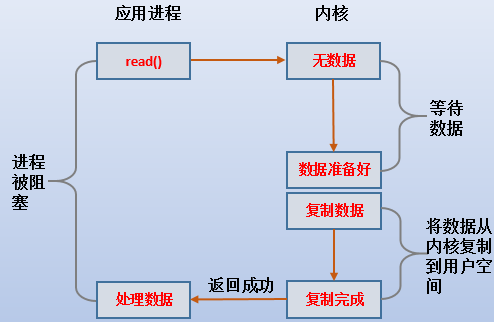
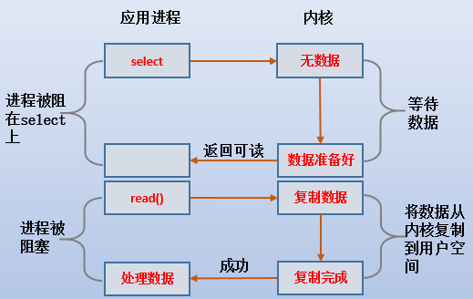
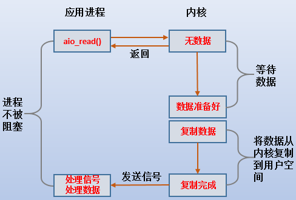

# 网络IO模型总结

  IO模型就是说用什么样的通道进行数据的发送和接收，首先要明确一点：IO是操作系统与其他网络进行数据交互，JDK底层并没有实现IO，而是对操作系统内核函数做的一个封装，IO代码进入底层其实都是native形式的。Java共支持3种网络编程IO模式：BIO，NIO，AIO。


## BIO

BIO（Blocking IO）又称为同步阻塞IO，一个客户端由一个线程来处理，线程模型图下所示


**BIO代码示例：**

```java
    public static void main(String[] args) throws IOException {

        ServerSocket serverSocket = new ServerSocket();
        serverSocket.bind(new InetSocketAddress(8080));

        
        while(true){
            //如果没有请求的话，accept会阻塞当前流程。
            Socket socket = serverSocket.accept();
            new Thread(() -> {
                try {
                    System.out.println(Thread.currentThread().getName());
                    InputStream inputStream = socket.getInputStream();
                    Reader reader = new InputStreamReader(inputStream);
                    BufferedReader bufferedReader = new BufferedReader(reader);
                    StringBuilder stringBuilder = new StringBuilder();
                    while(bufferedReader.ready()){
                        stringBuilder.append(bufferedReader.readLine() + "\n");
                    }
//                    System.out.println(stringBuilder.toString());
                    socket.close();

                } catch (IOException e) {
                    e.printStackTrace();
                }
            }).start();
        }
        
        //使用线程池的方式
        
//        while(true){
//            Socket socket = serverSocket.accept();
//
//            executorService.submit(() -> {
//                try {
//                    System.out.println(Thread.currentThread().getName());
//                    InputStream inputStream = socket.getInputStream();
//                    Reader reader = new InputStreamReader(inputStream);
//                    BufferedReader bufferedReader = new BufferedReader(reader);
//                    StringBuilder stringBuilder = new StringBuilder();
//                    while(bufferedReader.ready()){
//                        stringBuilder.append(bufferedReader.readLine() + "\n");
//                    }
////                    System.out.println(stringBuilder.toString());
//
//                    socket.close();
//
//                } catch (IOException e) {
//                    e.printStackTrace();
//                }
//            });
//        }
        
}
```

1.如果BIO使用单线程接受连接，则会阻塞其他连接，效率较低。
2.如果使用多线程虽然减弱了单线程带来的影响，但当有大并发进来时，会导致服务器线程太多，压力太大而崩溃。就是会开启过多的线程，这样容易导致系统奔溃。
3.就算使用线程池，也只能同时允许有限个数的线程进行连接，如果并发量远大于线程池设置的数量，还是与单线程无异
4.IO代码里read操作是阻塞操作，如果连接不做数据读写操作会导致线程阻塞，就是说只占用连接，不发送数据，则会浪费资源。比如线程池中500个连接，只有100个是频繁读写的连接，其他占着茅坑不拉屎，浪费资源！
5.另外多线程也会有线程切换带来的消耗

综上所述，BIO方式已经不适用于如下的大并发场景，仅适用于连接数目比较小且固定的架构。这种方式对服务器资源要求比较高，但BIO程序简单易理解。


补充：

阻塞I/O模型示意图：




以Read为例：

最传统的一种IO模型，即在读写数据过程中会发生阻塞现象。
当用户线程发出IO请求之后，内核会去查看数据是否就绪，如果没有就绪就会等待数据就绪，而用户线程就会处于阻塞状态，用户线程交出CPU。
当数据就绪之后，内核会将数据拷贝到用户线程，并返回结果给用户线程，用户线程才解除block状态.
典型的阻塞IO模型的例子为：data = socket.read();如果数据没有就绪，就会一直阻塞在read方法.

😄 也就是说，内核准备数据和数据从内核拷贝到进程内存地址这两个过程都是阻塞的。


## Non-Block（非阻塞I/O模型）

可以通过设置socket使其变为non-blocking。当对一个non-blocking socket执行读操作时，流程是这个样子：


当用户进程发出read操作时，如果kernel中的数据还没有准备好；
那么它并不会block用户进程，而是立刻返回一个error，从用户进程角度讲 ，它发起一个read操作后，并不需要等待，而是马上就得到了一个结果；
用户进程判断结果是一个error时，它就知道数据还没有准备好，于是它可以再次发送read操作。一旦kernel中的数据准备好了，并且又再次收到了用户进程的system call；
那么它马上就将数据拷贝到了用户内存，然后返回。
😄所以，nonblocking IO的特点是用户进程在内核准备数据的阶段需要不断的主动询问数据好了没有。


## NIO（IO多路复用）

NIO（Non blocking IO）又被称为同步非阻塞io，服务器把多个连接放入集合中，只用一个线程可以处理多个请求，也就是多路复用。

1**.同步**：调用的结果会在本次调用后返回，不存在异步线程回调之类的。

2.**非阻塞**：表现为线程不会一直等待，把连接接入集合之后，线程会一直轮询集合中的连接，有就处理，没有就继续接受请求；

NIO的多路复用底层主要是Linux内核（select、poll、epoll）。windows不支持epoll实现，windows底层基于winsock2函数实现的，三种的内核模型的如下所示：

|              | select                                   | poll                                     | epoll                                                        |
| ------------ | ---------------------------------------- | ---------------------------------------- | ------------------------------------------------------------ |
| 操作方式     | 遍历                                     | 遍历                                     | 回调                                                         |
| 底层实现方式 | 数组                                     | 链表                                     | 哈希表                                                       |
| IO效率       | 每次调用的进行线性遍历，时间复杂度为O(n) | 每次调用惊醒线性遍历，时间复杂度为O（n） | 事件通知方式，每当有IO事件就绪，系统注册的回调函数就会被调用，时间复杂度O（1） |
| 最大连接     | 有上限（1024个）                         | 无上限                                   | 无上限                                                       |

NIO的三大组件：

1.Buffer（缓冲区）：buffer底层就是个数组；

2.Channel（通道）：channel类似于流，每个channel对应一个buffer缓冲区；

3.Selector（多路复用器）：channel会注册到selector上，由selector根据channel读写事件的发生将其有某个空闲的线程处理；


应用场景：
NIO方式适用于连接数目多且连接比较短（轻操作） 的架构， 比如聊天服务器， 弹幕系统， 服务器间通讯，编程比较复杂

```java
//用NIO实现网络编程
public static void server() throws IOException {
        Selector serverSelector = Selector.open();
        Selector clientSelector = Selector.open();
        new Thread(() -> {
            while(true){
                try{
                    if(clientSelector.select(1) > 0){
                        Set<SelectionKey> set = clientSelector.selectedKeys();
                        Iterator<SelectionKey> iterator = set.iterator();
                        while(iterator.hasNext()){
                            SelectionKey key = iterator.next();
                            if(key.isReadable()){
                                try{
                                    SocketChannel clientChannel = (SocketChannel) key.channel();
                                    ByteBuffer byteBuffer = ByteBuffer.allocate(1024);

                                    clientChannel.read(byteBuffer);
                                    byteBuffer.flip();
                                    System.out.println(Charset.defaultCharset().newDecoder().decode(byteBuffer));

                                }finally {
                                    iterator.remove();
                                    key.interestOps(SelectionKey.OP_WRITE);
                                }
                            }
                        }
                    }
                }catch (Exception e){

                }


            }
        }).start();

        new Thread(() -> {
            try {
                ServerSocketChannel serverSocketChannel = ServerSocketChannel.open();
                serverSocketChannel.socket().bind(new InetSocketAddress(8080));
                serverSocketChannel.configureBlocking(false);
                serverSocketChannel.register(serverSelector, SelectionKey.OP_ACCEPT);
                while(true){
                    if(serverSelector.select(1) > 0){
                        Set<SelectionKey> set = serverSelector.selectedKeys();
                        Iterator<SelectionKey> iterator = set.iterator();
                        while(iterator.hasNext()){
                            SelectionKey key = iterator.next();
                            if(key.isAcceptable()){
                                try{
                                    SocketChannel clientChannel = ((ServerSocketChannel)key.channel()).accept();
                                    clientChannel.configureBlocking(false);
                                    clientChannel.register(clientSelector, SelectionKey.OP_READ);
                                }finally {
                                    iterator.remove();
                                }
                            }
                        }
                    }
                }
            } catch (IOException e) {
                e.printStackTrace();
            }


        }).start();

    }
```

补充：

I/O多路复用实际上就是用select, poll, epoll监听多个io对象，当io对象有变化（有数据）的时候就通知用户进程。好处就是单个进程可以处理多个socket。当然具体区别我们后面再讨论，现在先来看下I/O多路复用的流程：



1.当用户进程调用了select，那么整个进程会被block；
2.而同时，kernel会“监视”所有select负责的socket；
3.当任何一个socket中的数据准备好了，select就会返回；
4.这个时候用户进程再调用read操作，将数据从kernel拷贝到用户进程。

所以，I/O 多路复用的特点是通过一种机制一个进程能同时等待多个文件描述符，而这些文件描述符（套接字描述符）其中的任意一个进入读就绪状态，select()函数就可以返回。

这个图和blocking IO的图其实并没有太大的不同，事实上，还更差一些。因为这里需要使用两个system call (select 和 recvfrom)，而blocking IO只调用了一个system call (recvfrom)。但是，用select的优势在于它可以同时处理多个connection。

所以，如果处理的连接数不是很高的话，使用select/epoll的web server不一定比使用多线程 + 阻塞 IO的web server性能更好，可能延迟还更大。

select/epoll的优势并不是对于单个连接能处理得更快，而是在于能处理更多的连接。）

在IO multiplexing Model中，实际中，对于每一个socket，一般都设置成为non-blocking，但是，如上图所示，整个用户的process其实是一直被block的。只不过process是被select这个函数block，而不是被socket IO给block。


## select、poll模型

​		NIO底层在JDK1.4版本是用linux的内核函数select()或poll()来实现，selector每次都会轮询所有的sockchannel看下哪个channel有读写事件，有的话就处理，没有就继续遍历，select和poll模型作为NIO的早期实现，存在一定弊端。下面是一段代码，简单表述一下他们的弊端！

```java
public class NioServer {

    // 保存客户端连接
    static List<SocketChannel> channelList = new ArrayList<>();

    public static void main(String[] args) throws IOException, InterruptedException {

        // 创建NIO ServerSocketChannel,与BIO的serverSocket类似
        ServerSocketChannel serverSocket = ServerSocketChannel.open();
        serverSocket.socket().bind(new InetSocketAddress(9000));
        
        // 设置ServerSocketChannel为非阻塞, 配置为true，则和BIO类似
        serverSocket.configureBlocking(false);
        System.out.println("服务启动成功");

        while (true) {
            // 非阻塞模式accept方法不会阻塞，否则会阻塞
            // NIO的非阻塞是由操作系统内部实现的，底层调用了linux内核的accept函数
            SocketChannel socketChannel = serverSocket.accept();
            
            if (socketChannel != null) { // 如果有客户端进行连接
                System.out.println("连接成功");
                // 设置SocketChannel为非阻塞
                socketChannel.configureBlocking(false);
                // 保存客户端连接在List中
                channelList.add(socketChannel);
            }
            
            // 遍历连接进行数据读取
            Iterator<SocketChannel> iterator = channelList.iterator();
            
            while (iterator.hasNext()) {
                SocketChannel sc = iterator.next();
                ByteBuffer byteBuffer = ByteBuffer.allocate(128);
                // 非阻塞模式read方法不会阻塞，否则会阻塞
                int len = sc.read(byteBuffer);
                // 如果有数据，把数据打印出来
                if (len > 0) {
                    System.out.println("接收到消息：" + new String(byteBuffer.array()));
                } else if (len == -1) { // 如果客户端断开，把socket从集合中去掉
                    iterator.remove();
                    System.out.println("客户端断开连接");
                }
            }
        }
    }
}

```

这种方式虽然解决了BIO的部分痛点，但并不是很完美。因为select和poll模型的底层实现、io效率、最大连接数在面对高并发时还存在一定弊端！他们的多路复用采用的是遍历Selector中所有的连接，然后对有事件的连接做出响应。 假如连接数太多，有10000个连接，其中只有1000个连接有写数据，但是由于其他9000个连接并没有断开，我们还是要每次轮询遍历一万次，其中有十分之九的遍历都是无效的，这显然不是一个让人很满意的状态。为了处理无效遍历的问题，在jdk1.5及以上版本引入了epoll模型


## epoll模型

   JDK1.5开始引入了epoll基于事件响应机制来优化NIO。epoll模型解决了elect和poll模型的无效遍历问题，是NIO的核心。epoll是基于事件响应的，类似于观察者模式！

NIO第二个版本：使用epoll模型后的代码示例

```java
public class NioSelectorServer {

    public static void main(String[] args) throws IOException, InterruptedException {

        // 创建NIO ServerSocketChannel
        ServerSocketChannel serverSocket = ServerSocketChannel.open();
        serverSocket.socket().bind(new InetSocketAddress(9000));
        // 设置ServerSocketChannel为非阻塞
        serverSocket.configureBlocking(false);
        // 打开Selector处理Channel，即创建epoll
        Selector selector = Selector.open();
        // 把ServerSocketChannel注册到selector上，并且selector对客户端accept连接操作感兴趣
        serverSocket.register(selector, SelectionKey.OP_ACCEPT);
        System.out.println("服务启动成功");

        while (true) {
            // 阻塞等待需要处理的事件发生
            selector.select();

            // 获取selector中注册的全部事件的 SelectionKey 实例
            Set<SelectionKey> selectionKeys = selector.selectedKeys();
            Iterator<SelectionKey> iterator = selectionKeys.iterator();

            // 遍历SelectionKey对事件进行处理
            while (iterator.hasNext()) {
                SelectionKey key = iterator.next();
                // 如果是OP_ACCEPT事件，则进行连接获取和事件注册
                if (key.isAcceptable()) {
                    ServerSocketChannel server = (ServerSocketChannel) key.channel();
                    SocketChannel socketChannel = server.accept();
                    socketChannel.configureBlocking(false);
                    // 这里只注册了读事件，如果需要给客户端发送数据可以注册写事件
                    socketChannel.register(selector, SelectionKey.OP_READ);
                    System.out.println("客户端连接成功");
                } else if (key.isReadable()) {  // 如果是OP_READ事件，则进行读取和打印
                    SocketChannel socketChannel = (SocketChannel) key.channel();
                    ByteBuffer byteBuffer = ByteBuffer.allocate(128);
                    int len = socketChannel.read(byteBuffer);
                    // 如果有数据，把数据打印出来
                    if (len > 0) {
                        System.out.println("接收到消息：" + new String(byteBuffer.array()));
                    } else if (len == -1) { // 如果客户端断开连接，关闭Socket
                        System.out.println("客户端断开连接");
                        socketChannel.close();
                    }
                }
                //从事件集合里删除本次处理的key，防止下次select重复处理
                iterator.remove();
            }
        }
    }
}
```

 在使用epoll模型之后，对简单版本的NIO做了优化处理，可以理解为在第一个版本的NIO上，又增加了一个就绪事件列表集合，这个集合中存放着有事件响应的连接，然后开启一个线程去监听这个集合，有元素的话就进行处理。

   总结：NIO整个调用流程就是Java调用了操作系统的内核函数来创建Socket，获取到Socket的文件描述符，再创建一个Selector对象，对应操作系统的Epoll描述符，将获取到的Socket连接的文件描述符的事件绑定到Selector对应的Epoll文件描述符上，进行事件的异步通知，这样就实现了使用一条线程，并且不需要太多的无效的遍历，将事件处理交给了操作系统内核(操作系统硬中断程序实现)，大大提高了效率。


## Asynchronous I/O（异步 I/O)

真正的异步I/O很牛逼，流程大概如下：



> 1.用户进程发起read操作之后，立刻就可以开始去做其它的事。
> 2.而另一方面，从kernel的角度，当它受到一个asynchronous read之后，首先它会立刻返回，所以不会对用户进程产生任何block。
> 3.然后，kernel会等待数据准备完成，然后将数据拷贝到用户内存，当这一切都完成之后，kernel会给用户进程发送一个signal，告诉它read操作完成了。
>