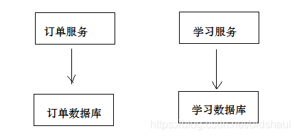
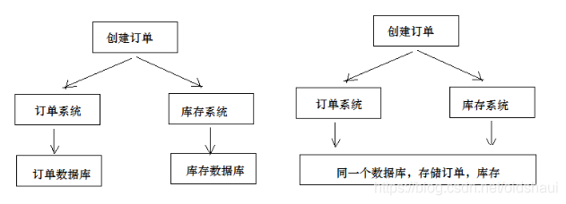
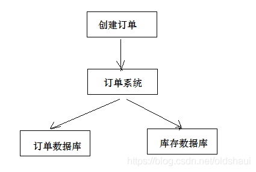
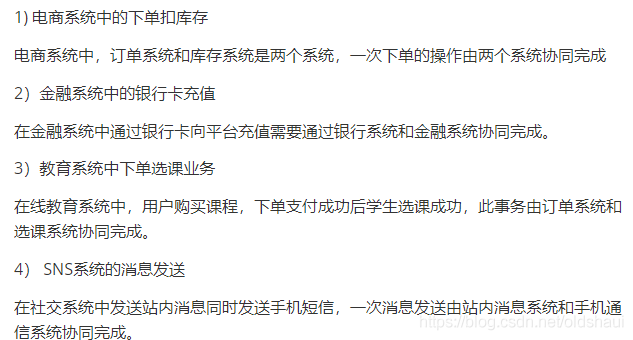
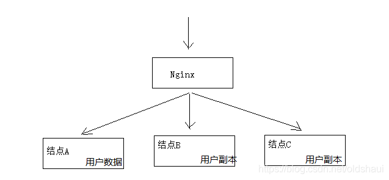
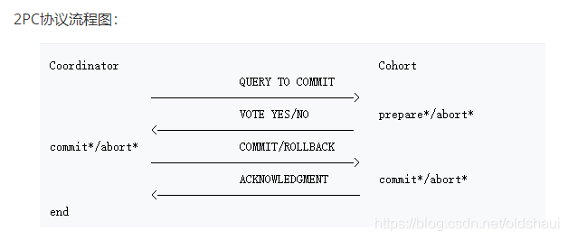
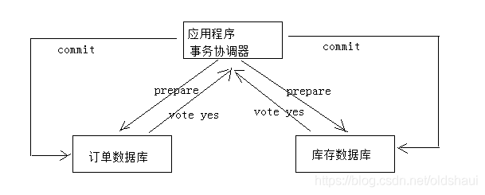
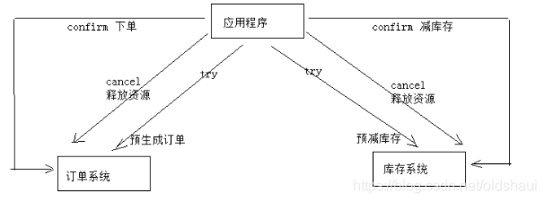
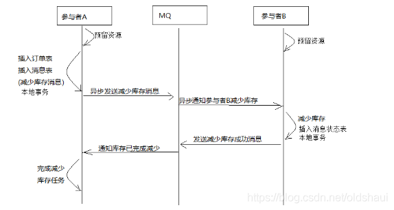
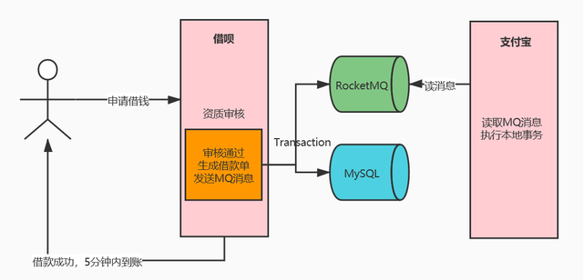

# Java微服务下的分布式事务介绍及其解决方案

## 1.前言

> 
>
> 

## 2 问题描述

> 在介绍分布式事务下，下面我们先来了解一个常见应用场景，这个场景(类似慕课网购买付费课程)也是我后面要讲的分布式事务的解决方案的案例

2 用户支付完成会将支付状态及订单状态保存在订单数据库中，由订单服务去维护订单数据库。而学生选课信息在学习中心数据库，由学习服务去维护学习中心数据库的信息。下图是系统结构图：

 如何实现两个分布式服务（订单服务、学习服务）共同完成一件事即订单支付成功自动添加学生选课的需求，这里的关键是如何保证两个分布式服务的事务的一致性。

 尝试解决上边的需求，在订单服务中远程调用选课接口，伪代码如下：

下面我们分析下这种解决方案的问题

> 1.更新支付表状态为本地数据库操作。
> 2.远程调用选课接口为网络远程调用请求
> 3.为保存事务上边两步操作由spring控制事务，当遇到Exception异常则回滚本地数据库操作。
> 问题如下：
> 1、如果更新支付表失败则抛出异常，不再执行远程调用，此设想没有问题。
> 2、如果更新支付表成功，网络远程调用超时会拉长本地数据库事务时间，影响数据库性能。（远程调用非常耗时的哦）
> 3、如果更新支付表成功，远程调用添加选课成功（选课数据库commit成功），最后更新支付表commit失败，此时出现操作不一致。
> 上面的问题就涉及到了分布式事务的控制

## 3.什么是分布式事务

> > ### 什么是分布式系统
> >
> > 部署在不同结点上的系统通过网络交互来完成协同工作的系统
> > 比如：充值加积分的业务，用户在充值系统向自己的账户充钱，在积分系统中自己积分相应的增加。充值系统和积分系统是两个不同的系统，一次充值加积分的业务就需要这两个系统协同工作来完成。
> >
> > ### 什么是事务
> >
> > 事务是指由一组操作组成的一个工作单元，这个工作单元具有原子性（atomicity）、一致性（consistency）、隔离性（isolation）和持久性（durability）。
> > 原子性：执行单元中的操作要么全部执行成功，要么全部失败。如果有一部分成功一部分失败那么成功的操作要全部回滚到执行前的状态。
> > 一致性：执行一次事务会使用数据从一个正确的状态转换到另一个正确的状态，执行前后数据都是完整的。 隔离性：在该事务执行的过程中，任何数据的改变只存在于该事务之中，对外界没有影响，事务与事务之间是完全的隔离的。只有事务提交后其它事务才可以查询到最新的数据。
> > 持久性：事务完成后对数据的改变会永久性的存储起来，即使发生断电宕机数据依然在。
> >
> > ### 什么是本地事务
> >
> > 本地事务就是用关系数据库来控制事务，关系数据库通常都具有ACID特性，传统的单体应用通常会将数据全部存储在一个数据库中，会借助关系数据库来完成事务控制。
> >
> > ### 什么是分布式事务
> >
> > 在分布式系统中一次操作由多个系统协同完成，这种一次事务操作涉及多个系统通过网络协同完成的过程称为分布式事务。这里强调的是多个系统通过网络协同完成一个事务的过程，并不强调多个系统访问了不同的数据库，即使多个系统访问的是同一个数据库也是分布式事务，如下图：
>
> > 
>
>  另外一种分布式事务的表现是，一个应用程序使用了多个数据源连接了不同的数据库，当一次事务需要操作多个数据源，此时也属于分布式事务，当系统做出了数据库拆分后会出现此种情况。
>
> 

## 4.分布式事务的应用场景

> 

**CAP理论**

> 如何进行分布式事务控制？CAP理论是分布式事务处理的理论基础，了解了CAP理论有助于我们研究分布式事务的处理方案。
> **CAP理论是**：分布式系统在设计时只能在一致性(Consistency)、可用性(Availability)、分区容忍性(Partition Tolerance)中满足两种，无法兼顾三种。
> 通过下图来理解CAP理论
>
> 
>
> **一致性(Consistency)**：服务A、B、C三个结点都存储了用户数据， 三个结点的数据需要保持同一时刻数据一致性。
> **可用性(Availability)**：服务A、B、C三个结点，其中一个结点宕机不影响整个集群对外提供服务，如果只有服务A结点，当服务A宕机整个系统将无法提供服务，增加服务B、C是为了保证系统的可用性。
> **分区容忍性(Partition Tolerance)**：分区容忍性就是允许系统通过网络协同工作，分区容忍性要解决由于网络分区导致数据的不完整及无法访问等问题。
> 分布式系统不可避免的出现了多个系统通过网络协同工作的场景，结点之间难免会出现网络中断、网延延迟等现象，这种现象一旦出现就导致数据被分散在不同的结点上，这就是网络分区

## 5.分布式系统能否兼顾C、A、P？

> 在保证分区容忍性的前提下一致性和可用性无法兼顾，如果要提高系统的可用性就要增加多个结点，如果要保证数据的一致性就要实现每个结点的数据一致，结点越多可用性越好，但是数据一致性越差。所以，在进行分布式系统设计时，同时满足“一致性”、“可用性”和“分区容忍性”三者是几乎不可能的
>
> ### CAP有哪些组合方式？
>
> 1、CA：放弃分区容忍性，加强一致性和可用性，关系数据库按照CA进行设计。
> 2、AP：放弃一致性，加强可用性和分区容忍性，追求最终一致性，很多NoSQL数据库按照AP进行设计。
> 说明：这里放弃一致性是指放弃强一致性，强一致性就是写入成功立刻要查询出最新数据。追求最终一致性是指允许暂时的数据不一致，只要最终在用户接受的时间内数据 一致即可
> 3、CP：放弃可用性，加强一致性和分区容忍性，一些强一致性要求的系统按CP进行设计，比如跨行转账，一次转账请求要等待双方银行系统都完成整个事务才算完成。
> ​ 说明：由于网络问题的存在CP系统可能会出现待等待超时，如果没有处理超时问题则整理系统会出现阻塞
> 总结：​ 在分布式系统设计中AP的应用较多，即保证分区容忍性和可用性，牺牲数据的强一致性（写操作后立刻读取到最新数据），保证数据最终一致性。比如：订单退款，今日退款成功，明日账户到账，只要在预定的用户可以接受的时间内退款事务走完即可。

## 6.分布式事务的解决方案

### 两阶段提交协议（2PC）

> 为解决分布式系统的数据一致性问题出现了两阶段提交协议（2 Phase Commitment Protocol），两阶段提交由协调者和参与者组成，共经过两个阶段和三个操作，部分关系数据库如Oracle、MySQL支持两阶段提交协议，本节讲解关系数据库两阶段提交协议。
>
> 
>
> 1）第一阶段：准备阶段（prepare）
> 协调者通知参与者准备提交订单，参与者开始投票。
> 协调者完成准备工作向协调者回应Yes。
> 2）第二阶段：提交(commit)/回滚(rollback)阶段
> 协调者根据参与者的投票结果发起最终的提交指令。
> 如果有参与者没有准备好则发起回滚指令。
> 一个下单减库存的例子：
>
> 
>
> 2、应用程序通过事务协调器向两个库发起prepare，两个数据库收到消息分别执行本地事务（记录日志），但不提交，如果执行成功则回复yes，否则回复no。
> 3、事务协调器收到回复，只要有一方回复no则分别向参与者发起回滚事务，参与者开始回滚事务。
> 4、事务协调器收到回复，全部回复yes，此时向参与者发起提交事务。如果参与者有一方提交事务失败则由事务协调器发起回滚事务。
> 2PC的优点：实现强一致性，部分关系数据库支持（Oracle、MySQL等）。
> 缺点：整个事务的执行需要由协调者在多个节点之间去协调，增加了事务的执行时间，性能低下。
> 解决方案有：springboot+Atomikos or Bitronix

### 三阶段提交（3PC）

**3PC 要解决什么问题？**

3PC 是作为 ‌**2PC（两阶段提交）**‌ 的改进版而出现的。它的设计目标就是为了解决 2PC 中暴露的两个核心问题：

1. ‌**同步阻塞问题**‌：在 2PC 的准备阶段之后，所有参与者都锁定了资源，并必须一直等待协调者的指令。在此期间，这些资源无法被其他事务访问，导致性能瓶颈。
2. ‌**单点故障问题**‌：如果协调者在发送提交指令前宕机，部分参与者将永远处于“不知所措”的阻塞状态，导致数据被长期锁定。

3PC 通过引入一个额外的阶段和超时机制，试图缓解这些问题。

------

**3PC 的核心思想**

3PC 将事务提交过程分为三个阶段，其核心思想是：‌**“在真正执行提交之前，让所有参与者都明确知道大家的决定，并引入超时机制来避免无限期等待。”**‌

**三阶段详解**

它包含以下三个阶段：

**阶段一：CanCommit**

这个阶段类似于一次“预检”，目的是‌**询问**‌各参与者是否有能力完成事务，而‌**不锁定资源**‌。

1. ‌**事务询问**‌：协调者向所有参与者发送 `CanCommit` 请求。
2. ‌参与者反馈‌：参与者根据自身情况（如网络、资源是否可用等）判断是否可以执行事务。
   - 如果‌**可以**‌，则返回 `Yes` 响应，并进入预备状态。
   - 如果‌**不可以**‌，则返回 `No` 响应。

‌**注意**‌：此阶段参与者‌**不会执行事务操作，也不会锁定资源**‌。

**阶段二：PreCommit**

协调者根据第一阶段的投票结果决定是否继续。

- ‌**情况 A：所有参与者都返回 `Yes`**‌
  1. 协调者向所有参与者发送 `PreCommit` 请求。
  2. 参与者‌**接收到 `PreCommit` 后，开始执行事务操作，并写入 undo/redo 日志，锁定资源**‌。
  3. 如果成功，则返回 `Ack` 响应，并等待最终的 `DoCommit` 指令。
- ‌**情况 B：有任一参与者返回 `No` 或超时**‌
  1. 协调者向所有参与者发送 `Abort` 请求。
  2. 参与者（如果收到了 `PreCommit`）则中断事务，并进行回滚。

**阶段三：DoCommit**

这是真正提交的阶段。协调者根据第二阶段的执行情况发出指令。

- ‌**情况 A：协调者收到了所有参与者的 `Ack` 响应**‌
  1. 协调者从 ‌**预提交状态**‌ 转换为 ‌**提交状态**‌。
  2. 向所有参与者发送 `DoCommit` 请求。
  3. 参与者接收到 `DoCommit` 后，‌**正式提交事务**‌，释放资源，并向协调者返回 `Ack`。
  4. 协调者接收到所有 `Ack` 后，完成事务。
- ‌**情况 B：协调者没有收到所有参与者的 `Ack`（有参与者失败或超时）**‌
  1. 协调者向所有参与者发送 `Abort` 请求。
  2. 参与者（在阶段二已经执行了事务操作）利用 undo 日志‌**回滚事务**‌，释放资源。

------

**3PC 的关键改进：超时机制**

3PC 最重要的改进是为‌**参与者也引入了超时机制**‌。

1. ‌在 PreCommit 阶段后等待 DoCommit 时‌：
   - 如果参与者‌**等待 `DoCommit` 或 `Abort` 消息超时**‌，它会‌**默认执行提交**‌。
   - ‌**为什么？**‌ 因为能进入这个阶段，说明所有参与者在第一阶段都回答了 `Yes`，并且在第二阶段都成功执行了事务操作并返回了 `Ack`。这意味着整个系统已经达成了提交的共识。此时如果收不到协调者的指令，大概率是协调者出了问题，为了打破阻塞，参与者们会自动提交。

这个机制‌**极大地减少了数据阻塞的时间**‌。在 2PC 中，参与者可能永远阻塞，而在 3PC 中，超时后事务会自动走向完成。

------

**3PC vs 2PC：结合上下文的对比**

| 特性             | 2PC (两阶段提交)                                       | 3PC (三阶段提交)                                             |
| ---------------- | ------------------------------------------------------ | ------------------------------------------------------------ |
| ‌**阶段**‌         | 准备阶段，提交阶段                                     | 询问阶段，预提交阶段，提交阶段                               |
| ‌**阻塞范围**‌     | 从准备阶段后开始阻塞，时间长                           | 从预提交阶段后开始阻塞，时间相对短                           |
| ‌**单点故障影响**‌ | ‌**严重**‌。协调者宕机在准备阶段后会导致参与者永久阻塞。 | ‌**缓解**‌。通过超时机制，参与者在等待最终指令时会自动提交，避免永久阻塞。 |
| ‌**数据一致性**‌   | 在网络正常且无故障时，强一致。                         | 在网络分区等极端情况下，‌**可能不一致**‌（见下文缺点）。       |
| ‌**性能**‌         | 较差，资源锁定时间长。                                 | 相对较好，资源锁定时间缩短。                                 |

------

**3PC 的优缺点**

‌**优点：**‌

1. ‌**降低了阻塞范围**‌：由于 `CanCommit` 阶段不锁定资源，将资源锁定的时间点推迟到了 `PreCommit` 阶段。
2. ‌**解决了单点故障问题**‌：通过参与者的超时提交机制，避免了在协调者宕机时参与者无限期等待的问题。

‌**缺点：**‌

1. ‌**数据不一致风险**‌：‌**这正是 3PC 未能广泛流行的根本原因**‌。在发生网络分区时，3PC 的一致性无法保证。
   - ‌**场景**‌：假设所有参与者进入了 `PreCommit` 阶段并都返回了 `Ack`。此时发生了网络分区，一部分参与者（分区A）与协调者在一起，另一部分（分区B）被隔开。
   - ‌过程：
     - 协调者向‌**分区A**‌的参与者发送了 `DoCommit`，它们提交了事务。
     - ‌**分区B**‌的参与者收不到 `DoCommit`，等待超时后，根据机制它们也‌**自动提交**‌了事务。
   - ‌**问题**‌：这看起来没问题？但如果协调者在发送 `DoCommit` ‌**之前**‌就宕机了，而它实际上想发送的是 `Abort` 呢？此时，所有参与者在超时后都会自动提交，但事实上事务应该被中止，这就导致了‌**数据不一致**‌。
2. ‌**实现更复杂**‌：三个阶段的状态管理和超时处理比 2PC 复杂得多。

**结论**

3PC 是一种在理论上对 2PC 的优化，它通过增加交互次数和引入超时机制，‌**在一定程度上改善了 2PC 的同步阻塞和单点故障问题**‌。

然而，它的代价是：

- ‌**性能开销**‌：多了一次网络往返。
- ‌**复杂性**‌：实现更复杂。
- ‌**一致性妥协**‌：在极端故障情况下，它放弃了强一致性来换取系统的可用性（遵循了 CAP 定理中的 AP 选择）。

正因为这些缺点，尤其是在一致性上的妥协，使得 3PC 在工业界‌**并未被广泛采用**‌。在实际生产中，人们更倾向于使用 ‌**TCC**‌、‌**Saga**‌ 或‌**事务消息**‌等‌**最终一致性**‌方案，它们在保证系统高可用的同时，通过业务设计来达成最终一致，往往比 3PC 这种“半吊子”的强一致性方案更具可行性和优势。

### 事务补偿（TCC）

> TCC事务补偿是基于2PC实现的业务层事务控制方案，它是Try、Confirm和Cancel三个单词的首字母，含义如下：
> 1、Try 检查及预留业务资源完成提交事务前的检查，并预留好资源。
> 2、Confirm 确定执行业务操作
> 对try阶段预留的资源正式执行。
> 3、Cancel 取消执行业务操作
> 对try阶段预留的资源释放。
> 下边用一个下单减库存的业务为例来说明
>
> 
>
> 1、Try
> 下单业务由订单服务和库存服务协同完成，在try阶段订单服务和库存服务完成检查和预留资源。
> 订单服务检查当前是否满足提交订单的条件（比如：当前存在未完成订单的不允许提交新订单）。
> 库存服务检查当前是否有充足的库存，并锁定资源。
> 2、Confirm
> 订单服务和库存服务成功完成Try后开始正式执行资源操作。
> 订单服务向订单写一条订单信息。
> 库存服务减去库存。
> 3、Cancel
> 如果订单服务和库存服务有一方出现失败则全部取消操作。
> 订单服务需要删除新增的订单信息。
> 库存服务将减去的库存再还原。
> 优点：最终保证数据的一致性，在业务层实现事务控制，灵活性好。
> 缺点：开发成本高，每个事务操作每个参与者都需要实现try/confirm/cancel三个接口。
> 注意：TCC的try/confirm/cancel接口都要实现幂等性，在为在try、confirm、cancel失败后要不断重试

**什么是幂等性？**

> 幂等性是指同一个操作无论请求多少次，其结果都相同。
> 幂等操作实现方式有：
> 1、操作之前在业务方法进行判断如果执行过了就不再执行。
> 2、缓存所有请求和处理的结果，已经处理的请求则直接返回结果。
> 3、在数据库表中加一个状态字段（未处理，已处理），数据操作时判断未处理时再处理。

### 消息队列实现最终一致性

> 本方案是将分布式事务拆分成多个本地事务来完成，并且由消息队列异步协调完成，如下图：
> 下边以下单减少库存为例来说明：
>
> 
>
> 1.订单服务和库存服务完成检查和预留资源
>
> 2、订单服务在本地事务中完成添加订单表记录和添加“减少库存任务消息”。
> 3、由定时任务根据消息表的记录发送给MQ通知库存服务执行减库存操作。
> 4、库存服务执行减少库存，并且记录执行消息状态（为避免重复执行消息，在执行减库存之前查询是否执行过此消息）。
> 5、库存服务向MQ发送完成减少库存的消息。
> 6、订单服务接收到完成库存减少的消息后删除原来添加的“减少库存任务消息”。
> 实现最终事务一致要求：预留资源成功理论上要求正式执行成功，如果执行失败会进行重试，要求业务执行方法实现幂等。
> 优点 ：
> 由MQ按异步的方式协调完成事务，性能较高。
> 不用实现try/confirm/cancel接口，开发成本比TCC低。
> 缺点：
> 此方式基于关系数据库本地事务来实现，会出现频繁读写数据库记录，浪费数据库资源，另外对于高并发操作不是最佳方案。

### 可靠消息最终一致性方案

这个的意思，就是干脆不要用本地的消息表了，直接基于 MQ 来实现事务。比如阿里的 RocketMQ 就支持消息事务。

大概的意思就是：

1.A 系统先发送一个 prepared 消息到 mq，如果这个 prepared 消息发送失败那么就直接取消操作别执行了；

2.如果这个消息发送成功过了，那么接着执行本地事务，如果成功就告诉 mq 发送确认消息，如果失败就告诉 mq 回滚消息；

3.如果发送了确认消息，那么此时 B 系统会接收到确认消息，然后执行本地的事务；

4.mq 会自动定时轮询所有 prepared 消息回调你的接口，问你，这个消息是不是本地事务处理失败了，所有没发送确认的消息，是继续重试还是回滚？一般来说这里你就可以查下数据库看之前本地事务是否执行，如果回滚了，那么这里也回滚吧。这个就是避免可能本地事务执行成功了，而确认消息却发送失败了。

5.这个方案里，要是系统 B 的事务失败了咋办？重试咯，自动不断重试直到成功，如果实在是不行，要么就是针对重要的资金类业务进行回滚，比如 B 系统本地回滚后，想办法通知系统 A 也回滚；或者是发送报警由人工来手工回滚和补偿。

6.这个还是比较合适的，目前国内互联网公司大都是这么玩儿的，要不你举用 RocketMQ 支持的，要不你就自己基于类似 ActiveMQ？RabbitMQ？自己封装一套类似的逻辑出来，总之思路就是这样子的。

### 最大努力通知方案

这个方案的大致意思就是：

1. 系统 A 本地事务执行完之后，发送个消息到 MQ；
2. 这里会有个专门消费 MQ 的最大努力通知服务，这个服务会消费 MQ 然后写入数据库中记录下来，或者是放入个内存队列也可以，接着调用系统 B 的接口；
3. 要是系统 B 执行成功就 ok 了；要是系统 B 执行失败了，那么最大努力通知服务就定时尝试重新调用系统 B，反复 N 次，最后还是不行就放弃。