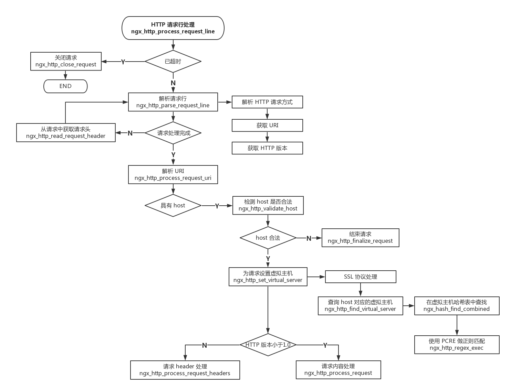

## nginx 功能介绍

Nginx因为它的稳定性、丰富的模块库、灵活的配置和低系统资源的消耗而闻名．业界一致认为它是Apache2.2＋mod_proxy_balancer的轻量级代替者，不仅是因为响应静态页面的速度非常快，而且它的模块数量达到Apache的近2/3。对proxy和rewrite模块的支持很彻底，还支持mod_fcgi、ssl、vhosts ，适合用来做mongrel clusters的前端HTTP响应。
nginx和Apache一样使用模块化设计，nginx模块包括内置模块和第三方模块，其中内置模块中包含主模块和事件模块。

nginx处理请求逻辑图

### nginx可以提供的服务

1. web 服务.
2. 负载均衡 （反向代理）
3. web cache（web 缓存）

### nginx 的优点

1. 高并发。静态小文件
2. 占用资源少。2万并发、10个线程，内存消耗几百M。
3. 功能种类比较多。web,cache,proxy。每一个功能都不是特别强。
4. 支持epoll模型，使得nginx可以支持高并发。
5. nginx 配合动态服务和Apache有区别。（FASTCGI 接口）
6. 利用nginx可以对IP限速，可以限制连接数。
7. 配置简单，更灵活。

### nginx应用场合

1. 静态服务器。（图片，视频服务）另一个lighttpd。并发几万，html，js，css，flv，jpg，gif等。
2. 动态服务，nginx——fastcgi 的方式运行PHP，jsp。（PHP并发在500-1500，MySQL 并发在300-1500）。
3. 反向代理，负载均衡。日pv2000W以下，都可以直接用nginx做代理。
4. 缓存服务。类似 SQUID,VARNISH。

### 主流web服务产品对比说明

#### Apache-特性

1. 2.2版本本身稳定强大，据官方说：其2.4版本性能更强。
2. prefork模式取消了进程创建开销，性能很高。
3. 处理动态业务数据时，因关联到后端的引擎和数据库，瓶颈不在与Apache本身。
4. 高并发时消耗系统资源相对多一些。
5. 基于传统的select模型。
6. 扩展库，DSO方法。

#### nginx-特性

1. 基于异步IO模型，（epoll，kqueue），性能强，能够支持上万并发。
2. 对小文件支持很好，性能很高（限静态小文件1M）。
3. 代码优美，扩展库必须编译进主程序。
4. 消耗代码资源比较低。
5. lighttpd（百度贴吧，豆瓣）
6. 基于异步IO模式，性能和nginx相近。
7. 扩展库是SO模式，比nginx要灵活。
8. 通过差距（mod_secdownload）可实现文件URL地址加密。

#### web服务产品性能对比测试

##### 静态数据性能对比

1. 处理静态文件Apache性能比nginx和lighttpd要差。
2. nginx在处理小文件优势明显。
3. 处理静态小文件（小于1M），nginx和lighttpd比Apache更有优势，lighttpd最强。

##### 动态数据性能对比

1. 处理动态内容三者相差不大，主要取决于PHP和数据库的压力。
2. 当处理动态数据时，三者差距不大，从测试结果看，Apache更有优势一点。这是因为处理动态数据能力取决于PHP和后端数据的提供服务能力。也就是说瓶颈不在web服务器上。
3. 一般PHP引擎支持的并发参考值300-1000，JAVA引擎并发300-1000，数据库的并发300-1000.

##### 为什么nginx的总体性能比Apache高。

1. nginx使用最新的epoll和kqueue网络IO模型，而Apache使用传统的select模式。
2. 目前Linux下能够承受高并发访问的squid、Memcached 都采用的是epoll网络IO模型。

### 如何选择WEB服务器：

静态业务：高并发、采用nginx，lighttpd，根据自己的掌握程度或公司的要求。
动态业务：采用nginx和Apache均可。
既有静态业务又有动态业务：nginx或Apache，不要多选要单选。
动态业务可以由前端代理（haproxy）,根据页面元素的类型，向后转发相应的服务器进行处理。
思想：我们工作都不要追求一步到位，满足需求的前提下，先用，然后逐步完善。
提示：nginx做web（Apache，lighttpd）、反向代理（haproxy,lvs,nat）及缓存服务器（squid）也是不错的。
最终建议：对外的业务nginx，对内的业务Apache（yum httpd mysql-server php）。

### 

