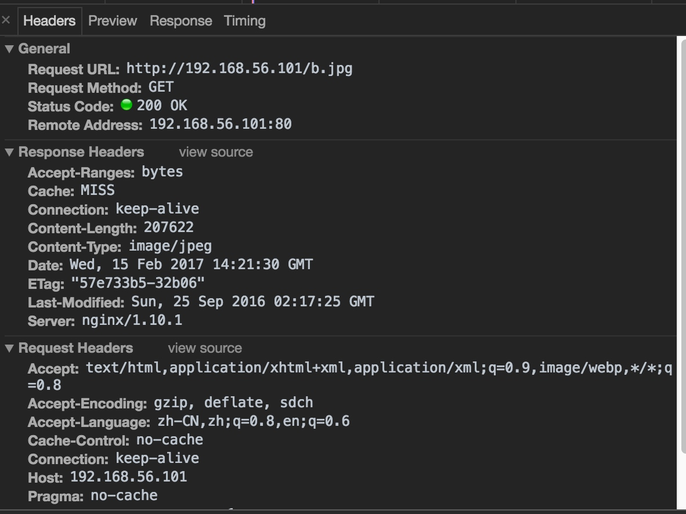

# 使用nginx做cache服务

### 配置文件

nginx.conf 主配置文件

```sh
worker_processes  1;
events {
    worker_connections  1024;
}
http {
    include       mime.types;
    default_type  application/octet-stream;
    sendfile        on;
    keepalive_timeout  65;
    log_format  main  '$remote_addr - $remote_user [$time_local] "$request" '
                      '$status $body_bytes_sent "$http_referer" '
                      '"$http_user_agent" "$http_x_forwarded_for"';

    access_log  logs/access.log  main;
#CDN Include
    include proxy.conf;
    include upstrem.conf;
    include blog.biglittleant.cn.conf;
    server {
        listen       80;
        server_name  localhost;
        error_page   500 502 503 504  /50x.html;
        location = /50x.html {
            root   html;
        }
    }
}
```

```
cat proxy.conf 
#CDN
proxy_temp_path /data/cdn_cache/proxy_temp_dir;
proxy_cache_path /data/cdn_cache/proxy_cache_dir levels=1:2 keys_zone=cache_one:50m inactive=1d max_size=1g;
proxy_connect_timeout 5;
proxy_read_timeout 60;
proxy_send_timeout 5;
proxy_buffer_size 16k;
proxy_buffers 4 64k;
proxy_busy_buffers_size 128k;
proxy_temp_file_write_size 128k;
proxy_next_upstream error timeout invalid_header http_500 http_502 http_503 http_404;
```

```
[root@data-1-1 conf]# cat upstrem.conf 
upstream blog.biglittleant.cn
{
        server 192.168.56.102:80 weight=10 max_fails=3;
}

[root@data-1-1 conf]# 
```

```
[root@data-1-1 conf]# cat blog.biglittleant.cn.conf 
server
{
    listen 80;
    server_name blog.biglittleant.cn;
    access_log logs/blog.biglittleant.cn-access.log main;
    location ~ .*\.(gif|jpg|png|html|htm|css|js|ico|swf|pdf)$
    {
        #Proxy 
        proxy_redirect off;
        proxy_next_upstream http_502 http_504 http_404 error timeout invalid_header;
        proxy_set_header            Host $host;
        proxy_set_header            X-real-ip $remote_addr;
        proxy_set_header            X-Forwarded-For $proxy_add_x_forwarded_for;
        proxy_pass    http://blog.biglittleant.cn;

        #Use Proxy Cache
        proxy_cache cache_one;
        proxy_cache_key "$host$request_uri";
        add_header Cache "$upstream_cache_status";
        proxy_cache_valid  200 304 301 302 8h;
        proxy_cache_valid 404 1m;
        proxy_cache_valid  any 2d;
    }
    location /
    {
                proxy_redirect off;
                proxy_next_upstream http_502 http_504 http_404 error timeout invalid_header;
                proxy_set_header            Host $host;
                proxy_set_header            X-real-ip $remote_addr;
                proxy_set_header            X-Forwarded-For $proxy_add_x_forwarded_for;
                proxy_pass    http://blog.biglittleant.cn;
                client_max_body_size 40m;
                client_body_buffer_size 128k;
                proxy_connect_timeout 60;
                proxy_send_timeout 60;
                proxy_read_timeout 60;
                proxy_buffer_size 64k;
                proxy_buffers 4 32k;
                proxy_busy_buffers_size 64k;

    }
}
```

mkdir /data/cdn_cache -p

```
[root@data-1-1 nginx]# ps -ef |grep nginx 
root       5620      1  0 21:31 ?        00:00:00 nginx: master process sbin/nginx
nginx      5621   5620  0 21:31 ?        00:00:00 nginx: worker process
nginx      5622   5620  0 21:31 ?        00:00:00 nginx: cache manager process
nginx      5623   5620  0 21:31 ?        00:00:00 nginx: cache loader process
```



cache未命中的情况


cache命中的情况

通过上面的图得到如下结论

1. 访问html的时候，不走缓存。
2. 第一次访问图片的时候，cache是miss的状态。
3. 第二次访问图片的时候，cache是hit的状态。

登录缓存服务器查看

分析nginx缓存过程
第一步：访问了两个URL：`http://192.168.56.101/index.html`,`http://192.168.56.101/b.jpg`。

第二步查看缓存目录：

```sh
[root@data-1-1 cdn_cache]# tree -A /data/cdn_cache/
/data/cdn_cache/
+-- proxy_cache_dir
|   +-- 9
|   |   +-- a8
|   |       +-- f28e02e3877f3826567907bcb0ebea89
|   +-- e
|       +-- 88
|           +-- 114250cf63938b2f9c60b2fb3e4bd88e
+-- proxy_temp_dir

6 directories, 2 files
```

第三步：
缓存配置参数：

```sh
proxy_cache_path /data/cdn_cache/proxy_cache_dir levels=1:2
```

第四步查看缓存内容：

第五步：分析过程
通过对key加密

```sh
echo -n '192.168.56.101/index.html' |md5sum |awk '{print $1}'       
114250cf63938b2f9c60b2fb3e4bd88e
 echo -n '192.168.56.101/b.jpg' |md5sum |awk '{print $1}'       
f28e02e3877f3826567907bcb0ebea89
```

分析结果：

1. nginx根据配置`levels=1:2`进行缓存。
2. 其中1表示MD5的最后一位。
3. 其中2表示MD5的倒数第三位和第三位。
4. 一个冒号表示一层。