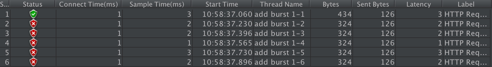
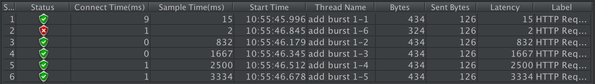
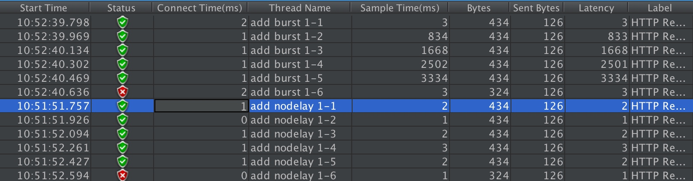
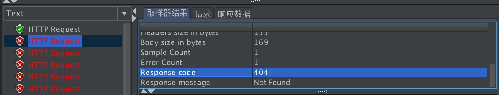
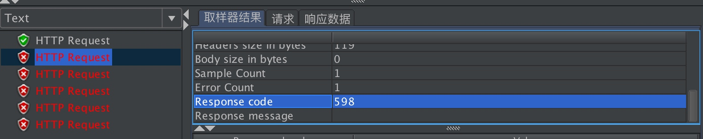

## 限流算法

### 令牌桶算法


算法思想是：

- 令牌以固定速率产生，并缓存到令牌桶中；
- 令牌桶放满时，多余的令牌被丢弃；
- 请求要消耗等比例的令牌才能被处理；
- 令牌不够时，请求被缓存。

### 漏桶算法


算法思想是：

- 水（请求）从上方倒入水桶，从水桶下方流出（被处理）；
- 来不及流出的水存在水桶中（缓冲），以固定速率流出；
- 水桶满后水溢出（丢弃）。
- 这个算法的核心是：缓存请求、匀速处理、多余的请求直接丢弃。
  相比漏桶算法，令牌桶算法不同之处在于它不但有一只“桶”，还有个队列，这个桶是用来存放令牌的，队列才是用来存放请求的。

从作用上来说，漏桶和令牌桶算法最明显的区别就是是否允许突发流量(burst)的处理，漏桶算法能够强行限制数据的实时传输（处理）速率，对突发流量不做额外处理；而令牌桶算法能够在限制数据的平均传输速率的同时允许某种程度的突发传输。

Nginx按请求速率限速模块使用的是**漏桶算法**，即能够强行保证请求的实时处理速度不会超过设置的阈值。

Nginx官方版本限制IP的连接和并发分别有两个模块：

- `limit_req_zone` 用来限制单位时间内的请求数，即速率限制,采用的漏桶算法 "leaky bucket"。
- `limit_req_conn` 用来限制同一时间连接数，即并发限制。

## limit_req_zone 参数配置

```shell
Syntax:	limit_req zone=name [burst=number] [nodelay];
Default:	—
Context:	http, server, location
limit_req_zone $binary_remote_addr zone=one:10m rate=1r/s;
```

- 第一个参数：$binary_remote_addr 表示通过remote_addr这个标识来做限制，“binary_”的目的是缩写内存占用量，是限制同一客户端ip地址。
- 第二个参数：zone=one:10m表示生成一个大小为10M，名字为one的内存区域，用来存储访问的频次信息。
- 第三个参数：rate=1r/s表示允许相同标识的客户端的访问频次，这里限制的是每秒1次，还可以有比如30r/m的。

```
limit_req zone=one burst=5 nodelay;
```

- 第一个参数：zone=one 设置使用哪个配置区域来做限制，与上面limit_req_zone 里的name对应。
- 第二个参数：burst=5，重点说明一下这个配置，burst爆发的意思，这个配置的意思是设置一个大小为5的缓冲区当有大量请求（爆发）过来时，超过了访问频次限制的请求可以先放到这个缓冲区内。
- 第三个参数：nodelay，如果设置，超过访问频次而且缓冲区也满了的时候就会直接返回503，如果没有设置，则所有请求会等待排队。

例子：

```
http {
    limit_req_zone $binary_remote_addr zone=one:10m rate=1r/s;
    server {
        location /search/ {
            limit_req zone=one burst=5 nodelay;
        }
}
```

下面配置可以限制特定UA（比如搜索引擎）的访问：

```shell
limit_req_zone  $anti_spider  zone=one:10m   rate=10r/s;
limit_req zone=one burst=100 nodelay;
if ($http_user_agent ~* "googlebot|bingbot|Feedfetcher-Google") {
    set $anti_spider $http_user_agent;
}
```

其他参数

```shell
Syntax:	limit_req_log_level info | notice | warn | error;
Default:	
limit_req_log_level error;
Context:	http, server, location
```

当服务器由于limit被限速或缓存时，配置写入日志。延迟的记录比拒绝的记录低一个级别。例子：`limit_req_log_level notice`延迟的的基本是info。

```shell
Syntax:	limit_req_status code;
Default:	
limit_req_status 503;
Context:	http, server, location
```

设置拒绝请求的返回值。值只能设置 400 到 599 之间。

## ngx_http_limit_conn_module 参数配置

这个模块用来限制单个IP的请求数。并非所有的连接都被计数。只有在服务器处理了请求并且已经读取了整个请求头时，连接才被计数。

```shell
Syntax:	limit_conn zone number;
Default:	—
Context:	http, server, location
limit_conn_zone $binary_remote_addr zone=addr:10m;

server {
    location /download/ {
        limit_conn addr 1;
    }
```

一次只允许每个IP地址一个连接。

```shell
limit_conn_zone $binary_remote_addr zone=perip:10m;
limit_conn_zone $server_name zone=perserver:10m;

server {
    ...
    limit_conn perip 10;
    limit_conn perserver 100;
}
```

可以配置多个limit_conn指令。例如，以上配置将限制每个客户端IP连接到服务器的数量，同时限制连接到虚拟服务器的总数。

```shell
Syntax:	limit_conn_zone key zone=name:size;
Default:	—
Context:	http
limit_conn_zone $binary_remote_addr zone=addr:10m;
```

在这里，客户端IP地址作为关键。请注意，不是`$ remote_addr`，而是使用`$ binary_remote_addr`变量。 `$ remote_addr`变量的大小可以从7到15个字节不等。存储的状态在32位平台上占用32或64字节的内存，在64位平台上总是占用64字节。对于IPv4地址，`$ binary_remote_addr`变量的大小始终为4个字节，对于IPv6地址则为16个字节。存储状态在32位平台上始终占用32或64个字节，在64位平台上占用64个字节。一个兆字节的区域可以保持大约32000个32字节的状态或大约16000个64字节的状态。如果区域存储耗尽，服务器会将错误返回给所有其他请求。

```shell
Syntax:	limit_conn_log_level info | notice | warn | error;
Default:	
limit_conn_log_level error;
Context:	http, server, location
```

当服务器限制连接数时，设置所需的日志记录级别。

```shell
Syntax:	limit_conn_status code;
Default:	
limit_conn_status 503;
Context:	http, server, location
```

设置拒绝请求的返回值。

## 实战

### 实例一 限制访问速率

```shell
limit_req_zone $binary_remote_addr zone=mylimit:10m rate=2r/s;
server { 
    location / { 
        limit_req zone=mylimit;
    }
}
```

上述规则限制了每个IP访问的速度为2r/s，并将该规则作用于根目录。如果单个IP在非常短的时间内并发发送多个请求，结果会怎样呢？


我们使用单个IP在10ms内发并发送了6个请求，只有1个成功，剩下的5个都被拒绝。我们设置的速度是2r/s，为什么只有1个成功呢，是不是Nginx限制错了？当然不是，是因为Nginx的限流统计是基于毫秒的，我们设置的速度是2r/s，转换一下就是500ms内单个IP只允许通过1个请求，从501ms开始才允许通过第二个请求。

### 实例二 burst缓存处理

我们看到，我们短时间内发送了大量请求，Nginx按照毫秒级精度统计，超出限制的请求直接拒绝。这在实际场景中未免过于苛刻，真实网络环境中请求到来不是匀速的，很可能有请求“突发”的情况，也就是“一股子一股子”的。Nginx考虑到了这种情况，可以通过burst关键字开启对突发请求的缓存处理，而不是直接拒绝。
来看我们的配置：

```shell
limit_req_zone $binary_remote_addr zone=mylimit:10m rate=2r/s;
server { 
    location / { 
        limit_req zone=mylimit burst=4;
    }
}
```

我们加入了burst=4，意思是每个key(此处是每个IP)最多允许4个突发请求的到来。如果单个IP在10ms内发送6个请求，结果会怎样呢？


相比实例一成功数增加了4个，这个我们设置的burst数目是一致的。具体处理流程是：1个请求被立即处理，4个请求被放到burst队列里，另外一个请求被拒绝。通过burst参数，我们使得Nginx限流具备了缓存处理突发流量的能力。

但是请注意：burst的作用是让多余的请求可以先放到队列里，慢慢处理。如果不加nodelay参数，队列里的请求不会立即处理，而是按照rate设置的速度，以毫秒级精确的速度慢慢处理。

### 实例三 nodelay降低排队时间

实例二中我们看到，通过设置burst参数，我们可以允许Nginx缓存处理一定程度的突发，多余的请求可以先放到队列里，慢慢处理，这起到了平滑流量的作用。但是如果队列设置的比较大，请求排队的时间就会比较长，用户角度看来就是RT变长了，这对用户很不友好。有什么解决办法呢？nodelay参数允许请求在排队的时候就立即被处理，也就是说只要请求能够进入burst队列，就会立即被后台worker处理，请注意，这意味着burst设置了nodelay时，系统瞬间的QPS可能会超过rate设置的阈值。nodelay参数要跟burst一起使用才有作用。

延续实例二的配置，我们加入nodelay选项：

```shell
limit_req_zone $binary_remote_addr zone=mylimit:10m rate=2r/s;
server { 
    location / { 
        limit_req zone=mylimit burst=4 nodelay;
    }
}
```

单个IP 10ms内并发发送6个请求，结果如下：


跟实例二相比，请求成功率没变化，但是总体耗时变短了。这怎么解释呢？实例二中，有4个请求被放到burst队列当中，工作进程每隔500ms(rate=2r/s)取一个请求进行处理，最后一个请求要排队2s才会被处理；实例三中，请求放入队列跟实例二是一样的，但不同的是，队列中的请求同时具有了被处理的资格，所以实例三中的5个请求可以说是同时开始被处理的，花费时间自然变短了。

但是请注意，虽然设置burst和nodelay能够降低突发请求的处理时间，但是长期来看并不会提高吞吐量的上限，长期吞吐量的上限是由rate决定的，因为nodelay只能保证burst的请求被立即处理，但Nginx会限制队列元素释放的速度，就像是限制了令牌桶中令牌产生的速度。

看到这里你可能会问，加入了nodelay参数之后的限速算法，到底算是哪一个“桶”，是漏桶算法还是令牌桶算法？当然还算是漏桶算法。考虑一种情况，令牌桶算法的token为耗尽时会怎么做呢？由于它有一个请求队列，所以会把接下来的请求缓存下来，缓存多少受限于队列大小。但此时缓存这些请求还有意义吗？如果server已经过载，缓存队列越来越长，RT越来越高，即使过了很久请求被处理了，对用户来说也没什么价值了。所以当token不够用时，最明智的做法就是直接拒绝用户的请求，这就成了漏桶算法。

### 示例四 自定义返回值

```shell
limit_req_zone $binary_remote_addr zone=mylimit:10m rate=2r/s;
server { 
    location / { 
        limit_req zone=mylimit burst=4 nodelay;
        limit_req_status 598;
    }
}
```

默认情况下 没有配置 status 返回值的状态：

自定义 status 返回值的状态：


