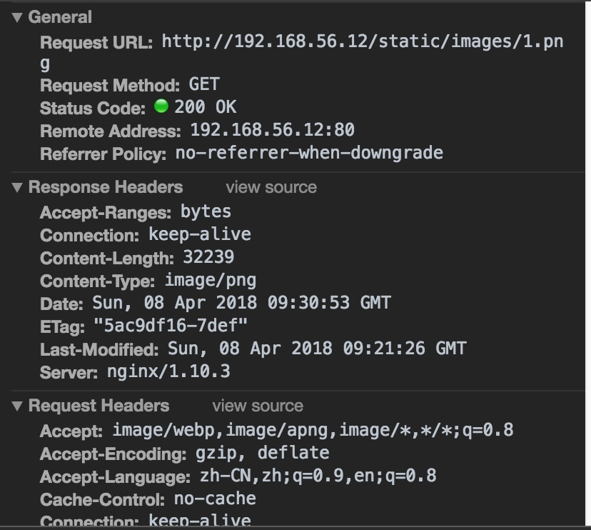
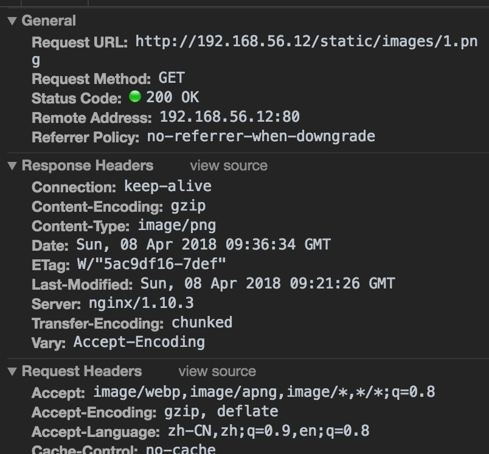
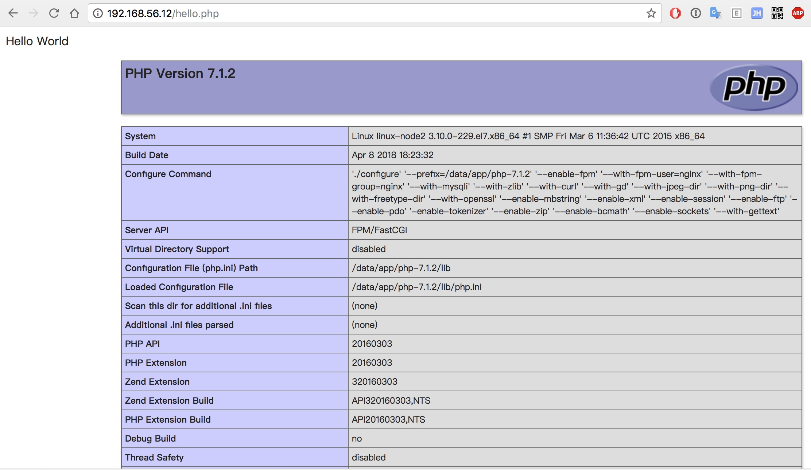

# nginx服务器做web服务器

## nginx 做静态服务器

HTML页面如下

```html
<!DOCTYPE html>
<html lang="en">
<head>
    <meta charset="UTF-8">
    <title>Title</title>
</head>
<body>

<h1>图片展示</h1>

<div>
    
</div>
</body>
</html>
```

上传相关文件，生成如下路径

```
tree html/
html/
├── index.html
└── static
    └── images
        └── 1.png

```

```
## 配置nginx.conf 配置文件
worker_processes  1;
events {
    worker_connections  1024;
}
http {
    include       mime.types;
    default_type  application/octet-stream;
    sendfile        on;
    keepalive_timeout  65;
    server {
        listen       80;
        server_name  localhost;
        location / {
            root   html;
            index  index.html index.htm;
        }
        error_page   500 502 503 504  /50x.html;
        location = /50x.html {
            root   html;
        }
    }
}
```

```
/data/app/nginx/sbin/nginx -t 
nginx: the configuration file /data/app/nginx-1.10.3/conf/nginx.conf syntax is ok
nginx: configuration file /data/app/nginx-1.10.3/conf/nginx.conf test is successful
/data/app/nginx/sbin/nginx -s reload  
```

浏览器访问：


这个时候我们可以把static静态页面给拆分出来

```
worker_processes  1;
events {
    worker_connections  1024;
}
http {
    include       mime.types;
    default_type  application/octet-stream;
    sendfile        on;
    keepalive_timeout  65;
    server {
        listen       80;
        server_name  localhost;
        location / {
            root   html;
            index  index.html index.htm;
        }
        location /static/ {
            root /data/db;
        }
        error_page   500 502 503 504  /50x.html;
        location = /50x.html {
            root   html;
        }
    }
}
```

将静态文件迁移到/data/db目录下，并重启nginx服务。

```shell
mv html/static/ /data/db/
/data/app/nginx/sbin/nginx -t 
/data/app/nginx/sbin/nginx -s reload  
```

测试图片是否能否获取：

```shell
curl -I http://192.168.56.12/static/images/1.png
HTTP/1.1 200 OK
Server: nginx/1.10.3
Date: Sun, 08 Apr 2018 09:31:35 GMT
Content-Type: image/png
Content-Length: 32239
Last-Modified: Sun, 08 Apr 2018 09:21:26 GMT
Connection: keep-alive
ETag: "5ac9df16-7def"
Accept-Ranges: bytes
```

### 对图片开启gzip压缩

```
worker_processes  1;
events {
    worker_connections  1024;
}
http {
    include       mime.types;
    default_type  application/octet-stream;
    sendfile        on;

    gzip on;
    gzip_min_length 1k;
    gzip_buffers    4 16k;
    gzip_http_version 1.1;
    gzip_comp_level 6;
    gzip_types image/png;
    gzip_vary on;
    
    keepalive_timeout  65;
    server {
        listen       80;
        server_name  localhost;
        location / {
            root   html;
            index  index.html index.htm;
        }
        location /static/ {
            root /data/db;
        }
        error_page   500 502 503 504  /50x.html;
        location = /50x.html {
            root   html;
        }
    }
}
```

```
/data/app/nginx/sbin/nginx -t 
/data/app/nginx/sbin/nginx -s reload  
```

对比两次响应头信息，开启gzip 压缩后响应头多了`Content-Encoding: gzip`，开启压缩成功。





## nginx 反向代理后端服务器

### 配置nginx环境

```
user  www www;
worker_processes 8;
error_log  /data/logs/nginx_error.log  crit;
pid        /usr/local/webserver/nginx/nginx.pid;
#Specifies the value for maximum file descriptors that can be opened by this process.
worker_rlimit_nofile 65535;
events
{
  use epoll;
  worker_connections 65535;
}
http
{
  include       mime.types;
  default_type  application/octet-stream;
  #charset  gb2312;
  server_names_hash_bucket_size 128;
  client_header_buffer_size 32k;
  large_client_header_buffers 4 32k;
  client_max_body_size 8m;
  sendfile on;
  tcp_nopush     on;
  keepalive_timeout 60;
  tcp_nodelay on;
include  gzip.conf;
include blog.biglittle.cn.conf;
```

`gzip.conf`文件内容

```shell
  gzip on;
  gzip_min_length  1k;
  gzip_buffers     4 16k;
  gzip_http_version 1.0;
  gzip_comp_level 2;
  gzip_types       text/plain application/x-javascript text/css application/xml;
  gzip_vary on;
```

`blog.biglittle.cn.conf`文件内容

```shell
##  server
  {
    listen 80 default;
    server_name blog.biglittleant.cn;
    index index.html index.htm index.php;
    root html;
    location ~ .*\.(php|php5)?$
    {
      fastcgi_pass  127.0.0.1:9000;
      fastcgi_index index.php;
      include fastcgi.conf;
    }
  }
```

`fastcgi.conf`文件内容

```shell
  fastcgi_connect_timeout 300;
  fastcgi_send_timeout 300;
  fastcgi_read_timeout 300;
  fastcgi_buffer_size 64k;
  fastcgi_buffers 4 64k;
  fastcgi_busy_buffers_size 128k;
  fastcgi_temp_file_write_size 128k;
```

### 安装PHP 环境

下载PHP文件，并安装基础依赖包

```sh
wget http://cn2.php.net/distributions/php-7.1.2.tar.gz
 yum -y install  libpng libpng-devel freetype freetype-devel libxml2 libxml2-devel zlib zlib-devel libcurl-devel libjpeg-turbo-devel openssl openssl-devel
```

编译安装

```sh
./configure --prefix=/data/app/php-7.1.2 --enable-fpm --with-fpm-user=nginx --with-fpm-group=nginx --with-mysqli --with-zlib --with-curl --with-gd --with-jpeg-dir --with-png-dir --with-freetype-dir --with-openssl --enable-mbstring --enable-xml --enable-session --enable-ftp --enable-pdo -enable-tokenizer --enable-zip --enable-bcmath --enable-sockets --with-gettext
make && make install 
ln -s /data/app/php-7.1.2/ /data/app/php7
cp php.ini-development /data/app/php7/lib/php.ini
cp sapi/fpm/php-fpm.service /usr/lib/systemd/system/
```

修改配置文件

```sh
vim /data/app/php7/lib/php.ini
# 查找 mysqli.default_socket，修改成：
mysqli.default_socket = /data/app/mysql/mysql.sock
date.timezone = PRC
```

好了，PHP 7 已经安装好，下面验证一下

```sh
shell > /data/app/php7/bin/php -v
PHP 7.0.5 (cli) (built: Apr  8 2016 00:08:04) ( NTS )
Copyright (c) 1997-2016 The PHP Group
Zend Engine v3.0.0, Copyright (c) 1998-2016 Zend Technologies
```

再查看下已经安装的模块

```sh
/data/app/php7/bin/php -m
```

接着配置 `php-fpm`文件

```sh
# copy php-fpm 的配置文档
cp /data/app/php7/etc/php-fpm.conf.default /data/app/php7/etc/php-fpm.conf
cp /data/app/php7/etc/php-fpm.d/www.conf.default /data/app/php7/etc/php-fpm.d/www.conf
```

> 其中 www.conf 中要留意以下这个值 `listen = 127.0.0.1:9000`

配置 php-fpm 启动服务脚本

修改启动脚本，把里边 prefix 相关的内容用实际路径代替

```sh
vim /usr/lib/systemd/system/php-fpm.service
PIDFile=/usr/local/php7/var/run/php-fpm.pid
ExecStart=/usr/local/php7/sbin/php-fpm --nodaemonize --fpm-config /usr/local/php7/etc/php-fpm.conf
# 重新载入 systemd
systemctl daemon-reload
systemctl start php-fpm 
ss -lntup |grep 9000
```

### 编写PHP测试文件

`vim /data/app/nginx/html/hello.php` 编写一个PHP测试文件。

```PHP
<html>
 <head>
  <title>PHP 测试</title>
 </head>
 <body>
 <?php echo '<p>Hello World</p>'; ?>
 <?php phpinfo(); ?>
 </body>
</html>
```

### 测试是否可用

```shell
/data/app/nginx/sbin/nginx -t 
/data/app/nginx/sbin/nginx -s reload  
```

