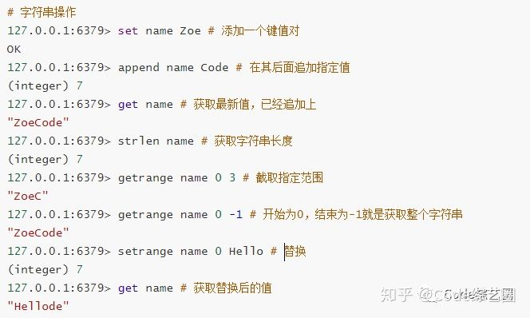
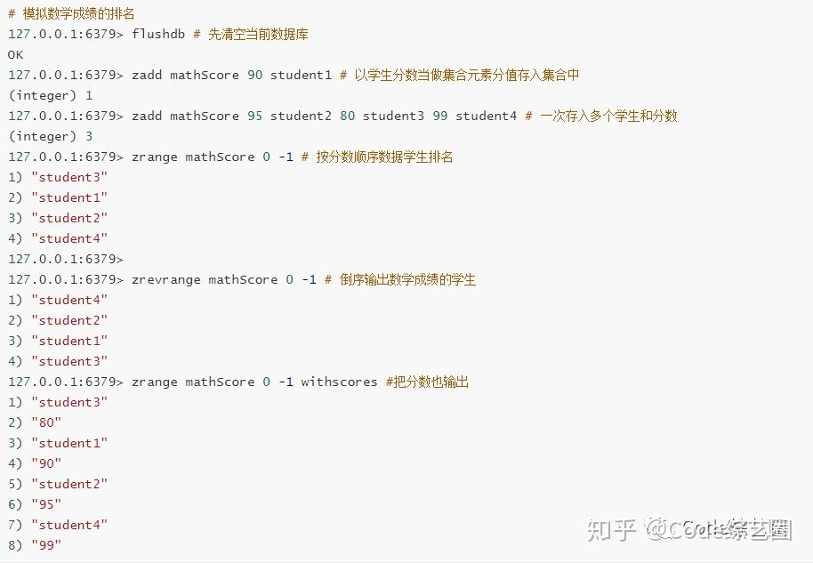

# Redis的数据类型及应用场景

Redis默认有16个数据库(编号为0~15)，默认使用第0个，通过命令select任意切换数据库，和MySql切换数据库一个道理；各数据库之间的数据是隔离的，先启动服务端，再启动客户端，然后开干，如下演示：

Select命令，用于切换数据库


清除数据，主要是测试时使用，在生产环境是杜绝使用这个命令的，如下演示：

> Flushdb清除当前库中的数据
> Flushall清除所有库中的数据


Key获取、移除、判断是否存在，如下演示

> Keys 获取Key
> Move 移动指定Key到指定数据库
> Exists 判断Key是否存在


查看指定Key对应值类型，如下：

type key


Redis中基本的五种数据结构，分别是字符串string、哈希hash、列表list、集合set、有序集合zset，存储的数据结构大概如下图；


string

非常常用的类型，搞过Redis的应该都用过。着重分享以下命令：

> set key value : 新增或更新字符串键值对
> mset key value [key1 value1 ...]：批量新增或更新键值对
> setnx key value ：如果key不存在就添加，否则就失败
> setex key seconds value：设置简直对的时同时设置过期时间
> get key ：获取指定key的值
> mget key [key1 key2 ...]：获取多个key的值
> del key [key1 key2 ...]：删除指定key
> expire key seconds：设置指定key过期时间，以秒为单位
> ttl key：查看指定key还剩余多长时间
> incr key：将指定key存储的数值加1
> decr key：将指定key存储的数值减1
> incrby key step：将指定key存储的数值加上step
> decrby key step ：将指定key存储的数值减去step


**单值缓存：**即简单键值对数据缓存；有一些数据需要共享，比如在没有统一授权中心的多个系统中，可以通过相同的算法共享token字符串进行各系统统一认证；


**对象缓存：**比如之前都喜欢用Session保存用户数据，然后在每个网页中进行使用，但对于分布式或是集群系统就需要做Session共享了，一般会将用户信息转为json字符串进行缓存；


对于简单的对象缓存，也可以用mset和mget实现，但使用相对不如上例方便，如下：


以上只是用于共享数据，但其实经常会用于缓存一些高频率访问但不频繁修改的数据上。比如采集设备数据，需要实时核对设备是否正确，当采集比较频繁，如传感器数据时，核对的设备信息不可能实时从数据库中查，需将其进行缓存，减轻数据库压力的同时，也能提高效率。

可能看到这，有小伙伴会问key值中的冒号啥意思，其实这里是用来分层归类的，就比如userData:userId:userName，理解为：用户数据中指定用户的用户名。


**计数器：**有没有遇见一种需要递增的数据编号，比如说订单编号：202009290001，后四位不断的递增，单体程序还稍微好处理一点，但如果是分布式系统或集群就有点意思了，所以存在Redis中进行统一递增是不错的选择，针对数据量大的，还可以进行分段计数。


**文章阅读数或网页浏览数统计：**常见博客文章或是公众号都有阅读数统计，或是自己开发的站点需要统计页面访问量，用Redis也可以轻松实现，换其他方式估计得费点心思。


**分布式锁：**单体程序，多线程通过线程锁来控制资源抢占，对于分布式系统用线程锁就不行了，借助于setnx(set if not exists的缩写) 来完成，及如果没有值就能新增成功，否则就失败，和资源被占就要等待原理是一样的，当然还得考虑对应值的过期和删除，不然一直占用也不行。


**字符串的常规操作**：比如截取字符串、获取字符串长度等操作。



**hash**

hash的相关命令一般以h开头，着重分享以下命令：

> hset key field value : 新增或更新key对应字段的值；
> hsetnx key field value：新增一个不存在Key的字段值；
> hmset key field value [field value ...]：在指定Key上存储多个字段和值
> hget key field：获取指定key中指定字段的值；
> hdel key field [field1...]：删除指定Key值的指定字段
> hlen key：获取指定key中的字段的数量
> hgetall key：获取指定key中所有的字段值
> hincrby key field step：指定key中字段值增加step

**对象缓存：**string也能做，为什么还要用hash?，string一般用于简单对象的缓存，比如字段不多，记录也不多的情况，便于序列化解析。

平时项目中有配置信息或下拉数据信息，会用于各个页面，这种变化频率不高，但需频繁的读取的数据，将其进行缓存减少数据库访问是不错的选择：


**当做数据库：**有一个同学，做硬件相关系统，通常关于硬件的相关的参数配置都放在内存中，但由于参数过多时，维护是非常不爽的事，而且稍微一个参数的改动，就会重新发布程序。有些也采用SQLite来存储，对于高效访问和修改，Redis却是相对比较优的选择：

如：多个主机，每个主机中有不同的属性，每个属性有对应的值。


**做购物车(之前学习记录的)**：因为大型的网站，用户很多，将每个人的购物车信息都进行关系存储，做以下页面是有点难处的。所以用Redis做比较高效，至于一些明细信息，可以通过商品ID从关系数据库中查找。


相对于string来说，对于对象存储，不用来回进行序列化，减少内存和CPU的消耗，但设置过期不能到具体字段，只能针对Key设置。

**list**

着重分享以下命令：

> lpush key value [value1 ...] ：在指定key的列表左边插入一个或多个值；
> rpush key value [value1 ...] ：在指定key的列表右边插入一个或多个值；
> lpop key ：从指定key的列表左边取出第一个值；
> rpop key：从指定key的列表右边取出第一个值；
> lrange key start end：从指定key列表中获取指定区间内的数据；
> blpop key [key1 ...] timeout：从指定key列表中左边取出第一个值,若列表中没有元素就等待timeout时间，如果timeout为0就一直等待。
> brpop key [key1 ...] timeout：从指定key列表中右边取出第一个值,若列表中没有元素就等待timeout时间，如果timeout为0就一直等待。
> lset key index value：将指定下标的值更新为value，


**用于模拟数据结构：**

- 栈：先进后出，lpush+lpop 或 rpush+rpop；

- 队列：先进先出，lpush+rpop 或 rpush+lpop；

- 阻塞队列：先进先出，如果列表没有元素就等待，lpush+brpop或rpush+blpop；

- **用于数据传输桥梁：**经常会遇见采集一些仪器相关数据的需求，但通常方式都会让仪器生成数据文件，供其它程序进行解析，也有用Redis中List作为桥梁传输数据的，减少自己生成文件的过程，通过用List的方式，一边塞进去，一边定时取出，然后发送到远程。同样的道理，也可以用于一些消息的推送，比如关注了一个公众号，要发送给订阅者，首先公众号发表文章到List，有一个后台任务程序定时进行取出发给订阅者，这里就是拿公众号举一个例，并非公众号是这么实现。

  

  **模拟消息推送**


专门有一个后台任务程序从关注者消息列表中取出消息，依次发给每个关注者。

**list常规操作(获取，更新，插入)：**


**set**

set命令一般以s开头，里面元素无序且不重复，着重分享以下命令：

> sadd key member [member ...]：在集合中增加一个或多个元素；
> srem key member [member ...]：从集合中删除一个或多个元素；
> smembers key：获取集合中的所有元素；
> scard key：获取集合中的元素个数；
> sismember key member：判断指定member是否在集合中；
> srandmember key [count]：从集合中获取count个元素，不从集合中删除；
> spop key [count]：从集合中获取count个元素，从集合中删除
> sinter key [key1 ...]：指定多个集合进行交集运算；
> sinterstore dest key [key1 ...]：指定多个集合进行交集运算，存入dest集合；
> sunion key [key1 ...]：指定多个集合进行并集运算；
> sunionstore dest key [key1 ...]：指定多个集合进行并集运算，存入dest集合；
> sdiff key [key1 ...]：指定多个集合进行差集运算；
> sdiffstore dest key [key1 ...]：指定多个集合进行差集运算，并存入dest集合；

**抽奖逻辑：**抽奖小伙伴们不陌生了吧，不管是公司年会抽奖，还是公众号参与抽奖，应该几乎不用亲手抓阄了吧。都是通过程序，把人员都放在一起，然后随机抽取，set很符合这种应用场景，如下：


**文章点赞**：发表文章之后，可以进行点赞、取消点赞等相关操作；


**共同好友统计**


**zset**

zset的命令一般以z开头，里面元素是有序不可重复的。和Set用法基本一样，只是每个元素中多了一个分值，用于元素排序。

> zadd key score member [(score member)...]：往有序集合中添加带分值的元素；
> zrem key member [member...]：从有序集合中删除成员；
> zscore key member：返回集合中指定成员的分值；
> zcard key：统计集合中元素个数；
> zrange key start stop [withscores]：返回指定范围的元素，withscores代表返回的元素包含对应的分值。
> zreverange key start stop [withscores]：返回指定范围的倒序元素，withscores代表返回的元素包含对应的分值。
> 同set一样也可以进行交集、并集、差集的集合运算。

**用于排名**：比如考试成绩的排名，新闻热度排行榜，直播打赏排名等。



**新闻热榜：**


**1、BitMap是什么**

​	就是通过一个bit位来表示某个元素对应的值或者状态,其中的key就是对应元素本身。我们知道8个bit可以组成一个Byte，所以bitmap本身会极大的节省储存空间。

**2、Redis中的BitMap**

Redis从2.2.0版本开始新增了`setbit`,`getbit`,`bitcount`等几个bitmap相关命令。虽然是新命令，但是并没有新增新的数据类型，因为`setbit`等命令只不过是在`set`上的扩展。

3、**setbit命令介绍**

指令 `SETBIT key offset value`
设置或者清空key的value(字符串)在offset处的bit值(只能只0或者1)。

**4、使用场景一：用户签到**

很多网站都提供了签到功能(这里不考虑数据落地事宜)，并且需要展示最近一个月的签到情况，如果使用bitmap我们怎么做？一言不合亮代码！
根据日期 offset =hash % 365  ； key = 年份#用户id

```
127.0.0.1:6379> setbit 2020#zkk 1 1
(integer) 0
127.0.0.1:6379> setbit 2020#zkk 2 1
(integer) 0
127.0.0.1:6379> bitcount 2020#zkk
(integer) 2
```

**6、使用场景二：统计活跃用户**

使用时间作为cacheKey，然后用户ID为offset，如果当日活跃过就设置为1
那么我该如果计算某几天/月/年的活跃用户呢(暂且约定，统计时间内只有有一天在线就称为活跃)，有请下一个redis的命令
命令 `BITOP operation destkey key [key ...]`
说明：对一个或多个保存二进制位的字符串 key 进行位元操作，并将结果保存到 destkey 上。
说明：BITOP 命令支持 AND 、 OR 、 NOT 、 XOR 这四种操作中的任意一种参数

20190216 活跃用户 【1，2】
20190217 活跃用户 【1】
统计20190216~20190217 总活跃用户数: 1

```
127.0.0.1:6379> setbit 20190216 1 1
(integer) 1
127.0.0.1:6379> setbit 20190216 2 1
(integer) 1
127.0.0.1:6379> setbit 20190217 1 1
(integer) 0
127.0.0.1:6379> bitop and desk1 20190216 20190217
(integer) 1
127.0.0.1:6379> bitcount desk1
(integer) 1
127.0.0.1:6379> bitop or desk2 20190216 20190217
(integer) 1
127.0.0.1:6379> bitcount desk2
(integer) 2
127.0.0.1:6379>
```

**7、使用场景三：用户在线状态**

开发一个查询当前用户是否在线的接口。使用bitmap是一个节约空间效率又高的一种方法，只需要一个key，然后用户ID为offset，如果在线就设置为1，不在线就设置为0，和上面的场景一样，5000W用户只需要6MB的空间。


## Hyper LogLog

​	Hyper LogLog 计数器的名称是具有自描述性的。 你可以仅仅使用`loglog(Nmax)+ O(1)`位来估计基数为 Nmax 的集合的基数。

## Redis Hyperloglog 操作

要进行 Redis Hyperloglog 的操作，我们可以使用以下三个命令：

- `PFADD`
- `PFCOUNT`
- `PFMERGE`

我们用一个实际的例子来解释这些命令。比如，有这么个场景，用户登录到系统，我们需要在一小时内统计不同的用户。 因此，我们需要一个 key，例如 USER:LOGIN:2019092818。 换句话说，我们要统计在 2019 年 09 月 28 日下午 18 点至 19 点之间发生用户登录操作的非重复用户数。对于将来的时间，我们也需要使用对应的 key 进行表示，比如 2019111100、2019111101、2019111102 等。

我们假设，用户 A、B、C、D、E 和 F 在下午 18 点至 19 点之间登录了系统。

```
127.0.0.1:6379> pfadd USER:LOGIN:2019092818 A
(integer) 1
127.0.0.1:6379> pfadd USER:LOGIN:2019092818 B C D E F
(integer) 1
127.0.0.1:6379>
```

当进行计数时，你会得到预期的 6。

```
127.0.0.1:6379> pfcount USER:LOGIN:2019092818
(integer) 6
```

如果 A 和 B 在这个时间内多次登录系统，你也将得到相同的结果，因为我们仅保留不同的用户。

```
127.0.0.1:6379> pfadd USER:LOGIN:2019092818 A B
(integer) 0
127.0.0.1:6379> pfcount USER:LOGIN:2019092818
(integer) 6
```

如果用户 A~F 和另外一个其他用户 G 在下午 19 点至下午 20 点之间登录系统：

```
127.0.0.1:6379> pfadd USER:LOGIN:2019092819 A B C D E F G
(integer) 1
127.0.0.1:6379> pfcount USER:LOGIN:2019092819
(integer) 7
```

现在，我们有两个键 USER:LOGIN:2019092818 和 USER:LOGIN:2019092819，如果我们想知道在 18 点到 20 点（2 小时）之间有多少不同的用户登录到系统中，我们可以直接使用`pfcount`命令对两个键进行合并计数：

```
127.0.0.1:6379> pfcount USER:LOGIN:2019092818 USER:LOGIN:2019092819
(integer) 7
```

如果我们需要保留键值而避免一遍又一遍地计数，那么我们可以将键合并为一个键 USER:LOGIN:2019092818-19，然后直接对该键进行`pfcount`操作，如下所示。

```
127.0.0.1:6379> pfmerge USER:LOGIN:2019092818-19 USER:LOGIN:2019092818 USER:LOGIN:2019092819
OK
127.0.0.1:6379> pfcount USER:LOGIN:2019092818-19
(integer) 7
```

