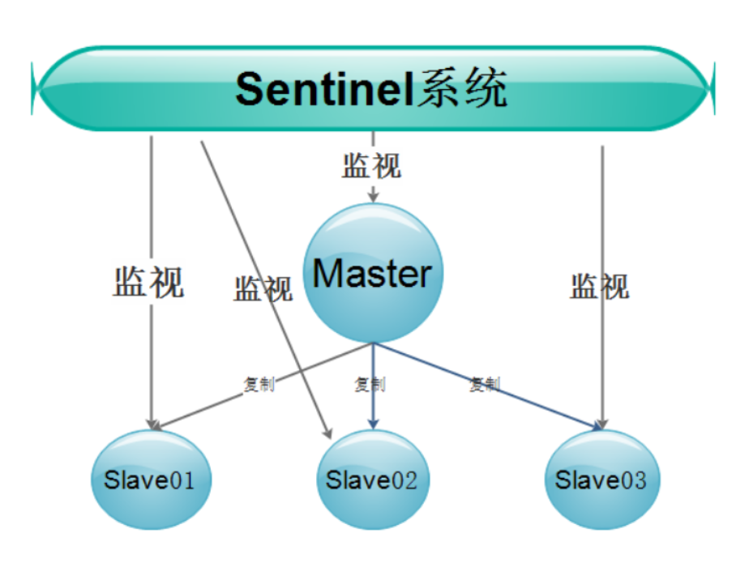

## Redis哨兵模式

### 1.Redis sentinel介绍

Redis Sentinel是Redis高可用的实现方案。Sentinel是一个管理多个Redis实例的工具，它可以实现对Redis的监控、通知、自动故障转移。

### 2.redis sentinel的主要功能

Sentinel的主要功能包括主节点存活检测、主从运行情况检测、自动故障转移（failover）、主从切换。Redis的Sentinel最小配置是一主一从。 Redis的Sentinel系统可以用来管理多个Redis服务器，该系统可以执行以下四个任务：

- 监控

  Sentinel会不断的检查主服务器和从服务器是否正常运行。

- 通知

  当被监控的某个Redis服务器出现问题，Sentinel通过API脚本向管理员或者其他的应用程序发送通知。

- 自动故障转移

  当主节点不能正常工作时，Sentinel会开始一次自动的故障转移操作，它会将与失效主节点是主从关系的其中一个从节点升级为新的主节点， 并且将其他的从节点指向新的主节点。

- 配置提供者

  在Redis Sentinel模式下，客户端应用在初始化时连接的是Sentinel节点集合，从中获取主节点的信息。

3.redis sentinel的工作流程

Sentinel是Redis的高可用解决方案之一

由一个或多个Sentinel实例组成的Sentinel系统可以监视任意多个主服务器，以及所有从服务器，并在被监视的主服务器进入下线状态时，自动将下线主服务器属下的某个从服务器升级为新的主服务器，然后由新的主服务器代替已下线的主服务器继续处理命令请求 。如下图：



Sentinel负责监控集群中的所有主、从Redis，当发现主故障时，Sentinel会在所有的从中选一个成为新的主。并且会把其余的从变为新主的从。同时那台有问题的旧主也会变为新主的从，也就是说当旧的主即使恢复时，并不会恢复原来的主身份，而是作为新主的一个从。

在Redis高可用架构中，Sentinel往往不是只有一个，而是有3个或者以上。目的是为了让其更加可靠，毕竟主和从切换角色这个过程还是蛮复杂的。


## 4、相关概念

- 主观失效

  SDOWN（subjectively down）,直接翻译的为”主观”失效,即当前sentinel实例认为某个redis服务为”不可用”状态.

- 客观失效

  ODOWN（objectively down）,直接翻译为”客观”失效,即多个sentinel实例都认为master处于”SDOWN”状态,那么此时master将处于ODOWN,ODOWN可以简单理解为master已经被集群确定为”不可用”,将会开启failover

## 5、环境说明

<table>
<thead>
<tr>
<th>主机名称</th>
<th>IP地址</th>
<th>redis版本和角色说明</th>
</tr>
</thead>
<tbody>
<tr>
<td>redis-master</td>
<td>192.168.56.11:6379</td>
<td>redis 5.0.3（主）</td>
</tr>
<tr>
<td>redis-slave01</td>
<td>192.168.56.12:6379</td>
<td>redis 5.0.3（从）</td>
</tr>
<tr>
<td>redis-slave02</td>
<td>192.168.56.13:6379</td>
<td>redis 5.0.3（从）</td>
</tr>
<tr>
<td>redis-master</td>
<td>192.168.56.11:26379</td>
<td>Sentinel01</td>
</tr>
<tr>
<td>redis-slave01</td>
<td>192.168.56.12:26379</td>
<td>Sentinel02</td>
</tr>
<tr>
<td>redis-slave02</td>
<td>192.168.56.13:26379</td>
<td>Sentinel03</td>
</tr>
</tbody>
</table>

## 6、部署Sentinel

Sentinel.conf配置文件主要参数解析：

```
# 端口
port 26379

# 是否后台启动 以守护进程的方式进行
daemonize yes

# pid文件路径
pidfile /var/run/redis-sentinel.pid

# 日志文件路径
logfile "/var/log/sentinel.log"

# 定义工作目录
dir /tmp

# 定义Redis主的别名, IP, 端口，这里的2指的是需要至少2个Sentinel认为主Redis挂了才最终会采取下一步行为
sentinel monitor mymaster 127.0.0.1 6379 2

# 如果mymaster 30秒内没有响应，则认为其主观失效
sentinel down-after-milliseconds mymaster 30000

# 如果master重新选出来后，其它slave节点能同时并行从新master同步数据的台数有多少个，显然该值越大，所有slave节点完成同步切换的整体速度越快，但如果此时正好有人在访问这些slave，可能造成读取失败，影响面会更广。最保守的设置为1，同一时间，只能有一台干这件事，这样其它slave还能继续服务，但是所有slave全部完成缓存更新同步的进程将变慢。
sentinel parallel-syncs mymaster 1

# 该参数指定一个时间段，在该时间段内没有实现故障转移成功，则会再一次发起故障转移的操作，单位毫秒
sentinel failover-timeout mymaster 180000

# 不允许使用SENTINEL SET设置notification-script和client-reconfig-script。
sentinel deny-scripts-reconfig yes
```

修改三台Sentinel的配置文件，如下

```
[root@redis-master ~]# grep -Ev "^$|#" /usr/local/redis/sentinel.conf 
port 26379
daemonize yes
pidfile "/var/run/redis-sentinel.pid"
logfile "/var/log/sentinel.log"
dir "/tmp"
sentinel monitor mymaster 192.168.56.11 6379 2
sentinel down-after-milliseconds mymaster 30000
sentinel parallel-syncs mymaster 1
sentinel failover-timeout mymaster 180000
sentinel deny-scripts-reconfig yes

[root@redis-slave01 ~]# grep -Ev "^$|#" /usr/local/redis/sentinel.conf 
port 26379
daemonize yes
pidfile "/var/run/redis-sentinel.pid"
logfile "/var/log/sentinel.log"
dir "/tmp"
sentinel monitor mymaster 192.168.56.11 6379 2
sentinel down-after-milliseconds mymaster 30000
sentinel parallel-syncs mymaster 1
sentinel failover-timeout mymaster 180000
sentinel deny-scripts-reconfig yes

[root@redis-slave02 ~]# grep -Ev "^$|#" /usr/local/redis/sentinel.conf 
port 26379
daemonize yes
pidfile "/var/run/redis-sentinel.pid"
logfile "/var/log/sentinel.log"
dir "/tmp"
sentinel monitor mymaster 192.168.56.11 6379 2
sentinel down-after-milliseconds mymaster 30000
sentinel parallel-syncs mymaster 1
sentinel failover-timeout mymaster 180000
sentinel deny-scripts-reconfig yes
```

## 7、启动Sentinel

启动的顺序：主Redis --> 从Redis --> Sentinel1/2/3

```
[root@redis-master ~]# redis-sentinel /usr/local/redis/sentinel.conf 
[root@redis-master ~]# ps -ef |grep redis
root      1295     1  0 14:03 ?        00:00:06 /usr/local/redis/src/redis-server 192.168.56.11:6379
root      1407     1  1 14:40 ?        00:00:00 redis-sentinel *:26379 [sentinel]
root      1412  1200  0 14:40 pts/1    00:00:00 grep --color=auto redis

[root@redis-slave01 ~]# redis-sentinel /usr/local/redis/sentinel.conf 
[root@redis-slave01 ~]# ps -ef |grep redis
root      1625     1  0 14:04 ?        00:00:06 /usr/local/redis/src/redis-server 192.168.56.12:6379
root      1715     1  1 14:41 ?        00:00:00 redis-sentinel *:26379 [sentinel]
root      1720  1574  0 14:41 pts/0    00:00:00 grep --color=auto redis

[root@redis-slave02 ~]# redis-sentinel /usr/local/redis/sentinel.conf 
[root@redis-slave02 ~]# ps -ef |grep redis
root      1628     1  0 14:07 ?        00:00:06 /usr/local/redis/src/redis-server 192.168.56.13:6379
root      1709     1  0 14:42 ?        00:00:00 redis-sentinel *:26379 [sentinel]
root      1714  1575  0 14:42 pts/0    00:00:00 grep --color=auto redis
```

## 8 、Sentinel 总结

#### 1、Sentinel的作用：

A、Master 状态监测

B、如果Master 异常，则会进行Master-slave 转换，将其中一个Slave作为Master，将之前的Master作为Slave 

C、Master-Slave切换后，master_redis.conf、slave_redis.conf和sentinel.conf的内容都会发生改变，即master_redis.conf中会多一行slaveof的配置，sentinel.conf的监控目标会随之调换

#### 2、Sentinel的工作方式:

1)：每个Sentinel以每秒钟一次的频率向它所知的Master，Slave以及其他Sentinel实例发送一个PING命令 
2)：如果一个实例（instance）距离最后一次有效回复 PING 命令的时间超过 down-after-milliseconds 选项所指定的值，则这个实例会被 Sentinel 标记为**主观下线**。 
3)：如果一个Master被标记为主观下线，则正在监视这个Master的所有 Sentinel 要以每秒一次的频率确认Master的确进入了主观下线状态。 
4)：当有足够数量的 Sentinel（大于等于配置文件指定的值）在指定的时间范围内确认Master的确进入了主观下线状态， 则Master会被标记为**客观下线** 
5)：在一般情况下， 每个 Sentinel 会以每10 秒一次的频率向它已知的所有Master，Slave发送 INFO 命令 
6)：当Master被 Sentinel 标记为客观下线时，Sentinel 向下线的 Master 的所有 Slave 发送 INFO 命令的频率会从 10 秒一次改为每秒一次 
7)：若没有足够数量的 Sentinel 同意Master 已经下线， Master 的客观下线状态就会被移除。 
若 Master 重新向 Sentinel 的 PING 命令返回有效回复， Master 的主观下线状态就会被移除。

主从同步原理：

在Slave启动并连接到Master之后，它将主动发送一个SYNC命令。此后Master将启动后台存盘进程，同时收集所有接收到的用于修改数据集的命令，在后台进程执行完毕后，Master将传送整个数据库文件到Slave，以完成一次完全同步。而Slave服务器在接收到数据库文件数据之后将其存盘并加载到内存中。此后，Master继续将所有已经收集到的修改命令，和新的修改命令依次传送给Slaves，Slave将在本次执行这些数据修改命令，从而达到最终的数据同步。
   如果Master和Slave之间的链接出现断连现象，Slave可以自动重连Master，但是在连接成功之后，一次完全同步将被自动执行。