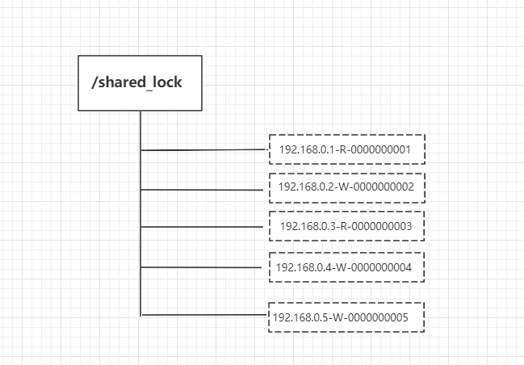
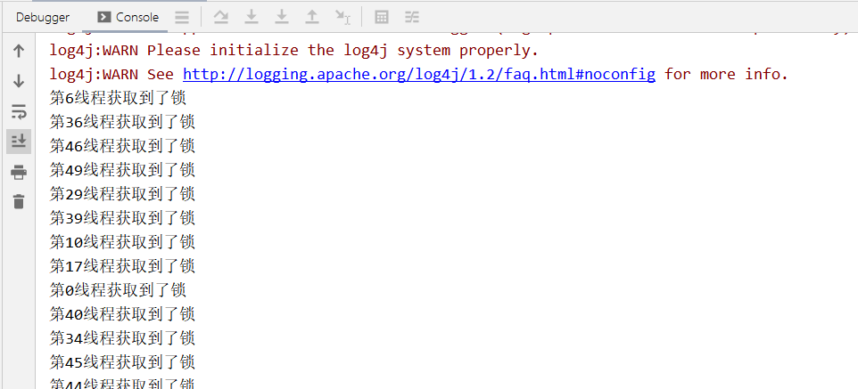

## Zookeeper 分布式锁实现原理

分布式锁是控制分布式系统之间同步访问**共享资源**的一种方式。

下面介绍 zookeeper 如何实现分布式锁，讲解排他锁和共享锁两类分布式锁。

### 排他锁

排他锁（Exclusive Locks），又被称为写锁或独占锁，如果事务T1对数据对象O1加上排他锁，那么整个加锁期间，只允许事务T1对O1进行读取和更新操作，其他任何事务都不能进行读或写。

定义锁：

```
/exclusive_lock/lock
```

**实现方式：**

利用 zookeeper 的同级节点的唯一性特性，在需要获取排他锁时，所有的客户端试图通过调用 create() 接口，在 **/exclusive_lock** 节点下创建临时子节点 **/exclusive_lock/lock**，最终只有一个客户端能创建成功，那么此客户端就获得了分布式锁。同时，所有没有获取到锁的客户端可以在 **/exclusive_lock** 节点上注册一个子节点变更的 watcher 监听事件，以便重新争取获得锁。

### 共享锁

共享锁（Shared Locks），又称读锁。如果事务T1对数据对象O1加上了共享锁，那么当前事务只能对O1进行读取操作，其他事务也只能对这个数据对象加共享锁，直到该数据对象上的所有共享锁都释放。

定义锁:

```
/shared_lock/[hostname]-请求类型W/R-序号
```

**实现方式：**

1、客户端调用 create 方法创建类似定义锁方式的临时顺序节点。




2、客户端调用 getChildren 接口来获取所有已创建的子节点列表。

3、判断是否获得锁，对于读请求如果所有比自己小的子节点都是读请求或者没有比自己序号小的子节点，表明已经成功获取共享锁，同时开始执行度逻辑。对于写请求，如果自己不是序号最小的子节点，那么就进入等待。

4、如果没有获取到共享锁，读请求向比自己序号小的最后一个写请求节点注册 watcher 监听，写请求向比自己序号小的最后一个节点注册watcher 监听。

实际开发过程中，可以 curator 工具包封装的API帮助我们实现分布式锁。

```
<dependency>
  <groupId>org.apache.curator</groupId>
  <artifactId>curator-recipes</artifactId>
  <version>x.x.x</version>
</dependency>
```

curator 的几种锁方案 ：

- 1、**InterProcessMutex**：分布式可重入排它锁
- 2、**InterProcessSemaphoreMutex**：分布式排它锁
- 3、**InterProcessReadWriteLock**：分布式读写锁

下面例子模拟 50 个线程使用重入排它锁 InterProcessMutex 同时争抢锁：

## 实例

```
public class InterprocessLock {
    public static void main(String[] args)  {
        CuratorFramework zkClient = getZkClient();
        String lockPath = "/lock";
        InterProcessMutex lock = new InterProcessMutex(zkClient, lockPath);
        //模拟50个线程抢锁
        for (int i = 0; i < 50; i++) {
            new Thread(new TestThread(i, lock)).start();
        }
    }


    static class TestThread implements Runnable {
        private Integer threadFlag;
        private InterProcessMutex lock;

        public TestThread(Integer threadFlag, InterProcessMutex lock) {
            this.threadFlag = threadFlag;
            this.lock = lock;
        }

        @Override
        public void run() {
            try {
                lock.acquire();
                System.out.println("第"+threadFlag+"线程获取到了锁");
                //等到1秒后释放锁
                Thread.sleep(1000);
            } catch (Exception e) {
                e.printStackTrace();
            }finally {
                try {
                    lock.release();
                } catch (Exception e) {
                    e.printStackTrace();
                }
            }
        }
    }

    private static CuratorFramework getZkClient() {
        String zkServerAddress = "192.168.3.39:2181";
        ExponentialBackoffRetry retryPolicy = new ExponentialBackoffRetry(1000, 3, 5000);
        CuratorFramework zkClient = CuratorFrameworkFactory.builder()
                .connectString(zkServerAddress)
                .sessionTimeoutMs(5000)
                .connectionTimeoutMs(5000)
                .retryPolicy(retryPolicy)
                .build();
        zkClient.start();
        return zkClient;
    }
}
```

