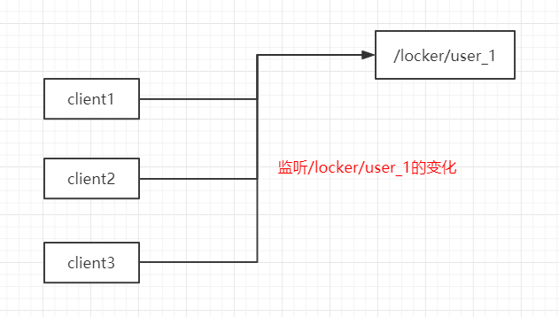
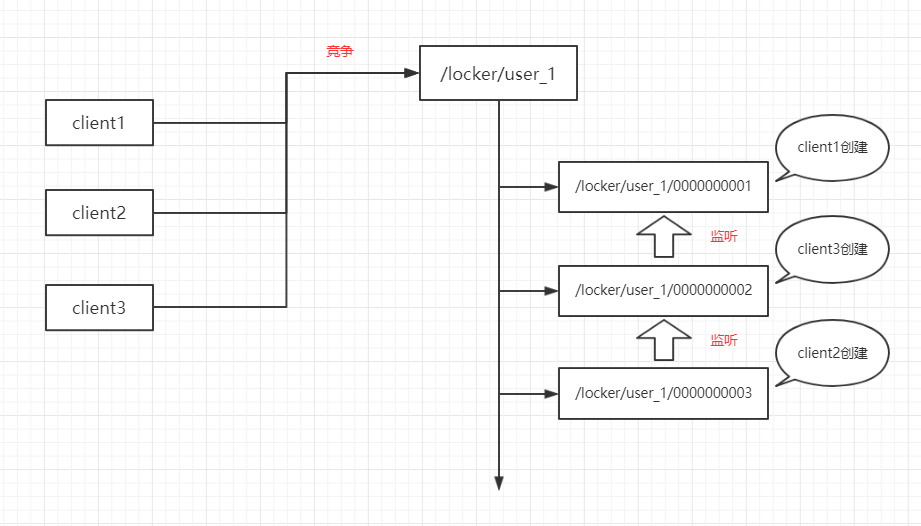

# zookeeper分布式锁

## 简介

zooKeeper是一个分布式的，开放源码的分布式应用程序协调服务，它可以为分布式应用提供一致性服务，它是Hadoop和Hbase的重要组件，同时也可以作为配置中心、注册中心运用在微服务体系中。

本章我们将介绍zookeeper如何实现分布式锁运用在分布式系统中。

## 基础知识

### 什么是znode？

zooKeeper操作和维护的为一个个数据节点，称为 znode，采用类似文件系统的层级树状结构进行管理，如果 znode 节点包含数据则存储为字节数组（byte array）。

而且，同一个节点多个客户同时创建，只有一个客户端会成功，其它客户端创建时将失败。


### 节点类型

znode 共有四种类型：

- 持久（无序）
- 持久有序
- 临时（无序）
- 临时有序

其中，持久节点如果不手动删除会一直存在，临时节点当客户端session失效就会自动删除节点。

### 什么是watcher？

watcher（事件监听器），是zookeeper中的一个很重要的特性。

zookeeper允许用户在指定节点上注册一些watcher，并且在一些特定事件触发的时候，zooKeeper服务端会将事件通知到感兴趣的客户端上去，该机制是Zookeeper实现分布式协调服务的**重要特性**。

| KeeperState        | EventType             | 触发条件                                                     | 说明                                                         | 操作          |
| ------------------ | --------------------- | ------------------------------------------------------------ | ------------------------------------------------------------ | ------------- |
| SyncConnected（3） | None（-1）            | 客户端与服务端成功建立连接                                   | 此时客户端和服务器处于连接状态                               | -             |
| 同上               | NodeCreated（1）      | Watcher监听的对应数据节点被创建                              | 同上                                                         | Create        |
| 同上               | NodeDeleted（2）      | Watcher监听的对应数据节点被删除                              | 同上                                                         | Delete/znode  |
| 同上               | NodeDataChanged（3）  | Watcher监听的对应数据节点的数据内容发生变更                  | 同上                                                         | setDate/znode |
| 同上               | NodeChildChanged（4） | Wather监听的对应数据节点的子节点列表发生变更                 | 同上                                                         | Create/child  |
| Disconnected（0）  | None（-1）            | 客户端与ZooKeeper服务器断开连接                              | 此时客户端和服务器处于断开连接状态                           | -             |
| Expired（-112）    | None（-1）            | 会话超时                                                     | 此时客户端会话失效，通常同时也会受到SessionExpiredException异常 | -             |
| AuthFailed（4）    | None（-1）            | 通常有两种情况，1：使用错误的schema进行权限检查 2：SASL权限检查失败 | 通常同时也会收到AuthFailedException异常                      | -             |

## 原理解析

### 方案一

既然，同一个节点只能创建一次，那么，加锁时检测节点是否存在，不存在则创建之，存在或者创建失败则监听这个节点的删除事件，这样，当释放锁的时候监听的客户端再次竞争去创建这个节点，成功的则获取到锁，不成功的则再次监听该节点。



比如，有三个客户端client1、client2、client3同时获取/locker/user_1这把锁，它们将按照如下步骤运行：

（1）三者同时尝试创建/locker/user_1节点；

（2）client1创建成功，它获取到锁；

（3）client2和client3创建失败，它们监听/locker/user_1的删除事件；

（4）client1执行锁内业务逻辑；

（5）client1释放锁，删除节点/locker/user_1；

（6）client2和client3都捕获到节点/locker/user_1被删除的事件，二者皆被唤醒；

（7）client2和client3同时去创建/locker/user_1节点；

（8）回到第二步，依次类推

不过，这种方案有个很严重的弊端——惊群效应。

如果并发量很高，多个客户端同时监听同一个节点，释放锁时同时唤醒这么多个客户端，然后再竞争，最后还是只有一个能获取到锁，其它客户端又要沉睡，这些客户端的唤醒没有任何意义，极大地浪费系统资源，那么有没有更好的方案呢？答案是当然有，请看方案二。

### 方案二

为了解决方案一中的惊群效应，我们可以使用有序子节点的形式来实现分布式锁，而且为了规避客户端获取锁后突然断线的风险，我们有必要使用临时有序节点。



比如，有三个客户端client1、client2、client3同时获取/locker/user_1这把锁，它们将按照如下步骤运行：

（1）三者同时在/locker/user_1/下面创建临时有序子节点；

（2）三者皆创建成功，分别为/locker/user_1/0000000001、/locker/user_1/0000000003、/locker/user_1/0000000002；

（3）检查自己创建的节点是不是子节点中最小的；

（4）client1发现自己是最小的节点，它获取到锁；

（5）client2和client3发现自己不是最小的节点，它们无法获取到锁；

（6）client2创建的节点为/locker/user_1/0000000003，它监听其上一个节点/locker/user_1/0000000002的删除事件；

（7）client3创建的节点为/locker/user_1/0000000002，它监听其上一个节点/locker/user_1/0000000001的删除事件；

（8）client1执行锁内业务逻辑；

（9）client1释放锁，删除节点/locker/user_1/0000000001；

（10）client3监听到节点/locker/user_1/0000000001的删除事件，被唤醒；

（11）client3再次检查自己是不是最小的节点，发现是，则获取到锁；

（12）client3执行锁内业务逻辑；

（13）client3释放锁，删除节点/locker/user_1/0000000002；

（14）client2监听到节点/locker/user_1/0000000002的删除事件，被唤醒；

（15）client2执行锁内业务逻辑；

（16）client2释放锁，删除节点/locker/user_1/0000000003；

（17）client2检查/locker/user_1/下是否还有子节点，没有了则删除/locker/user_1节点；

（18）流程结束；

这种方案相对于方案一来说，每次释放锁时只唤醒一个客户端，减少了线程唤醒的代价，提高了效率。

## zookeeper原生API实现

### pom文件

pom中引入以下jar包：

```xml
<dependency>
    <groupId>org.apache.zookeeper</groupId>
    <artifactId>zookeeper</artifactId>
    <version>3.5.5</version>
</dependency>
```

### Locker接口

定义一个Locker接口，与上一章mysql分布式锁使用同一个接口。

```java
public interface Locker {
    void lock(String key, Runnable command);
}
```

### zookeeper分布式锁实现

这里通过内部类ZkLockerWatcher处理zookeeper的相关操作，需要注意以下几点：

（1）zk连接建立完毕之前不要进行相关操作，否则会报ConnectionLoss异常，这里通过LockSupport.park();阻塞连接线程并在监听线程中唤醒处理；

（2）客户端线程与监听线程不是同一个线程，所以可以通过LockSupport.park();及LockSupport.unpark(thread);来处理；

（3）中间很多步骤不是原子的（坑），所以需要再次检测，详见代码中注释；

```java
@Slf4j
@Component
public class ZkLocker implements Locker {
    @Override
    public void lock(String key, Runnable command) {
        ZkLockerWatcher watcher = ZkLockerWatcher.conn(key);
        try {
            if (watcher.getLock()) {
                command.run();
            }
        } finally {
            watcher.releaseLock();
        }
    }

    private static class ZkLockerWatcher implements Watcher {
        public static final String connAddr = "127.0.0.1:2181";
        public static final int timeout = 6000;
        public static final String LOCKER_ROOT = "/locker";

        ZooKeeper zooKeeper;
        String parentLockPath;
        String childLockPath;
        Thread thread;

        public static ZkLockerWatcher conn(String key) {
            ZkLockerWatcher watcher = new ZkLockerWatcher();
            try {
                ZooKeeper zooKeeper = watcher.zooKeeper = new ZooKeeper(connAddr, timeout, watcher);
                watcher.thread = Thread.currentThread();
                // 阻塞等待连接建立完毕
                LockSupport.park();
                // 根节点如果不存在，就创建一个（并发问题，如果两个线程同时检测不存在，两个同时去创建必须有一个会失败）
                if (zooKeeper.exists(LOCKER_ROOT, false) == null) {
                    try {
                        zooKeeper.create(LOCKER_ROOT, "".getBytes(), ZooDefs.Ids.OPEN_ACL_UNSAFE, CreateMode.PERSISTENT);
                    } catch (KeeperException e) {
                        // 如果节点已存在，则创建失败，这里捕获异常，并不阻挡程序正常运行
                        log.info("创建节点 {} 失败", LOCKER_ROOT);
                    }
                }
                // 当前加锁的节点是否存在
                watcher.parentLockPath = LOCKER_ROOT + "/" + key;
                if (zooKeeper.exists(watcher.parentLockPath, false) == null) {
                    try {
                        zooKeeper.create(watcher.parentLockPath, "".getBytes(), ZooDefs.Ids.OPEN_ACL_UNSAFE, CreateMode.PERSISTENT);
                    } catch (KeeperException e) {
                        // 如果节点已存在，则创建失败，这里捕获异常，并不阻挡程序正常运行
                        log.info("创建节点 {} 失败", watcher.parentLockPath);
                    }
                }

            } catch (Exception e) {
                log.error("conn to zk error", e);
                throw new RuntimeException("conn to zk error");
            }
            return watcher;
        }

        public boolean getLock() {
            try {
                // 创建子节点
                this.childLockPath = zooKeeper.create(parentLockPath + "/", "".getBytes(), ZooDefs.Ids.OPEN_ACL_UNSAFE, CreateMode.EPHEMERAL_SEQUENTIAL);
                // 检查自己是不是最小的节点，是则获取成功，不是则监听上一个节点
                return getLockOrWatchLast();
            } catch (Exception e) {
                log.error("get lock error", e);
                throw new RuntimeException("get lock error");
            } finally {
//                System.out.println("getLock: " + childLockPath);
            }
        }

        public void releaseLock() {
            try {
                if (childLockPath != null) {
                    // 释放锁，删除节点
                    zooKeeper.delete(childLockPath, -1);
                }
                // 最后一个释放的删除锁节点
                List<String> children = zooKeeper.getChildren(parentLockPath, false);
                if (children.isEmpty()) {
                    try {
                        zooKeeper.delete(parentLockPath, -1);
                    } catch (KeeperException e) {
                        // 如果删除之前又新加了一个子节点，会删除失败
                        log.info("删除节点 {} 失败", parentLockPath);
                    }
                }
                // 关闭zk连接
                if (zooKeeper != null) {
                    zooKeeper.close();
                }
            } catch (Exception e) {
                log.error("release lock error", e);
                throw new RuntimeException("release lock error");
            } finally {
//                System.out.println("releaseLock: " + childLockPath);
            }
        }

        private boolean getLockOrWatchLast() throws KeeperException, InterruptedException {
            List<String> children = zooKeeper.getChildren(parentLockPath, false);
            // 必须要排序一下，这里取出来的顺序可能是乱的
            Collections.sort(children);
            // 如果当前节点是第一个子节点，则获取锁成功
            if ((parentLockPath + "/" + children.get(0)).equals(childLockPath)) {
                return true;
            }

            // 如果不是第一个子节点，就监听前一个节点
            String last = "";
            for (String child : children) {
                if ((parentLockPath + "/" + child).equals(childLockPath)) {
                    break;
                }
                last = child;
            }

            if (zooKeeper.exists(parentLockPath + "/" + last, true) != null) {
                this.thread = Thread.currentThread();
                // 阻塞当前线程
                LockSupport.park();
                // 唤醒之后重新检测自己是不是最小的节点，因为有可能上一个节点断线了
                return getLockOrWatchLast();
            } else {
                // 如果上一个节点不存在，说明还没来得及监听就释放了，重新检查一次
                return getLockOrWatchLast();
            }
        }

        @Override
        public void process(WatchedEvent event) {
            if (this.thread != null) {
                // 唤醒阻塞的线程（这是在监听线程，跟获取锁的线程不是同一个线程）
                LockSupport.unpark(this.thread);
                this.thread = null;
            }
        }
    }
}
```

### 测试代码

我们这里起两批线程，一批获取user_1这个锁，一批获取user_2这个锁。

```java
@RunWith(SpringRunner.class)
@SpringBootTest(classes = Application.class)
public class ZkLockerTest {

    @Autowired
    private Locker locker;

    @Test
    public void testZkLocker() throws IOException {
        for (int i = 0; i < 1000; i++) {
            new Thread(()->{
                locker.lock("user_1", ()-> {
                    try {
                        System.out.println(String.format("user_1 time: %d, threadName: %s", System.currentTimeMillis(), Thread.currentThread().getName()));
                        Thread.sleep(500);
                    } catch (InterruptedException e) {
                        e.printStackTrace();
                    }
                });
            }, "Thread-"+i).start();
        }
        for (int i = 1000; i < 2000; i++) {
            new Thread(()->{
                locker.lock("user_2", ()-> {
                    try {
                        System.out.println(String.format("user_2 time: %d, threadName: %s", System.currentTimeMillis(), Thread.currentThread().getName()));
                        Thread.sleep(500);
                    } catch (InterruptedException e) {
                        e.printStackTrace();
                    }
                });
            }, "Thread-"+i).start();
        }

        System.in.read();
    }
}
```

运行结果：

可以看到稳定在500ms左右打印两个锁的结果。

```
user_1 time: 1568973299578, threadName: Thread-10
user_2 time: 1568973299579, threadName: Thread-1780
user_1 time: 1568973300091, threadName: Thread-887
user_2 time: 1568973300091, threadName: Thread-1542
user_1 time: 1568973300594, threadName: Thread-882
user_2 time: 1568973300594, threadName: Thread-1539
user_2 time: 1568973301098, threadName: Thread-1592
user_1 time: 1568973301098, threadName: Thread-799
user_1 time: 1568973301601, threadName: Thread-444
user_2 time: 1568973301601, threadName: Thread-1096
user_1 time: 1568973302104, threadName: Thread-908
user_2 time: 1568973302104, threadName: Thread-1574
user_2 time: 1568973302607, threadName: Thread-1515
user_1 time: 1568973302607, threadName: Thread-80
user_1 time: 1568973303110, threadName: Thread-274
user_2 time: 1568973303110, threadName: Thread-1774
user_1 time: 1568973303615, threadName: Thread-324
user_2 time: 1568973303615, threadName: Thread-1621
```

## curator实现

上面的原生API实现更易于理解zookeeper实现分布式锁的逻辑，但是难免保证没有什么问题，比如不是重入锁，不支持读写锁等。

下面我们一起看看现有的轮子curator是怎么实现的。

### pom文件

pom文件中引入以下jar包：

```xml
<dependency>
    <groupId>org.apache.curator</groupId>
    <artifactId>curator-recipes</artifactId>
    <version>4.0.0</version>
</dependency>
<dependency>
    <groupId>org.apache.curator</groupId>
    <artifactId>curator-framework</artifactId>
    <version>4.0.0</version>
</dependency>
```

### 代码实现

下面是互斥锁的一种实现方案：

```java
@Component
@Slf4j
public class ZkCuratorLocker implements Locker {
    public static final String connAddr = "127.0.0.1:2181";
    public static final int timeout = 6000;
    public static final String LOCKER_ROOT = "/locker";

    private CuratorFramework cf;

    @PostConstruct
    public void init() {
        this.cf = CuratorFrameworkFactory.builder()
                .connectString(connAddr)
                .sessionTimeoutMs(timeout)
                .retryPolicy(new ExponentialBackoffRetry(1000, 3))
                .build();

        cf.start();
    }

    @Override
    public void lock(String key, Runnable command) {
        String path = LOCKER_ROOT + "/" + key;
        InterProcessLock lock = new InterProcessMutex(cf, path);
        try {
          
            lock.acquire();
            command.run();
        } catch (Exception e) {
            log.error("get lock error", e);
            throw new RuntimeException("get lock error", e);
        } finally {
            try {
                lock.release();
            } catch (Exception e) {
                log.error("release lock error", e);
                throw new RuntimeException("release lock error", e);
            }
        }
    }
}
```

除了互斥锁，curator还提供了读写锁、多重锁、信号量等实现方式，而且他们是可重入的锁。

## 总结

（1）zookeeper中的节点有四种类型：持久、持久有序、临时、临时有序；

（2）zookeeper提供了一种非常重要的特性——监听机制，它可以用来监听节点的变化；

（3）zookeeper分布式锁是基于 临时有序节点 + 监听机制 实现的；

（4）zookeeper分布式锁加锁时在锁路径下创建临时有序节点；

（5）如果自己是第一个节点，则获得锁；

（6）如果自己不是第一个节点，则监听前一个节点，并阻塞当前线程；

（7）当监听到前一个节点的删除事件时，唤醒当前节点的线程，并再次检查自己是不是第一个节点；

（8）使用临时有序节点而不是持久有序节点是为了让客户端无故断线时能够自动释放锁；

