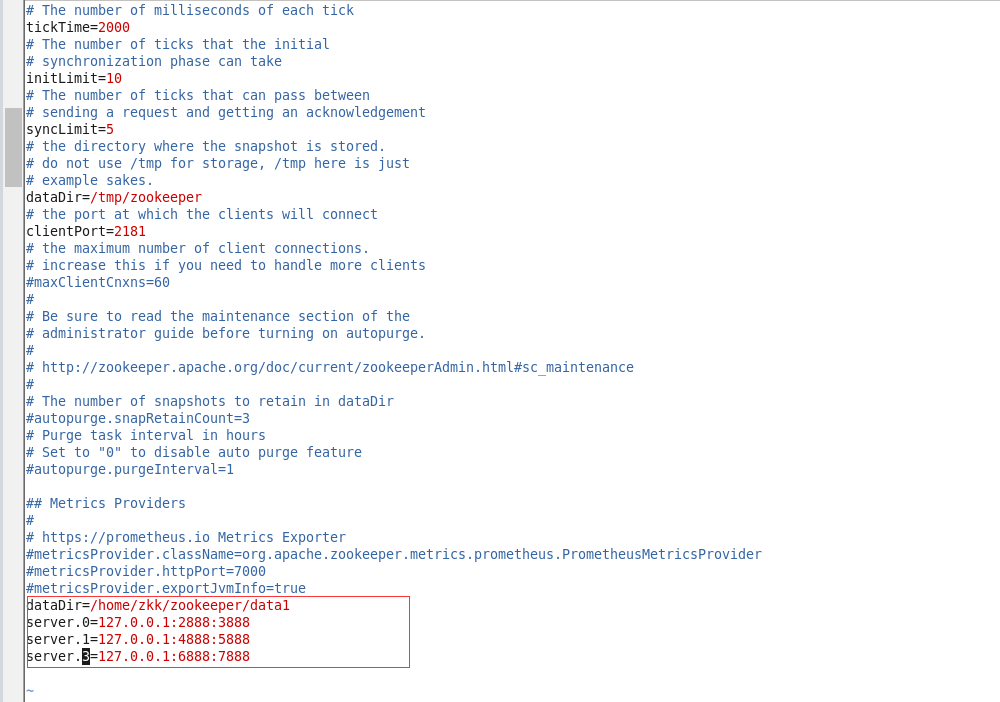

# zookeeper 集群搭建

　　通过 VMware ，我们安装了三台虚拟机，用来搭建 zookeeper 集群，虚拟机网络地址如下         

1、 master　　　　　127.0.0.1:2181　　　　 

2、 slave1　　　　　 127.0.0.1:3181　　　     　　　

3、 slave2　　　　　 127.0.0.1:4181　　　　　　　

　　在搭建 zookeeper 集群之前，我们首先要明白为什么要选择三台机器搭建，2台不可以吗？4台不可以吗？

　　zookeeper 集群通常是用来对用户的分布式应用程序提供协调服务的，为了保证数据的一致性，对 zookeeper 集群进行了这样三种角色划分：leader、follower、observer分别对应着总统、议员和观察者。

　　总统（leader）：负责进行投票的发起和决议，更新系统状态。

　　议员（follower）：用于接收客户端请求并向客户端返回结果以及在选举过程中参与投票。

　　观察者（observer）：也可以接收客户端连接，将写请求转发给leader节点，但是不参与投票过程，只同步leader的状态。通常对查询操作做负载。

### 1、为什么zookeeper节点是奇数？

　我们知道，在每台机器数据保持一致的情况下，zookeeper集群可以保证，客户端发起的每次查询操作，集群节点都能返回同样的结果。

　　但是对于客户端发起的修改、删除等能改变数据的操作呢？集群中那么多台机器，你修改你的，我修改我的，最后返回集群中哪台机器的数据呢？

　　这就是一盘散沙，需要一个领导，于是在zookeeper集群中，leader的作用就体现出来了，**只有leader节点才有权利发起修改数据的操作**，而follower节点即使接收到了客户端发起的修改操作，也要将其转交给leader来处理，leader接收到修改数据的请求后，会向所有follower广播一条消息，让他们执行某项操作，follower 执行完后，便会向 leader 回复执行完毕。当 leader 收到半数以上的 follower 的确认消息，便会判定该操作执行完毕，然后向所有 follower 广播该操作已经生效。

　　所以zookeeper集群中leader是不可缺少的，但是 leader 节点是怎么产生的呢？其实就是由所有follower 节点选举产生的，讲究民主嘛，而且leader节点只能有一个，毕竟一个国家不能有多个总统。

　　这个时候回到我们的小标题，为什么 zookeeper 节点数是奇数，我们下面来一一来说明：

　　**①、容错率**

　　首先从容错率来说明：（需要保证集群能够有半数进行投票）

　　2台服务器，至少2台正常运行才行（2的半数为1，半数以上最少为2），正常运行1台服务器都不允许挂掉，但是相对于 单节点服务器，2台服务器还有两个单点故障，所以直接排除了。

　　3台服务器，至少2台正常运行才行（3的半数为1.5，半数以上最少为2），正常运行可以允许1台服务器挂掉

　　4台服务器，至少3台正常运行才行（4的半数为2，半数以上最少为3），正常运行可以允许1台服务器挂掉

　　5台服务器，至少3台正常运行才行（5的半数为2.5，半数以上最少为3），正常运行可以允许2台服务器挂掉

　　**②、防脑裂**

　　脑裂集群的脑裂通常是发生在节点之间通信不可达的情况下，集群会分裂成不同的小集群，小集群各自选出自己的leader节点，导致原有的集群出现多个leader节点的情况，这就是脑裂。

　　3台服务器，投票选举半数为1.5，一台服务裂开，和另外两台服务器无法通行，这时候2台服务器的集群（2票大于半数1.5票），所以可以选举出leader，而 1 台服务器的集群无法选举。

　　4台服务器，投票选举半数为2，可以分成 1,3两个集群或者2,2两个集群，对于 1,3集群，3集群可以选举；对于2,2集群，则不能选择，造成没有leader节点。

　　5台服务器，投票选举半数为2.5，可以分成1,4两个集群，或者2,3两集群，这两个集群分别都只能选举一个集群，满足zookeeper集群搭建数目。

　　以上分析，我们从容错率以及防止脑裂两方面说明了3台服务器是搭建集群的最少数目，4台发生脑裂时会造成没有leader节点的错误。

集群搭建：



　

上面红色框住的内容即是我们修改的内容：

　　①、tickTime：基本事件单元，这个时间是作为Zookeeper服务器之间或客户端与服务器之间维持心跳的时间间隔，每隔tickTime时间就会发送一个心跳；最小 的session过期时间为2倍tickTime

　　②、dataDir：存储内存中数据库快照的位置，除非另有说明，否则指向数据库更新的事务日志。注意：应该谨慎的选择日志存放的位置，使用专用的日志存储设备能够大大提高系统的性能，如果将日志存储在比较繁忙的存储设备上，那么将会很大程度上影像系统性能。

　　③、client：监听客户端连接的端口。

　　④、initLimit：允许follower连接并同步到Leader的初始化连接时间，以tickTime为单位。当初始化连接时间超过该值，则表示连接失败。

　　⑤、syncLimit：表示Leader与Follower之间发送消息时，请求和应答时间长度。如果follower在设置时间内不能与leader通信，那么此follower将会被丢弃。

　　⑥、server.A=B:C:D

　　　　A：其中 A 是一个数字，表示这个是服务器的编号；

　　　　B：是这个服务器的 ip 地址；

　　　　C：Leader选举的端口；

　　　　D：Zookeeper服务器之间的通信端口。

　　我们需要修改的第一个是 dataDir ,在指定的位置处创建好目录。

　　第二个需要新增的是 server.A=B:C:D 配置，其中 A 对应下面我们即将介绍的myid 文件。B是集群的各个IP地址，C:D 是端口配置。

### 创建 myid 文件

　在 上一步 dataDir 指定的目录下，创建 myid 文件。

   然后在该文件添加上一步 server 配置的对应 A 数字。

```
dataDir=/home/zkk/zookeeper/data1

server.0=127.0.0.1:2888:3888
server.1=127.0.0.1:4888:5888
server.3=127.0.0.1:6888:7888

```

在各自的myid文件中写入相应的数字 也就是 A。然后分别启动，集群搭建完毕。