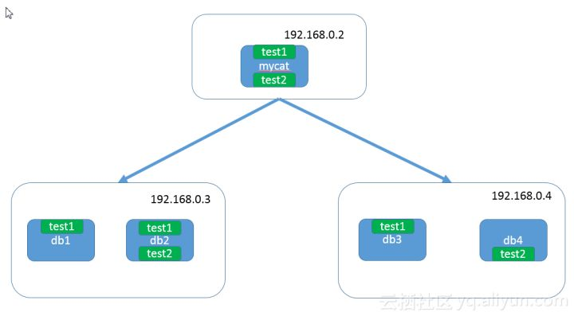
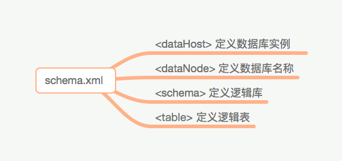
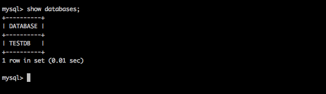
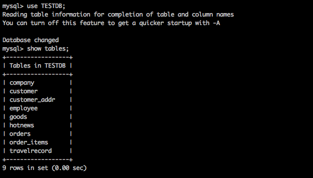

# mycat实现mysql分库分表

> **摘要：** myCat是一个开源的分布式数据库系统，是一个实现了MySQL协议的服务器，前端用户可以把它看作是一个数据库代理，用MySQL客户端工具和命令行访问，而其后端可以用MySQL原生协议与多个MySQL服务器通信，也可以用JDBC协议与大多数主流数据库服务器通信，其核心功能是分表分库，即将一个大表水平分割为N个小表，存储在后端MySQL服务器里或者其他数据库里。

**1. mycat介绍**

```text
myCat是一个开源的分布式数据库系统，是一个实现了MySQL协议的服务器，前端用户可以把它看作是一个数据库代理，用MySQL客户端工具和命令行访问，而其后端可以用MySQL原生协议与多个MySQL服务器通信，也可以用JDBC协议与大多数主流数据库服务器通信，其核心功能是分表分库，即将一个大表水平分割为N个小表，存储在后端MySQL服务器里或者其他数据库里。
```

MyCat发展到目前的版本，已经不是一个单纯的MySQL代理了，它的后端可以支持MySQL、SQL Server、Oracle、DB2、PostgreSQL等主流数据库，也支持MongoDB这种新型NoSQL方式的存储，未来还会支持更多类型的存储。而在最终用户看来，无论是那种存储方式，在MyCat里，都是一个传统的数据库表，支持标准的SQL语句进行数据的操作，这样一来，对前端业务系统来说，可以大幅降低开发难度，提升开发速度

**2.使用介绍：**
本次演示的是基于mysql数据库，通过中间件mycat实现分库分表功能。

**3.环境**
3台物理机linux操作系统
其中两台安装Mysql 5.7
另一台安装Mycat

**4.原理图**



**5.搭建过程**

1. 下载mycat
   [http://mycat.sourceforge.net/](https://link.zhihu.com/?target=http%3A//mycat.sourceforge.net/)
2. 安装及修改配置文件
   下载好安装包，解压即可

Mycat分为3个重要的配置文件，分别为 schema.xml server.xml rule.xml**MyCat的配置文件**

在这 MyCat 的目录中，最重要的是 conf 目录，这里面存放了 MyCat 所有的配置信息。在 conf 目录中有三个重要的配置文件：schema.xml、server.xml、rule.xml。

## schema.xml

schema.xml 文件定义了 MyCat 到底连接那个数据库实例，连接这个数据库实例的哪个数据库。MyCat 一共有几个逻辑数据库，MyCat 一共有几个逻辑表。

schema.xml 文件一共有四个配置节点：DataHost、DataNode、Schema、Table。



*DataHost 节点定义了 MyCat 要连接哪个 MySQL 实例，连接的账号密码是多少。*默认的 MyCat 为我们定义了一个名为 localhost1 的数据服务器（DataHost），它指向了本地（localhost）3306 端口的 MySQL 服务器，对应 MySQL 服务器的账号是 root，密码是 123456。

```text
<dataHost name="localhost1" maxCon="1000" minCon="10" balance="0" writeType="0" dbType="mysql" dbDriver="native" switchType="1"  slaveThreshold="100">
    <heartbeat>select user()</heartbeat> 
    <writeHost host="hostM1" url="localhost:3306" user="root" password="123456"> 
        <readHost host="hostS2" url="192.168.1.200:3306" user="root" password="xxx" />
    </writeHost>
    <writeHost host="hostS1" url="localhost:3316" user="root" password="123456" /> 
</dataHost>
```

*DataNode 节点指定了需要连接的具体数据库名称，其使用一个 dataHost 属性指定该数据库位于哪个数据库实例上。*默认的 MyCat 为我们创建了三个数据节点（DataNode），dn1 数据节点对应 localhost1 数据服务器上的 db1 数据库，dn2 数据节点对应 localhost1 数据服务器上的 db2 数据库，dn1 数据节点对应 localhost1 数据服务器上的 db3 数据库。

```text
<dataNode name="dn1" dataHost="localhost1" database="db1" />
<dataNode name="dn2" dataHost="localhost1" database="db2" />
<dataNode name="dn3" dataHost="localhost1" database="db3" />
```

*Schema 节点定义了 MyCat 的所有逻辑数据库，Table 节点定义了 MyCat 的所有逻辑表。*默认的 MyCat 为我们定义了一个名为 TESTDB 的逻辑数据库，在这个逻辑数据库下又定义了名为 travaelrecord、company 等 6 个逻辑表。

```text
<schema name="TESTDB" checkSQLschema="false" sqlMaxLimit="100"> 
    <table name="travelrecord" dataNode="dn1,dn2,dn3" rule="auto-sharding-long" /> 
    <table name="company" primaryKey="ID" type="global" dataNode="dn1,dn2,dn3" />
    ……
</schema>
```

所以上面当我们登陆 MyCat 输入`show databases`会看到只有一个名为 TESTDB 的数据库，这个就是 MyCat 的逻辑数据库。





我们输入`show tables`可以看到 TESTDB 下对应的逻辑表。





## server.xml

server.xml 定义了项目中连接 MyCat 服务器所需要的账号密码，以及该账号能访问那些逻辑数据库。 server.xml 配置文件中有 System 和 User 两个配置节点。

*System 节点定义了连接 MyCat 服务器的系统配置信息。*例如是否开启实时统计功能，是否开启全加班一致性检测等。

```text
<system>
    <property name="useSqlStat">0</property>  <!-- 1为开启实时统计、0为关闭 -->
    <property name="useGlobleTableCheck">0</property>  <!-- 1为开启全加班一致性检测、0为关闭 --> 
    <property name="sequnceHandlerType">2</property> 
    <property name="processorBufferPoolType">0</property> 
    ……
</system>
```

*User 配置节点定义了连接 MyCat 服务器的账号密码，以及该账号密码所能进行的数据库操作。*默认的 MyCat 为我们创建了一个账户名为 root，密码为 123456 的账号，只能访问 TESTDB 逻辑数据库，并且定义了对相关表的操作权限。

```text
<user name="root">
    <property name="password">123456</property>
    <property name="schemas">TESTDB</property> 
    <privileges check="false">
        <schema name="TESTDB" dml="0110" >
            <table name="tb01" dml="0000"></table>
            <table name="tb02" dml="1111"></table>
        </schema>
    </privileges>    
</user>
```

## rule.xml

rule.xml 定义了逻辑表使用哪个字段进行拆分，使用什么拆分算法进行拆分。rule.xml 中有两个配置节点，分别是：TableRule 和 Function 配置节点。

*TableRule 配置节点定义了逻辑表的拆分信息，例如使用哪个字段进行拆分，使用什么拆分算法。*默认的 MyCat 为我们配置了一个名为 rule2 的表拆分规则，表示根据 user_id 字段进行拆分，拆分算法是 func1。

```text
<tableRule name="rule2">
    <rule>
        <columns>user_id</columns>
        <algorithm>func1</algorithm>
    </rule>
</tableRule>
```

*Function 配置节点则定义了具体的拆分算法。*例如使用对 1000 取余的拆分算法，对 100 取余的拆分算分等等。默认的 MyCat 为我们定义了一个名为 func1 的拆分算法，这个拆分算法定义在 o.mycat.route.function.PartitionByLong 类中，并且还传入了两个参数值。

```text
<function name="func1" class="io.mycat.route.function.PartitionByLong">
    <property name="partitionCount">8</property>
    <property name="partitionLength">128</property>
</function>
```

