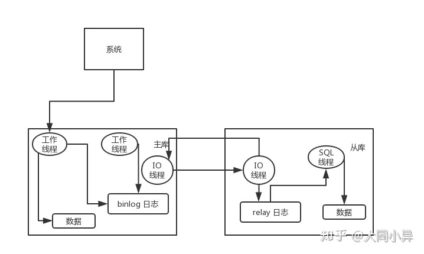
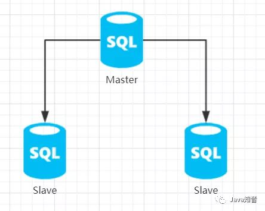
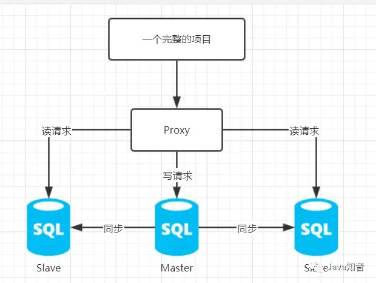
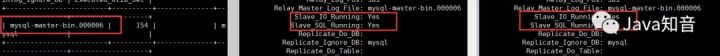

## MySql读写分离

### MySQL 主从复制原理的是啥？

主库将变更写入 binlog 日志，然后从库连接到主库之后，从库有一个 IO 线程，将主库的 binlog 日志拷贝到自己本地，写入一个 relay 中继日志中。接着从库中有一个 SQL 线程会从中继日志读取 binlog，然后执行 binlog 日志中的内容，也就是在自己本地再次执行一遍 SQL，这样就可以保证自己跟主库的数据是一样的。



这里有一个非常重要的一点，就是从库同步主库数据的过程是串行化的，也就是说主库上并行的操作，在从库上会串行执行。所以这就是一个非常重要的点了，由于从库从主库拷贝日志以及串行执行 SQL 的特点，在高并发场景下，从库的数据一定会比主库慢一些，是**有延时**的。所以经常出现，刚写入主库的数据可能是读不到的，要过几十毫秒，甚至几百毫秒才能读取到。

而且这里还有另外一个问题，就是如果主库突然宕机，然后恰好数据还没同步到从库，那么有些数据可能在从库上是没有的，有些数据可能就丢失了。

所以 MySQL 实际上在这一块有两个机制，一个是**半同步复制**，用来解决主库数据丢失问题；一个是**并行复制**，用来解决主从同步延时问题。

这个所谓**半同步复制**，也叫`semi-sync`复制，指的就是主库写入 binlog 日志之后，就会将**强制**此时立即将数据同步到从库，从库将日志写入自己本地的 relay log 之后，接着会返回一个 ack 给主库，主库接收到**至少一个从库**的 ack 之后才会认为写操作完成了。

所谓**并行复制**，指的是从库开启多个线程，并行读取 relay log 中不同库的日志，然后**并行重放不同库的日志**，这是库级别的并行。

### MySQL 主从同步延时问题（精华）

以前线上确实处理过因为主从同步延时问题而导致的线上的 bug，属于小型的生产事故。

是这个么场景。有个同学是这样写代码逻辑的。先插入一条数据，再把它查出来，然后更新这条数据。在生产环境高峰期，写并发达到了 2000/s，这个时候，主从复制延时大概是在小几十毫秒。线上会发现，每天总有那么一些数据，我们期望更新一些重要的数据状态，但在高峰期时候却没更新。用户跟客服反馈，而客服就会反馈给我们。
我们通过 MySQL 命令：

```text
show status
```

查看 `Seconds_Behind_Master`，可以看到从库复制主库的数据落后了几 ms。

一般来说，如果主从延迟较为严重，有以下解决方案：

- 分库，将一个主库拆分为多个主库，每个主库的写并发就减少了几倍，此时主从延迟可以忽略不计。
- 打开 MySQL 支持的并行复制，多个库并行复制。如果说某个库的写入并发就是特别高，单库写并发达到了 2000/s，并行复制还是没意义。
- 重写代码，写代码的同学，要慎重，插入数据时立马查询可能查不到。
- 如果确实是存在必须先插入，立马要求就查询到，然后立马就要反过来执行一些操作，对这个查询**设置直连主库**。**不推荐**这种方法，你这么搞导致读写分离的意义就丧失了。

### 读写分离具体实现方式：

关于MySQL的读写分离的实现，有两种方式，第一种方式即我们**手动在代码层实现逻辑，来解析读请求或者写请求，分别分发到不同的数据库中，实现读写分离**；第二种方式就是**基于MyCat中间件来实现读写分离的效果**；这两种方式我都会在这篇博客中进行详细地介绍、搭建，并且分析其中的优劣。

## 原理初探

从MySQL的主从同步开始谈起，最开始我们的数据库架构是这样的。



主库负责了所有的读写操作，而从库只对主库进行了备份，如果只实现了一个备份，不能读写分离和故障转移，不能降低Master节点的IO压力，这样的主从架构看起来性价比似乎不是很高。

我们所希望的主从架构是，当我们在写数据时，请求全部发到Master节点上，当我们需要读数据时，请求全部发到Slave节点上。并且多个Slave节点最好可以存在负载均衡，让集群的效率最大化。

那么这样的架构就不够我们使用了，我们需要找寻某种方式，来实现读写分离。那么实际上有两种方式。


### 方法1：代码层实现读写分离

这种方法的优势就是比较灵活，我们可以按照自己的逻辑来决定读写分离的规则。如果使用了这样的方法。概括来说就是主库执行增删改操作代码，从库执行读操作代码。


### 方法2：使用中间层（虚拟节点）进行请求的转发

这种方式最主要的特点就是我们在除了数据库以外地方，新构建了一个虚拟节点，而我们所有的请求都发到这个虚拟节点上，由这个虚拟节点来转发读写请求该相应的数据库。

这种方式的特点就是，其构建了一个独立的节点来接收所有的请求，而不用在我们的程序中配置多数据源，我们的项目只需要将url指向这个虚拟节点，然后由这个虚拟节点来处理读写请求。不是有这么一句话吗，**专业的事交给专业的人来做**，大概是这么个意思吧。而现在存在的MyCat等中间件，就是这样的一个”专业的人“。



那么下面我就会动手实现上述两个读写分离的解决方案，代码层实现读写分离和使用中间件实现读写分离

## 手动实现读写分离

实现读写分离的方法有很多，我这里会说到两种，第一种是使用MyBatis和Spring，手写MyBatis拦截器来判断SQL是读或者写，从而选择数据源，最后交给Spring注入数据源，来实现读写分离；第二种是使用MyCat中间件，配置化地实现读写分离，每种方式都有其可取之处，可以自己视情况选用。

### 环境说明

> mysql
>
> 192.168.43.201:3306 Master
> 192.168.43.202:3306 Slave

开发环境：

> IDE:Eclipse
> Spring boot 2.1.7
> MySQL 5.7
> CentOS 7.3

### 新建Maven项目

为了演示方便，这里使用SpringBoot作为测试的基础框架，省去了很多Spring需要的xml配置。

### 导入依赖

```
<parent>
        <groupId>org.springframework.boot</groupId>
        <artifactId>spring-boot-starter-parent</artifactId>
        <version>2.1.7.RELEASE</version>
        <relativePath /> <!-- lookup parent from repository -->
</parent>
<dependencies>
        <!-- Web相关 -->
        <dependency>
            <groupId>org.springframework.boot</groupId>
            <artifactId>spring-boot-starter-web</artifactId>
        </dependency>
        <!-- 数据库相关 -->
        <dependency>
            <groupId>com.oracle</groupId>
            <artifactId>ojdbc7</artifactId>
            <version>12.1.0</version>
        </dependency>
        <dependency>
            <groupId>org.mybatis.spring.boot</groupId>
            <artifactId>mybatis-spring-boot-starter</artifactId>
            <version>2.0.0</version>
        </dependency>
        <dependency>
            <groupId>mysql</groupId>
            <artifactId>mysql-connector-java</artifactId>
        </dependency>
        <!-- 测试相关依赖 -->
        <dependency>
            <groupId>org.springframework.boot</groupId>
            <artifactId>spring-boot-starter-test</artifactId>
        </dependency>
        <!-- -->
        <dependency>
            <groupId>org.springframework.boot</groupId>
            <artifactId>
                spring-boot-configuration-processor
            </artifactId>
            <optional>true</optional>
        </dependency>
</dependencies>
```

### application.yml

为了测试项目尽量简单，所以我们不用去过多地配置其它东西。只有一些基本配置和数据源配置。

```
server: 
  port: 10001
spring: 
  datasource:
    url: jdbc:mysql://192.168.43.201:3306/springtestdemo?useUnicode=true&characterEncoding=UTF-8&serverTimezone=UTC
    username: Object
    password: Object971103.
    driver-class-name: com.mysql.cj.jdbc.Driver

#MyBatis配置
mybatis:
  mapper-locations: classpath:mapper/*.xml
  configuration:
    map-underscore-to-camel-case: true
```

### 编写启动类

```
@SpringBootApplication
public class ApplicationStarter {
    public static void main(String[] args) {
        SpringApplication.run(ApplicationStarter.class, args);
    }
}
```

### 新建Student实体并创建数据库

```
package cn.objectspace.springtestdemo.domain;
public class Student {
    private String studentId;
    private String studentName;
    public String getStudentId() {
        return studentId;
    }
    public void setStudentId(String studentId) {
        this.studentId = studentId;
    }
    public String getStudentName() {
        return studentName;
    }
    public void setStudentName(String studentName) {
        this.studentName = studentName;
    }   
}

```

```
CREATE TABLE student(
    student_id VARCHAR(32),
    student_name VARCHAR(32)
);
```

### 编写StudentDao接口，并进行测试

接口：

```
package cn.objectspace.springtestdemo.dao;

import org.apache.ibatis.annotations.Insert;
import org.apache.ibatis.annotations.Mapper;
import org.apache.ibatis.annotations.Select;

import cn.objectspace.springtestdemo.domain.Student;

@Mapper
public interface StudentDao {
    @Insert("INSERT INTO student(student_id,student_name)VALUES(#{studentId},#{studentName})")
    public Integer insertStudent(Student student);
    @Select("SELECT * FROM student WHERE student_id = #{studentId}")
    public Student queryStudentByStudentId(Student student);
}
```

测试类：

```
@RunWith(SpringRunner.class)
@SpringBootTest(classes = {ApplicationStarter.class})// 指定启动类
public class DaoTest {
    @Autowired StudentDao studentDao;
    @Test
    public void test01() {
        Student student = new Student();
        student.setStudentId("20191130");
        student.setStudentName("Object6");
        studentDao.insertStudent(student);
        studentDao.queryStudentByStudentId(student);
    }
}
```

### 正式搭建

通过上面的准备工作，我们已经可以实现对数据库的读写，但是并没有实现读写分离，现在才是开始实现数据库的读写分离。

### 修改application.yml

刚才我们的配置文件中只有单数据源，而读写分离肯定不会是单数据源，所以我们首先要在application.yml中配置多数据源。

```
server: 
  port: 10001
spring: 
  datasource:
    master: 
      url: jdbc:mysql://192.168.43.201:3306/springtestdemo?useUnicode=true&characterEncoding=UTF-8&serverTimezone=UTC
      username: Object
      password: Object971103.
      driver-class-name: com.mysql.cj.jdbc.Driver
    slave: 
      url: jdbc:mysql://192.168.43.202:3306/springtestdemo?useUnicode=true&characterEncoding=UTF-8&serverTimezone=UTC
      username: Object
      password: Object971103.
      driver-class-name: com.mysql.cj.jdbc.Driver


#MyBatis配置
mybatis:
  mapper-locations: classpath:mapper/*.xml
  configuration:
    cache-enabled: true #开启二级缓存
    map-underscore-to-camel-case: true
```

### DataSource的配置

首先要先创建两个ConfigurationProperties类，这一步不是非必须的，直接配置DataSource也是可以的，但是我还是比较习惯去写这个Properties。

### MasterProperpties

```
package cn.objectspace.springtestdemo.config;

import org.springframework.boot.context.properties.ConfigurationProperties;
import org.springframework.stereotype.Component;

@ConfigurationProperties(prefix = "spring.datasource.master")
@Component
public class MasterProperties {
    private String url;
    private String username;
    private String password;
    private String driverClassName;
    public String getUrl() {
        return url;
    }
    public void setUrl(String url) {
        this.url = url;
    }
    public String getUsername() {
        return username;
    }
    public void setUsername(String username) {
        this.username = username;
    }
    public String getPassword() {
        return password;
    }
    public void setPassword(String password) {
        this.password = password;
    }
    public String getDriverClassName() {
        return driverClassName;
    }
    public void setDriverClassName(String driverClassName) {
        this.driverClassName = driverClassName;
    }

}
```

### SlaveProperties

```
package cn.objectspace.springtestdemo.config;

import org.springframework.boot.context.properties.ConfigurationProperties;
import org.springframework.stereotype.Component;

@ConfigurationProperties(prefix = "spring.datasource.slave")
@Component
public class SlaveProperties {
    private String url;
    private String username;
    private String password;
    private String driverClassName;
    public String getUrl() {
        return url;
    }
    public void setUrl(String url) {
        this.url = url;
    }
    public String getUsername() {
        return username;
    }
    public void setUsername(String username) {
        this.username = username;
    }
    public String getPassword() {
        return password;
    }
    public void setPassword(String password) {
        this.password = password;
    }
    public String getDriverClassName() {
        return driverClassName;
    }
    public void setDriverClassName(String driverClassName) {
        this.driverClassName = driverClassName;
    }

}
```

### DataSourceConfig

这个配置主要是对主从数据源进行配置。

```
@Configuration
public class DataSourceConfig {
    private Logger logger = LoggerFactory.getLogger(DataSourceConfig.class);
    @Autowired
    private MasterProperties masterProperties;

    @Autowired
    private SlaveProperties slaveProperties;

    //默认是master数据源
    @Bean(name = "masterDataSource")
    @Primary
    public DataSource masterProperties(){
        logger.info("masterDataSource初始化");
        HikariDataSource dataSource = new HikariDataSource();
        dataSource.setJdbcUrl(masterProperties.getUrl());
        dataSource.setUsername(masterProperties.getUsername());
        dataSource.setPassword(masterProperties.getPassword());
        dataSource.setDriverClassName(masterProperties.getDriverClassName());
        return dataSource;
    }

    @Bean(name = "slaveDataSource")
    public DataSource dataBase2DataSource(){
        logger.info("slaveDataSource初始化");
        HikariDataSource dataSource = new HikariDataSource();
        dataSource.setJdbcUrl(slaveProperties.getUrl());
        dataSource.setUsername(slaveProperties.getUsername());
        dataSource.setPassword(slaveProperties.getPassword());
        dataSource.setDriverClassName(slaveProperties.getDriverClassName());
        return dataSource;
    }
}
```

### 动态数据源的切换

这里使用到的主要是Spring提供的AbstractRoutingDataSource，其提供了动态数据源的功能，可以帮助我们实现读写分离。其determineCurrentLookupKey()可以决定最终使用哪个数据源，这里我们自己创建了一个DynamicDataSourceHolder，来给他传一个数据源的类型（主、从）。

```
package cn.objectspace.springtestdemo.dao.split;

import java.util.HashMap;
import java.util.Map;

import javax.annotation.Resource;
import javax.sql.DataSource;

import org.springframework.jdbc.datasource.lookup.AbstractRoutingDataSource;
/**
 * 
* @Description: spring提供了AbstractRoutingDataSource，提供了动态选择数据源的功能，替换原有的单一数据源后，即可实现读写分离:
* @Author: Object
* @Date: 2019年11月30日
 */
public class DynamicDataSource extends AbstractRoutingDataSource{
    //注入主从数据源
    @Resource(name="masterDataSource")
    private DataSource masterDataSource;
    @Resource(name="slaveDataSource")
    private DataSource slaveDataSource;
    @Override
    public void afterPropertiesSet() {
        setDefaultTargetDataSource(masterDataSource);
        Map<Object, Object> dataSourceMap = new HashMap<>();
        //将两个数据源set入目标数据源
        dataSourceMap.put("master", masterDataSource);
        dataSourceMap.put("slave", slaveDataSource);
        setTargetDataSources(dataSourceMap);

        super.afterPropertiesSet();
    }
    @Override
    protected Object determineCurrentLookupKey() {
        //确定最终的目标数据源
        return DynamicDataSourceHolder.getDbType();
    }
}
```

### DynamicDataSourceHolder的实现

这个类由我们自己实现，主要是提供给Spring我们需要用到的数据源类型

```
package cn.objectspace.springtestdemo.dao.split;

import org.slf4j.Logger;
import org.slf4j.LoggerFactory;

/**
* @Description: 获取DataSource
* @Author: Object
* @Date: 2019年11月30日
*/
public class DynamicDataSourceHolder {
    private static Logger logger = LoggerFactory.getLogger(DynamicDataSourceHolder.class);
    private static ThreadLocal<String> contextHolder = new ThreadLocal<>();
    public static final String DB_MASTER = "master";
    public static final String DB_SLAVE="slave";
    /**
     * @Description: 获取线程的DbType
     * @Param: args
     * @return: String
     * @Author: Object
     * @Date: 2019年11月30日
     */
    public static String getDbType() {
        String db = contextHolder.get();
        if(db==null) {
            db = "master";
        }
        return db;
    }
    /**
     * @Description: 设置线程的DbType
     * @Param: args
     * @return: void
     * @Author: Object
     * @Date: 2019年11月30日
     */
    public static void setDbType(String str) {
        logger.info("所使用的数据源为:"+str);
        contextHolder.set(str);
    }

    /**
     * @Description: 清理连接类型
     * @Param: args
     * @return: void
     * @Author: Object
     * @Date: 2019年11月30日
     */
    public static void clearDbType() {
        contextHolder.remove();
    }
}
```

### MyBatis拦截器的实现

最后就是我们实现读写分离的核心了，这个类可以对SQL进行判断，是读SQL还是写SQL，从而进行数据源的选择，最终调用DynamicDataSourceHolder的setDbType方法，将数据源类型传入。

```
package cn.objectspace.springtestdemo.dao.split;

import java.util.Locale;
import java.util.Properties;

import org.apache.ibatis.executor.Executor;
import org.apache.ibatis.executor.keygen.SelectKeyGenerator;
import org.apache.ibatis.mapping.BoundSql;
import org.apache.ibatis.mapping.MappedStatement;
import org.apache.ibatis.mapping.SqlCommandType;
import org.apache.ibatis.plugin.Interceptor;
import org.apache.ibatis.plugin.Intercepts;
import org.apache.ibatis.plugin.Invocation;
import org.apache.ibatis.plugin.Plugin;
import org.apache.ibatis.plugin.Signature;
import org.apache.ibatis.session.ResultHandler;
import org.apache.ibatis.session.RowBounds;
import org.slf4j.Logger;
import org.slf4j.LoggerFactory;
import org.springframework.stereotype.Component;
import org.springframework.transaction.support.TransactionSynchronizationManager;

/**
 * @Description: MyBatis级别拦截器，根据SQL信息，选择不同的数据源
 * @Author: Object
 * @Date: 2019年11月30日
 */
@Intercepts({ 
    @Signature(type = Executor.class, method = "update", args = { MappedStatement.class, Object.class }),
    @Signature(type = Executor.class, method = "query", args = { MappedStatement.class, Object.class,RowBounds.class, ResultHandler.class })
    })
@Component
public class DynamicDataSourceInterceptor implements Interceptor {
    private Logger logger = LoggerFactory.getLogger(DynamicDataSourceInterceptor.class);
    // 验证是否为写SQL的正则表达式
    private static final String REGEX = ".*insert\\u0020.*|.*delete\\u0020.*|.*update\\u0020.*";

    /**
     * 主要的拦截方法
     */
    @Override
    public Object intercept(Invocation invocation) throws Throwable {
        // 判断当前是否被事务管理
        boolean synchronizationActive = TransactionSynchronizationManager.isActualTransactionActive();
        String lookupKey = DynamicDataSourceHolder.DB_MASTER;
        if (!synchronizationActive) {
            //如果是非事务的，则再判断是读或者写。
            // 获取SQL中的参数
            Object[] objects = invocation.getArgs();
            // object[0]会携带增删改查的信息，可以判断是读或者是写
            MappedStatement ms = (MappedStatement) objects[0];
            // 如果为读，且为自增id查询主键，则使用主库
            // 这种判断主要用于插入时返回ID的操作，由于日志同步到从库有延时
            // 所以如果插入时需要返回id，则不适用于到从库查询数据，有可能查询不到
            if (ms.getSqlCommandType().equals(SqlCommandType.SELECT)
                    && ms.getId().contains(SelectKeyGenerator.SELECT_KEY_SUFFIX)) {
                lookupKey = DynamicDataSourceHolder.DB_MASTER;
            } else {
                BoundSql boundSql = ms.getSqlSource().getBoundSql(objects[1]);
                String sql = boundSql.getSql().toLowerCase(Locale.CHINA).replaceAll("[\\t\\n\\r]", " ");
                // 正则验证
                if (sql.matches(REGEX)) {
                    // 如果是写语句
                    lookupKey = DynamicDataSourceHolder.DB_MASTER;
                } else {
                    lookupKey = DynamicDataSourceHolder.DB_SLAVE;
                }
            }
        } else {
            // 如果是通过事务管理的，一般都是写语句,直接通过主库
            lookupKey = DynamicDataSourceHolder.DB_MASTER;
        }

        logger.info("在" + lookupKey + "中进行操作");
        DynamicDataSourceHolder.setDbType(lookupKey);
        // 最后直接执行SQL
        return invocation.proceed();
    }

    /**
     * 返回封装好的对象，或代理对象
     */
    @Override
    public Object plugin(Object target) {
        // 如果存在增删改查，则直接拦截下来，否则直接返回
        if (target instanceof Executor)
            return Plugin.wrap(target, this);
        else
            return target;
    }

    /**
     * 类初始化的时候做一些相关的设置
     */
    @Override
    public void setProperties(Properties properties) {
        // TODO Auto-generated method stub

    }

}
```

### 代码梳理

通过上文中的程序，我们已经可以实现读写分离了，但是这么看着还是挺乱的。所以在这里重新梳理一遍上文中的代码。

其实逻辑并不难：

- 通过`@Configuration`实现多数据源的配置。
- 通过MyBatis的拦截器，DynamicDataSourceInterceptor来判断某条SQL语句是读还是写，如果是读，则调用`DynamicDataSourceHolder.setDbType("slave")`，否则调用`DynamicDataSourceHolder.setDbType("master")`。
- 通过AbstractRoutingDataSource的`determineCurrentLookupKey()`方法，返回`DynamicDataSourceHolder.getDbType();`也就是我们在拦截器中设置的数据源。
- 对注入的数据源执行SQL。


## 基于MyCat中间件实现读写分离、故障转移

### 简介

在上文中我们已经实现了使用手写代码的方式对数据库进行读写分离，但是不知道大家发现了没有，我只使用了一主一从。那么**为什么我有一主二从的环境却只实现一主一从的读写分离呢？因为，在代码层实现一主多从的读写分离我也不会写。那么假设数据库集群不止于一主二从，而是一主三从，一主四从，多主多从呢？如果Master节点宕机了，又该怎么处理？**

每次动态增加一个节点，我们就要重新修改我们的代码，这不但会给开发人员造成很大的负担，而且不符合开闭原则。

所以接下来的MyCat应该可以解决这样的问题。并且我会直接使用一主二从的环境演示。

### MyCat介绍

这里直接套官方文档。

- 一个彻底开源的，面向企业应用开发的大数据库集群
- 支持事务、ACID、可以替代MySQL的加强版数据库
- 一个可以视为MySQL集群的企业级数据库，用来替代昂贵的Oracle集群
- 一个融合内存缓存技术、NoSQL技术、HDFS大数据的新型SQL Server
- 结合传统数据库和新型分布式数据仓库的新一代企业级数据库产品
- 一个新颖的数据库中间件产品


### 环境说明

> MyCat 192.168.43.90
> MySQL master 192.168.43.201
> MySQL slave1 192.168.43.202
> MySQL slave2 192.168.43.203

接上篇博客的MySQL数据库一主二从，不过**MySQL版本需要从8.0改为5.7**，否则会出现密码问题无法连接。

**另外，我们需要在每个数据库中都为MyCat创建一个账号并赋上权限：**

```text
CREATE USER  'user_name'@'host'  IDENTIFIED BY  'password';
GRANT privileges ON  databasename.tablename  TO  ‘username’@‘host’;
--可以使用下面这句 赋予所有权限
GRANT ALL PRIVILEGES ON *.* TO  ‘username’@‘host’;
--最后刷新权限
FLUSH PRIVILEGES;
```

在开始之前，先保证主从库的搭建是成功的：





我们着重说说和我们MyCat配置相关的两个配置文件——schema.xml和server.xml，当然还有一个rules.xml。

### server.xml

打开mycat安装目录下的/conf/server.xml文件，这个配置文件比较长，看着比较费脑，但其实对于初学者来说，我们需要配置的地方并不多，所以不用太害怕这种长篇幅的配置文件。（其实在上一篇文章的结尾，我也说过，面对一个新技术的时候首先不能懵逼，一步一步地去分析并接受他，扯远了）配置文件简化之后大概是这样的一个结构。

```text
<?xml version="1.0" encoding="UTF-8"?>
<!DOCTYPE mycat:server SYSTEM "server.dtd">
<mycat:server xmlns:mycat="http://io.mycat/">
    <system>
    </system>
    <user name="MyCat" defaultAccount="true">
    </user>

</mycat:server>
```

这样看起来是不是简单多了，其实对于Server.xml，我们主要配置的就是下面的user模块，我们把它展开，着重讲讲这部分的配置。

```text
<user name="这里写MyCat的用户名 可以自定义" defaultAccount="true">
   <property name="password">这里写MyCat的密码</property>
   <property name="schemas">这里配置MyCat的虚拟database</property>
            <!-- 表级 DML 权限设置 -->
            <!--
                这里是我们配置的mycat用户对某张表的权限配置，我们这里暂不配置但是还是说一                 下。下文中的0000 1111 每一位 代表CRUD  1111就是有增删改查的权限，0000就                是没有这些权限。以此类推
            <privileges check="false">
                    <schema name="TESTDB" dml="0110" >
                            <table name="tb01" dml="0000"></table>
                            <table name="tb02" dml="1111"></table>
                    </schema>
            </privileges>
             -->
</user>
```

user代表MyCat的用户，我们在使用MySQL的时候都会有一个用户，**MyCat作为一个虚拟节点，我们可以把它想象成它就是一个MySQL**，所以自然而然它也需要有一个用户。但是他的用户并不是我们用命令创建的，而是直接在配置文件中配置好的，我们之后登录MyCat，就是用这里的用户名和密码进行登录。

### schema.xml

打开MyCat安装目录的conf/**schema.xml，这个配置文件是我们需要关注的一个配置文件**，因为我们的读写分离、分库分表、故障转移、都配置在这个配置文件中。但是这个配置文件并不长，我们可以一点一点慢慢分析。

首先是`<schema></schema>`标签中的内容。这个标签主要是为MyCat虚拟出一个数据库，我们连接到MyCat上能看到的数据库就是这里配置的,而**分库分表也主要在这个标签中进行配置**。

这个标签中的name属性，就是为虚拟数据库指定一个名字，也是我们连接MyCat看到的数据库的库名，dataNode是和下文的dataNode标签中的name相对应的，代表这个虚拟的数据库和下面的dataNode进行绑定。

```text
<schema name="MyCatDatabase" checkSQLschema="false" sqlMaxLimit="100" dataNode="这里写节点名，需要和dataNode中的name相对应">
    <!-- 分库分表 -->
        <!--<table name="travelrecord" dataNode="dn1,dn2,dn3" rule="auto-sharding-long" />-->
</schema>
```

第二个标签是`<dataNode/>`标签，这个标签是和我们真实数据库中的database联系起来的，name属性是我们对这个dataNode自定义的一个名字，要注意的是，这个名字需要和schema标签中的dataNode内容一致，database属性写的是我们真实数据库中的真实database的名字。而dataHost的内容需要和之后`<dataHost></dataHost>`标签中的name属性的值相对应。

```text
<dataNode name="这里写节点名，需要和schema中的dataNode相对应" dataHost="这里也是一个自定义名字，需要和dataHost中的name相对应" database="这里填MySQL真实的数据库名" />
```

第三个标签要说的是`<dataHost></dataHost>`标签，这个标签是和我们真实数据库的主从、读写分离联系起来的标签，什么意思呢。这个标签中有这么两个子标签`<writeHost>`和`<readHost>`分别代表我们的写库和读库，`<writeHost>`中配置的库可以用于读或者写，而`<readHost>`中配置的库只能用于读。

可以看到schema.xml的配置是一环扣一环的，每个标签之间都有相互进行联系的属性。我们最后配置完的schema.xml应该长下面这个样子：

```text
<?xml version="1.0"?>
<!DOCTYPE mycat:schema SYSTEM "schema.dtd">
<mycat:schema xmlns:mycat="http://io.mycat/">
    <schema name="这里写虚拟database名，需要和server.xml中的schema相对应" checkSQLschema="false" sqlMaxLimit="100" dataNode="这里写节点名，需要和dataNode中的name相对应">
    <!-- 分库分表 -->
        <!--<table name="travelrecord" dataNode="dn1,dn2,dn3" rule="auto-sharding-long" />-->
    </schema>
        <dataNode name="这里写节点名，需要和schema中的dataNode相对应" dataHost="这里也是一个自定义名字，需要和dataHost中的name相对应" database="这里填MySQL真实的数据库名" />
        <dataHost name="这里写和dataNode中的dataHost相同的名字" maxCon="1000" minCon="10" balance="1" writeType="0" dbType="mysql" dbDriver="native" switchType="1"  slaveThreshold="100">
            <!-- 心跳语句，证明myCat和mySQL是相互连接的状态-->
            <heartbeat>show slave status</heartbeat>
            <!-- 读写分离 -->
            <writeHost host="节点的名字，随便取" url="数据库的url（IP:PORT）" user="数据库中给MyCat创建的用户名" password="数据库中给MyCat创建的密码">
                <readHost host="节点的名字，随便取" url="数据库的url（IP:PORT）" user="数据库中给MyCat创建的用户名" password="数据库中给MyCat创建的密码">
                </readHost>
                <readHost host="节点的名字，随便取" url="数据库的url（IP:PORT）" user="数据库中给MyCat创建的用户名" password="数据库中给MyCat创建的密码">
                </readHost>
            </writeHost>
            <!-- 主从切换 -->
            <writeHost host="节点的名字，随便取" url="数据库的url（IP:PORT）" user="数据库中给MyCat创建的用户名" password="数据库中给MyCat创建的密码"></writeHost>
            <writeHost host="节点的名字，随便取" url="数据库的url（IP:PORT）" user="数据库中给MyCat创建的用户名" password="数据库中给MyCat创建的密码"></writeHost>
        </dataHost>
</mycat:schema>
```