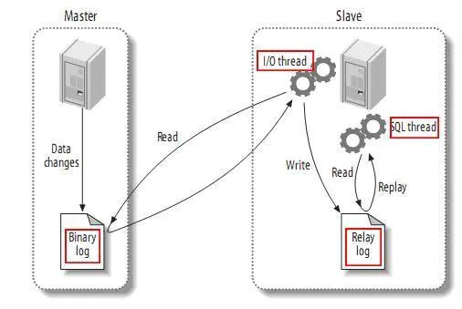

# mysql实现主从复制/主从同步

### 什么是mysql 的主从复制

#### ① 简介

> 指一台服务器充当主数据库服务器，另一台或多台服务器充当从数据库服务器，主服务器中的数据自动复制到从服务器之中。对于多级复制，数据库服务器即可充当主机，也可充当从机。MySQL主从复制的基础是主服务器对数据库修改记录二进制日志，从服务器通过主服务器的二进制日志自动执行更新。
>  一句话表示就是，主数据库做什么，从数据库就跟着做什么。

#### ② mysql复制的类型

>  1.基于语句的复制 ：主库把sql语句写入到bin log中，完成复制
>  2.基于行数据的复制：主库把每一行数据变化的信息作为事件，写入到bin log，完成复制
>  3.混合复制：上面两个结合体，默认用语句复制，出问题时候自动切换成行数据复制
>  tip:和上面相对应的日志格式也有三种:STATEMENT，ROW，MIXED。

1.STATEMENT模式（SBR）
 每一条会修改数据的sql语句会记录到binlog中。优点是并不需要记录每一条sql语句和每一行的数据变化，减少了binlog日志量，节约IO，提高性能。缺点是在某些情况下会导致master-slave中的数据不一致(如sleep()函数， last_insert_id()，以及user-defined functions(udf)等会出现问题)

1. ROW模式（RBR）
    不记录每条sql语句的上下文信息，仅需记录哪条数据被修改了，修改成什么样了。而且不会出现某些特定情况下的存储过程、或function、或trigger的调用和触发无法被正确复制的问题。缺点是会产生大量的日志，尤其是alter table的时候会让日志暴涨。
2. MIXED模式（MBR）
    以上两种模式的混合使用，一般的复制使用STATEMENT模式保存binlog，对于STATEMENT模式无法复制的操作使用ROW模式保存binlog，MySQL会根据执行的SQL语句选择日志保存方式。

#### ③ 主从复制工作原理剖析

> 1.Master 数据库只要发生变化，立马记录到Binary log 日志文件中
>  2.Slave数据库启动一个I/O thread连接Master数据库，请求Master变化的二进制日志
>  3.Slave I/O获取到的二进制日志，保存到自己的Relay log 日志文件中。
>  4.Slave 有一个 SQL thread定时检查Realy log是否变化，变化那么就更新数据



### 为什么要用mysql 的主从

1.**实现服务器负载均衡**
        即可以通过在主服务器和从服务器之间切分处理客户查询的负荷，从而得到更好的客户相应时间。通常情况下，数据库管理员会有两种思路。

​       一是在主服务器上只实现数据的更新操作。包括数据记录的更新、删除、新建等等作业。而不关心数据的查询作业。数据库管理员将数据的查询请求全部 转发到从服务器中。这在某些应用中会比较有用。如某些应用，像基金净值预测的网站。其数据的更新都是有管理员更新的，即更新的用户比较少。而查询的用户数 量会非常的多。此时就可以设置一台主服务器，专门用来数据的更新。同时设置多台从服务器，用来负责用户信息的查询

​       二是在主服务器上与从服务器切分查询的作业。在这种思路下，主服务器不单单要完成数据的更新、删除、插入等作业，同时也需要负担一部分查询作业。而从服务器的话，只负责数据的查询。当主服务器比较忙时，部分查询请求会自动发送到从服务器重，以降低主服务器的工作负荷。

2.**通过复制实现数据的异地备份**
        可以定期的将数据从主服务器上复制到从服务器上，这无疑是先了数据的异地备份。在传统的备份体制下，是将数据备份在本地。此时备份 作业与数据库服务器运行在同一台设备上，当备份作业运行时就会影响到服务器的正常运行。有时候会明显的降低服务器的性能。同时，将备份数据存放在本地，也 不是很安全。如硬盘因为电压等原因被损坏或者服务器被失窃，此时由于备份文件仍然存放在硬盘上，数据库管理员无法使用备份文件来恢复数据。这显然会给企业 带来比较大的损失。

3.**提高数据库系统的可用性**

​       数据库复制功能实现了主服务器与从服务器之间数据的同步，增加了数据库系统的可用性。当主服务器出现问题时，数据库管理员可以马上让从服务器作为主服务器，用来数据的更新与查询服务。然后回过头来再仔细的检查主服务器的问题。此时一般数据库管理员也会采用两种手段。

​       一是主服务器故障之后，虽然从服务器取代了主服务器的位置，但是对于主服务器可以采取的操作仍然做了一些限制。如仍然只能够进行数据的查询，而 不能够进行数据的更新、删除等操作。这主要是从数据的安全性考虑。如现在一些银行系统的升级，在升级的过程中，只能够查询余额而不能够取钱。这是同样的道 理。

​       二是从服务器真正变成了主服务器。当从服务器切换为主服务器之后，其地位完全与原先的主服务器相同。此时可以实现对数据的查询、更新、删除等操 作。为此就需要做好数据的安全性工作。即数据的安全策略，要与原先的主服务器完全相同。否则的话，就可能会留下一定的安全隐患

### 配置mysql主从复制

#### ① 环境准备

本地安装两个mysql，或者使用虚拟机，或者使用docker安装，需要准备两个mysql

> 环境
>  宿主机 centos7
>  mysql:5.6
>  mysql1(master):  172.17.0.3:3307
>  mysql2(slave): 172.17.0.2:3308

#### ② mysql 配置文件配置

mysql1(master): 172.17.0.3 my.cnf 配置文件设置，mysql

```

#mysql master1 config 
[mysqld]
server-id = 1        # 节点ID，确保唯一

# log config
log-bin = mysql-bin     #开启mysql的binlog日志功能
sync_binlog = 1         #控制数据库的binlog刷到磁盘上去 , 0 不控制，性能最好，1每次事物提交都会刷到日志文件中，性能最差，最安全
binlog_format = mixed   #binlog日志格式，mysql默认采用statement，建议使用mixed
expire_logs_days = 7                           #binlog过期清理时间
max_binlog_size = 100m                    #binlog每个日志文件大小
binlog_cache_size = 4m                        #binlog缓存大小
max_binlog_cache_size= 512m              #最大binlog缓存大
binlog-ignore-db=mysql #不生成日志文件的数据库，多个忽略数据库可以用逗号拼接，或者 复制这句话，写多行

auto-increment-offset = 1     # 自增值的偏移量
auto-increment-increment = 1  # 自增值的自增量
slave-skip-errors = all #跳过从库错误

```

mysql2(slave): 172.17.0.2 mysql.cnf 配置

```
[mysqld]
server-id = 2
log-bin=mysql-bin
relay-log = mysql-relay-bin
replicate-wild-ignore-table=mysql.%
replicate-wild-ignore-table=test.%
replicate-wild-ignore-table=information_schema.%
```

重启两个mysql，让配置生效

#### ③ master数据库，创建复制用户并授权

1.进入master的数据库，为master创建复制用户

```
CREATE USER repl_user IDENTIFIED BY 'repl_passwd';
```

2.赋予该用户复制的权利

```
grant replication slave on *.* to 'repl_user'@'172.17.0.2'  identified by 'repl_passwd';

FLUSH PRIVILEGES;
```

3.查看master的状态

```
show master status;
mysql> show master status;
+------------------+----------+--------------+------------------+-------------------+
| File             | Position | Binlog_Do_DB | Binlog_Ignore_DB | Executed_Gtid_Set |
+------------------+----------+--------------+------------------+-------------------+
| mysql-bin.000005      120|              | mysql            |                   |
+------------------+----------+--------------+------------------+-------------------+
1 row in set (0.00 sec)
```

4,配置从库

```
mysql> CHANGE MASTER TO 
MASTER_HOST = '172.17.0.3',  
MASTER_USER = 'repl_user', 
MASTER_PASSWORD = 'repl_passwd',
MASTER_PORT = 3307,
MASTER_LOG_FILE='mysql-bin.000005',
MASTER_LOG_POS=120,
MASTER_RETRY_COUNT = 60,
MASTER_HEARTBEAT_PERIOD = 10000; 

# MASTER_LOG_FILE='mysql-bin.000005',#与主库File 保持一致
# MASTER_LOG_POS=120 , #与主库Position 保持一致

```

