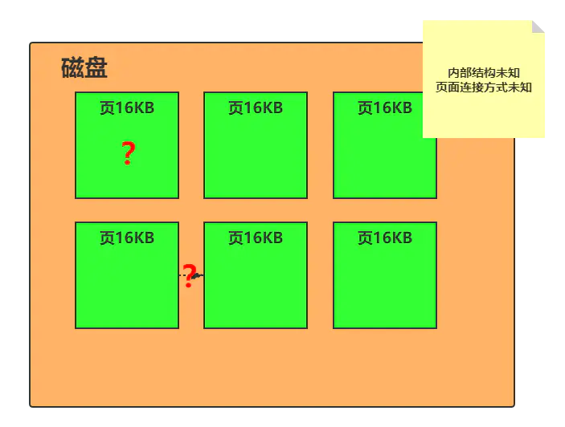
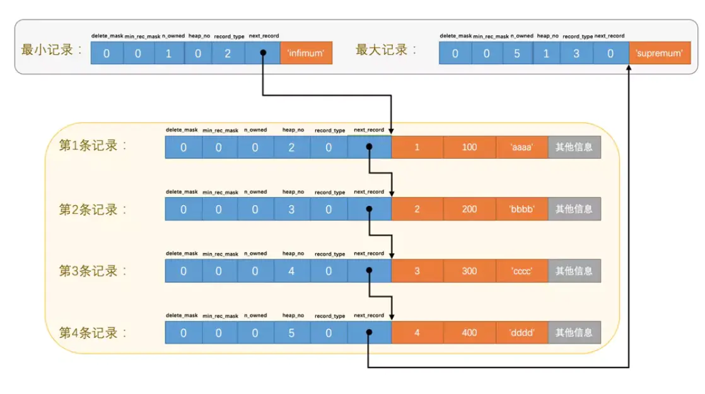
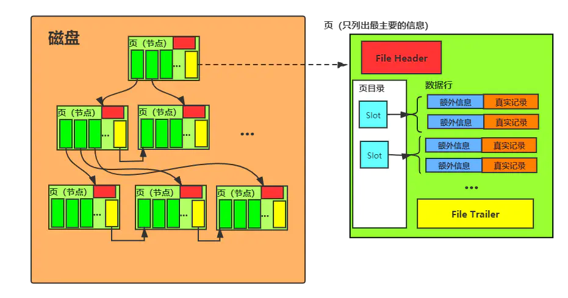
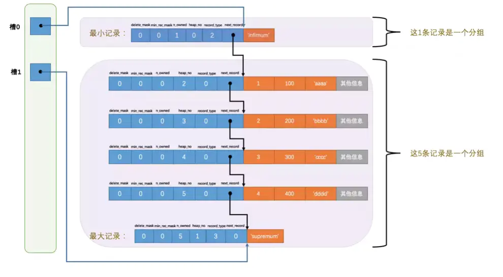
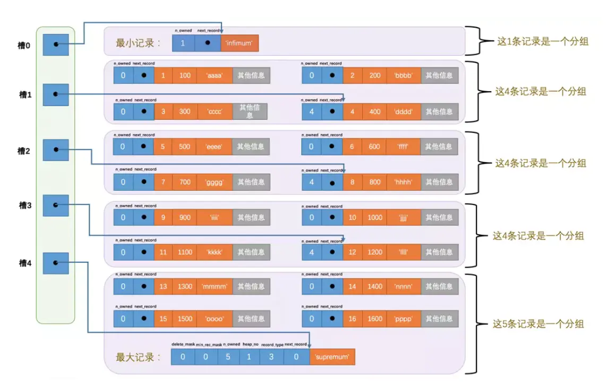

# mysql之行格式、页格式

### 从图开始理解

以下面这段创建代码为例：

```
mysql> CREATE TABLE format_demo (
    ->      c1 VARCHAR(10),
    ->      c2 VARCHAR NOT NULL,
    ->      c3 CHAR(10),
    ->      c4 VARCHAR(10)
    )
```

插入了两条数据

```java
mysql> SELECT * FROM record_format_demo;
+------+-----+------+------+
| c1   | c2  | c3   | c4   |
+------+-----+------+------+
| aaaa | bbb | cc   | d    |
| eeee | fff | NULL | NULL |
+------+-----+------+------+
2 rows in set (0.00 sec)

mysql>
```

对应在磁盘中表又是怎么样存储的呢？

### 行格式

所谓表的构成，实际就是**一行行的数据**，所以在磁盘中表是按行数据进行存储的。那么在磁盘中是一整个表的数据都连续放在一起么？显然不可能，思考数据分页的方法，`MySQL`也是按照**分页**的方式将一个表的数据拆分开存放。以`InnoDB`来说：

- 将数据划分为若干个页，以页作为磁盘和内存之间交互的基本单位，InnoDB中页的大小一般为 **16** KB。也就是在一般情况下，一次最少从磁盘中读取16KB的内容到内存中，一次最少把内存中的16KB内容刷新到磁盘中。




再回到**行格式**上，`MySQL`中涉及的有这4种：

1. **COMPACT行格式**
2. **Redundant行格式**
3. **Dynamic行格式**
4. **Compressed行格式**

主要介绍最重要的**COMPACT**格式，首先它长这样：


可以看到`MySQL`除了记录用户提供的信息之外还记录了相当的**额外信息**，这些信息可以分为`3`类：

1. **变长字段长度列表**
2. **NULL值列表**
3. **记录头信息**

简要说明这些**额外信息**：

**变长字段长度列表**MySQL支持一些变长的数据类型，比如VARCHAR(M)、VARBINARY(M)、TEXT类型，BLOB类型，这些数据类型修饰列称为变长字段，变长字段中存储多少字节的数据不是固定的，所以我们在存储真实数据的时候需要顺便把这些数据占用的字节数也存起来。在Compact行格式中，把所有变长字段的真实数据占用的字节长度都存放在记录的开头部位，从而形成一个变长字段长度列表。


空间分配：长度不是固定的，取决于有多少数据


**NULL值列表（标志位）：**

Compact行格式会把可以为NULL的列统一管理起来，存一个标记为在NULL值列表中，如果表中没有允许存储NULL 的列，则 NULL值列表也不存在了。

- 二进制位的值为1时，代表该列的值为NULL

- 二进制位的值为0时，代表该列的值不为NULL

  

需要说明的是，`MySQL`中无论是**定长数据**还是**非定长数据**都可以设置对`NULL`的控制，所以如果该列不为空那么**该列数据**的相关信息就存在**变长字段长度列表**中。

空间分配：同时**NULL值列表**是按**整数倍**字节分配空间的，不足的位置补上`0`.

**记录头信息**存储的都是和**行数据控制**相关的内容：


除了变长字段长度列表、NULL值列表之外，还有一个用于描述记录的记录头信息，它是由固定的5个字节组成。

5个字节也就是40个二进制位，不同的位代表不同的意思，如图：


##### 真实数据

 

 记录的真实数据除了我们自己定义的列的数据以外，还会有三个隐藏列：


### 页结构

下面是页结构的示意图：


可以在中间找到我们刚刚讨论的**行数据**位于`User Records`中。

上述内容简述功能如下：

<table>
<thead>
<tr>
<th>名称</th>
<th>中文名</th>
<th>占用空间</th>
<th>描述</th>
</tr>
</thead>
<tbody>
<tr>
<td><code>File Header</code></td>
<td>文件头部</td>
<td>
<code>38</code>字节</td>
<td>页的一些通用信息</td>
</tr>
<tr>
<td><code>Page Header</code></td>
<td>页面头部</td>
<td>
<code>56</code>字节</td>
<td>数据页专有的一些信息</td>
</tr>
<tr>
<td><code>Infimum + Supremum</code></td>
<td>最小记录和最大记录</td>
<td>
<code>26</code>字节</td>
<td>两个虚拟的行记录</td>
</tr>
<tr>
<td><code>User Records</code></td>
<td>用户记录</td>
<td>不确定</td>
<td>实际存储的行记录内容</td>
</tr>
<tr>
<td><code>Free Space</code></td>
<td>空闲空间</td>
<td>不确定</td>
<td>页中尚未使用的空间</td>
</tr>
<tr>
<td><code>Page Directory</code></td>
<td>页面目录</td>
<td>不确定</td>
<td>页中的某些记录的相对位置</td>
</tr>
<tr>
<td><code>File Trailer</code></td>
<td>文件尾部</td>
<td>
<code>8</code>字节</td>
<td>校验页是否完整</td>
</tr>
</tbody>
</table>

其中**用户记录**开始是没有的，当插入**行数据**时会使用**空闲空间**，当**空闲空间**装满之后就要申请新的**页**了


继续说明行记录在页中怎么组织又需要使用到之前提到的行中的头信息

大致如下：

- `heap_no`属性表示当前记录在**页**中的位置，用户插入的数据一般从`2`开始排序，为什么是`2`呢？

  因为 `0`,`1`是**页**中固有的**最大**和**最小行记录**，分别指向**页**最大和最小数据。这里其实涉及到了`MySQL`B+树的物理实现过程，简单来说就是**页**其实就是B+树的一个物理节点，而B+树中所有节点是顺序排列的，这个**排列的顺序**就是按照表的**唯一主键**来进行的（一般会设置一个**与业务无关的逻辑主键**，并且**自增**）。所以这**两个多余的记录**就可以理解成**节点链表中的头尾节点**，用于快速遍历节点。

- `next_record`记录了从**当前记录到下一行数据的地址偏移量**

那么现在**页**中的**行数据**就是这样串起来的：



这里再提供一个简图说明一个**页是B+树中的一个节点**这句话的意义：



### 页目录

所以B+树中的索引是怎么在页中实现的呢？这里就涉及到页中另外一个关键的内容：页目录

**页目录就是MySQL在页中可以快速检索数据的保障**。如果没有页目录，那么定位到了一个**页**不就只能顺序遍历一次链表了。当然，**页目录**得以实现的基础也是**行数据**是按主键进行**排序存放**的。

而目录的制作过程大致是这样的：

1. 将所有正常的记录（包括最大和最小记录，不包括标记为已删除的记录）划分为几个组。
2. 每个组的最后一条记录（也就是组内最大的那条记录）的头信息中的`n_owned`属性表示该记录拥有多少条记录，也就是该组内共有几条记录。
3. 将每个组的最后一条记录的地址偏移量单独提取出来按顺序存储到靠近`页`的尾部的地方，这个地方就是所谓的`Page Directory`，也就是`页目录`（此时应该返回头看看页面各个部分的图）。页面目录中的这些地址偏移量被称为`槽`（英文名：`Slot`），所以这个页面目录就是由`槽`组成的。

那么最小只有一个分组的概况如下：



可以观察到最小记录的`n_owned`值为1，而最大记录的`n_owned`值为5。这关系到每个分组是如何设计的：

对于最小记录所在的分组只能有 **1** 条记录，最大记录所在的分组拥有的记录条数只能在 **1~8** 条之间，剩下的分组中记录的条数范围只能在是 **4~8** 条之间。所以分组是按照下边的步骤进行的：

- 初始情况下一个数据页里只有最小记录和最大记录两条记录，它们分属于两个分组。
- 之后每插入一条记录，都会从`页目录`中找到主键值比本记录的主键值大并且差值最小的槽，然后把该槽对应的记录的`n_owned`值加1，表示本组内又添加了一条记录，直到该组中的记录数等于8个。
- 在一个组中的记录数等于8个后再插入一条记录时，会将组中的记录拆分成两个组，一个组中4条记录，另一个5条记录。这个过程会在`页目录`中新增一个`槽`来记录这个新增分组中最大的那条记录的偏移量。

所以最终一个有**多个分组**的页面结构就长这样：



#### File Header和File Trailer

不出意料**Header**中保存了这个**页**中的一些信息，而**File Trailer**中保存了指向**下一个页**的指针，用于串联**页面**，也就是B+树。