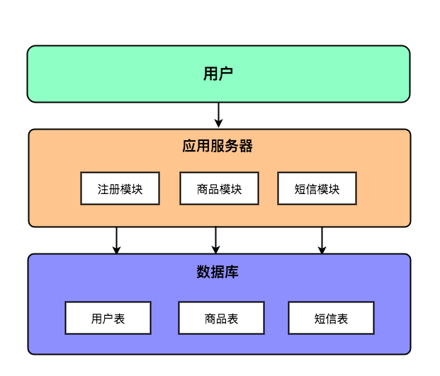
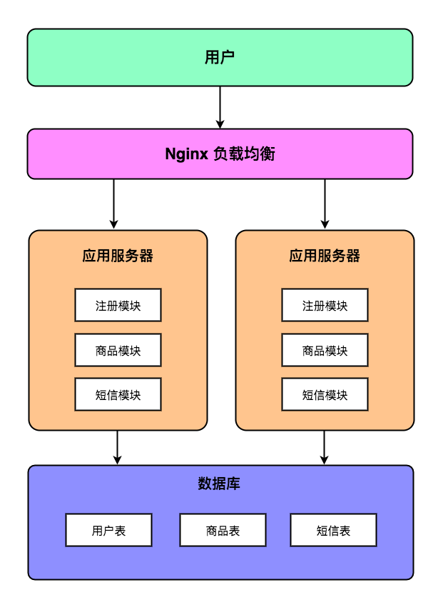
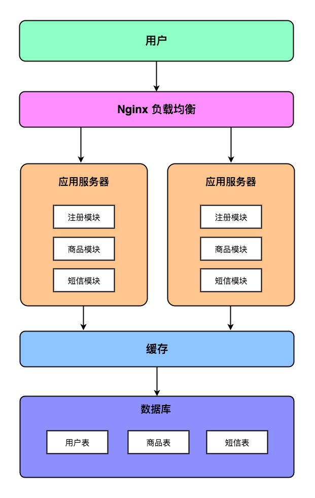
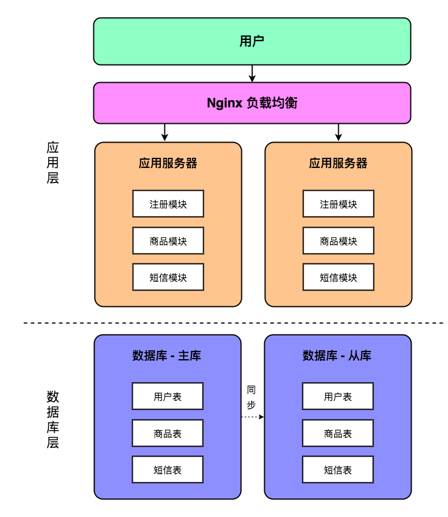
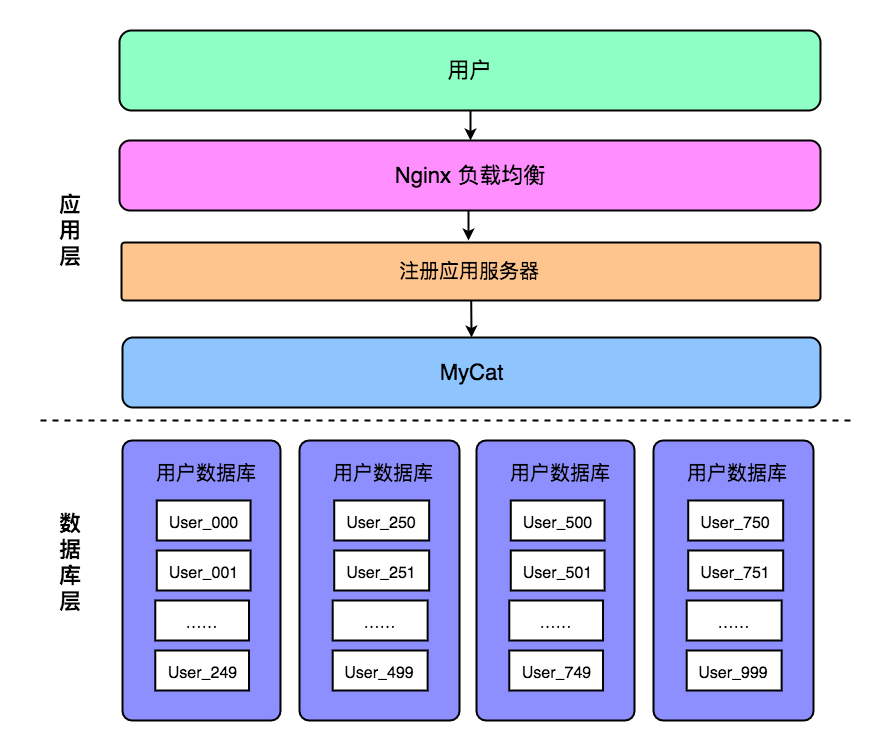

# **分布式系统的数据库架构演变**

单数据库架构

一个项目在初期的时候，为了尽可能快地验证市场，其对业务系统的最大要求是快速实现。在这个阶段，代码开发人员为了能快速实现业务系统，一般都是将所有层级（MVC）的业务代码都写在同一个项目中，所有的业务数据都存放在同一个数据库中。此时，项目的整体架构图如下所示：



从上图可以看到，我们在一个项目中集中了注册、登陆、购物三个模块的业务代码，并且这三个业务模块都读取同一个业务数据库。

但随着项目的不断推进，用户量不断增长，单台应用服务器已经无法承受如此巨大的流量了。此时常见的做法是把项目进行分布式部署，分散单台服务器的流量，从而可以暂时缓解用户增长带来的应用服务器压力。此时的项目架构图如下所示：



```
但随着我们部署的应用服务器越来越多，后端的单台数据库服务器已经无法承受如此巨大的流量了。为了尽快缓解用户访问压力，我们一般是在应用服务器与数据库服务器中间加多一个缓存层，通过缓存可以抵消掉一部分的数据库查询操作。此时的项目架构图如下所示：
```



```
但是增加数据库缓存层只能缓解数据库访问压力，拦截部分数据库访问请求。随着用户访问量的进一步增长，数据库访问的瓶颈还是会进一步凸显。这个时候，我们不得不对数据层的架构进行改造。
```

主从数据库架构

这个时候常用的解决方案就是将原本单台数据库服务器变成主从模式的数据库服务器，即一台数据库作为主库支持写入数据，一台数据库作为读库支持查询数据。此时项目的架构图如下所示：



我们通过数据库主从同步实现了读写分离，将所有读操作都引导到从库进行，将所有写操作都引导到主库进行。

因为我们对数据库层进行了改造，规定所有读数据库操作要访问从库，所有写数据库操作要访问主库，那么我们就必须对原来的代码进行改造。

```
public User selectUser(){
    dataTemplate.selectById(...);
}
public User insertUser(){
    dataTemplate.insert(user);
}
```

上面是改造前的代码，无论是读操作还是写操作，我们都使用同一个数据源进行操作。但为了适应新的数据库架构，我们必须在代码中手动判断应该请求哪个数据源。

```
public User selectUser(){
    readTemplate.selectById(...);
}
public User insertUser(){
    writeTemplate.insert(user);
}
```

经过修改后的代码，开发根据自身经验判断应该选择哪个数据源进行操作。当是读操作的时候，我们选择 readTemplate。当是写操作的时候，我们选择 writeTemplate。

但作为一个程序员，我们隐隐约约觉得识别应该用哪个数据源这个判断不应该人工判断，而应该自动让代码去判断。毕竟这个判断的模式很简单 —— 如果是 select 那么就用读的数据源，如果是其他那么就用写的数据源。

**其实这个就是 MyCat 的用途之一，即作为一个数据库中间件去解决数据源判断问题。**如果我们使用 MyCat 作为数据库中间件，那么我们不需要关心我应该使用哪个数据源。MyCat 帮我们屏蔽了不同数据源的差异，对于我们来说就只有一个数据源，这个数据源能处理写操作，也能处理读操作。上面查询和插入的代码就可以变成下面这样：

```
public User selectUser(){
    dataTemplate.selectById(...);
}
public User insertUser(){
    dataTemplate.insert(user);
}
```

实现了主从数据库架构，再使用 MyCat，你发现我们并不需要去修改太多的代码，只需要将数据源改为 MyCat 地址即可。MyCat 自动把我们所有的语句发送给后端的 MySQL 服务器。

当我们使用了主从数据库架构之后，我们会发现我们能支撑更多的用户访问和请求了。但随着业务的进一步发展，其实可以发现会存在一些问题：

- 当我们修改了注册模块的时候，我们需要整个项目都发布一次，这样会影响到登录、购物模块的正常使用。
- 即使每次改动的代码即使很小，我们还是需要发布整个项目包，这使得每次发布的代码包非常巨大。
- 随着业务量的不断增长，我们会发现即使实现了主从的读写分离，数据库的压力也是非常大，似乎快要承受不了了。

上面说的这些问题只是实战中遇到的一部分问题，事实上遇到的问题只会更多不会更少，而且随着业务的不断发展会愈加凸显。

垂直切分数据库架构

此时为了各个业务模块不互相影响，我们把应用层进行垂直拆分，即把注册模块、登陆模块、购物模块都单独作为一个应用系统，分别读写独立的数据库服务器。此时，我们的系统架构图如下图所示：

![实现了垂直拆分之后，我们可以成功解决上面说到的三个问题：业务模块相互影响问题、单数据库压力问题。

但是随着业务的进一步扩大，我们又增加了许多业务模块：客服模块、钱包模块、个人中心模块、收藏夹模块、订单模块等。按照我们之前所设计的数据库架构，我们会存在许多个数据源，这些数据源分散在各个项目中：

- 用户数据库 192.168.0.1
- 商品数据库 192.168.0.2
- 短信数据库 192.168.0.3
- 客服数据库 192.168.0.4
- 钱包数据库 192.168.0.5
- ……

对于一个项目管理者来说，这么多的数据源分散在不同项目中，怎么统一管理是一个问题。很多时候我们都很难记住这个项目连接的是哪个数据库，那个项目连接的是哪个数据库。

但如果你使用了 MyCat 作为数据库中间件的话，MyCat 就可以帮你解决这个问题。**对于所有项目来说，它们只需要统一连接 MyCat 对外提供的一个地址，而 MyCat 则帮这些项目联系所有后端的 MySQL 数据库。**对于前端的项目俩说，它们只知道 MyCat 这个数据库中间件，而不需要去理会我到底连接哪个数据库，MyCat 通过自身配置可以完成这个任务。

水平切分数据库架构

当数据库架构经历了主从架构、垂直拆分架构之后，应对一般的业务读写是没有什么问题了。但对于一些核心的业务数据，可能还是会有瓶颈问题，例如用户模块。

对于一些用户量高达一个亿的用户系统来说，即使经过主从架构、垂直拆分架构的优化，但其用户数据库的单个表里需要存储的数据还是高达一个亿的大小。如果我们把所有的数据都存放在一个表里，无论是注册时的插入数据，或者是登陆时的查询数据，势必会变得很慢。

这时候，我们就不得不对这些高数据量的核心业务表进行水平拆分，即将海量的数据记录拆分到多张表中保存。例如我们一开始可能只有一张 User 表，我们将 User 表按照用户 ID 对 1000 取余进行拆分，那么我们就会有 1000 张表，分别是 User_000 至 User_999。此时，项目的架构图如下所示：



当我们在代码中查询用户数据时，我们先根据用户 ID 取余判断其应该操作的表，之后再查询对应的表。例如 UserId 为 90749738 的用户就应该查询 User_38 表，UserId 为 74847383 的用户就应该查询 User_83 表。

通过水平拆分，我们成功解决了海量数据核心业务表的读写瓶颈问题。但此时在代码层面上有一个问题出现了，那就是我们需要在查询数据库之前，根据 UserId 去判断应该查询哪个表，这个操作对于所有业务模块来说都是高度一致的，应该抽离成一个公用的项目。

与判断应该使用读数据源还是写数据源一致，我们都觉得这样机械的任务不应该丢给程序员做，应该让机器去做。这其实就是 MyCat 可以帮我们做的事情：**MyCat 通过配置一系列的分库分表规则，让 MyCat 帮我们自动判断应该查询哪一个分表。**通过使用 MyCat 数据库中间件，我们可以省去在代码层判断查询哪个表的冗余代码，从而让开发人员更专注于业务逻辑的开发。

总结

从单一的数据库架构，到主从读写分离的数据库架构，再到垂直拆分、水平拆分的数据库架构。我们可以看到 MyCat 帮我们解决了读写数据源判断、繁杂数据源地址、分表判断这三个机械的重复性的问题。

上面说到的三个功能就是 MyCat 诞生初期的最基本功能。但 MyCat 发展至今，其功能已经远远超过上面说的这三个。例如 MyCat 支持主从切换功能，当数据库主库发生网络问题或其他故障时，MyCat 可以自动切换到从库，从而保证正常读写功能的进行。

总的来说，MyCat 的定位是一个数据库中间件。但凡所有处于应用层和数据层之间的事情，MyCat 都可以做。

