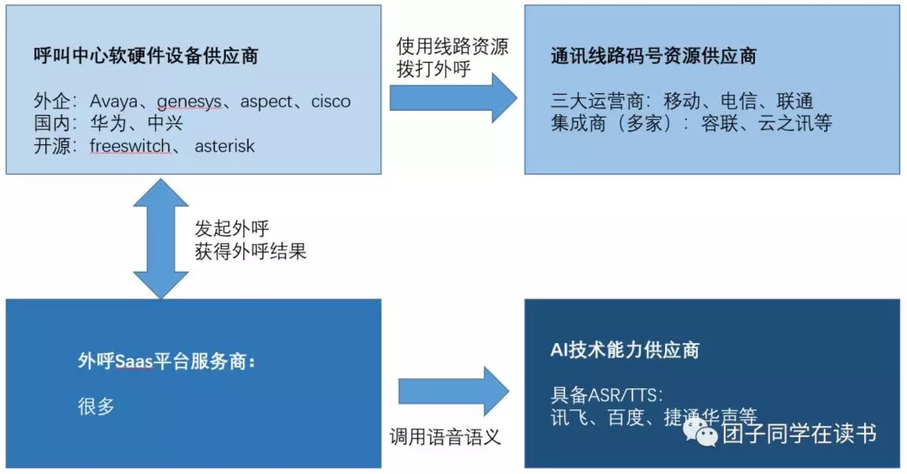
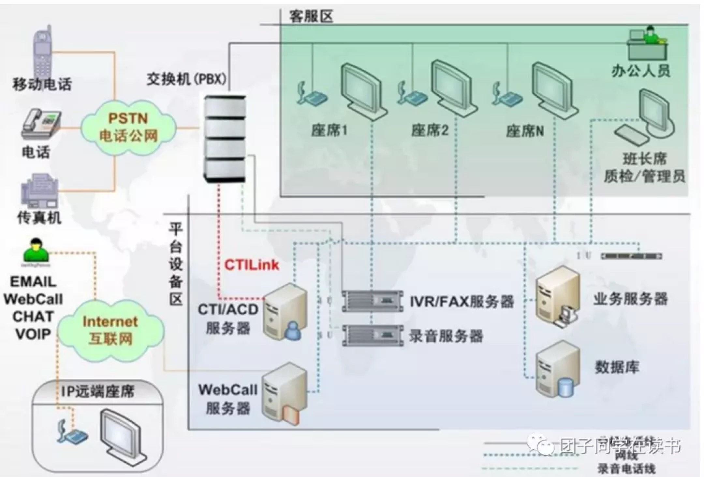
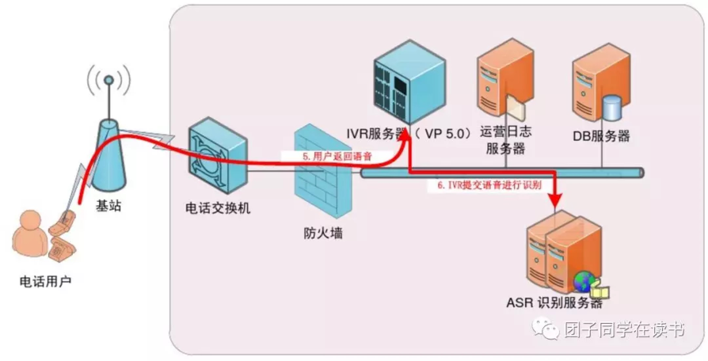
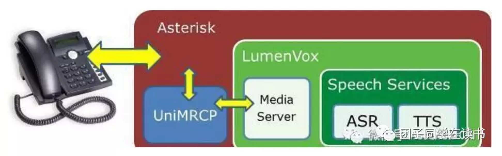

## 一、序言

随着人工智能技术的发展，近半年来涌现了大量基于人工智能的呼叫中心业务服务商和集成商。仅电销机器人这一个方向就至少有近百家公司正在推广运营，包括百度、讯飞、智齿、硅基、百应、箭鱼、容联等。商务上的需求非常强烈，整个市场都飞快地热闹起来。

一套可提供saas服务的智能外呼系统，看起来功能并不复杂。一个网站可注册、充值缴费开票，登录后在后台页面选择或者定制外呼话术脚本，新建外呼任务并导入外呼号码列表，明确外呼策略（时间段、重呼次数），设置外呼机器人数量（同时拨出几个号码），点击开始。然后就可以看着进度条走完，外呼机器人按照列表一个个打电话出去。任务完成后，可以查看外呼结果列表。

那么如何**从零开始搭建一套对外可以提供saas服务的智能外呼系统**呢？

## 二、总览

我们先列出，搭建这样一整套系统需要哪些技术和资源：

- **运营商线路：**提供方包括三大运营商、集成线路商，这是我们打电话出去要交电话费，必须涉及的供应商。
- **呼叫中心设备：**商用设备原厂包括avaya、genesys、cisco、华为等，集成商很多，开源的也有一些。在发起外呼任务时，saas平台是把外呼请求发给了呼叫中心设备经由运营商线路而拨出去的。
- **AI能力：**包含语音识别、语音合成、语义理解。这就是外呼机器人的核心组成部分，它能听懂接电话的人所说的话、表达的意思，并回复和引导对话。
- **saas服务平台：**即用户可以注册、登录、缴费、上传呼叫列表、发起外呼任务、外呼结果查看的网站，这个是终端用户唯一可以看得到的前端界面。

上图中四个主要模块，其中一些难以自研，只能选择供应商：

1. **AI能力**部分（中文ASR/TTS）基本已经格局稳定，没太多可挑选的。
2. **运营商资源**这块儿，可以选择大牌老厂的码号线路资源多的然后便宜的去谈合作，一方面外呼应用在催收场景时容易被封号，同时话费再便宜也好几分钱一分钟，也是重要的成本。
3. **呼叫中心设备**，因为涉及不少接口对接调试，优先选自己熟悉的，其次选便宜的且技术资料多的。
4. 最后是**外呼saas平台**，可能这是各个电销机器人服务商/集成商最容易实现自研的部分。

明确了涉及到的技术和资源之后，再明确一下建设步骤。由于各个厂商都有各自的资源和能力，建设方式也各不相同，简单来说可以分成以下几类：

1. 有运营商资源的，等着别人找上门来就行了。
2. 呼叫中心厂商，必然有已长期合作的运营商线路资源，手里也有呼叫中心设备+职场，也有技术人员。于是就选择自研saas平台，然后找AI能力厂商合作提供ASR/TTS/NLU。
3. AI能力厂商，尤其以NLU起家的在线客服类厂商，通常会选择接入百度/讯飞的语音能力，然后去找呼叫中心类厂商合作。
4. 啥都没有，只有几个技术人员的，选择自研saas平台，接入呼叫中心设备、AI能力、运营商资源。

作为初学者，为了自行从零开始搭建一套对外可以提供saas服务的智能外呼系统，身份必然是第四种，啥都没有，啥都要干。

以上这四部分，核心角色是呼叫中心。AI只是插上了想象力的翅膀，但是没这翅膀，呼叫中心还是呼叫中心，但是AI就只是空中楼阁了。业务明确可落地的呼叫中心才是想象力的基石，这一点与CV和安防的关系很像。

## 三、呼叫中心搭建

### **1. 通信原理**

目前对呼叫中心比较普遍接受的定义是：呼叫中心是以计算机电话集成（CTI）技术系统为基础，将计算机的信息处理功能、数字程控交换机的电话接入和智能分配、自动语音处理技术、 Internet技术、网络通信技术、商业智能技术与业务系统紧密结合在一起，将公司的通信系统、计算机处理系统、人工业务代表、信息等资源整合成统一、高效的服务工作平台 。

最新一代呼叫中心架构NGCC（Next Generation Call Center）如下图所示：

**具体如何理解呢？**

先从最简单的说起：个人A给个人B打了个电话。

- 流程：A→PSTN→B
- 解释：PSTN是Public Switched Telephone Network，公共交换电话网络，也就是运营商的电话网络。

然后来个复杂点的：个人A给呼叫中心400xxxxxxxx打了个电话，拨通后先听到了录音，“您好，找B类接线员说话请按0号键”。按了0，然后听到录音，“排队中，请稍后”。几分钟后接通，B0026号接线员接了电话。

> 流程：A→PSTN→PBX→IVR→ACD→B
>
> 解释：PBX是Private Branch Exchange，用户级交换机，这是企业内部的局端用户级交换机，整个呼叫中心的出入口设备。
>
> PSTN到PBX之间是中继（分成模拟中继、数字中继、IP中继），这是将通讯公司的局端交换机与企业内部的用户级交换机（PBX）相连的通讯线路。
>
> IVR是Interactive Voice Response，互动/交互式语音应答，我们把它叫语音导航。实现的是类似拨打10086后听到录音说，xx业务请按x，这个环节。主要用途是根据业务分流来电，进入对应的排队机。
>
> ACD是Automatic Call Distribution，自动电话分配，也叫排队机。

再来个复杂点的：个人A给呼叫中心400xxxxxxxx打了个电话，拨通后先听到了录音，“您好，您想找哪类接线员？”

个人A说，“B~~”。

然后很快接通，“您好，这是B0026号机器人，有什么可以帮您？”

个人A说，“我不想跟机器人说话，泥奏凯~”

然后听到录音，“为您转接很贵的真人客服，排队中，请稍后”。

几分钟后接通，B1026号真人接线员接了电话。

> 流程：A→PSTN→PBX→IVR（→ASR→NLU）→ACD（→ASR→NLU→DM→NLG→TTS）→ACD→B
>
> 解释：现在智能的部分，也就是我们说的语音机器人的部分，分别在IVR和虚拟坐席处体现。
>
> IVR部分，不再需要提示按键，而是直接问来电方需要办理什么业务，然后识别语音、理解意图后，进入对应的业务队列排队。排队后可以等待真人客服接待，也可以由机器人先行接待。
>
> 机器人（实际是服务器资源）资源空闲时，直接接待，进行语音对话，对话过程就是语音识别、语义理解、语音合成的多次调用，部分业务涉及业务数据接口对接调用，比如查询话费、积分。并可以根据需求自动或者选择转人工，再次进入排队，等候真人客服接待。

其中IVR部分示意图如下：

### **2. 集成实施**

上面提到的全部流程中，PBX、IVR、ACD等部分基本都是由我们说的呼叫中心设备商提供，产品有三种类型:板卡式、交换机式、VoIP形式。

交换机式比较适合大型职场，例如三五百人以上，硬件价格五位数。交换机领域，主要有：avaya、genesys、cisco、华为、中兴，其中最常用的两家对比下来，avaya比genesys便宜（[参见文章](http://dwz.cn/8aUugf)）。

板卡式适合中小型职场，比如几十人到两三百人，硬件价格四位数。基于板卡建设呼叫中心的步骤，可以参考使用三汇板卡的这几篇（[主要前4篇讲原理](http://tinyurl.com/y7ku35ms)）。

选择板卡之前，先要确定选用哪种中继线路，比如：使用常规的数字中继，那么就需要选择数字板卡，这个找板卡的供应商问就行了。通常来说呼叫中心要购买的一条E1数字中继报价五位数/年，由用户级交换机将局端的光信号转换为30路模拟信号，也就是支持30个人同时接打电话，通话费会另外按照实际呼出分钟数收取。

近期一个实际落地项目是选择了数字中继+Asterisk（开源VoIP PBX纯软方案），（可参考：[安装配置](http://tinyurl.com/yaeu3k5y)，[调试](http://tinyurl.com/ybg53adp)）示意图如下：

具体的软件业务细节，比如：常规客服中心需要的管理模块、配置模块、工单服务、坐席服务、报表模块、CRM，还有比如：坐席班长监听、通话插入、质检，录音文件管理等整套软件细节，不做详述。